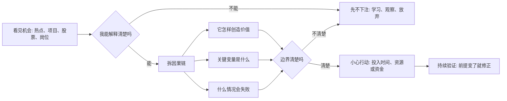

## 巴菲特思维筑基课: 能力圈: 只投能解释清楚的生意

### 作者
digoal

### 日期
2026-05-19

### 标签
能力圈 , 认知边界 , 投资判断 , 商业模式 , 产品经理 , 运营经理 , 大学生 , 风险控制 , 独立思考 , 决策方法

----

## 背景

> 面向对象: 大学生、产品经理、运营经理、有投资需求的人  
> 核心问题: 世界变化太快，热点、概念、商业故事层出不穷，怎样判断自己是在理解事实，还是只是在复述别人的结论？  
> 先说结论: 能力圈不是“我感兴趣的范围”，而是“我能用自己的语言解释因果链、关键变量、失败条件和边界”的范围。只投能解释清楚的生意，本质上是先控制认知风险，再谈收益。

这里把“能力圈”当作一个判断公理来讲。它不是数学公理，也不是永远不变的真理，而是一条在投资、产品、运营、职业选择中反复有效的底层规律：在你不能解释清楚的领域里，你以为自己在判断，其实常常只是在被叙事牵着走。

## 一张图先看懂



## 求真讲法

### 它到底说了什么

能力圈说的是：一个人只应该在自己真正理解的范围内做重要决策。

“真正理解”不是听过名词，不是看过几篇文章，也不是别人说得很有道理。真正理解至少要过四道题。

| 检查题 | 能过关的表现 | 没过关的表现 |
|---|---|---|
| 价值链 | 能说清它为谁解决什么问题 | 只会说“市场很大”“趋势很好” |
| 赚钱逻辑 | 能说清收入、成本、利润从哪里来 | 只会说“用户多了自然赚钱” |
| 关键变量 | 能指出 2-3 个最重要的变量 | 罗列一堆指标但没有主次 |
| 失败条件 | 能说清什么变化会让判断失效 | 只讲上涨空间，不讲下跌路径 |

所以，“只投能解释清楚的生意”不是一句保守口号，而是一道认知防线。它把问题从“别人说这个机会好不好”改成“我能不能独立解释它为什么好、怎样变坏、哪里不能碰”。

### 它是怎么来的

这个思想在巴菲特体系里很核心。巴菲特长期强调，投资者不需要理解世界上所有公司，只需要能评价自己能力圈内的少数对象；能力圈的大小不重要，知道边界才重要。

这条规律背后的动机很简单：很多亏损不是因为人完全无知，而是因为人对自己不懂的事情产生了错误自信。

例如，一个人看到新能源、AI、生物医药、跨境电商、短剧、加密资产等热点，如果只会复述“空间巨大、政策支持、技术革命、流量红利”，他并没有真的理解。他可能只是学会了一套解释上涨的语言。真正的能力圈要求他继续追问：

1. 谁付钱？为什么现在付？为什么以后还付？
2. 成本会不会随规模下降？还是越做越亏？
3. 竞争者能不能复制？复制需要多久？
4. 用户为什么留下？如果价格上涨会不会离开？
5. 现金流什么时候出现？会不会永远靠融资续命？
6. 哪个变量一变，整个故事就不成立？

这就是能力圈的来历：它不是为了让人少做事，而是为了让人少在“不懂却以为懂”的地方犯大错。

### 它依赖哪些假设

能力圈这条规律成立，依赖几个前提。

1. 复杂世界可以被拆成相对稳定的因果链。比如客户需求、商业模式、成本结构、竞争格局、现金流。
2. 人的认知能力有限。一个人不可能同时深入理解所有行业、技术和资产。
3. 重要决策的错误代价不对称。一次重大误判，可能抵消很多次小成功。
4. 很多机会会重复出现。错过能力圈外的机会，不等于永远没有机会。
5. 能力圈可以扩展，但必须靠长期学习、实践、反馈，而不是靠短期阅读和情绪兴奋。

如果这些前提不成立，能力圈就会失效或变弱。比如一个决策完全靠随机运气决定，解释能力就帮不上太多；又比如一个人使用高杠杆，即使在能力圈内判断正确，也可能因为短期波动被迫出局。

### 常见误解

误解一：能力圈就是专业背景。

不对。学金融的人未必懂一家企业，做程序的人未必懂一家软件公司的商业价值，产品经理也未必懂自己所在行业的利润结构。专业背景只是入口，不等于能力圈。

误解二：能力圈就是兴趣圈。

不对。喜欢新能源车、喜欢 AI 工具、喜欢某个消费品牌，不代表你理解它的竞争格局、成本结构和估值逻辑。兴趣能启动学习，但不能替代理解。

误解三：能力圈会限制成长。

不对。能力圈不是让人永远待在原地，而是区分“学习区”和“下注区”。你可以在能力圈外学习，但不要在没有理解前重仓投入资金、时间、职业信用或团队资源。

误解四：别人懂，所以我跟着做也可以。

不对。别人的能力圈不能自动复制到你身上。你跟对了可能赚钱，但那不是你的判断力；你跟错了，很可能连错在哪里都不知道。

## 求存讲法

### 它有什么用

能力圈的直接作用是降低“认知亏损”。

投资亏损只是其中一种。更常见的是产品做错方向、运营追错指标、大学生选错赛道、职场人押错技能、创业者被概念带偏。

| 场景 | 没有能力圈会怎样 | 有能力圈会怎样 |
|---|---|---|
| 大学生选专业 | 追热门榜单，忽视自身基础和长期积累 | 先判断自己能否理解学科问题和训练路径 |
| 产品经理做功能 | 看竞品上了什么就跟什么 | 解释用户场景、约束、指标和失败条件 |
| 运营经理做增长 | 只盯曝光、点击、GMV | 分清短期刺激和可持续留存 |
| 投资者买股票 | 听故事、看涨幅、跟群消息 | 先解释生意怎样赚钱、优势能否持续 |
| 创业者选方向 | 被风口催促，忽略现金流 | 先验证客户付费和单位经济模型 |

能力圈不是让你更胆小，而是让你知道什么时候该谨慎，什么时候可以果断。

### 它怎么迁移到熟悉领域

能力圈可以迁移成一套通用提问法。

```text
对象: 一个机会 / 产品 / 公司 / 岗位 / 项目

第一层: 它服务谁？
第二层: 解决什么高频或高价值问题？
第三层: 为什么现在的方案不够好？
第四层: 它凭什么获得收入或资源？
第五层: 成本、竞争、替代品在哪里？
第六层: 哪个关键假设一错，结论就崩？
第七层: 我有什么证据，而不是只有观点？
```

对大学生来说，这套问题能避免把“热门专业”误认为“适合自己的长期能力资产”。

对产品经理来说，它能避免把“用户说想要”误认为“用户真的会使用、留存、付费”。

对运营经理来说，它能避免把“活动数据好看”误认为“用户价值增长”。

对投资者来说，它能避免把“股价上涨”和“企业价值提升”混为一谈。

### 它的适用范围和边界

能力圈适合用于高代价、长期性、复杂性的决策。

比如投资、创业、择业、产品战略、组织用人、长期学习方向。因为这些决策一旦错了，成本不只是钱，还包括时间、机会、信用和心理能量。

能力圈不适合被机械化使用。

第一，不能把“我不懂”变成懒惰的借口。正确做法是：能力圈外先学习，能力圈内再下注。

第二，不能把过去的能力圈误认为永久有效。行业会变，技术会变，客户需求会变。能力圈需要更新。

第三，不能把“能解释”误认为“解释一定正确”。好解释也可能错，所以必须持续找反证。

第四，不能只解释增长，不解释风险。只会讲为什么会成功，不会讲怎样会失败，仍然不算真正理解。

### 正例: 怎么用它提升能力

假设一个产品经理负责一款面向中小商家的 AI 客服产品。市场很热，老板希望快速投入。

如果他用能力圈思考，就不会只说“AI 是趋势”。他会先把生意解释清楚。

1. 客户是谁：客服人力成本高、咨询重复度高的中小商家。
2. 痛点是什么：人工客服贵、回复慢、培训难，夜间服务不足。
3. 付费理由是什么：如果 AI 能减少人工成本或提高转化率，商家愿意付费。
4. 关键变量是什么：回答准确率、接入成本、人工接管率、商家 GMV、客户投诉率。
5. 竞争壁垒是什么：行业知识库、工作流集成、历史数据、客户切换成本。
6. 失败条件是什么：回答不准导致投诉，接入复杂导致不用，价格高于节省的人力成本。

这时，他不是“因为 AI 热所以做”，而是知道自己在验证哪些假设。即使最后不做，也不是保守，而是避免把团队资源投进一个解释不清的故事。

对投资者也一样。如果他研究一家连锁餐饮公司，能说清单店模型、翻台率、客单价、租金、人力、加盟政策、食品安全风险、开店速度和同店增长，才算接近能力圈。只说“品牌火、门店多、年轻人喜欢”，还远远不够。

### 反例: 前提不成立会怎样

假设一名大学生看到某个概念股连续上涨，听到同学说“这是未来十年的主线”，于是把积蓄投入。

他以为自己做了研究，但实际只做了信息收集。

| 能力圈要求 | 他的实际状态 | 为什么危险 |
|---|---|---|
| 能解释赚钱逻辑 | 只知道公司属于热门赛道 | 不知道利润从哪里来 |
| 能识别关键变量 | 只看新闻和股价 | 不知道该跟踪什么指标 |
| 能说出失败条件 | 只相信长期空间 | 风险出现时无法判断是否卖出 |
| 能估大致价值 | 只比较涨幅和市值 | 价格没有锚 |
| 能独立判断 | 依赖群消息和大 V | 别人撤退时他最后知道 |

这个失败不是因为他“不努力”，而是因为他把“信息量”误认为“理解力”。信息越多，如果没有因果结构，反而越容易制造自信幻觉。

## 思考

能力圈最反人性的地方，是它要求人主动承认：世界上大多数机会不属于我。

这听起来很吃亏。尤其在快速变化的世界里，每天都有新技术、新产品、新资产、新故事。如果你总是说“我还不懂”，会不会错过很多机会？

会。你一定会错过很多机会。

但问题不是“会不会错过”，而是“错过的代价”和“误判的代价”哪个更大。错过一个能力圈外的机会，通常只是少赚；重仓一个能力圈外的错误，可能会亏掉本金、时间、信誉，甚至让你失去下一次真正机会的资格。

能力圈也提醒产品和运营人员：不要被指标外观骗了。一个功能带来短期点击，不等于创造用户价值；一次活动带来 GMV，不等于形成复购；一个渠道带来低价用户，不等于建立品牌资产。你必须能解释指标背后的因果链。

对个人成长来说，能力圈不是边界墙，而是地图。地图上有三块区域：

```text
+----------------------+----------------------+
| 能力圈内             | 可以下注、承担结果   |
+----------------------+----------------------+
| 学习区               | 可以试错、少量投入   |
+----------------------+----------------------+
| 盲区                 | 不重仓、不承诺、不幻想 |
+----------------------+----------------------+
```

真正成熟的人，不是永远待在能力圈内，而是能清楚区分这三块区域。

还有一个反事实问题值得想：如果你必须向一个完全不懂的人解释你的选择，并且对方只能根据你的解释判断是否投入自己的钱、时间或职业信用，你还敢说自己懂吗？

如果不敢，说明你还没有进入能力圈。

## 最后记住

1. 能力圈不是兴趣圈，也不是专业标签，而是能解释因果链、关键变量、失败条件和边界。
2. 能力圈外可以学习，但不要重仓下注；学习区和下注区必须分开。
3. “只投能解释清楚的生意”本质上是在控制认知风险，而不是追求保守。
4. 信息量不等于理解力；没有结构的信息，只会放大自信幻觉。
5. 能力圈可以扩展，但只能靠长期学习、实践反馈和持续纠错扩展。

## 参考资料

- Warren Buffett, Berkshire Hathaway Shareholder Letters, especially discussions on circle of competence, business understanding, long-term ownership, and risk as permanent capital loss.
- Charles T. Munger, *Poor Charlie's Almanack*, especially inversion, mental models, and avoiding obvious stupidity.
- Benjamin Graham, *The Intelligent Investor*, especially the distinction between market quotation and business value.
- 本文参考本地 `buffett` 技能资料: `references/01-thinking-frameworks.md` 中关于能力圈、反向思考、独立判断和耐心的框架。
  
#### [PostgreSQL 解决方案集合](../201706/20170601_02.md "40cff096e9ed7122c512b35d8561d9c8")
  
  
#### [德哥 / digoal's Github - 公益是一辈子的事.](https://github.com/digoal/blog/blob/master/README.md "22709685feb7cab07d30f30387f0a9ae")
  
  
#### [About 德哥](https://github.com/digoal/blog/blob/master/me/readme.md "a37735981e7704886ffd590565582dd0")
  
  

  
