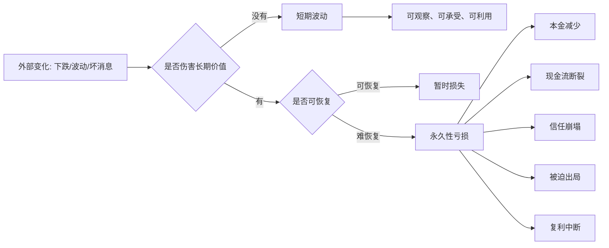

## 巴菲特思维筑基课: 风险定义: 真正的风险是永久性亏损

### 作者
digoal

### 日期
2026-05-19

### 标签
风险定义 , 永久性亏损 , 波动 , 杠杆风险 , 现金流 , 复利中断 , 投资风险 , 产品风险 , 运营风险 , 职业选择

----

## 背景

> 面向对象: 大学生、产品经理、运营经理、有投资需求的人  
> 核心问题: 为什么股价下跌、指标波动、项目延期不一定是真风险，而有些看起来平稳的东西反而很危险？  
> 先说结论: 真正的风险不是波动，而是永久性亏损：本金、时间、信用、信任、选择权或组织能力被损害到难以恢复。波动只是表面起伏，永久性损失才会破坏复利。

这里把“风险”当作一条底层规律来讲。巴菲特反对把风险简单等同于价格波动。他更关心的是：你会不会因为看不懂、买贵、杠杆、欺诈、护城河消失或现金流断裂，而永久失去继续复利的能力。

## 一张图先看懂



## 求真讲法

### 它到底说了什么

风险不是“看起来吓人”，而是“会不会让你永久失去未来机会”。

股票下跌 30%，如果企业内在价值没有变、你没有杠杆、你理解这门生意，这可能只是波动。反过来，一个资产价格每天很稳定，但背后是高杠杆、现金流造假或不可持续承诺，那才可能是真风险。

可以把风险分成四类。

| 类型 | 表面现象 | 本质判断 |
|---|---|---|
| 短期波动 | 价格、指标、情绪上下起伏 | 不一定伤害长期价值 |
| 暂时损失 | 阶段性亏损、项目延期 | 能否恢复，是否伤筋动骨 |
| 永久性亏损 | 本金、信任、现金流、能力被破坏 | 会中断复利 |
| 被迫出局 | 杠杆、债务、现金流压力导致卖出或停摆 | 明明长期可能对，也等不到兑现 |

真正的风险通常来自这些地方：

1. 看不懂还下注。
2. 买入价格远高于价值。
3. 企业护城河被永久破坏。
4. 管理层不诚实或资本配置错误。
5. 杠杆让你在最坏时刻被迫卖出。
6. 现金流断裂，项目或公司无法继续。
7. 信任被透支，用户、员工、客户或股东离开。

### 它是怎么来的

传统金融里常把波动率当作风险指标。股价波动越大，风险看起来越高。

巴菲特不接受这种定义。原因很简单：如果一家优秀企业从 100 元跌到 60 元，而内在价值没有下降，风险真的更高了吗？对懂它、没有杠杆、有现金的人来说，风险可能反而更低，因为价格更便宜了。

真正需要害怕的是永久性亏损。因为复利有一个残酷数学：

```text
亏损 10% -> 需要上涨 11.1% 回本
亏损 30% -> 需要上涨 42.9% 回本
亏损 50% -> 需要上涨 100% 回本
亏损 100% -> 没有下一局
```

这就是为什么巴菲特反复强调避免重大错误。长期复利不是靠每次都赢，而是靠不被一次灾难清零。

### 它依赖哪些假设

“风险是永久性亏损”这条规律成立，依赖几个前提。

1. 投资或决策目标是长期复利，而不是短期赌博。
2. 资产或项目有可估计的长期价值。
3. 决策者不被短期波动强迫退出。
4. 现金流、信用、信任和组织能力是长期资产。
5. 损失有些可以恢复，有些会永久改变未来机会。
6. 人会因为恐惧、杠杆和从众，把暂时波动变成永久损失。

如果你的目标就是极短期交易，波动本身可能就是风险。但对长期投资、产品、运营、创业和职业选择来说，更关键的是永久损害。

### 常见误解

误解一：下跌就是风险。

不对。下跌可能是风险，也可能是机会。要看价值是否受损、你是否被迫卖出、你是否真正理解。

误解二：不波动就安全。

不对。有些产品数据很平稳，但用户正在慢慢流失；有些理财收益很稳定，但底层信用风险在累积。平稳不等于安全。

误解三：分散一定降低风险。

不一定。分散能降低单点波动，但如果你分散买了一堆自己不懂、质量差、买贵的资产，只是把无知铺开。

误解四：高收益一定高风险。

不一定。风险来自价格、质量、杠杆、认知和现金流。一个被错误定价的高质量资产，可能同时有较好收益和较低永久亏损风险。

误解五：风险管理就是少行动。

不对。风险管理不是不做事，而是识别哪些损失会让你无法继续复利，然后避免它们。

## 求存讲法

### 它有什么用

重新定义风险，可以让你不被表面波动吓住，也不被表面稳定欺骗。

| 场景 | 表面风险 | 真风险 |
|---|---|---|
| 投资 | 股价每天波动 | 本金永久亏损、企业价值恶化、杠杆爆仓 |
| 产品 | 指标短期下降 | 用户信任受损、核心体验变差、留存结构恶化 |
| 运营 | 活动没冲上峰值 | 补贴套利、用户质量差、品牌信任被透支 |
| 创业 | 融资环境变冷 | 现金流断裂、单位经济模型不成立 |
| 职业 | 短期薪资低 | 技能不可迁移、信用受损、行业长期衰退 |

对投资者，它让你区分“价格跌了”和“价值坏了”。

对产品经理，它让你区分“数据波动”和“用户价值被破坏”。

对运营经理，它让你区分“活动效果不完美”和“用错误增长方式透支未来”。

对大学生，它让你区分“短期不顺”和“长期选择权被毁掉”。

### 它怎么迁移到熟悉领域

可以用一个通用问题判断真风险：

```text
这件事如果出错，会不会永久损害未来复利能力？

会损害什么:
  本金 / 现金流 / 信任 / 健康 / 信用 / 能力 / 选择权 / 组织文化

能不能恢复:
  能恢复 -> 波动或暂时损失
  难恢复 -> 真风险
```

产品经理做决策时，可以问：

1. 这个改版如果失败，会不会伤害用户信任？
2. 是否会增加长期维护复杂度？
3. 是否会让核心用户离开？
4. 是否把团队带向错误指标？

运营经理做活动时，可以问：

1. 这个增长是否依赖误导性承诺？
2. 用户是否会因为体验落差而失去信任？
3. 补贴是否吸引了低质量套利用户？
4. 活动结束后是否留下负资产？

投资者买股票时，可以问：

1. 如果股价下跌 50%，企业价值是否也永久下降？
2. 我是否用了会被迫卖出的杠杆？
3. 管理层是否可信？
4. 护城河是否可能被结构性破坏？
5. 如果我错了，损失是否可承受？

### 它的适用范围和边界

这条风险定义适合长期决策。

适用条件包括：

1. 你关心的是长期财富、能力、信任或组织价值。
2. 对象存在基本面和表面价格的区别。
3. 你能承受一定短期波动。
4. 你能大致判断什么是可恢复损失，什么是永久损失。

边界也要清楚。

1. 对短期交易者，波动本身可能带来爆仓和止损压力，因此就是风险。
2. 对现金流脆弱的人，短期下跌可能迫使卖出，从而变成永久损失。
3. 对高杠杆企业，暂时经营波动可能引发债务违约。
4. 对信任型产品，小错误如果伤害信任，也可能永久化。
5. 对职业和健康，很多损失不是马上可见，但恢复成本极高。

### 正例: 怎么用它提升能力

假设一个产品经理负责一款付费工具。某次改版后，短期新增转化率下降 10%，团队很紧张。

如果把风险定义为“指标波动”，团队可能立刻回滚。但如果把风险定义为“永久性损害”，产品经理会进一步检查：

1. 老用户留存是否下降？
2. 付费用户投诉是否增加？
3. 转化率下降是否因为过滤掉低质量用户？
4. 用户生命周期价值是否提高？
5. 新版是否降低长期服务成本？

如果发现短期转化下降，但付费用户质量更高、退款率下降、长期留存改善，那么这不是重大风险，而是短期波动。

投资中也是同理。优秀企业股价下跌，如果企业现金流、护城河、管理层都没变，且投资者没有杠杆，这种波动未必是风险。真正的风险是因为恐慌卖出，把暂时价格波动变成永久亏损。

### 反例: 前提不成立会怎样

某运营团队为了完成季度增长目标，推出高补贴活动。数据很好看，新增用户和 GMV 都大涨。团队以为风险很低，因为指标在上涨。

但真实风险在底层累积。

| 表面现象 | 底层风险 | 永久性损害 |
|---|---|---|
| 新增用户很多 | 大量套利用户 | 用户质量下降 |
| GMV 很高 | 补贴成本高于毛利 | 现金流恶化 |
| 转化率漂亮 | 权益说明过度包装 | 用户信任受损 |
| 渠道放量快 | 渠道作弊难识别 | 数据系统失真 |
| 团队士气高 | 错误指标被奖励 | 组织文化变坏 |

这个失败不是因为增长有波动，而是因为团队把“指标上涨”误认为“风险下降”。真正的风险是信任、现金流和判断系统被损害。

投资里也一样。一只股票每天波动很小，但公司高杠杆、现金流差、管理层粉饰报表。它看起来稳定，实际可能是永久性亏损的温床。

## 思考

风险定义会决定你的行为。

如果你认为风险是波动，你会害怕下跌，喜欢平稳，容易追求“看起来不动”的东西。但很多真正危险的东西，在爆发前都很平稳。

如果你认为风险是永久性亏损，你会更关心底层结构：现金流是否真实，护城河是否存在，杠杆是否可控，管理层是否诚实，用户信任是否被保护，自己是否在能力圈内。

这就是表面世界和底层规律的区别。

```text
表面风险:
  跌了 / 慢了 / 被质疑 / 指标波动 / 短期不好看

底层风险:
  看不懂 / 买贵了 / 杠杆过高 / 现金流断裂 / 信任崩塌 / 失去选择权
```

对大学生来说，真正的风险不一定是第一份工作工资低一点，而是进入一个没有成长、没有作品、没有信用积累、训练你短视和造假的环境。

对产品经理来说，真正的风险不一定是一次 A/B 测试失败，而是团队逐渐习惯用虚荣指标替代用户价值。

对运营经理来说，真正的风险不一定是活动没有爆，而是为了爆而透支用户信任和品牌资产。

对投资者来说，真正的风险不一定是价格下跌，而是永久损害本金和复利能力。

风险管理的核心，不是让曲线每天好看，而是让系统在坏天气里仍然活着，并保留下一次进攻的资格。

## 最后记住

1. 真正的风险不是波动，而是本金、现金流、信任、能力或选择权的永久性损害。
2. 下跌不自动等于风险，平稳也不自动等于安全；关键看长期价值是否受损。
3. 杠杆会把暂时波动变成永久亏损，因为它可能迫使你在最坏时刻出局。
4. 产品、运营和职业里的真风险，常常是信任被透支、数据失真、能力不可迁移。
5. 复利最怕重大错误；风险管理的目标是活下来，并保留下次机会。

## 参考资料

- Warren Buffett, Berkshire Hathaway Shareholder Letters, especially discussions on permanent capital loss, leverage, market volatility, intrinsic value, and risk versus beta.
- Benjamin Graham, *The Intelligent Investor*, especially the distinction between market quotation and business value.
- Charles T. Munger, *Poor Charlie's Almanack*, especially inversion, avoiding ruin, and behavioral bias.
- 本文参考本地 `buffett` 技能资料: `references/07-risk-behavior.md` 中关于永久性亏损、杠杆风险、价值陷阱、卖出条件和行为偏误的框架；以及 `references/02-investment-philosophy.md` 中关于集中投资、风险不是波动、能力圈和市场有效性边界的框架。
  
#### [PostgreSQL 解决方案集合](../201706/20170601_02.md "40cff096e9ed7122c512b35d8561d9c8")
  
  
#### [德哥 / digoal's Github - 公益是一辈子的事.](https://github.com/digoal/blog/blob/master/README.md "22709685feb7cab07d30f30387f0a9ae")
  
  
#### [About 德哥](https://github.com/digoal/blog/blob/master/me/readme.md "a37735981e7704886ffd590565582dd0")
  
  

  
