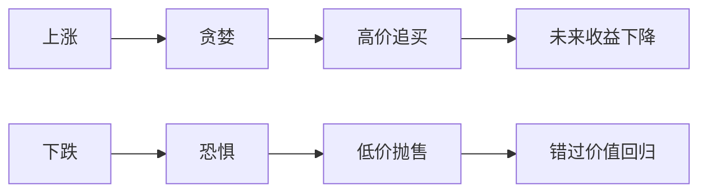

## 巴菲特思维筑基课: 人类行为会反复犯错

### 作者
digoal

### 日期
2026-05-19

### 标签
人性 , 行为偏误 , 从众 , 恐惧 , 贪婪 , 确认偏误 , 沉没成本 , 投资心理 , 市场情绪 , 巴菲特

----

## 背景

> 面向对象: 高中生
> 核心问题: 为什么投资错误总是一代又一代重复?
> 先说结论: 市场由人组成，人会贪婪、恐惧、从众和自我欺骗。理解人性错误，是理解市场机会和风险的关键。

## 一张图先看懂

| 偏误 | 表现 | 反制问题 |
|---|---|---|
| 从众 | 大家买我也买 | 证据是什么 |
| 确认偏误 | 只看支持自己的信息 | 什么能证明我错 |
| 沉没成本 | 跌了不愿承认 | 今天没持仓还会买吗 |

## 求真讲法

### 它到底说了什么

投资不是纯数学题，也是心理题。价格常常被人类情绪推高或压低。巴菲特的冷静，本质上是对这些偏误的系统抵抗。

### 它是怎么来的

人在不确定中喜欢寻找安全感。别人都买时，买入让人感觉安全；别人都卖时，卖出让人感觉安全。但这种“心理安全”常常牺牲经济理性。

### 它依赖哪些假设

- 市场参与者并非完全理性。
- 情绪会影响买卖决策。
- 群体行为会放大个体错误。
- 少数人能通过纪律和独立思考降低偏误。

### 常见误解

误解一: “别人错，我就一定对。”不对。逆向投资不是为了反对而反对，而是证据支持时才不同意。

误解二: “我知道偏误，所以不会犯。”知道偏误不等于免疫，必须有检查清单和纪律。

## 求存讲法

### 它有什么用

它让你在市场极端时先问事实，而不是先跟随情绪。它也提醒你设计规则，防止自己在压力下失控。

### 它怎么迁移到熟悉领域

学习、择业、消费也会受从众影响。热门不代表适合，冷门不代表没价值，关键是背后的长期逻辑。

### 它的适用范围和边界

适用于高不确定、高反馈延迟的领域。不适合用来否定所有共识，因为有些共识确实来自可靠证据。

### 正例: 怎么用它提升能力

买入前写下反方理由: 这家公司为什么可能不值这个价? 三个月后回看，检查自己是否只收集了支持材料。

### 反例: 前提不成立会怎样

如果你把“大家都恐惧”自动等同于“机会来了”，却不检查企业是否永久恶化，就会买进价值陷阱。

## 思考

你最近一次改变判断，是因为新证据，还是因为周围人的情绪变了?

## 最后记住

- 市场错误常来自人性错误。
- 逆向不等于正确，证据才决定正确。
- 偏误需要制度化反制，而不是靠自信。
- 投资纪律就是在情绪最大时保护理性。

## 参考资料

- Charlie Munger, speeches on psychology of human misjudgment.
- Warren Buffett, Berkshire Hathaway shareholder letters.
- Behavioral finance literature on herd behavior and loss aversion.
  
#### [PostgreSQL 解决方案集合](../201706/20170601_02.md "40cff096e9ed7122c512b35d8561d9c8")
  
  
#### [德哥 / digoal's Github - 公益是一辈子的事.](https://github.com/digoal/blog/blob/master/README.md "22709685feb7cab07d30f30387f0a9ae")
  
  
#### [About 德哥](https://github.com/digoal/blog/blob/master/me/readme.md "a37735981e7704886ffd590565582dd0")
  
  

  
