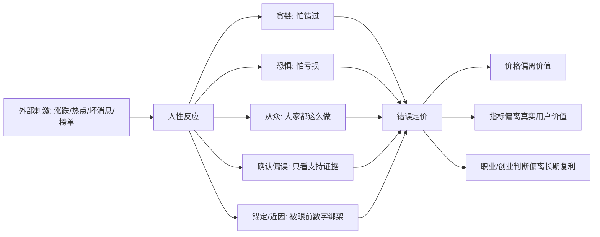

## 巴菲特思维筑基课: 行为偏误: 人性反复制造错误定价

### 作者
digoal

### 日期
2026-05-19

### 标签
行为偏误 , 错误定价 , 贪婪 , 恐惧 , 从众 , 确认偏误 , 沉没成本 , 锚定效应 , 投资心理 , 决策机制

----

## 背景

> 面向对象: 大学生、产品经理、运营经理、有投资需求的人  
> 核心问题: 为什么市场、组织和个人明明拥有很多信息，仍然会反复高估热门、低估冷门、追涨杀跌、错把短期现象当长期规律？  
> 先说结论: 行为偏误是人类大脑在不确定环境中的系统性误判。贪婪、恐惧、从众、确认偏误、沉没成本、锚定、近因偏误和行动偏误，会反复制造错误定价，也会反复制造产品、运营、职业和投资中的错误决策。

这里把“行为偏误”当作一条底层规律来讲。它解释了为什么“市场先生”会情绪化，为什么价格会偏离价值，为什么聪明人也会在热点和恐慌中犯低级错误。

## 一张图先看懂



## 求真讲法

### 它到底说了什么

行为偏误说的是：人在判断不确定问题时，并不是冷静计算机器，而会被情绪、群体、近期经验和已有立场系统性影响。

这些偏误不是偶尔发生，而是会反复发生。因为人的大脑喜欢省力、喜欢确定性、害怕损失、害怕落后、害怕承认错误。

| 行为偏误 | 典型表现 | 造成的错误定价 |
|---|---|---|
| 贪婪 / FOMO | 怕错过机会，看到上涨就追 | 热门资产被高估 |
| 恐惧 / 损失厌恶 | 下跌时只想逃离 | 好资产被低估 |
| 从众 | 大家都买，所以我也买 | 群体泡沫或群体恐慌 |
| 确认偏误 | 只找支持自己观点的信息 | 错误判断被越证越真 |
| 沉没成本 | 因为已经投入，所以继续加码 | 小错变大错 |
| 锚定效应 | 被买入价、历史高点、估值峰值绑住 | 无法重新估值 |
| 近因偏误 | 最近发生的事被看得过重 | 把短期趋势当长期规律 |
| 行动偏误 | 总觉得必须做点什么 | 频繁交易、乱改产品、乱做活动 |

### 它是怎么来的

行为偏误来自人类大脑的生存机制。远古环境里，快速反应、跟随群体、害怕损失、优先处理近期刺激，往往有助于生存。

但在现代市场和组织里，这些机制会变形。

价格上涨会被大脑解释成“别人发现了我没发现的机会”；价格下跌会被解释成“危险正在发生”；群体一致会让人觉得安全；已经投入的成本会让人不愿承认错误。

于是，市场和组织就会出现这样的循环：

```text
好消息 -> 价格上涨 -> 更多人相信故事 -> 更多资金进入 -> 价格继续上涨
坏消息 -> 价格下跌 -> 更多人恐慌 -> 更多人卖出 -> 价格继续下跌
```

这就是错误定价的心理机制。不是因为所有人都笨，而是因为相同的人性在相同压力下会做出相似反应。

### 它依赖哪些假设

行为偏误能反复制造错误定价，依赖几个前提。

1. 人面对不确定性时会使用心理捷径，而不是完整理性计算。
2. 损失带来的痛苦通常大于同等收益带来的快乐。
3. 群体行为会影响个体判断。
4. 价格、排名、播放量、融资估值等外部信号会反过来塑造信念。
5. 人很难主动寻找反证，尤其是在已经投入金钱、时间或面子的情况下。
6. 组织激励会放大偏误，例如只奖励短期指标、规模、增长和表面成功。

如果一个系统能强制记录假设、暴露反证、限制杠杆、延迟决策、复盘错误，行为偏误的伤害会变小。

### 常见误解

误解一：行为偏误只影响散户。

不对。机构、公司、团队、专家也会犯偏误，只是表现得更复杂。组织也会从众，也会沉没成本，也会确认偏误。

误解二：知道偏误就不会犯。

不对。知道只是第一步。偏误最强的时候，通常正是情绪最强、利益最大、压力最高的时候。

误解三：逆着大众一定正确。

不对。从众可能错，逆向也可能错。关键不是反大众，而是回到事实、价值和因果链。

误解四：上涨说明共识正确。

不一定。上涨可能是基本面改善，也可能是叙事扩张和流动性推动。价格变化需要解释，不能直接当证据。

误解五：坚持就是理性。

不一定。坚持正确前提是纪律；坚持错误前提是沉没成本。要看关键假设是否仍成立。

## 求存讲法

### 它有什么用

理解行为偏误，可以帮你识别错误定价和错误决策的来源。

| 场景 | 常见偏误 | 结果 |
|---|---|---|
| 投资 | 追涨、恐慌、锚定买入价 | 高买低卖 |
| 产品 | 只看支持功能上线的数据 | 做出没人长期使用的功能 |
| 运营 | 被短期 GMV 和转化率绑架 | 透支用户信任 |
| 创业 | 看到风口就转向 | 战略摇摆，资源消耗 |
| 职业 | 只看当下热门岗位 | 忽略能力积累和长期选择权 |

对投资者，行为偏误解释了为什么市场会出现高估和低估。

对产品经理，它提醒你不要只听支持你方案的用户反馈，也不要因为竞品做了就跟着做。

对运营经理，它提醒你不要把短期活动成功误认为长期增长机制。

对大学生，它提醒你不要把“大家都选”当作“适合自己”。

### 它怎么迁移到熟悉领域

可以把行为偏误变成一套决策前检查表。

```text
做决定前问:
  我是不是怕错过？
  我是不是怕承认亏损？
  我是不是只找支持我的证据？
  我是不是被最近发生的事影响过重？
  我是不是因为已经投入很多，所以不愿停下？
  我是不是只是因为大家都这么做？
  如果我今天还没投入，我还会重新选择它吗？
```

产品经理可以用它审查需求：

1. 这个功能是用户真实痛点，还是老板/竞品/热点带来的从众？
2. 数据是否只筛选了支持上线的部分？
3. 之前投入很多，是否让团队不愿砍掉无效功能？
4. 最近一个大客户的反馈，是否被过度放大？

运营经理可以用它审查活动：

1. 是不是因为上次活动成功，就认为这次也会成功？
2. 是不是只看转化，不看退款、投诉和复购？
3. 是不是因为预算已经投了，所以继续加码？
4. 是不是看到同行都补贴，就不敢停？

投资者可以用它审查持仓：

1. 如果我没有这只股票，今天还会买吗？
2. 我是否只读看多观点？
3. 我是否被买入价或历史高点锚定？
4. 我是否把最近几个季度当成未来十年？

### 它的适用范围和边界

行为偏误分析适合所有高不确定、高情绪、高利益相关的决策。

特别适合这些情况：

1. 市场价格剧烈上涨或下跌。
2. 团队对某个项目已经投入很多。
3. 所有人都在说同一个机会。
4. 你发现自己不愿意看反对证据。
5. 决策涉及面子、奖金、晋升、估值或亏损。

边界也要清楚。

1. 不能把所有市场变化都归因于偏误，基本面也可能真的变了。
2. 不能因为别人有偏误，就默认自己正确。
3. 不能用“长期主义”掩盖沉没成本。
4. 不能用“逆向思维”掩盖缺乏事实证据。
5. 偏误分析需要和能力圈、内在价值、安全边际一起使用。

### 正例: 怎么用它提升能力

假设一个产品经理负责推荐算法改版。团队做了两个月，内部很期待。上线灰度后，点击率略升，但用户停留时长下降，投诉增加。

行为偏误检查会提醒他：

1. 沉没成本：不能因为做了两个月，就默认必须全量上线。
2. 确认偏误：不能只看点击率上升，要看停留、投诉、留存。
3. 近因偏误：不能因为某一天数据好，就忽略完整周期。
4. 从众偏误：不能因为竞品也这么做，就认为方向正确。

理性的处理方式是：暂停全量，重新验证用户价值，找出点击提升是否来自标题刺激或低质量内容。如果长期体验下降，宁可承认改版失败，也不要让小错变成系统性损害。

投资中也是同理。一个投资者买入后，主动建立“反证清单”：如果毛利率连续下降、现金流恶化、管理层改口、护城河变窄，就重新评估，而不是只寻找支持继续持有的材料。

### 反例: 前提不成立会怎样

某运营团队看到同行通过高补贴快速拉新，于是也跟进。首周新增用户和 GMV 大涨，团队开始相信这是正确方向。

但他们被行为偏误带偏了。

| 偏误 | 实际表现 | 后果 |
|---|---|---|
| 从众偏误 | 行业都补贴，所以我们也补贴 | 忽略自身单位经济模型 |
| 确认偏误 | 只展示新增和 GMV | 忽略复购低、套利高 |
| 近因偏误 | 把首周增长当长期趋势 | 高估活动可持续性 |
| 沉没成本 | 预算已投，继续加码 | 亏损扩大 |
| 行动偏误 | 觉得不做就落后 | 没有耐心建设长期资产 |

最后，用户没有留下，品牌被低价心智绑定，团队还误以为“增长就是靠砸钱”。失败不是因为运营不努力，而是因为偏误让团队把表面增长误判成真实价值。

## 思考

行为偏误最值得警惕的地方，是它通常会让人感觉自己很理性。

追涨的人会说“趋势已经验证”；恐慌卖出的人会说“先控制风险”；继续投入失败项目的人会说“不能半途而废”；只看支持证据的人会说“我研究得很充分”；跟随大众的人会说“这么多人不可能都错”。

所以，对抗偏误不能只靠意志力，要靠机制。

```text
偏误防火墙:
  写下买入/上线/投入前的关键假设
  预先定义什么证据会推翻判断
  固定查看反对意见
  用长期指标约束短期指标
  设置停止线和复盘机制
  把“如果我今天还没投入”作为重评问题
```

对大学生来说，行为偏误会让你追热门专业、追高薪岗位、追看起来体面的路径，却忽略自己是否真正适合、是否能长期积累能力。

对产品经理来说，行为偏误会让你维护自己提出的方案，而不是维护用户真实价值。

对运营经理来说，行为偏误会让你维护漂亮数据，而不是维护长期信任和现金流。

对投资者来说，行为偏误会让你把价格变化当成证据，把群众情绪当成真理，把自己的持仓当成信仰。

市场反复错误定价，不是因为人类没有信息，而是因为人类在信息面前也会被自己误导。

## 最后记住

1. 行为偏误是人类在不确定环境中的系统性误判，不是少数人的低级错误。
2. 贪婪、恐惧、从众、确认偏误、沉没成本、锚定和近因偏误，会反复制造错误定价。
3. 价格上涨或指标变好不自动证明判断正确，必须回到价值、现金流、留存和长期结果。
4. 对抗偏误靠机制：记录假设、寻找反证、设置停止线、复盘错误。
5. 真正的理性不是没有情绪，而是在情绪最强时仍能回到事实和因果链。

## 参考资料

- Warren Buffett, Berkshire Hathaway Shareholder Letters, especially discussions on market psychology, Mr. Market, independent thinking, and avoiding permanent capital loss.
- Charles T. Munger, *Poor Charlie's Almanack*, especially psychological tendencies, inversion, social proof, incentives, and multidisciplinary thinking.
- Benjamin Graham, *The Intelligent Investor*, especially Mr. Market and the distinction between price and value.
- 本文参考本地 `buffett` 技能资料: `references/07-risk-behavior.md` 中关于确认偏误、沉没成本、锚定、近因偏误、行动偏误和风险行为的框架；以及 `references/01-thinking-frameworks.md` 中关于独立思考、社会认同、耐心和机会成本的框架。
  
#### [PostgreSQL 解决方案集合](../201706/20170601_02.md "40cff096e9ed7122c512b35d8561d9c8")
  
  
#### [德哥 / digoal's Github - 公益是一辈子的事.](https://github.com/digoal/blog/blob/master/README.md "22709685feb7cab07d30f30387f0a9ae")
  
  
#### [About 德哥](https://github.com/digoal/blog/blob/master/me/readme.md "a37735981e7704886ffd590565582dd0")
  
  

  
