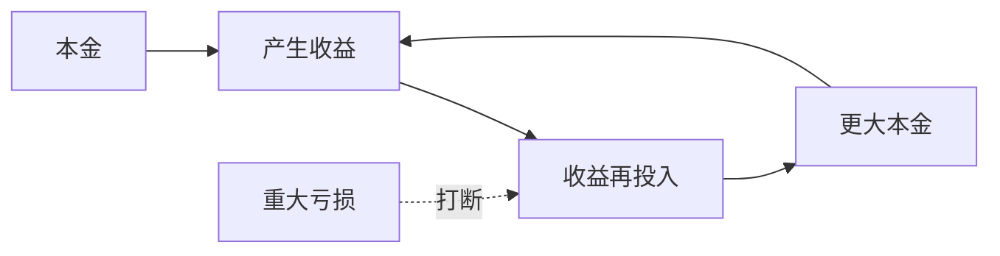

## 巴菲特思维筑基课: 复利是投资的核心物理法则

### 作者
digoal

### 日期
2026-05-19

### 标签
复利 , 长期主义 , 再投资 , 时间 , 本金 , 收益率 , 永久亏损 , 巴菲特 , 财富增长 , 投资基础

----

## 背景

> 面向对象: 高中生
> 核心问题: 为什么巴菲特那么重视“长期”和“少犯大错”?
> 先说结论: 复利让收益在时间中指数增长，但前提是收益能持续再投入，而且过程不被重大亏损打断。

## 一张图先看懂

| 年化收益 | 10 年后约变成 | 30 年后约变成 |
|---|---:|---:|
| 5% | 1.6 倍 | 4.3 倍 |
| 10% | 2.6 倍 | 17.4 倍 |
| 15% | 4.0 倍 | 66.2 倍 |

## 求真讲法

### 它到底说了什么

复利不是“赚一次钱”，而是“赚到的钱继续赚钱”。时间越长，差距越大。巴菲特的长期主义，本质上是让高质量资本长期复利。

### 它是怎么来的

如果 100 元每年增长 10%，第一年赚 10 元，第二年是在 110 元上赚 11 元。后面增长越来越快，因为收益也变成本金。

### 它依赖哪些假设

- 资产能持续产生正回报。
- 收益能够再投资。
- 没有重大永久亏损打断过程。
- 投资者有足够长的时间和耐心。

### 常见误解

误解一: “复利就是越久越赚钱。”不对。负收益也会复利，烂资产持有越久伤害越大。

误解二: “高收益最重要。”不完整。稳定、可持续、少犯大错同样重要。

## 求存讲法

### 它有什么用

它解释了为什么巴菲特宁愿长期持有优秀企业，也不频繁追逐短期机会。频繁交易会增加税费和错误，破坏复利。

### 它怎么迁移到熟悉领域

学习也是复利。每天理解一个概念，概念之间会连接成网络；但如果基础漏洞很大，后面的学习会反向拖累。

### 它的适用范围和边界

适用于可持续积累的系统，如知识、信誉、资本、健康。不适用于一次性机会、不可重复好运或会突然归零的高风险赌局。

### 正例: 怎么用它提升能力

选择一个能长期提高能力的方向，每周产出笔记和项目。几年后，知识、作品、信誉会相互增强。

### 反例: 前提不成立会怎样

为了追求更高收益使用高杠杆，连续几年都成功，但一次极端波动导致归零。复利链条被永久切断。

## 思考

你现在做的事情，有没有可能让五年后的你站在更大的本金、更强的能力或更好的信誉上继续增长?

## 最后记住

- 复利需要时间、再投入和不中断。
- 最大敌人是重大永久亏损。
- 好资产让时间成为朋友，坏资产让时间成为敌人。
- 长期主义不是慢，而是让指数增长发生。

## 参考资料

- Warren Buffett, Berkshire Hathaway shareholder letters on compounding.
- Benjamin Graham, margin of safety framework.
- Standard compound interest mathematics.
  
#### [PostgreSQL 解决方案集合](../201706/20170601_02.md "40cff096e9ed7122c512b35d8561d9c8")
  
  
#### [德哥 / digoal's Github - 公益是一辈子的事.](https://github.com/digoal/blog/blob/master/README.md "22709685feb7cab07d30f30387f0a9ae")
  
  
#### [About 德哥](https://github.com/digoal/blog/blob/master/me/readme.md "a37735981e7704886ffd590565582dd0")
  
  

  
