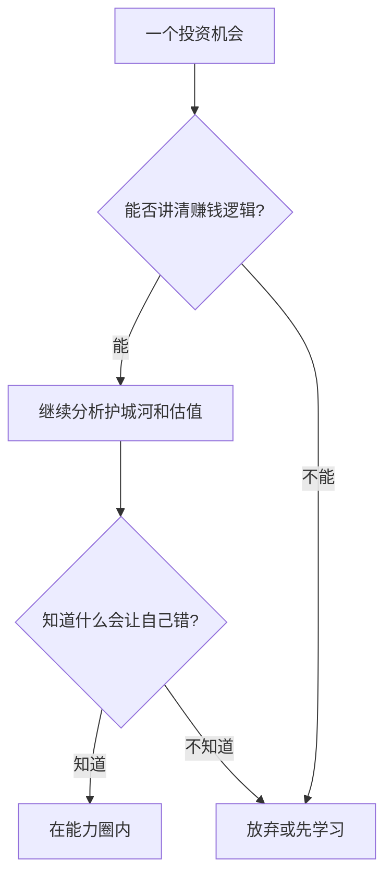

## 巴菲特思维筑基课: 能力圈边界比大小更重要

### 作者
digoal

### 日期
2026-05-19

### 标签
能力圈 , 边界 , 理解力 , 投资判断 , 不懂不投 , 巴菲特 , 芒格 , 风险控制 , 独立思考 , 投资原则

----

## 背景

> 面向对象: 高中生
> 核心问题: 为什么承认“不懂”反而是一种投资能力?
> 先说结论: 能力圈不是炫耀自己懂多少，而是清楚知道哪些判断自己有把握，哪些没有。边界清楚，才能避免假自信。

## 一张图先看懂



```
能力圈内: 少数、清楚、可验证
能力圈外: 模糊、依赖故事、容易自信
```

## 求真讲法

### 它到底说了什么

投资者不需要懂所有行业，只需要在自己真正理解的范围内做少数高质量决策。真正危险的不是无知，而是不知道自己无知。

### 它是怎么来的

每个人的知识有限。商业世界又复杂，如果在不懂的领域下注，就像没学过游泳却跳进深水区。承认边界能保命。

### 它依赖哪些假设

- 不同人理解能力和经验范围不同。
- 有些业务可以被某个投资者理解，有些暂时不能。
- 投资者可以选择不行动。
- 错过机会的成本小于看不懂还下注的损失。

### 常见误解

误解一: “能力圈小就不能投资。”不对。巴菲特强调大小不重要，边界重要。

误解二: “看几篇文章就进入能力圈。”不对。能力圈需要长期观察、经验和可验证判断。

## 求存讲法

### 它有什么用

它是投资筛选器。大量机会可以直接跳过，把精力留给真正能判断的少数机会。

### 它怎么迁移到熟悉领域

做题、选课、做项目也要知道自己的能力边界。先在能掌控的地方建立优势，再逐步扩圈。

### 它的适用范围和边界

适用于需要判断和承担后果的决策。不适合成为逃避学习的借口，因为能力圈可以通过长期训练扩大。

### 正例: 怎么用它提升能力

你能清楚解释一家超市如何赚钱、成本在哪里、竞争者是谁，于是先研究零售，而不是追逐听起来更酷但看不懂的行业。

### 反例: 前提不成立会怎样

你买入一家复杂金融公司，只因为别人说便宜，却看不懂资产负债表中的风险。价格下跌时，你无法判断该买还是该卖。

## 思考

一个人最有价值的知识，可能不是“我知道什么”，而是“我知道自己不知道什么”。你能列出自己的边界吗?

## 最后记住

- 能力圈边界比大小重要。
- 不懂却下注，会制造假安全感。
- 能力圈内要果断，能力圈外要克制。
- 扩大能力圈靠长期学习和真实反馈。

## 参考资料

- Warren Buffett, shareholder letters and annual meeting discussions on circle of competence.
- Charlie Munger, mental models and inversion speeches.
- Berkshire Hathaway investment criteria.
  
#### [PostgreSQL 解决方案集合](../201706/20170601_02.md "40cff096e9ed7122c512b35d8561d9c8")
  
  
#### [德哥 / digoal's Github - 公益是一辈子的事.](https://github.com/digoal/blog/blob/master/README.md "22709685feb7cab07d30f30387f0a9ae")
  
  
#### [About 德哥](https://github.com/digoal/blog/blob/master/me/readme.md "a37735981e7704886ffd590565582dd0")
  
  

  
