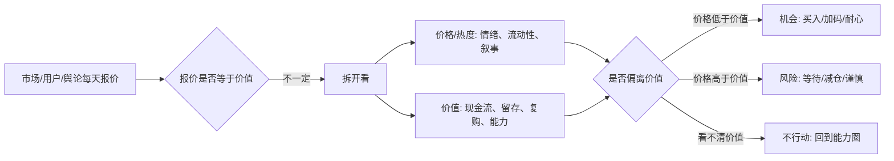

## 巴菲特思维筑基课: 市场先生: 市场波动提供机会，不提供真理

### 作者
digoal

### 日期
2026-05-19

### 标签
市场先生 , 市场波动 , 价格与价值 , 投资心理 , 内在价值 , 市场报价 , 情绪周期 , 产品指标 , 运营数据 , 独立判断

----

## 背景

> 面向对象: 大学生、产品经理、运营经理、有投资需求的人  
> 核心问题: 为什么价格、热度、排名、点击量和舆论每天都在变，但这些变化不一定代表真实价值变化？  
> 先说结论: “市场先生”是格雷厄姆提出、巴菲特长期使用的思维模型：市场每天给你报价，但报价只是情绪和流动性的结果，不是真理。你可以利用市场波动，但不能让市场波动替你思考。

这里把“市场先生”当作一条底层规律来讲。它不只适用于股票市场，也适用于产品数据、运营指标、创业融资、职业选择和社交评价：外部反馈很重要，但外部反馈不是事实本身。

## 一张图先看懂



## 求真讲法

### 它到底说了什么

“市场先生”是一个比喻：想象你和一个情绪很不稳定的人共同拥有一家公司。每天，他都跑来给你一个价格，要么愿意用这个价格买走你的份额，要么愿意按这个价格把他的份额卖给你。

有时他极度乐观，报价高得离谱；有时他极度悲观，报价低得离谱。关键是：你没有义务接受他的报价。

这条规律的核心是：

> 市场价格是报价，不是裁判；市场波动是机会来源，不是真理来源。

| 现象 | 普通反应 | 市场先生视角 |
|---|---|---|
| 股价大涨 | 公司一定更好了 | 内在价值是否真的提高 |
| 股价大跌 | 公司一定出问题了 | 现金流、护城河、管理层是否变坏 |
| 热点爆发 | 现在不上车就晚了 | 价格是否已透支未来 |
| 舆论唱衰 | 赶紧远离 | 坏消息是否已经反映过度 |
| 指标短期波动 | 立刻调整方向 | 先判断是噪音还是趋势 |

### 它是怎么来的

这个模型来自本杰明·格雷厄姆，后来被巴菲特反复使用。它解决的是一个古老问题：市场每天都在给价格，人很容易把价格变化误认为价值变化。

但股票不是彩票号码，而是企业所有权的一部分。企业的真实价值来自未来可取现金流，不会因为今天有人高兴或恐慌就同步大幅变化。

市场当然不是完全无用。它有时会反映信息，有时会提前消化变化。但它也会被情绪、流动性、杠杆、政策预期、叙事和群体行为推得过高或过低。

所以，市场先生的合理用法是：

```text
市场报价 -> 提醒我重新检查价值
价值没变 + 价格大跌 -> 可能是机会
价值变坏 + 价格大跌 -> 不是机会，是风险
价值没变 + 价格大涨 -> 可能是风险
价值变好 + 价格仍低 -> 可能是机会
```

### 它依赖哪些假设

市场先生模型能成立，依赖几个前提。

1. 价格和价值不是同一个东西。价格是交易结果，价值是长期产出。
2. 市场短期会受情绪、流动性和叙事影响。
3. 某些资产的内在价值可以在能力圈内被粗略估计。
4. 投资者可以选择不交易，不必每天回应市场报价。
5. 长期看，价值会比短期情绪更重要。
6. 使用者有足够耐心和现金流安全，不被短期波动强迫出局。

如果你完全无法估计价值，市场先生就不能帮你。因为你不知道报价是贵还是便宜，只是在猜别人明天的情绪。

### 常见误解

误解一：市场错了，所以我一定对。

不对。市场会错，你也会错。市场先生不是鼓励自大，而是提醒你独立检查价值。

误解二：下跌就是机会。

不对。只有价值没有同步下降，价格下跌才可能是机会。如果企业护城河被破坏、现金流恶化、管理层失信，下跌可能只是价值回归。

误解三：上涨就是泡沫。

不一定。如果企业真实现金流和竞争优势明显增强，上涨可能合理。关键不是涨跌，而是价格相对价值的位置。

误解四：不预测市场就是不判断。

不对。巴菲特不预测短期市场走势，但会判断资产是否相对价值过贵或过便宜。前者是猜方向，后者是估价值。

误解五：情绪完全没用。

不对。情绪本身不是价值，但情绪会制造价格偏离。理性的人可以利用偏离，而不是跟随偏离。

## 求存讲法

### 它有什么用

市场先生的作用，是把你从“价格奴隶”变成“报价使用者”。

| 场景 | 市场先生是什么 | 正确用法 |
|---|---|---|
| 投资 | 股价、市值、估值倍数 | 用报价和内在价值比较 |
| 产品 | DAU、点击率、留存短期波动 | 判断是噪音还是真实用户价值变化 |
| 运营 | GMV、转化率、渠道成本 | 不被单日数据牵着走 |
| 创业 | 融资估值、媒体热度 | 不把外部价格当商业验证 |
| 职业 | 薪资热度、岗位风口 | 看长期能力和行业现金流 |

对投资者，它帮助你在大跌时不自动恐慌，在大涨时不自动兴奋。

对产品经理，它帮助你不因为一次指标波动就乱改方向，而是回到用户价值和长期留存。

对运营经理，它帮助你区分渠道噪音和真实增长，避免为了当期数字牺牲长期资产。

对大学生，它帮助你不把“热门岗位”和“长期价值”混为一谈。

### 它怎么迁移到熟悉领域

市场先生可以迁移成“外部反馈先生”。

```text
股票市场给报价: 股价涨跌
内容平台给报价: 点赞、转发、播放量
产品系统给报价: DAU、点击率、转化率
招聘市场给报价: 薪资、岗位热度
融资市场给报价: 估值、投资人追捧

这些报价都重要，但都不自动等于真理。
```

产品经理看数据时，不能只问“今天指标涨跌了多少”，还要问：

1. 指标变化是否来自真实用户价值？
2. 样本是否足够大，周期是否足够长？
3. 是否被活动、渠道、版本 bug 或季节因素干扰？
4. 这个变化会影响长期留存、付费和口碑吗？

运营经理看活动时，不能只问“今天 GMV 有没有冲上去”，还要问：

1. 用户是否会复购？
2. 渠道质量是否稳定？
3. 补贴结束后是否还有自然需求？
4. 这次增长是在积累信任，还是消耗信任？

投资者看股价时，不能只问“涨了还是跌了”，还要问：

1. 内在价值是否变化？
2. 价格和价值的差距变大还是变小？
3. 这次波动来自基本面，还是来自情绪和流动性？
4. 如果市场明天关闭五年，我还愿意拥有这项资产吗？

### 它的适用范围和边界

市场先生模型适合这些情况。

1. 价格或指标频繁波动，容易干扰判断。
2. 你能用独立标准估计价值或用户真实需求。
3. 你有权选择不行动，不被外部报价强迫交易。
4. 你能承受短期波动，不使用过高杠杆。
5. 你能持续检查基本面是否真的变化。

它不适合被机械套用。

1. 如果你不懂资产价值，就无法判断市场是错还是对。
2. 如果价格下跌来自基本面永久恶化，不能把它当机会。
3. 如果你必须短期兑现，波动就不只是噪音，而是真实约束。
4. 如果指标变化代表结构性问题，不能用“市场先生情绪化”逃避现实。
5. 如果你把所有反对意见都归为市场情绪，就会变成自我欺骗。

### 正例: 怎么用它提升能力

假设一个产品经理负责一款学习 App。某天新版上线后，日活下降 8%。团队很紧张，准备立刻回滚。

市场先生视角不会忽略这个信号，但也不会立刻把它当真理。产品经理先拆原因：

1. 下降是否来自统计口径变化？
2. 是否遇到考试周期结束、假期或渠道投放停止？
3. 新版是否影响核心路径？
4. 老用户留存、学习时长、完成率是否同步下降？
5. 用户投诉集中在哪个环节？

如果发现日活下降主要来自低质量渠道停止投放，但核心用户学习时长和完课率提高，那么这次“报价”并不代表产品价值变差。团队应该优化观察，而不是被单日指标牵着走。

投资里也是同理。某家企业股价大跌，理性投资者不会只问“跌了多少”，而会问：需求是否变了？护城河是否变窄？管理层是否失信？现金流是否永久受损？如果答案都是否定的，市场先生的悲观报价可能提供机会。

### 反例: 前提不成立会怎样

某投资者买入一家热门公司。股价下跌后，他不断告诉自己“市场先生情绪化，市场错了”。但他没有重新检查基本面。

后来发现，公司真实情况已经恶化。

| 市场先生前提 | 实际情况 | 后果 |
|---|---|---|
| 内在价值没变 | 现金流恶化 | 下跌不是噪音 |
| 护城河没变 | 新竞争者抢走核心客户 | 价值确实下降 |
| 管理层可信 | 管理层粉饰坏消息 | 信息基础被破坏 |
| 自己在能力圈内 | 他只懂概念，不懂业务 | 无法判断市场是否错 |
| 有安全边际 | 买入价格过高 | 价格下跌直接造成损失 |

这个失败不是因为市场先生模型错了，而是因为他把“市场可能错”偷换成“市场一定错”。真正的市场先生模型要求你用价值判断校验报价，而不是用信念对抗报价。

## 思考

市场先生最重要的训练，是把“反馈”和“真理”分开。

外部世界每天都会给你报价：股票涨跌、视频播放量、简历反馈、融资估值、用户增长、排行榜、舆论评价。它们都值得看，因为它们携带信息。但它们不值得盲从，因为它们也携带情绪、噪音、偏见和短期激励。

在快速变化的世界里，最危险的不是信息少，而是信息太多且更新太快。人会误以为“最新”就是“最真”，误以为“涨得快”就是“价值高”，误以为“大家都说”就是“已经被证明”。

市场先生提供的不是答案，而是试题。

```text
价格上涨时问:
  价值真的提高了吗？
  还是情绪更贵了？

价格下跌时问:
  价值真的受损了吗？
  还是情绪更便宜了？

指标波动时问:
  用户价值变了吗？
  还是样本、渠道、周期变了？
```

这套思维也适用于个人成长。一个岗位突然热门，不代表它适合你；一段时间没人认可，不代表你走错路；一个作品播放量低，不代表它没有长期价值。你要看的是：能力是否积累，作品是否改进，行业是否真实需要，未来现金流和选择权是否提高。

市场先生不是敌人。没有他的情绪波动，很多机会不会出现。但你必须记住，他可以给你报价，不能替你判断价值。

## 最后记住

1. 市场先生每天给报价，但报价不是价值本身。
2. 波动提供机会，不提供真理；真正的判断要回到内在价值和基本面。
3. 下跌不自动等于机会，上涨不自动等于泡沫，关键看价格相对价值。
4. 产品、运营、职业和创业中的短期指标，也像市场报价一样需要拆解。
5. 能力圈、内在价值、安全边际，是使用市场先生模型的前提。

## 参考资料

- Benjamin Graham, *The Intelligent Investor*, especially the Mr. Market metaphor and the distinction between market quotation and business value.
- Warren Buffett, Berkshire Hathaway Shareholder Letters, especially discussions on Mr. Market, market forecasting, intrinsic value, and long-term ownership.
- Charles T. Munger, *Poor Charlie's Almanack*, especially independent thinking, inversion, and resisting social proof.
- 本文参考本地 `buffett` 技能资料: `references/01-thinking-frameworks.md` 中关于 Mr. Market、长期主义和反向思考的框架；以及 `references/02-investment-philosophy.md` 中关于市场预测、有效市场边界、低估和安全边际的框架。
  
#### [PostgreSQL 解决方案集合](../201706/20170601_02.md "40cff096e9ed7122c512b35d8561d9c8")
  
  
#### [德哥 / digoal's Github - 公益是一辈子的事.](https://github.com/digoal/blog/blob/master/README.md "22709685feb7cab07d30f30387f0a9ae")
  
  
#### [About 德哥](https://github.com/digoal/blog/blob/master/me/readme.md "a37735981e7704886ffd590565582dd0")
  
  

  
