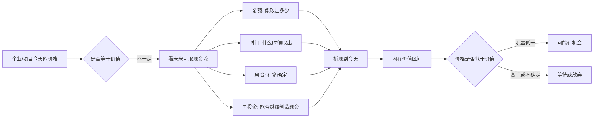

## 巴菲特思维筑基课: 内在价值: 企业未来可取现金流的折现值

### 作者
digoal

### 日期
2026-05-19

### 标签
内在价值 , 现金流折现 , 企业估值 , 未来现金流 , 价格与价值 , 投资判断 , 产品价值 , 运营价值 , 职业价值 , 安全边际

----

## 背景

> 面向对象: 大学生、产品经理、运营经理、有投资需求的人  
> 核心问题: 为什么股价、市值、收入、热度都不能直接代表一家企业真正值多少钱？怎样用底层规律判断一个机会是真有价值，还是只是价格和故事很热？  
> 先说结论: 内在价值是企业在未来生命周期里能够为所有者取出的现金流，按合理折现率折算到今天的价值。它不是一个精确数字，而是一个基于现金流、时间、风险和再投资能力的估计区间。

这里把“内在价值”当作一条底层规律来讲。它不是股票市场专用术语，而是一种判断所有资产、产品和项目的通用方法：今天值得投入多少，取决于未来能真实拿回多少、什么时候拿回、拿回的确定性有多高。

## 一张图先看懂



## 求真讲法

### 它到底说了什么

内在价值回答的是一个朴素问题：

> 如果你拥有这门生意，它未来能真正给你带来多少现金？这些未来现金折算到今天，值多少钱？

这里有三个关键词。

| 关键词 | 含义 | 为什么重要 |
|---|---|---|
| 未来 | 价值来自未来，不是过去 | 历史利润只能帮助估计未来 |
| 可取现金流 | 所有者能真正拿走或再配置的钱 | 账面利润不一定能变成现金 |
| 折现 | 未来的钱要按时间和风险折算 | 明年的 100 元不等于今天的 100 元 |

用极简公式表示：

```text
内在价值 = 未来每年可取现金流的现值之和
```

更展开一点：

```text
第1年现金流 / (1 + 折现率)^1
+ 第2年现金流 / (1 + 折现率)^2
+ 第3年现金流 / (1 + 折现率)^3
+ ...
= 今天的内在价值估计
```

这不是为了让普通人做复杂表格，而是为了建立一个判断锚：价值来自现金流，不来自口号、点击量、融资额、市场热度或别人愿意接盘的价格。

### 它是怎么来的

内在价值的思想来自企业所有权视角。

如果你买一张股票，本质上不是买一串会跳动的代码，而是买一家企业的一小部分。企业真正能给所有者的东西，不是新闻曝光，不是用户故事，也不是会计报表上的某个漂亮科目，而是长期可以取出的现金。

巴菲特把内在价值定义为：企业在剩余生命周期中可以取出的现金，折现到今天的价值。这个定义有几个重要含义。

第一，内在价值是向前看的。过去收入和利润只是证据，不是价值本身。

第二，内在价值是估计，不是精确数字。未来现金流、利率、竞争、管理层、技术变化都会影响估计。

第三，内在价值和账面价值不是一回事。账面价值记录过去投入了多少，内在价值估计未来能取出多少。

第四，增长不一定增加内在价值。只有当新增投入的回报高于资本成本时，增长才创造价值。

### 它依赖哪些假设

内在价值方法能成立，依赖几个前提。

1. 企业或项目未来能产生可观察、可估计的现金流。
2. 现金流能被所有者取出、分配或以合理方式再投资。
3. 经营环境没有完全随机化，需求、竞争、成本和规则有一定可判断性。
4. 投资者能估计一个合理折现率，用来反映时间成本和风险。
5. 管理层不会系统性侵占、浪费或错误配置现金流。
6. 估值者承认自己会错，所以把内在价值看成区间，而不是精确点位。

如果这些前提不成立，内在价值就很难估。比如一家企业没有稳定商业模式、现金流长期为负、全靠融资续命、未来高度依赖无法验证的技术突破，那么估值就会变成讲故事。

### 常见误解

误解一：市值就是内在价值。

不对。市值是市场今天给出的价格，内在价值是企业未来现金流折现后的估计。市场有时有效，有时会被情绪、流动性和叙事推偏。

误解二：账面价值就是内在价值。

不对。账面价值看过去投入，内在价值看未来产出。一个老工厂账面资产很高，但设备过时、利润下滑，内在价值可能很低；一个轻资产品牌账面资产不多，但现金流很强，内在价值可能很高。

误解三：利润等于现金流。

不对。会计利润可能被应收账款、库存、折旧、资本开支影响。真正重要的是企业在维持竞争力之后，能留给所有者的现金。

误解四：增长一定提高内在价值。

不对。亏损扩张、低回报扩张、靠补贴换规模的增长，可能降低内在价值。增长只有在回报高于资本成本时才有价值。

误解五：估值模型越复杂越准确。

不对。复杂模型可能只是把不确定性包装成精确数字。内在价值需要“方向上正确、假设清楚、留有余地”，而不是小数点后两位的幻觉。

## 求存讲法

### 它有什么用

内在价值的用途，是帮你把“价格”和“价值”分开。

| 表面指标 | 容易造成的错觉 | 内在价值视角 |
|---|---|---|
| 股价上涨 | 公司更值钱了 | 未来现金流是否真的增加 |
| 收入增长 | 生意变好了 | 增长是否转化为可取现金流 |
| 用户数量大 | 商业价值大 | 用户能否留存、付费、降低成本 |
| 融资估值高 | 项目很成功 | 融资价格不等于长期现金产出 |
| 品牌热度高 | 有护城河 | 是否有定价权和复购 |

对投资者，内在价值是买卖决策的锚。没有内在价值估计，股价涨跌只能制造情绪。

对产品经理，内在价值提醒你：产品功能的价值，不是做了多少，而是未来能产生多少用户价值、收入、留存和效率提升。

对运营经理，内在价值提醒你：活动数据的价值，不是当天 GMV 多漂亮，而是能否沉淀复购、会员关系、品牌信任和长期现金流。

对大学生，内在价值可以迁移成职业选择方法：一个技能或岗位的价值，不只看起薪和热度，还要看未来现金流、成长空间、可迁移能力和风险。

### 它怎么迁移到熟悉领域

内在价值可以迁移成一套通用判断框架。

```text
今天投入什么:
  钱 / 时间 / 团队 / 信用 / 机会成本

未来拿回什么:
  现金流 / 能力 / 用户资产 / 品牌 / 数据 / 关系 / 选择权

关键折现因素:
  多久拿回 / 多大概率拿回 / 中途会不会损耗 / 是否能持续再投资
```

对产品经理，判断一个功能值不值得做，可以问：

1. 它能提高多少留存、转化、付费或效率？
2. 这些收益是一次性的，还是会长期持续？
3. 维护成本、复杂度、用户学习成本有多高？
4. 它会不会强化产品护城河，还是只增加功能噪音？

对运营经理，判断一个活动值不值得做，可以问：

1. 活动带来的用户是否会留下？
2. 补贴结束后，复购和口碑是否还在？
3. 获客成本能否通过后续生命周期价值覆盖？
4. 活动是否沉淀用户标签、内容资产、会员关系？

对投资者，判断一个企业值不值得买，可以问：

1. 未来可取现金流大致是多少？
2. 现金流确定性高不高？
3. 护城河能不能保护现金流？
4. 管理层会不会把现金流合理分配？
5. 当前价格相对内在价值是否有安全边际？

### 它的适用范围和边界

内在价值适合用于以下对象。

1. 有商业模式，能产生现金流。
2. 有历史数据，可以帮助估计未来。
3. 竞争格局和成本结构大致可理解。
4. 管理层资本配置行为可观察。
5. 估值者在能力圈内，能解释关键变量。

内在价值不适合被机械套用在这些情况。

1. 未来现金流完全无法估计，只能靠远期故事支撑。
2. 行业技术路径快速变化，今天的优势可能突然失效。
3. 企业现金流长期为负，且看不到清晰转正机制。
4. 管理层治理差，现金流无法真正归属于所有者。
5. 使用高杠杆或短期资金，导致还没等价值兑现就被迫出局。

### 正例: 怎么用它提升能力

假设一个产品经理要决定是否投入三个月开发“自动化报表功能”。

表面上，这只是一个功能排期问题。用内在价值视角看，它其实是一个现金流和长期价值问题。

他可以粗略估计：

| 变量 | 保守估计 |
|---|---|
| 可影响客户数 | 500 家 |
| 每家每月节省人工时间 | 10 小时 |
| 每小时人工成本 | 80 元 |
| 每月客户可感知价值 | 500 x 10 x 80 = 400,000 元 |
| 可能转化为产品收入的比例 | 10%-20% |
| 每月新增收入潜力 | 40,000-80,000 元 |
| 主要成本 | 研发、维护、培训、客服 |

这不是精确估值，但它把讨论从“我觉得这个功能很酷”变成“它未来能创造多少可验证价值”。如果功能还能提高留存、降低客服成本、增强客户切换成本，它的内在价值就更高。

投资里也一样。假设一家企业每年能稳定产生 1 亿元所有者现金流，护城河较强，未来还能温和增长。它的价值一定不能只看今年利润，而要看未来多年现金流的折现。如果市场价格远低于保守估计的价值，才可能是机会。

### 反例: 前提不成立会怎样

某创业公司用户增长很快，融资估值很高，媒体称它是“未来平台”。投资者看到热度后买入相关股票或参与融资。

但内在价值前提并不成立。

| 内在价值前提 | 实际情况 | 结果 |
|---|---|---|
| 用户能转化为现金流 | 用户只在补贴时活跃 | 收入质量差 |
| 现金流能持续 | 留存低，复购弱 | 未来现金流不稳定 |
| 增长能创造价值 | 获客成本高于用户生命周期价值 | 增长越快亏越多 |
| 管理层理性配置资本 | 融资后盲目扩张 | 现金消耗加快 |
| 折现假设可靠 | 未来全靠乐观故事 | 估值没有锚 |

这个失败不是因为“创新公司不能投”，而是因为价格建立在故事上，内在价值缺少现金流支撑。没有现金流锚的估值，很容易在情绪退潮时重估。

## 思考

内在价值最重要的训练，是让你从“别人愿意出多少钱”转向“它未来真的能产生什么”。

价格是别人今天的看法，价值是对象未来的产出。短期里，价格可能被情绪、流动性、叙事、政策预期和群体行为推得很远；长期里，如果一个对象不能产生现金流或可转化的真实价值，价格就缺少重力中心。

这条规律也能帮助大学生理解职业选择。一个高薪岗位如果没有能力积累、行业沉淀和未来选择权，可能只是短期价格高；一个起薪普通但能积累稀缺能力、作品、信誉和行业理解的路径，长期内在价值可能更高。

对产品和运营来说，内在价值要求你看穿指标外观。一个功能的点击率很高，但如果不提高留存、收入、效率或用户信任，它的内在价值有限。一次活动的 GMV 很高，但如果靠高补贴换来低质量用户，活动可能是在透支未来价值。

可以用这张简化图做日常判断。

```text
价格层: 股价 / 市值 / 融资估值 / 点击量 / GMV / 起薪
  |
  v
价值层: 未来现金流 / 留存 / 复购 / 效率 / 信任 / 可迁移能力
  |
  v
折现层: 时间 / 风险 / 确定性 / 机会成本 / 管理质量
```

真正成熟的判断，不是忽略价格，而是知道价格只是入口。你必须往下挖到价值层，再看时间和风险如何折现。

内在价值还有一个反人性的地方：它要求你承认不确定。越诚实的估值，越像一个区间，而不是一个精确数字。你可以说“在这些假设下，它大约值多少”；但如果关键假设一变，估值也必须变。

所以，内在价值不是算命工具，而是防骗工具。它不能保证你每次都对，但能逼你把故事翻译成现金流，把热度翻译成留存和利润，把愿望翻译成可验证假设。

## 最后记住

1. 内在价值是未来可取现金流折现到今天的价值，不是股价、市值、账面价值或融资估值。
2. 价值来自未来现金流，历史收入和利润只是帮助估计未来的证据。
3. 增长不必然创造价值，只有高回报、可持续、能转化为现金流的增长才有价值。
4. 内在价值是估计区间，不是精确数字；关键假设变化，价值也要重估。
5. 对产品、运营、职业和投资来说，内在价值都是把表面热度翻译成长期真实产出的工具。

## 参考资料

- Warren Buffett, Berkshire Hathaway Shareholder Letters, especially discussions on intrinsic value, owner earnings, discounted cash flow, retained earnings, and the difference between book value and intrinsic value.
- Benjamin Graham, *The Intelligent Investor*, especially the distinction between market price and business value.
- Charles T. Munger, *Poor Charlie's Almanack*, especially opportunity cost, inversion, and avoiding false precision.
- 本文参考本地 `buffett` 技能资料: `references/02-investment-philosophy.md` 中关于内在价值、复利、增长质量的框架；以及 `references/06-valuation-capital.md` 中关于现金流折现、所有者收益倍数、安全边际和资本配置的框架。
  
#### [PostgreSQL 解决方案集合](../201706/20170601_02.md "40cff096e9ed7122c512b35d8561d9c8")
  
  
#### [德哥 / digoal's Github - 公益是一辈子的事.](https://github.com/digoal/blog/blob/master/README.md "22709685feb7cab07d30f30387f0a9ae")
  
  
#### [About 德哥](https://github.com/digoal/blog/blob/master/me/readme.md "a37735981e7704886ffd590565582dd0")
  
  

  
