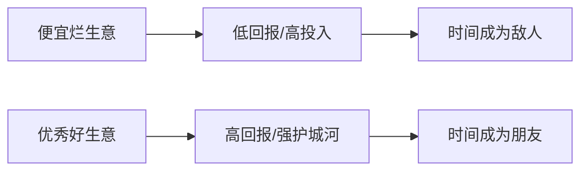

## 巴菲特思维筑基课: 好生意比便宜生意更重要

### 作者
digoal

### 日期
2026-05-19

### 标签
好生意 , 便宜 , 价值陷阱 , 护城河 , 企业质量 , 合理价格 , 芒格 , 巴菲特 , 长期复利 , 投资选择

----

## 背景

> 面向对象: 高中生
> 核心问题: 为什么巴菲特从“捡便宜”转向“买优秀公司”?
> 先说结论: 便宜的烂生意可能持续毁灭价值，优秀生意能让时间帮你赚钱。成熟巴菲特更愿意以合理价格买伟大公司。

## 一张图先看懂

| 类型 | 初看吸引力 | 长期结果 |
|---|---|---|
| 烂公司很便宜 | 估值低 | 可能是价值陷阱 |
| 好公司合理价 | 不一定最低 | 复利空间更大 |

## 求真讲法

### 它到底说了什么

巴菲特早期受格雷厄姆影响，喜欢买极便宜资产。后来在芒格影响下认识到: 如果企业经济特征很差，再便宜也可能只给一次小收益，甚至拖累资本多年。

### 它是怎么来的

一个破旧自动售货机便宜买来，也许还能赚最后几次钱；但如果机器经常坏、没人买饮料，你省下的买价会被后续麻烦吃掉。

### 它依赖哪些假设

- 企业质量会影响长期资本回报。
- 投资者希望资本长期复利，而不是只赚一次估值修复。
- 优秀企业的竞争优势能持续。
- 买入价格仍然合理，不是无条件追高。

### 常见误解

误解一: “好生意再贵也能买。”不对。买太贵会抵消多年经营成果。

误解二: “便宜一定不好。”不对。便宜且质量不错才是好机会，问题是只看便宜。

## 求存讲法

### 它有什么用

它把选股标准从“低估值”升级为“高质量 + 合理价格”。这能减少掉入价值陷阱的概率。

### 它怎么迁移到熟悉领域

买工具、选课程、选合作伙伴也一样。最低价未必最低成本，稳定、可靠、能长期产生价值更重要。

### 它的适用范围和边界

适用于长期投资。不适合完全否定短期特殊机会，但普通投资者更容易识别好生意，较难安全操作烂生意反弹。

### 正例: 怎么用它提升能力

比较两家公司时，不只看 PE。还看十年 ROIC、现金流、护城河和管理层。如果好公司价格合理，优先级更高。

### 反例: 前提不成立会怎样

一家传统企业 PE 很低，但行业需求永久下降、设备更新吞噬现金。你买到的不是便宜，而是衰退。

## 思考

你是在寻找“便宜的价格”，还是在寻找“长期能把每一元资本变得更值钱的机器”?

## 最后记住

- 便宜不是安全边际的全部。
- 烂生意会让时间成为敌人。
- 好生意必须有护城河和高资本回报。
- “合理价格”仍然是必要条件。

## 参考资料

- Warren Buffett, shareholder letters on wonderful businesses at fair prices.
- Charlie Munger's influence on Buffett's shift from cigar-butt investing.
- Benjamin Graham, value investing tradition.
  
#### [PostgreSQL 解决方案集合](../201706/20170601_02.md "40cff096e9ed7122c512b35d8561d9c8")
  
  
#### [德哥 / digoal's Github - 公益是一辈子的事.](https://github.com/digoal/blog/blob/master/README.md "22709685feb7cab07d30f30387f0a9ae")
  
  
#### [About 德哥](https://github.com/digoal/blog/blob/master/me/readme.md "a37735981e7704886ffd590565582dd0")
  
  

  
