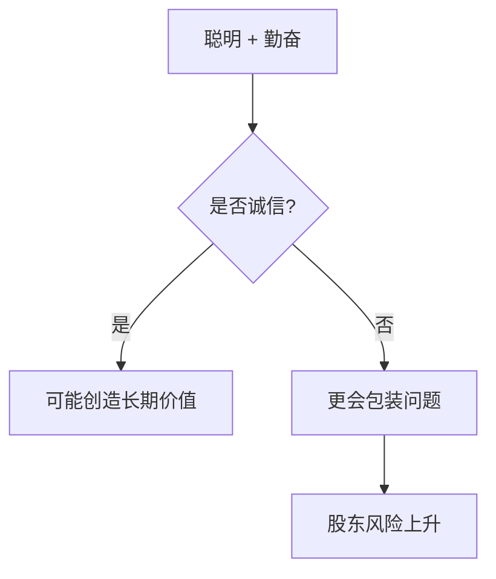

## 巴菲特思维筑基课: 管理层诚信是一票否决项

### 作者
digoal

### 日期
2026-05-19

### 标签
管理层 , 诚信 , 公司治理 , 资本配置 , 股东利益 , 财务质量 , 巴菲特 , 一票否决 , 代理问题 , 长期价值

----

## 背景

> 面向对象: 高中生
> 核心问题: 为什么巴菲特说坏人手里的好生意也不能碰?
> 先说结论: 管理层掌握信息、资本和决策权。如果他们不诚实，其他优点都会变成伤害股东的工具。

## 一张图先看懂

| 信号 | 好管理层 | 危险管理层 |
|---|---|---|
| 坏消息 | 主动说明 | 藏在脚注 |
| 指标 | 重视真实现金流 | 滥用调整后利润 |
| 资本配置 | 看每股价值 | 追求规模和面子 |

## 求真讲法

### 它到底说了什么

诚信不是“看起来礼貌”，而是愿意面对事实、承认错误、对股东说真话。巴菲特把诚信放在能力之前，因为不诚信的聪明人破坏力更大。

### 它是怎么来的

外部股东掌握的信息少于管理层。如果管理层故意美化财务、隐瞒风险、关联交易输送利益，股东很难及时发现。

### 它依赖哪些假设

- 管理层拥有信息优势。
- 股东无法每天参与经营。
- 资本配置权会显著影响长期价值。
- 不诚信行为通常不会只发生一次。

### 常见误解

误解一: “只要公司赚钱，诚信问题可以忍。”不对。诚信问题会污染财务、文化和资本配置。

误解二: “没违法就算诚信。”不对。巴菲特更看重是否主动、完整、清楚地面对问题。

## 求存讲法

### 它有什么用

它是投资的一票否决规则。发现重大欺骗或自利行为，不需要继续精算估值，因为基础信任已经破坏。

### 它怎么迁移到熟悉领域

合作也一样。能力强但不守信的人，短期可能有效率，长期会放大系统风险。

### 它的适用范围和边界

适用于所有依赖代理人的场景，包括上市公司、基金、创业团队。边界是: 不能因一次普通错误就等同于诚信问题，要区分能力不足和有意误导。

### 正例: 怎么用它提升能力

阅读年报时，专门找管理层如何解释失败。愿意量化错误、说明原因、给出改正路径的公司，更值得继续研究。

### 反例: 前提不成立会怎样

公司连续宣传“调整后利润创新高”，但经营现金流长期低于净利润，并频繁更换审计师。此时继续相信管理层，风险会积累到突然爆发。

## 思考

如果一个人会在小事上故意误导你，你凭什么相信他在掌管巨额资本时会突然诚实?

## 最后记住

- 诚信是一票否决项。
- 聪明的不诚信者更危险。
- 坏消息如何披露，是观察诚信的窗口。
- 投资前要评估人，而不只评估数字。

## 参考资料

- Warren Buffett, Berkshire Hathaway shareholder letters on integrity and reputation.
- Berkshire Hathaway discussions of Salomon Brothers.
- Corporate governance literature on agency problems.
  
#### [PostgreSQL 解决方案集合](../201706/20170601_02.md "40cff096e9ed7122c512b35d8561d9c8")
  
  
#### [德哥 / digoal's Github - 公益是一辈子的事.](https://github.com/digoal/blog/blob/master/README.md "22709685feb7cab07d30f30387f0a9ae")
  
  
#### [About 德哥](https://github.com/digoal/blog/blob/master/me/readme.md "a37735981e7704886ffd590565582dd0")
  
  

  
