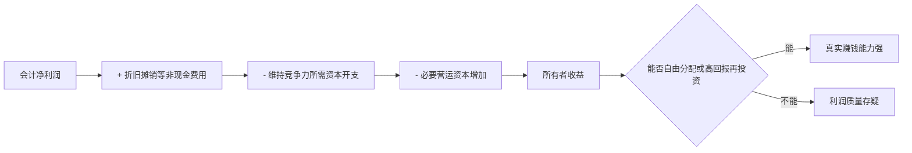

## 巴菲特思维筑基课: 所有者收益: 真正的利润是能拿走的现金

### 作者
digoal

### 日期
2026-05-19

### 标签
所有者收益 , 真实利润 , 现金流 , 净利润 , EBITDA , 维持性资本开支 , 自由现金流 , 利润质量 , 企业估值 , 经营分析

----

## 背景

> 面向对象: 大学生、产品经理、运营经理、有投资需求的人  
> 核心问题: 为什么一家企业报表上利润很好，股东却拿不到多少钱？为什么有些增长看起来漂亮，实际在不断吞现金？  
> 先说结论: 所有者收益不是会计净利润，而是企业在维持竞争力之后，真正能留给所有者自由支配的现金。真正的利润，必须经得起现金流和资本开支的检验。

这里把“所有者收益”当作一条底层规律来讲。它是巴菲特判断企业真实赚钱能力的重要工具：利润表只是起点，经济现实才是终点。看不懂所有者收益，就容易把会计利润、调整后利润和融资驱动的增长误认为真实价值。

## 一张图先看懂



## 求真讲法

### 它到底说了什么

所有者收益回答的是一个朴素问题：

> 这门生意扣掉维持经营和竞争力所必需的花费后，真正能给所有者留下多少钱？

巴菲特提出的简化公式是：

```text
所有者收益 =
  净利润
  + 折旧、摊销等非现金费用
  - 维持性资本开支
  - 必要营运资本增加
```

这里最关键的是“维持性资本开支”。很多企业看起来有利润，但为了保持产能、设备、门店、系统、库存和竞争地位，必须不断把钱重新投进去。这部分钱不能算成所有者真正能拿走的收益。

| 指标 | 看起来回答的问题 | 局限 |
|---|---|---|
| 净利润 | 会计上赚了多少钱 | 可能不等于现金 |
| EBITDA | 利息、税、折旧摊销前赚了多少 | 容易忽略资产会磨损 |
| 自由现金流 | 经营现金流减全部资本开支 | 对高增长企业可能过于粗糙 |
| 所有者收益 | 维持竞争力后能拿走多少现金 | 需要判断维持性资本开支 |

### 它是怎么来的

会计制度是为了统一记录企业经营结果，但会计数字不等于经济现实。

比如折旧是会计费用，但当年的确没有现金流出，所以要加回来。可是设备会老、门店会旧、系统要维护、库存要补充，这些未来要花真金白银，所以维持性资本开支又必须扣掉。

这就是所有者收益的动机：穿透会计利润，找到真正属于所有者的现金。

可以用一个小例子理解。

```text
公司 A:
  净利润 100 万
  折旧摊销 20 万
  维持性资本开支 10 万
  必要营运资本增加 5 万
  所有者收益 = 105 万

公司 B:
  净利润 100 万
  折旧摊销 20 万
  维持性资本开支 90 万
  必要营运资本增加 30 万
  所有者收益 = 0 万
```

两家公司净利润一样，但真实赚钱能力完全不同。公司 A 的利润能留下，公司 B 的利润被维持经营吃掉。

### 它依赖哪些假设

所有者收益这个概念成立，依赖几个前提。

1. 企业有真实经营现金流，而不是只靠融资、赊销或会计处理制造利润。
2. 可以大致区分维持性资本开支和成长性资本开支。
3. 企业的营运资本变化能被解释，比如应收账款、库存、预付款是否合理。
4. 管理层没有用“调整后利润”等口径掩盖真实现金流。
5. 所有者能分享企业留下的现金，或者管理层能把现金高回报再投资。
6. 分析者要看多年平均，而不是只看某一年。

如果企业处在早期高速扩张期，所有者收益可能暂时低甚至为负。这不一定说明它差，但必须解释清楚：现金消耗是在建设高回报资产，还是在补一个无底洞。

### 常见误解

误解一：净利润就是企业真正赚的钱。

不对。净利润是会计结果，现金流才说明钱有没有真正进来、能不能留下。

误解二：EBITDA 越高越好。

不一定。EBITDA 忽略折旧和资本开支，容易美化重资产企业。设备会坏，门店要装修，系统要维护，这些都要花现金。

误解三：经营现金流高就一定好。

不一定。经营现金流还要扣除维持性资本开支。如果维持竞争力要花很多钱，能留给所有者的现金可能很少。

误解四：资本开支都是坏事。

不对。维持性资本开支是必须花的钱；成长性资本开支如果能带来高回报，是好事。关键是区分两者。

误解五：所有者收益只适合投资者。

不对。产品、运营、创业也要看“真实留下来的价值”，而不是只看表面收入、GMV、下载量或曝光。

## 求存讲法

### 它有什么用

所有者收益的用途，是帮你判断“这门生意到底有没有真实现金产出”。

| 场景 | 表面指标 | 所有者收益视角 |
|---|---|---|
| 投资 | 净利润增长 | 现金是否能留下 |
| 产品 | 收入增长 | 维护、客服、云资源、研发成本是否吃掉收益 |
| 运营 | GMV 增长 | 补贴、退款、履约、渠道成本后还剩多少 |
| 创业 | 融资和规模 | 单位经济模型是否现金为正 |
| 职业 | 收入高 | 时间、健康、信用和机会成本后是否值得 |

对投资者，它能识别利润质量。

对产品经理，它能提醒你：功能带来的收入如果被复杂度、客服、运维和后续维护吃掉，就未必创造价值。

对运营经理，它能提醒你：活动 GMV 不是利润，扣掉补贴、渠道、履约、退款和低质量用户成本后，才知道是否真的赚钱。

对大学生，它能迁移成个人判断：一个选择带来的表面收入，要扣掉时间消耗、健康成本、能力折旧和机会成本，才是真收益。

### 它怎么迁移到熟悉领域

可以把所有者收益迁移成一个通用公式：

```text
真实收益 =
  表面收益
  - 为维持这个收益必须持续付出的成本
  - 被占用的资源和机会成本
```

产品经理可以问：

1. 这个功能带来的收入，是否覆盖长期维护成本？
2. 它是否增加客服、培训、运维和用户理解成本？
3. 它是否降低未来迭代效率？
4. 它沉淀的是资产，还是复杂度负债？

运营经理可以问：

1. 活动 GMV 扣掉补贴后还剩多少毛利？
2. 新用户是否会复购，还是只来套利？
3. 渠道费用是否越来越高？
4. 活动结束后是否留下可复用用户资产？

投资者可以问：

1. 净利润能否转化为经营现金流？
2. 维持性资本开支有多高？
3. 应收账款和库存是否异常增长？
4. 管理层是否频繁使用“调整后利润”？
5. 留下来的现金能否高回报再投资？

### 它的适用范围和边界

所有者收益特别适合判断成熟、稳定、可理解的企业。

适用条件包括：

1. 企业有持续经营记录。
2. 资本开支和营运资本变化可以估计。
3. 经营现金流与利润之间关系可分析。
4. 业务不是完全依赖一次性资产出售或金融重估。
5. 管理层披露相对透明。

边界也要清楚。

1. 早期成长企业可能有意牺牲当期现金流建设未来资产。
2. 周期行业某一年现金流可能失真，要看多年平均。
3. 维持性资本开支很难精确拆分，只能做保守估计。
4. 金融企业、保险企业和平台型企业需要更专业的现金流理解。
5. 所有者收益高也不等于一定值得买，还要看价格和未来可持续性。

### 正例: 怎么用它提升能力

假设一个运营经理做一次大促活动，报表显示 GMV 1000 万，看起来很成功。

但他用所有者收益思维重新计算。

| 项目 | 金额 |
|---|---:|
| GMV | 1000 万 |
| 商品成本 | -620 万 |
| 平台补贴 | -120 万 |
| 渠道投放 | -90 万 |
| 履约和客服 | -60 万 |
| 退款和售后 | -40 万 |
| 新用户后续复购价值 | +50 万 |
| 真实可留收益 | 120 万 |

这时他不会只看 GMV，而会继续问：这 120 万是否稳定？新用户质量如何？补贴减少后还有没有复购？这才是经营判断。

投资中也一样。一家企业净利润增长，但如果应收账款暴增、库存积压、资本开支长期高于折旧、经营现金流弱，那么利润质量就值得怀疑。相反，一家企业净利润不夸张，但现金转换率高、维持性资本开支低，可能是真正的好生意。

### 反例: 前提不成立会怎样

某制造企业连续几年净利润增长，市盈率看起来很低，投资者以为它很便宜。

但深入看，问题很多。

| 表面利润 | 真实情况 | 后果 |
|---|---|---|
| 净利润增长 | 应收账款增长更快 | 钱没有真正收回来 |
| EBITDA 很高 | 设备更新资本开支巨大 | 折旧加回后仍要花现金 |
| 收入扩张 | 库存持续增加 | 未来可能减值 |
| 毛利稳定 | 依赖赊销和价格让利 | 现金流差 |
| 低市盈率 | 所有者收益很低 | 便宜可能是价值陷阱 |

这个失败不是因为财报没用，而是因为只看利润表不够。真正的利润必须能穿过现金流量表和资本开支检验。

## 思考

所有者收益最重要的训练，是把“看起来赚了”改成“钱真的留下了吗”。

很多表面繁荣都经不起这个问题。GMV 很高，但补贴更高；用户很多，但服务成本更高；收入增长，但应收账款收不回来；利润增长，但设备更新吃掉现金；工资高，但健康和能力被透支。

这条规律能帮你穿透表面指标。

```text
表面层:
  收入 / GMV / 净利润 / EBITDA / 下载量 / 融资额

现金层:
  收到的钱 / 必须花的钱 / 能留下的钱

所有者层:
  留下的钱能否分配、回购、还债或高回报再投资
```

对产品和运营来说，所有者收益思维特别重要。一个功能、活动或渠道如果只能制造漂亮表面指标，却留下复杂度、退款、投诉、低质量用户和维护成本，它不是资产，而是负债。

对个人来说，也可以问自己的“所有者收益”：这份工作、这个项目、这门课程，扣掉时间、健康、注意力、机会成本之后，是否留下了能力、作品、现金流和信用？

真正好的系统，不只是创造收入，而是能留下可自由支配、可再投资、可复利的收益。

## 最后记住

1. 所有者收益是真正能留给所有者的现金，不等于会计净利润。
2. EBITDA 容易忽略资产磨损和维持性资本开支，不能单独当真实利润。
3. 维持性资本开支必须扣掉，因为不花这笔钱，企业竞争力会下降。
4. 表面增长要经过现金流、营运资本和资本开支检验。
5. 产品、运营、职业和投资都要问：扣掉维持成本后，真正留下了什么？

## 参考资料

- Warren Buffett, Berkshire Hathaway Shareholder Letters, especially the 1986 discussion of owner earnings, intrinsic value, retained earnings, and cash flow quality.
- Benjamin Graham, *The Intelligent Investor*, especially the distinction between market price and business value.
- Charles T. Munger, *Poor Charlie's Almanack*, especially economic reality, incentives, and avoiding accounting illusions.
- 本文参考本地 `buffett` 技能资料: `references/05-financial-metrics.md` 中关于所有者收益、维持性资本开支、ROIC、现金转换率和利润质量红旗的框架；`references/02-investment-philosophy.md` 中关于内在价值和未来可取现金流的框架；以及 `references/06-valuation-capital.md` 中关于所有者收益倍数和估值方法的框架。
  
#### [PostgreSQL 解决方案集合](../201706/20170601_02.md "40cff096e9ed7122c512b35d8561d9c8")
  
  
#### [德哥 / digoal's Github - 公益是一辈子的事.](https://github.com/digoal/blog/blob/master/README.md "22709685feb7cab07d30f30387f0a9ae")
  
  
#### [About 德哥](https://github.com/digoal/blog/blob/master/me/readme.md "a37735981e7704886ffd590565582dd0")
  
  

  
