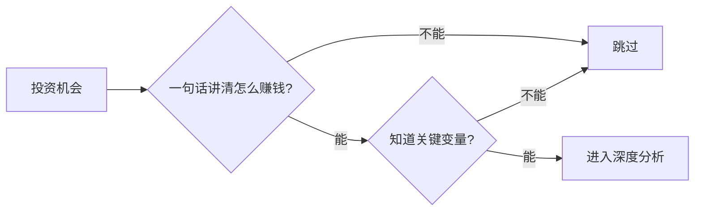

## 巴菲特思维筑基课: 能力圈定律

### 作者
digoal

### 日期
2026-05-19

### 标签
能力圈定律 , 投资筛选 , 商业模式 , 关键变量 , 失败路径 , 巴菲特 , 能力边界 , 主动投资 , 风险控制 , 判断力

----

## 背景

> 面向对象: 高中生
> 核心问题: 面对很多投资机会，第一步到底该筛什么?
> 先说结论: 第一筛不是估值，也不是热度，而是你能否清楚解释这门生意。解释不清，就不该下注。

## 一张图先看懂

| 自检问题 | 合格表现 |
|---|---|
| 谁付钱 | 能说出客户和购买理由 |
| 成本是什么 | 能说出主要成本项 |
| 为什么能赢 | 能说出竞争优势 |
| 什么会错 | 能说出失败路径 |

## 求真讲法

### 它到底说了什么

能力圈定律要求投资者只在自己能判断的范围内行动。它不是要求你无所不知，而是要求你不要在不懂时假装懂。

### 它是怎么来的

巴菲特把投资看成企业判断。既然你不能评价所有企业，就必须先划边界。边界越清楚，错误越少。

### 它依赖哪些假设

- 投资者可以选择不买。
- 不同业务的可理解程度不同。
- 深度理解能降低永久亏损概率。
- 错过看不懂的机会可以接受。

### 常见误解

“我不用懂，公司涨就行。”这是把结果当能力。短期上涨可能只是运气，无法重复。

## 求存讲法

### 它有什么用

它能迅速减少噪音。多数热门机会在第一步就会被排除，因为你无法解释它如何长期赚钱。

### 它怎么迁移到熟悉领域

选题研究也一样。先选自己能提出好问题、能验证答案的范围，而不是只选最流行的话题。

### 它的适用范围和边界

适用于主动投资和重大决策。对于无法建立能力圈的人，低成本指数基金可能更符合巴菲特给普通人的建议。

### 正例: 怎么用它提升能力

先研究本地超市、饮料、保险这类你能观察的业务，建立判断模板，再逐渐扩展到更复杂行业。

### 反例: 前提不成立会怎样

买入一家业务复杂、财务杠杆高的公司，价格下跌后你无法判断是机会还是危险，只能跟着情绪行动。

## 思考

你现在的投资清单里，有多少公司你能在不查资料的情况下讲清赚钱逻辑?

## 最后记住

- 第一筛是懂不懂。
- 能力圈外最好的动作是跳过。
- 能说出失败路径，才算接近理解。
- 普通人承认边界并不丢人。

## 参考资料

- Warren Buffett, Berkshire Hathaway annual meeting discussions.
- Berkshire Hathaway investment criteria.
- Charlie Munger, latticework of mental models.
  
#### [PostgreSQL 解决方案集合](../201706/20170601_02.md "40cff096e9ed7122c512b35d8561d9c8")
  
  
#### [德哥 / digoal's Github - 公益是一辈子的事.](https://github.com/digoal/blog/blob/master/README.md "22709685feb7cab07d30f30387f0a9ae")
  
  
#### [About 德哥](https://github.com/digoal/blog/blob/master/me/readme.md "a37735981e7704886ffd590565582dd0")
  
  

  
