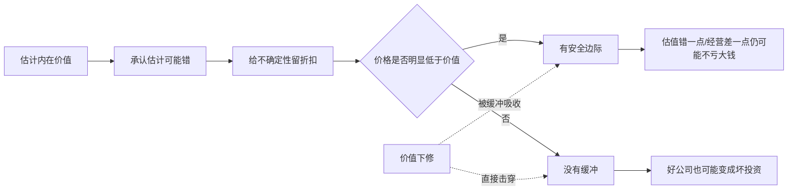

## 巴菲特思维筑基课: 安全边际: 价格必须明显低于价值

### 作者
digoal

### 日期
2026-05-19

### 标签
安全边际 , 价格低于价值 , 风险缓冲 , 内在价值 , 估值纪律 , 永久性亏损 , 投资安全 , 产品决策 , 运营预算 , 职业规划

----

## 背景

> 面向对象: 大学生、产品经理、运营经理、有投资需求的人  
> 核心问题: 为什么一个判断方向正确，最后仍然可能亏钱、失败或被迫退出？怎样在不确定世界里给自己留下犯错空间？  
> 先说结论: 安全边际就是让买入价格明显低于保守估计的内在价值，用价格差来吸收估值错误、经营波动和未来不确定性。它不是胆小，而是承认人会犯错之后的理性设计。

这里把“安全边际”当作一条底层规律来讲。它最早是价值投资里的核心原则，但可以迁移到产品、运营、创业、职业选择和生活决策中：重要决策不能建立在“所有假设都刚好正确”之上。

## 一张图先看懂



## 求真讲法

### 它到底说了什么

安全边际的核心很简单：

> 不要用 1 元钱买你估计值 1 元的东西；要用明显低于 1 元的价格买它，因为你的估计可能错。

在投资中，如果你保守估计一家企业值 100 元，安全边际要求你不要在 100 元买，而是在 70 元、60 元，甚至更低时才考虑。折扣越大，越能承受未来的错误和坏消息。

安全边际保护的不是“短期不下跌”，而是“长期不发生永久性重大损失”。

| 项目 | 没有安全边际 | 有安全边际 |
|---|---|---|
| 估值错误 | 一错就亏 | 错一部分仍有缓冲 |
| 经营波动 | 利润下滑就击穿预期 | 短期变差不一定致命 |
| 市场情绪 | 下跌时被迫恐慌 | 能区分价格和价值 |
| 决策心理 | 必须证明自己完全正确 | 允许自己不完美 |
| 长期结果 | 好资产也可能买贵 | 普通波动不易摧毁本金 |

### 它是怎么来的

安全边际来自工程和投资两个朴素事实。

工程里，桥梁不会只按“刚好承受日常车流”来设计。因为风、雨、超载、材料误差、施工误差都会出现。桥梁必须有安全系数。

投资里也一样。估值不是测量一张桌子的长度，而是在估计未来现金流。未来现金流会受竞争、利率、管理层、技术、政策、周期和人性影响。既然未来不可精确预测，价格就必须留出缓冲。

巴菲特和格雷厄姆把安全边际放在价值投资中心，是因为他们知道：投资不是为了证明自己聪明，而是为了避免一次重大错误毁掉长期复利。

可以把逻辑写成：

```text
内在价值估计 = 对未来现金流的保守判断
安全边际 = 内在价值估计 - 买入价格

安全边际越大:
  对估值错误的承受力越强
  对坏消息的承受力越强
  对心理波动的承受力越强
```

### 它依赖哪些假设

安全边际成立，依赖几个前提。

1. 你能大致估计价值。如果完全无法估值，就谈不上“低于价值”。
2. 价格和价值可能偏离。市场短期会受情绪、流动性和叙事影响。
3. 未来存在不确定性。现金流、竞争格局、利率、需求和管理层都会变化。
4. 错误代价不对称。亏 50% 需要涨 100% 才能回本。
5. 你有等待能力。没有合适价格时，能忍住不做。
6. 你不使用会被短期波动击穿的杠杆。否则再大的长期价值也可能等不到兑现。

如果你无法估计内在价值，安全边际就不是“打几折”那么简单，而是应该放弃或继续学习。

### 常见误解

误解一：安全边际就是买低价股。

不对。低价不等于便宜，便宜也不等于有安全边际。一家公司股价从 100 跌到 10，如果内在价值从 100 跌到 5，仍然不安全。

误解二：安全边际能保证不亏钱。

不对。它只能降低永久性亏损概率，不能保证短期价格不跌，也不能保证所有判断都正确。

误解三：好公司可以不讲价格。

不对。再好的公司，如果价格太高，也可能让投资者多年没有回报。价格决定未来收益的一大部分。

误解四：安全边际越大越好，所以永远等最低价。

不对。安全边际是理性折扣，不是幻想最低点。过度苛刻会导致长期不行动，错过能力圈内的合理机会。

误解五：安全边际只适用于股票。

不对。创业预算、产品排期、运营目标、职业选择、个人现金流，都需要安全边际。

## 求存讲法

### 它有什么用

安全边际的作用，是把“正确判断”变成“可承受的结果”。

很多失败不是因为方向完全错，而是因为没有缓冲。

| 场景 | 没有安全边际 | 有安全边际 |
|---|---|---|
| 投资 | 估值刚好合理就满仓买入 | 价格明显低于保守价值才行动 |
| 产品 | 排期按最理想情况安排 | 给需求变更、测试、返工留时间 |
| 运营 | 活动预算全靠乐观转化率 | 用保守转化率测算盈亏平衡 |
| 创业 | 现金只够跑到下一轮融资 | 现金流覆盖更长低谷期 |
| 个人 | 月收入刚好覆盖支出 | 有储蓄和技能备用路线 |

对投资者，安全边际是估值纪律。

对产品经理，安全边际是项目计划的缓冲。

对运营经理，安全边际是活动 ROI 和用户质量的底线。

对大学生，安全边际是职业和能力选择中的反脆弱空间：不要把未来押在单一证书、单一平台、单一岗位或单一热点上。

### 它怎么迁移到熟悉领域

安全边际可以迁移成一个通用公式：

```text
保守收益 - 真实成本 - 错误缓冲 > 0
```

产品经理做功能时，可以问：

1. 如果开发时间多 30%，项目还值得做吗？
2. 如果上线后转化率只有预期一半，还能接受吗？
3. 如果维护成本持续存在，收益是否覆盖复杂度？
4. 如果用户不按我们想象使用，是否有退出方案？

运营经理做活动时，可以问：

1. 用保守转化率测算，活动是否仍不亏？
2. 补贴结束后，用户生命周期价值能否覆盖获客成本？
3. 如果渠道质量下降，预算会不会迅速失控？
4. 是否有停止线，而不是越亏越加码？

投资者买企业时，可以问：

1. 内在价值是保守估计，还是乐观故事？
2. 当前价格是否明显低于保守价值？
3. 如果利润下调 20%，还有没有安全边际？
4. 如果估值倍数下降，还能不能保住本金？

大学生做职业选择时，可以问：

1. 这个方向如果热度下降，我的能力还可迁移吗？
2. 如果第一份工作不理想，我还有什么选择？
3. 如果行业变慢，我是否仍在积累基础能力？
4. 我是否把时间全押在一个无法验证的风口上？

### 它的适用范围和边界

安全边际适合高不确定、高代价、长期性的决策。

适用条件包括：

1. 你能估计一个保守价值或保守收益。
2. 决策存在明显下行风险。
3. 失败会造成较大损失或长期机会成本。
4. 你可以等待更好的价格、条件或准备程度。
5. 你能提前定义退出线和停止线。

安全边际不等于不冒险。它反对的是没有补偿的风险，不反对经过计算、下行可控、上行充足的风险。

边界也很重要。

1. 如果价值完全无法估计，安全边际无法计算。
2. 如果资产质量持续恶化，低价可能是价值陷阱。
3. 如果杠杆太高，短期波动会摧毁长期逻辑。
4. 如果机会窗口很短，过度等待会失去行动价值。
5. 如果目标是学习实验，可以用小规模试错替代大安全边际。

### 正例: 怎么用它提升能力

假设一个运营经理准备做一次付费投放活动。团队乐观估计：每个新用户获客成本 50 元，用户生命周期价值 90 元，看起来每个用户赚 40 元。

如果他有安全边际，不会直接按乐观模型放大预算，而会做保守测算。

| 变量 | 乐观估计 | 保守估计 |
|---|---:|---:|
| 获客成本 | 50 元 | 70 元 |
| 付费转化率 | 8% | 5% |
| 留存周期 | 6 个月 | 3 个月 |
| 用户生命周期价值 | 90 元 | 55 元 |
| 单用户安全边际 | +40 元 | -15 元 |

保守测算后，他发现活动没有安全边际，于是先小规模测试、设置停止线、优化渠道质量，而不是一次性放大预算。

这不是保守，而是避免把整个季度预算押在一组乐观假设上。

投资中也是同理。如果一家企业保守估计值 100 元，但市场价格是 95 元，表面看便宜，实际缓冲很薄；如果价格是 65 元，即使估值下修到 80 元，仍可能有保护。安全边际保护的是“你不可能完全正确”这个事实。

### 反例: 前提不成立会怎样

某投资者买入一家热门公司。他承认公司价格很贵，但认为“好公司值得高估值”。后来公司收入仍在增长，但增长略低于预期，市场估值倍数下降，股价大跌。

问题不在于公司完全变坏，而在于买入时没有安全边际。

| 安全边际前提 | 实际情况 | 结果 |
|---|---|---|
| 价格明显低于价值 | 价格已经反映完美预期 | 没有缓冲 |
| 估值足够保守 | 用高增长假设估值 | 小幅低于预期就重估 |
| 下行风险可承受 | 满仓买入 | 心理和资金压力放大 |
| 未来不确定性被折扣 | 认为好公司不会出问题 | 竞争、利率、情绪一起影响 |
| 有等待能力 | 怕错过而追高 | 被价格牵着走 |

这个失败不是因为“好公司不能买”，而是因为好公司也需要好价格。安全边际不是怀疑企业，而是怀疑自己的估计。

## 思考

安全边际背后有一个很深的世界观：人类不是因为知道未来才成功，而是因为承认不知道未来，所以设计缓冲。

表面变化快的世界里，人们容易被确定性语言吸引：“一定会爆发”“必然替代”“现在不上车就晚了”。但越是听起来确定的叙事，越要问：如果它只对一半呢？如果晚两年发生呢？如果竞争者更多呢？如果成本更高呢？

安全边际把这些问题提前放进决策里。

可以用一个简单结构理解。

```text
没有安全边际:
  乐观假设 -> 高投入 -> 轻微偏差 -> 亏损/被迫退出

有安全边际:
  保守假设 -> 低价格/小规模/多缓冲 -> 偏差出现 -> 仍可调整
```

安全边际也能帮你抵抗“表面便宜”。很多东西跌了很多，看起来便宜，但如果价值跌得更多，仍然不安全。反过来，有些东西价格不低，但价值质量高、现金流确定性强、下行有限，也可能有合理安全边际。

对大学生来说，安全边际意味着不要让人生路径只依赖一个完美剧本。一个专业、一个证书、一个平台、一个行业、一个老板，都可能变化。基础能力、储蓄、作品、健康、可信关系，都是人生安全边际。

对产品和运营来说，安全边际意味着不要用最好看的数据做决策。你需要用保守数据看项目是否还成立。真正好的项目，不应该只有在所有指标都达成上限时才赚钱。

对投资者来说，安全边际意味着：你的估值不需要精确到小数点，但你的买入价格必须能容纳错误。否则，模型越精美，风险越隐蔽。

## 最后记住

1. 安全边际是价格明显低于保守内在价值，不是单纯低价或低市盈率。
2. 它的核心作用是吸收估值错误、经营波动和未来不确定性。
3. 好公司也需要好价格；价格太高会毁掉多年经营带来的投资回报。
4. 安全边际不是不冒险，而是只承担有补偿、可承受、下行有限的风险。
5. 在产品、运营、职业和生活里，安全边际就是给错误、延迟、波动和坏运气预留缓冲。

## 参考资料

- Benjamin Graham, *The Intelligent Investor*, especially the concept of margin of safety and the distinction between price and value.
- Warren Buffett, Berkshire Hathaway Shareholder Letters, especially discussions on intrinsic value, purchase price, margin of safety, and permanent capital loss.
- Charles T. Munger, *Poor Charlie's Almanack*, especially inversion, avoiding ruin, and opportunity cost.
- 本文参考本地 `buffett` 技能资料: `references/06-valuation-capital.md` 中关于安全边际、内在价值估计、价格与价值关系的框架；以及 `references/02-investment-philosophy.md` 中关于低估、安全边际和复利中断风险的框架。
  
#### [PostgreSQL 解决方案集合](../201706/20170601_02.md "40cff096e9ed7122c512b35d8561d9c8")
  
  
#### [德哥 / digoal's Github - 公益是一辈子的事.](https://github.com/digoal/blog/blob/master/README.md "22709685feb7cab07d30f30387f0a9ae")
  
  
#### [About 德哥](https://github.com/digoal/blog/blob/master/me/readme.md "a37735981e7704886ffd590565582dd0")
  
  

  
