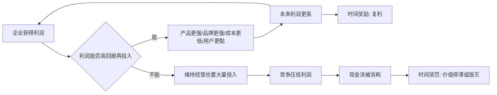

## 巴菲特思维筑基课: 好生意: 时间奖励优秀企业，惩罚平庸企业

### 作者
digoal

### 日期
2026-05-19

### 标签
好生意 , 优秀企业 , 时间复利 , 资本回报 , 护城河 , 现金流 , 定价权 , 商业模式 , 产品战略 , 长期价值

----

## 背景

> 面向对象: 大学生、产品经理、运营经理、有投资需求的人  
> 核心问题: 为什么有些企业越做越强，时间成为朋友；有些企业看似便宜、看似增长，却越做越累，时间成为敌人？  
> 先说结论: 好生意不是短期利润高、增长快或故事动听，而是能长期以高回报把资本、用户、品牌、数据和组织能力滚动起来的系统。时间会奖励优秀企业，也会惩罚平庸企业。

这里把“好生意”当作一条底层规律来讲。它解释了巴菲特为什么从早期的“买很便宜的普通企业”，逐渐转向“以合理价格买优秀企业”。因为便宜只能保护买入那一刻，优秀才能让时间持续创造价值。

## 一张图先看懂



## 求真讲法

### 它到底说了什么

“好生意”说的是：一门生意是否拥有让时间站在自己这边的经济结构。

如果一个企业今天赚到的钱，明天能继续投入到高回报的地方，让品牌更强、成本更低、用户更黏、产品更好、现金流更稳，那么时间会奖励它。

如果一个企业今天赚到的钱，明天必须大量用来维持设备、补贴用户、对抗竞争、修补质量问题、支付债务利息，那么时间会惩罚它。

| 维度 | 好生意 | 平庸生意 |
|---|---|---|
| 需求 | 稳定、真实、可持续 | 靠热点、补贴或周期 |
| 护城河 | 优势难复制，利润能保住 | 竞争一来就降价 |
| 资本需求 | 增长不需要大量维持性投入 | 赚的钱又被设备、库存、渠道吃掉 |
| 定价权 | 能适度涨价而不大量流失客户 | 只能接受市场价格 |
| 现金流 | 利润能转化为现金 | 账面利润多，现金留下少 |
| 再投资 | 留存收益能产生高回报 | 扩张越多，回报越低 |
| 管理难度 | 简单、可理解、关键变量清楚 | 复杂、脆弱、变量太多 |

### 它是怎么来的

巴菲特早期深受格雷厄姆影响，喜欢买“烟蒂股”：价格低到像地上还有最后一口的雪茄，捡起来还能吸一下。

这种方法的问题是：如果生意本身很差，便宜只解决买入价格，不能解决长期经营质量。差生意会不断消耗资本、注意力和时间。你可能买得便宜，但后面要处理一堆问题。

后来受芒格影响，巴菲特转向优秀企业：与其用极低价格买普通企业，不如用合理价格买能长期创造价值的好企业。

背后的逻辑是：

```text
普通生意 + 便宜价格:
  买入时可能占便宜
  但时间会暴露经营问题

好生意 + 合理价格:
  买入时不一定最便宜
  但时间会不断放大优秀经济结构
```

所以，好生意不是“贵也可以买”的借口，而是“时间会不会帮你”的判断。

### 它依赖哪些假设

好生意这条规律成立，依赖几个前提。

1. 企业的需求不是短期幻觉，而是真实且长期存在。
2. 企业有护城河，能防止竞争者快速抢走利润。
3. 企业能把利润转化为自由现金流或所有者收益。
4. 企业有高回报再投资机会，或者能理性分红、回购、配置资本。
5. 管理层诚实并具备资本配置能力。
6. 企业不是靠高杠杆、会计技巧或透支信任制造表面利润。
7. 投资者买入价格不能过高，否则好生意也会变成坏投资。

如果这些前提不成立，“好生意”就可能只是好故事。

### 常见误解

误解一：好生意就是增长快。

不对。增长如果依赖烧钱、补贴、低价、重资产扩张，且回报低于资本成本，增长越快越危险。

误解二：好生意就是大公司。

不对。规模大可能带来优势，也可能带来低效率。关键看规模是否带来更低成本、更强网络、更高议价权和更稳现金流。

误解三：好生意就是知名品牌。

不对。知名度不等于品牌护城河。真正的品牌要能带来复购、溢价、信任和渠道优势。

误解四：好生意可以不看价格。

不对。价格太高会透支未来回报。优秀企业也必须以合理价格买入。

误解五：便宜生意一定差。

不一定。有些好生意会因为市场恐慌暂时便宜。关键不是价格低，而是价格是否低于真实价值，且生意质量是否仍然优秀。

## 求存讲法

### 它有什么用

好生意的用途，是帮你判断“时间会帮助这个系统，还是伤害这个系统”。

| 场景 | 时间奖励 | 时间惩罚 |
|---|---|---|
| 投资 | 好企业利润再投资，内在价值增长 | 差企业持续消耗资本 |
| 产品 | 用户数据、体验、口碑持续累积 | 功能越来越复杂，用户越来越累 |
| 运营 | 会员关系、复购、品牌信任沉淀 | 活动越多，用户越只认补贴 |
| 创业 | 单位经济模型改善，获客成本下降 | 规模越大，亏损越大 |
| 职业 | 能力、作品、信用复利 | 重复劳动多年，没有迁移能力 |

对投资者，好生意让长期持有有意义。

对产品经理，好产品不是功能越堆越多，而是用户价值、数据资产、协作流程和切换成本越积越厚。

对运营经理，好运营不是每次活动都冲高峰，而是让每次活动沉淀用户关系、品牌信任和复购机制。

对大学生，好路径不是短期最热，而是能力能否长期积累并迁移。

### 它怎么迁移到熟悉领域

可以用“五问”判断一件事是不是好生意。

```text
1. 用户为什么持续需要它？
2. 竞争者为什么不容易复制它？
3. 收入增长是否能留下现金？
4. 下一轮投入是否比上一轮更有效？
5. 时间越久，它是更强还是更累？
```

对产品经理：

1. 功能越多，产品是否更好用，还是更混乱？
2. 用户越多，数据和协作是否让产品更强？
3. 客户迁移成本是否提高？
4. 维护成本是否被控制？

对运营经理：

1. 活动是否带来复购，而不只是一次交易？
2. 用户是否因为信任品牌而回来？
3. 渠道是否越做越低成本？
4. 内容、社群、会员是否变成资产？

对投资者：

1. 企业是否有高 ROIC？
2. 现金转换率是否好？
3. 护城河是否稳定或变宽？
4. 管理层是否能理性配置留存收益？
5. 价格是否合理？

### 它的适用范围和边界

好生意判断适合长期投资、创业方向、产品战略、职业路径和组织建设。

适用条件包括：

1. 你能理解生意模型和关键变量。
2. 企业或项目有真实需求和长期客户。
3. 经济结果可以观察，比如现金流、留存、复购、成本下降。
4. 竞争优势可以被验证，而不是只靠叙事。
5. 时间足够长，能让复利或反复利显现。

边界也要清楚。

1. 好生意不等于好投资，价格太贵仍会伤害回报。
2. 好行业不等于好公司，行业增长也可能被竞争分走。
3. 好产品不等于好商业模式，用户喜欢但不付费也可能不成立。
4. 好增长不等于高增长，要看增长质量和现金流。
5. 过去是好生意，不代表未来仍是好生意，护城河会变窄。

### 正例: 怎么用它提升能力

假设一个运营经理负责一个会员制消费品牌。他有两个选择。

选择 A：不断发大额优惠券，短期 GMV 很快上升。

选择 B：用较少补贴换取真实会员关系，建立积分体系、专属服务、复购提醒、内容社群和售后体验。

短期看，A 更像增长；长期看，B 更像好生意。

因为 B 能让时间积累资产：

```text
用户信任增加
  -> 复购率提高
  -> 获客成本下降
  -> 毛利改善
  -> 可继续投入服务和品牌
  -> 用户更愿意留下
```

投资中也是同理。一家优秀企业如果有稳定需求、护城河、高现金转换率、高资本回报和理性管理层，它每年留下的利润会变成更强的未来利润。这样的企业让时间成为朋友。

大学生也可以借用这套思路。一个职业方向如果能持续积累作品、能力、行业理解和可信关系，它就是“好生意式路径”；一个方向即使短期收入高，但技能不可迁移、信用不积累、身体被透支，时间可能会惩罚它。

### 反例: 前提不成立会怎样

某创业公司做连锁门店，门店数量快速增长，媒体称它是“新消费好生意”。但深入看，单店模型并不健康。

| 好生意前提 | 实际情况 | 后果 |
|---|---|---|
| 需求稳定 | 用户主要被折扣吸引 | 复购弱 |
| 有定价权 | 一涨价就流失 | 毛利受压 |
| 高回报再投资 | 新店回本周期越来越长 | 扩张越多越累 |
| 现金流好 | 库存、租金、人工吃掉利润 | 账面增长不等于现金 |
| 管理能复制 | 培训和品控跟不上 | 规模放大问题 |

这个失败不是因为“增长错了”，而是因为它不是好生意。时间没有奖励它，反而把单位经济模型、组织能力和现金流问题放大了。

投资者如果只看收入增长和门店扩张，很容易误把“规模变大”当成“企业变强”。

## 思考

好生意最重要的判断，不是它今天看起来多漂亮，而是它在时间里会发生什么。

有些企业短期很亮眼，但每一轮增长都需要更多补贴、更高债务、更低价格和更复杂管理。这类系统表面增长，底层变弱。

有些企业短期不刺激，但每一年都在积累品牌、客户、数据、成本优势和管理能力。这类系统表面普通，底层变强。

可以用一个简单对比提醒自己。

```text
好生意:
  时间 + 留存收益 + 护城河 -> 更强现金流

平庸生意:
  时间 + 竞争 + 资本消耗 -> 更低回报
```

这对个人成长也很直接。你也是一个“生意系统”。你每天投入时间和注意力，产出能力、作品、信用和现金流。如果这些产出能继续提高未来产出，你就在做自己的好生意。如果每天只是消耗注意力、重复低质量劳动、没有积累，时间就不会奖励你。

真正的好生意有一个共同特征：越往后，系统越轻松。客户更信任，成本更低，数据更多，品牌更强，管理更成熟，现金流更稳。

平庸生意也有一个共同特征：越往后，系统越沉重。竞争更激烈，价格更低，维护更贵，员工更累，现金更紧，问题更多。

所以，不要只问“它现在赚不赚钱”，还要问“时间会让它更赚钱，还是更难赚钱”。

## 最后记住

1. 好生意是能让时间站在自己这边的经济系统，不只是短期增长或低估值。
2. 时间奖励能高回报再投资、现金流好、护城河强、管理理性的企业。
3. 时间惩罚平庸企业：重资产、无定价权、低回报扩张、现金流差、竞争激烈。
4. 好生意也必须有合理价格；买太贵会透支未来回报。
5. 产品、运营、职业和创业都可以问同一个问题：时间会让这个系统更强，还是更累？

## 参考资料

- Warren Buffett, Berkshire Hathaway Shareholder Letters, especially discussions on buying wonderful businesses at fair prices, economic goodwill, compounding, owner earnings, and durable competitive advantage.
- Charles T. Munger, *Poor Charlie's Almanack*, especially the shift from cheap statistically undervalued stocks to high-quality businesses with durable economics.
- Benjamin Graham, *The Intelligent Investor*, especially the foundations of value investing and margin of safety.
- 本文参考本地 `buffett` 技能资料: `references/02-investment-philosophy.md` 中关于从烟蒂股到优秀企业、复利和内在价值的框架；`references/03-business-moat.md` 中关于商业模式、特许经营、商品型生意和经济商誉的框架；以及 `references/05-financial-metrics.md` 中关于所有者收益、ROIC 和现金转换率的框架。
  
#### [PostgreSQL 解决方案集合](../201706/20170601_02.md "40cff096e9ed7122c512b35d8561d9c8")
  
  
#### [德哥 / digoal's Github - 公益是一辈子的事.](https://github.com/digoal/blog/blob/master/README.md "22709685feb7cab07d30f30387f0a9ae")
  
  
#### [About 德哥](https://github.com/digoal/blog/blob/master/me/readme.md "a37735981e7704886ffd590565582dd0")
  
  

  
