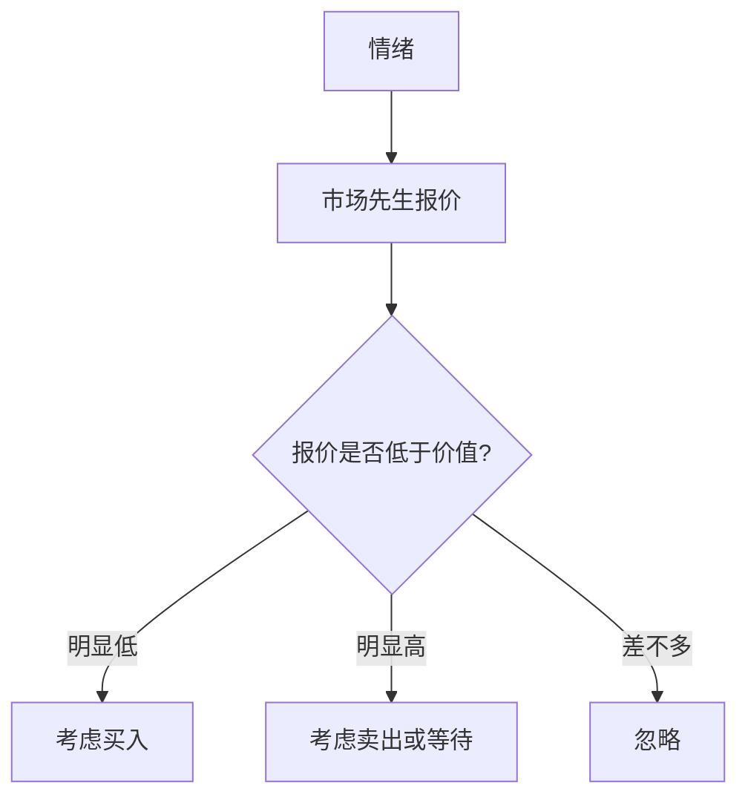

## 巴菲特思维筑基课: 市场先生定律

### 作者
digoal

### 日期
2026-05-19

### 标签
市场先生 , 格雷厄姆 , 市场报价 , 情绪波动 , 内在价值 , 买卖纪律 , 巴菲特 , 价格价值 , 投资心理 , 长期投资

----

## 背景

> 面向对象: 高中生
> 核心问题: 每天股价变化到底应该听谁的?
> 先说结论: 市场每天给你报价，但它是服务员，不是老师。你可以利用报价，不必服从报价。

## 一张图先看懂



```
市场先生: 每天敲门报价
理性投资者: 只在价格有利时开门
```

## 求真讲法

### 它到底说了什么

市场先生是格雷厄姆的比喻: 市场像一个情绪化合伙人，每天报价。报价可能很合理，也可能极端悲观或乐观。

### 它是怎么来的

股票市场流动性很强，所以每天都有价格。但“有价格”不代表“价格正确”。报价只是交易条件，不是价值证明。

### 它依赖哪些假设

- 投资者能独立估算价值。
- 市场报价会受情绪影响。
- 投资者没有每天交易的义务。
- 时间允许价值慢慢显现。

### 常见误解

“市场跌就是市场先生疯了。”不一定。市场也可能正确反映企业恶化，必须先检查内在价值。

## 求存讲法

### 它有什么用

它帮助你从价格波动中获得主动权。你不再问“市场今天怎么想”，而问“这个报价对我有利吗”。

### 它怎么迁移到熟悉领域

别人的评价也像市场报价。有时有参考价值，有时只是情绪。你要建立自己的价值判断。

### 它的适用范围和边界

适用于有内在价值可判断的资产。不适合给所有逆势操作找理由，因为市场有时确实发现了你没看见的问题。

### 正例: 怎么用它提升能力

优秀公司因短期新闻下跌，你检查现金流和护城河未变，市场低价报价反而提供买入机会。

### 反例: 前提不成立会怎样

公司核心产品被替代，市场下跌不是情绪，而是价值下降。把它当“市场先生发疯”会造成亏损。

## 思考

当别人每天给你的能力、作品、资产报价时，你是否有自己的估值系统?

## 最后记住

- 报价不是命令。
- 市场先生服务你，不教育你。
- 利用情绪，不能被情绪利用。
- 先判断价值，再判断价格。

## 参考资料

- Benjamin Graham, *The Intelligent Investor*, Mr. Market parable.
- Warren Buffett, shareholder letters referencing Mr. Market.
- Value investing tradition.
  
#### [PostgreSQL 解决方案集合](../201706/20170601_02.md "40cff096e9ed7122c512b35d8561d9c8")
  
  
#### [德哥 / digoal's Github - 公益是一辈子的事.](https://github.com/digoal/blog/blob/master/README.md "22709685feb7cab07d30f30387f0a9ae")
  
  
#### [About 德哥](https://github.com/digoal/blog/blob/master/me/readme.md "a37735981e7704886ffd590565582dd0")
  
  

  
