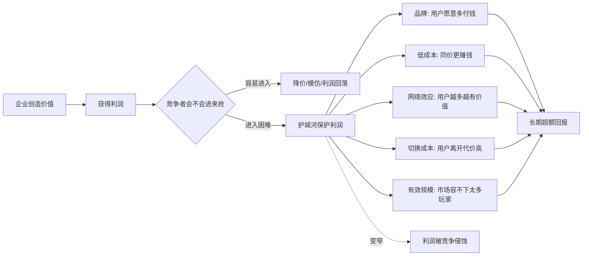

## 巴菲特思维筑基课: 护城河: 品牌、成本、网络、切换成本如何保护利润

### 作者
digoal

### 日期
2026-05-19

### 标签
护城河 , 竞争优势 , 品牌 , 低成本 , 网络效应 , 切换成本 , 有效规模 , 利润保护 , 产品护城河 , 个人护城河

----

## 背景

> 面向对象: 大学生、产品经理、运营经理、有投资需求的人  
> 核心问题: 为什么有些企业赚钱多年，竞争者却很难抢走利润；而有些企业一火就被模仿、降价、替代，最后赚不到钱？  
> 先说结论: 护城河不是“公司很有名”或“产品很先进”，而是能长期阻止竞争者侵蚀利润的结构性机制。品牌、低成本、网络效应、切换成本、有效规模等护城河，本质上是在保护企业的超额利润。

这里把“护城河”当作一条底层规律来讲。它来自商业和投资，但能迁移到产品、运营、职业发展和创业判断中：任何长期价值，都必须回答一个问题：别人为什么不能轻易复制你、替代你、压低你的收益？

## 一张图先看懂



## 求真讲法

### 它到底说了什么

护城河的核心是：企业能否长期保住超过普通水平的利润。

在自由竞争里，一个行业如果很赚钱，就会吸引竞争者进入。竞争者增加后，价格下降、获客成本上升、利润率下降，最后大多数企业只能赚普通利润。护城河就是阻止这个过程太快发生的结构性障碍。

可以用一个简单问题判断：

> 如果竞争者有钱、有人、有时间，能不能复制你的优势，并把你的利润打下来？

如果答案是“很容易”，那不是护城河。如果答案是“很难，而且越晚进入越难”，才可能是护城河。

常见护城河有五类。

| 护城河类型 | 它保护利润的方式 | 典型判断问题 |
|---|---|---|
| 品牌 | 用户愿意信任、优先选择、支付溢价 | 涨价 5%-10%，用户会大量离开吗 |
| 低成本 | 同样价格下成本更低，或低价仍能赚钱 | 竞争者花钱能不能复制成本结构 |
| 网络效应 | 用户越多，产品对每个用户越有价值 | 用户搬到新平台会损失什么 |
| 切换成本 | 用户想走，但迁移太麻烦、太贵、太危险 | 替换系统会不会中断业务 |
| 有效规模 | 市场容量有限，新玩家进入不划算 | 这个市场能否同时养活很多玩家 |

### 它是怎么来的

护城河这个比喻来自城堡：城墙外有水，敌人不是看不见城堡，而是攻进去代价太高。

商业里的城堡是利润，敌人是竞争。只要某个行业利润高，竞争者就会想进入。巴菲特看重护城河，是因为好企业不只是“现在赚钱”，而是“多年以后仍有能力赚钱”。

这背后有一个经济学逻辑：

```text
高利润 -> 吸引竞争 -> 供给增加/价格下降/成本上升 -> 利润回归普通水平

有护城河:
高利润 -> 吸引竞争 -> 竞争者难以复制优势 -> 利润保留更久
```

所以，护城河不是静态标签，而是动态防御。一个企业今天有优势，不代表十年后还有优势。真正重要的是护城河在变宽，还是变窄。

### 它依赖哪些假设

护城河判断依赖几个前提。

1. 行业存在竞争。没有竞争压力时，暂时的高利润不能证明护城河。
2. 企业的高利润来自结构优势，而不是短期运气、周期红利或补贴。
3. 客户需求相对真实且可持续。没有真实需求，护城河保护不了空中楼阁。
4. 竞争者有进入动机。如果行业利润高却没人进入，要解释为什么。
5. 优势能转化为经济结果。好口碑、好技术、好团队必须体现为定价权、低成本、留存、现金流或高资本回报。
6. 规则环境没有突然改变。监管、技术替代、平台规则变化都可能让护城河变窄。

### 常见误解

误解一：知名度就是品牌护城河。

不对。很多公司很有名，但没有定价权。真正的品牌护城河要看用户是否愿意优先选择、重复购买，并在涨价时仍然留下。

误解二：技术领先就是护城河。

不一定。技术如果很快被复制，或者不能形成专利、数据、生态、成本优势和客户绑定，就只是短期领先。

误解三：市场份额大就是护城河。

不一定。份额可能靠补贴、低价、渠道压货获得。如果停止补贴后用户流失，份额不是护城河。

误解四：增长快就是护城河强。

不对。增长可能来自行业风口。护城河看的是竞争进入后，利润还能不能守住。

误解五：护城河一旦形成就不会消失。

不对。报纸、传统零售、某些制造业都曾经有看似稳固的优势，但技术、渠道和用户习惯变化会让护城河变窄甚至消失。

## 求存讲法

### 它有什么用

护城河的用途，是帮你分辨“赚钱”和“能持续赚钱”。

对投资者，护城河决定企业能否长期保持高资本回报。没有护城河的企业，就算短期利润很好，也可能被竞争快速打回普通水平。

对产品经理，护城河决定产品是不是越做越强。一个功能被竞品一周抄走，就不是护城河；但用户数据、工作流绑定、生态插件、团队协作沉淀，可能逐渐形成护城河。

对运营经理，护城河决定增长是否能沉淀为资产。一次活动的流量不是护城河；会员关系、用户分层、内容库、品牌信任、社群关系，才可能成为可复用资产。

对大学生，护城河决定个人竞争力是否可持续。只会一个热门工具，容易被替代；能把行业理解、表达能力、技术能力、项目经验组合起来，才更难复制。

### 它怎么迁移到熟悉领域

可以把企业护城河迁移成个人、产品和组织的护城河。

| 商业护城河 | 产品经理视角 | 运营经理视角 | 个人成长视角 |
|---|---|---|---|
| 品牌 | 用户相信这个产品稳定可靠 | 用户愿意主动传播 | 别人相信你的交付质量 |
| 低成本 | 更低开发、交付、服务成本 | 更低获客和复购成本 | 更高效率完成高质量工作 |
| 网络效应 | 用户越多，协作/内容/交易越有价值 | 社群越大，匹配和传播越强 | 人脉和作品互相放大机会 |
| 切换成本 | 数据、流程、团队协作绑定 | 会员权益、积分、关系沉淀 | 你掌握关键上下文和方法论 |
| 有效规模 | 垂直市场容量有限，先发者占位 | 区域/圈层深耕形成密度 | 细分领域专家位置有限 |

### 它的适用范围和边界

护城河适合用于判断长期价值，但不能孤立使用。

适用时，要同时满足三个条件。

1. 有真实需求。用户不是被一次性补贴或热点吸引，而是真的需要。
2. 有经济结果。优势能变成利润率、留存率、复购率、现金流或资本回报。
3. 有持续防御。竞争者不是不能看见机会，而是复制成本高、周期长、成功率低。

不适用或需要谨慎的情况包括：

1. 行业变化太快，今天的优势明天可能被技术替代。
2. 企业利润来自监管保护、牌照红利或周期高点，但规则可能变化。
3. 用户没有忠诚度，只是跟着价格走。
4. 企业靠烧钱扩大份额，停止补贴后指标失真。
5. 管理层为了短期利润牺牲长期质量，主动挖窄护城河。

### 正例: 怎么用它提升能力

假设一个产品经理负责一款企业协作软件。他想判断产品有没有护城河，不能只看“注册用户增长”，而要看用户离不开它的原因。

他可以这样拆：

1. 切换成本：客户的项目、文档、审批、历史记录是否沉淀在系统里？
2. 网络效应：一个团队使用后，是否会自然邀请更多同事、供应商或客户加入？
3. 低成本：产品是否能用自动化降低客户管理成本，也降低自身服务成本？
4. 品牌信任：客户是否相信它安全、稳定、不会随便停服？
5. 有效规模：在某个垂直行业里，是否已经积累了足够模板和最佳实践，让后来者难追？

如果这些条件逐渐增强，产品就不只是“功能集合”，而是在形成利润保护机制。

投资者看企业也一样。比如一家消费品公司，如果用户愿意复购、涨价后流失不大、渠道愿意优先摆放、广告投入能长期沉淀品牌心智，它可能有品牌护城河。反过来，如果销量全靠低价促销，一涨价用户就走，就不能把“知名度”误判成护城河。

大学生也可以用护城河思维规划能力。只学一个工具，竞争者很容易复制；但如果同时积累“行业理解 + 数据分析 + 写作表达 + 项目经验 + 可信作品”，别人复制的成本就高很多。这就是个人护城河。

### 反例: 前提不成立会怎样

某创业团队做一款新消费饮料。上市初期，小红书和短视频爆火，渠道进货积极，团队认为自己已经有品牌护城河。

但实际前提并不成立。

| 护城河前提 | 实际情况 | 结果 |
|---|---|---|
| 用户有强复购 | 大量用户只是尝鲜 | 热度下降后销量回落 |
| 品牌有定价权 | 一涨价就被竞品替代 | 没有真实品牌溢价 |
| 渠道关系稳定 | 渠道只看短期动销 | 新品一多就被挤下货架 |
| 配方难复制 | 竞品两个月内做出类似口味 | 产品差异消失 |
| 营销能沉淀资产 | 投放停止后搜索和复购下降 | 增长依赖持续烧钱 |

这个失败不是因为“品牌不重要”，而是因为团队把热度误判成品牌，把销量误判成护城河。真正的品牌护城河不是大家听过你，而是用户在有替代品时仍然选择你，并愿意为你付出更高价格或更低便利性。

## 思考

护城河最重要的提醒是：利润不会自动属于你。

只要一个生意足够赚钱，就会有人模仿、压价、抢渠道、挖团队、替代技术、改变规则。表面上，企业之间是在比产品、营销、价格；底层看，其实是在比谁能建立更难复制的结构。

这对产品和运营尤其关键。很多团队喜欢追“爆款”，但爆款如果不能沉淀用户关系、数据资产、品牌信任和复购机制，就像下雨后的水坑，很快会干。护城河要的是水库，而不是水坑。

可以用一组问题做日常判断。

```text
这个优势是暂时的，还是结构性的？
竞争者看见后，复制需要什么代价？
用户为什么留下，而不是为什么来过？
利润率提高，是因为能力变强，还是因为周期运气？
如果明天停止补贴、停止投放、停止热点曝光，还剩下什么？
```

对投资者，护城河还要求你区分“好公司”和“好投资”。有护城河的企业也可能价格太贵；没有护城河的企业即使便宜，也可能是价值陷阱。护城河回答的是“利润能否持续”，不是“现在该不该买”。买不买还要看能力圈、内在价值和安全边际。

对个人成长，护城河不是让你封闭自己，而是让你建设可积累资产。一个人的护城河可能不是单项技能最强，而是组合优势难复制：懂技术又懂业务，能分析又能表达，能做事又可信任，能学习又能持续输出。

真正好的护城河，通常不是一天建成的。它来自持续兑现承诺、持续降低成本、持续积累数据、持续优化体验、持续建立关系。护城河的反面也不是“没有优势”，而是“优势无法留住”。

## 最后记住

1. 护城河是保护利润的结构性机制，不是知名度、热度、规模或短期技术领先。
2. 品牌、低成本、网络效应、切换成本、有效规模，是常见但必须验证的护城河来源。
3. 判断护城河要看竞争者能否复制，以及复制后能否把你的利润打下来。
4. 护城河有宽窄变化，技术、监管、用户习惯和管理层短视都可能让它变窄。
5. 对产品、运营、个人成长来说，护城河就是可积累、难复制、能持续产生收益的资产。

## 参考资料

- Warren Buffett, Berkshire Hathaway Shareholder Letters, especially discussions on durable competitive advantage, economic franchise, low-cost producer, brand power, and business quality.
- Charles T. Munger, *Poor Charlie's Almanack*, especially multidisciplinary thinking and inversion.
- Benjamin Graham, *The Intelligent Investor*, especially the distinction between market price and business value.
- 本文参考本地 `buffett` 技能资料: `references/03-business-moat.md` 中关于品牌、低成本、切换成本、网络效应、有效规模、经济商誉和护城河动态变化的框架。
  
#### [PostgreSQL 解决方案集合](../201706/20170601_02.md "40cff096e9ed7122c512b35d8561d9c8")
  
  
#### [德哥 / digoal's Github - 公益是一辈子的事.](https://github.com/digoal/blog/blob/master/README.md "22709685feb7cab07d30f30387f0a9ae")
  
  
#### [About 德哥](https://github.com/digoal/blog/blob/master/me/readme.md "a37735981e7704886ffd590565582dd0")
  
  

  
