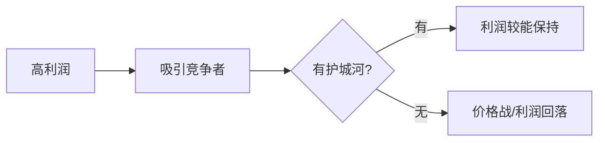

## 巴菲特思维筑基课: 护城河定律

### 作者
digoal

### 日期
2026-05-19

### 标签
护城河 , 竞争优势 , 品牌 , 低成本 , 转换成本 , 网络效应 , 有效规模 , 巴菲特 , 企业质量 , 长期利润

----

## 背景

> 面向对象: 高中生
> 核心问题: 为什么有些公司能长期赚钱，有些一赚钱就被竞争打掉?
> 先说结论: 护城河是竞争者难以复制的结构性优势。没有护城河，高利润会吸引竞争并被慢慢消灭。

## 一张图先看懂

| 护城河类型 | 简单解释 |
|---|---|
| 品牌 | 客户愿意付溢价 |
| 低成本 | 同样价格下赚得更多 |
| 转换成本 | 客户离开代价高 |
| 网络效应 | 用户越多越有价值 |
| 有效规模 | 市场只容纳少数玩家 |

## 求真讲法

### 它到底说了什么

好公司不只是今天赚钱，而是有能力阻止竞争者轻易抢走利润。护城河越宽，未来现金流越可靠。

### 它是怎么来的

资本会追逐高回报。如果一家店很赚钱又很容易复制，周围很快开满同类店，利润下降。护城河解释为什么有些利润能留下来。

### 它依赖哪些假设

- 竞争者会被高利润吸引。
- 某些优势具有结构性和持久性。
- 高资本回报只有在护城河保护下才可能长期维持。
- 护城河会变宽或变窄，需要跟踪。

### 常见误解

“知名度就是品牌护城河。”不对。真正的品牌护城河要有定价权，而不只是大家听过。

## 求存讲法

### 它有什么用

它让你判断企业未来现金流的可靠性。估值不是只看今年利润，而是看利润能不能守住。

### 它怎么迁移到熟悉领域

个人能力也有护城河。只是努力不够，最好形成难复制的组合: 专业能力、作品、信誉、关系和表达。

### 它的适用范围和边界

适用于竞争性商业分析。边界是: 护城河不是永恒的，技术、监管和消费习惯会改变它。

### 正例: 怎么用它提升能力

分析一家公司是否能涨价、客户是否难以离开、竞争者是否花钱也难复制。这比只看利润率更深入。

### 反例: 前提不成立会怎样

一家公司靠短期爆款产品赚高利润，但没有品牌忠诚和转换成本。竞争者复制后，利润迅速消失。

## 思考

你拥有的能力中，哪些是别人短期努力就能复制的，哪些需要长期积累才追得上?

## 最后记住

- 护城河保护高回报。
- 高利润会吸引竞争。
- 护城河要看趋势，不只看现状。
- 知名度不等于定价权。

## 参考资料

- Warren Buffett, shareholder letters on economic moat and franchise.
- Morningstar moat taxonomy as a modern classification reference.
- Berkshire case discussions: Coca-Cola, GEICO, See's Candies.
  
#### [PostgreSQL 解决方案集合](../201706/20170601_02.md "40cff096e9ed7122c512b35d8561d9c8")
  
  
#### [德哥 / digoal's Github - 公益是一辈子的事.](https://github.com/digoal/blog/blob/master/README.md "22709685feb7cab07d30f30387f0a9ae")
  
  
#### [About 德哥](https://github.com/digoal/blog/blob/master/me/readme.md "a37735981e7704886ffd590565582dd0")
  
  

  
