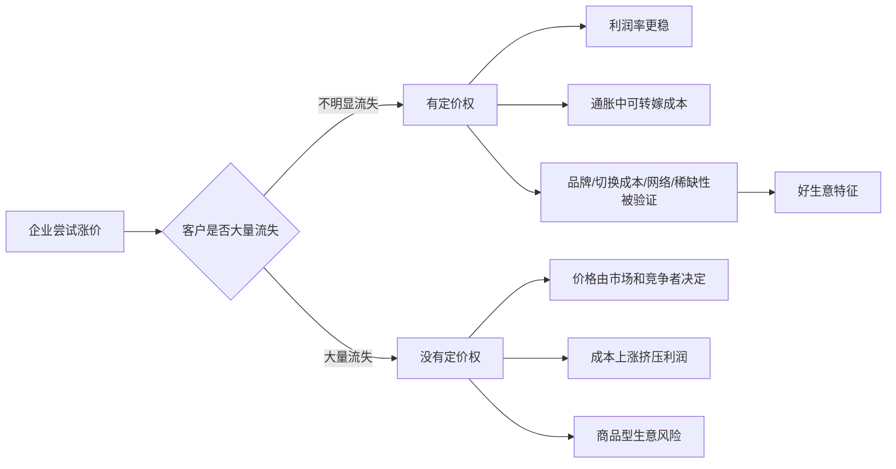

## 巴菲特思维筑基课: 定价权: 能涨价而不流失客户才是好生意

### 作者
digoal

### 日期
2026-05-19

### 标签
定价权 , 好生意 , 品牌护城河 , 涨价能力 , 客户留存 , 通胀抵抗 , 利润质量 , 产品付费 , 运营复购 , 个人议价能力

----

## 背景

> 面向对象: 大学生、产品经理、运营经理、有投资需求的人  
> 核心问题: 为什么有些企业成本上涨时仍能保持利润，有些企业只能降价竞争、越做越薄？怎样从价格变化看出一门生意的真实强弱？  
> 先说结论: 定价权不是企业“想涨价”的权力，而是客户在涨价后仍愿意留下的能力。能涨价而不明显流失客户，说明企业提供了不可轻易替代的价值。

这里把“定价权”当作一条底层规律来讲。它是判断好生意、品牌护城河、通胀抵抗力和利润质量的关键指标。销量高不一定是好生意，便宜卖出来的销量可能很脆弱；涨价后仍能保住需求，才说明企业有更深的价值。

## 一张图先看懂



## 求真讲法

### 它到底说了什么

定价权说的是：企业能否在提高价格后，仍然保住足够多的客户、销量和利润。

一个企业如果只能靠低价吸引客户，一涨价客户就走，它的利润很脆弱。一个企业如果能适度涨价而客户仍愿意购买，说明客户买的不只是产品本身，还包括信任、习惯、便利、品牌、网络、数据、服务或低替代成本。

| 现象 | 可能说明什么 |
|---|---|
| 涨价后销量基本稳定 | 有品牌、稀缺性、切换成本或刚需 |
| 涨价后客户大量流失 | 产品同质化，替代品多 |
| 成本上涨能顺利传导 | 对客户有议价能力 |
| 成本上涨只能自己扛 | 利润容易被压缩 |
| 长期毛利率稳定或提升 | 护城河可能在变宽 |
| 长期毛利率持续下降 | 定价权可能在变弱 |

所以，定价权不是单纯“价格高”，而是“价格提高后客户仍认可价值”。

### 它是怎么来的

定价权来自商业竞争的基本逻辑。

在充分竞争里，如果产品同质化，客户会选择更便宜的那个。企业想涨价，客户就去买替代品。于是企业只能接受市场价格，利润被竞争压到普通水平。

但有些企业不一样。客户认为它不可替代，或者替代成本很高，或者使用它能带来更高确定性。这时企业就拥有一定定价权。

巴菲特非常看重这点，因为定价权能回答一个硬问题：

> 成本上升、通胀出现、竞争加剧时，这门生意能不能保护利润？

可以写成一个简单逻辑：

```text
有定价权:
  成本上升 -> 提价 -> 客户仍留下 -> 利润较稳

无定价权:
  成本上升 -> 不敢提价 -> 利润被压缩
  或者
  提价 -> 客户流失 -> 利润也受损
```

### 它依赖哪些假设

定价权成立，依赖几个前提。

1. 客户真实需要这个产品或服务。
2. 客户认为替代品不够好，或替代成本较高。
3. 企业提供的价值高于涨价带来的痛感。
4. 企业有稳定质量，不能靠涨价牺牲体验。
5. 价格不受强监管完全限制。
6. 涨价不是一次性收割，而是长期价值关系的一部分。

如果客户只是被补贴吸引，或者产品非常同质化，或者替代品很多，定价权就很弱。

### 常见误解

误解一：价格高就是有定价权。

不对。高价可能只是定位高，也可能是短期供需紧张。真正的定价权要看涨价后客户是否留下。

误解二：销量大就是有定价权。

不对。销量可能靠低价、补贴、渠道压货或短期热度获得。低价换来的销量不一定能保护利润。

误解三：品牌知名度等于定价权。

不对。很多品牌很有名，但一涨价客户就走。品牌护城河必须能转化为复购、溢价和信任。

误解四：定价权就是不断涨价。

不对。乱涨价会透支信任。好定价权是价值提升、客户认可和价格调整之间的平衡。

误解五：互联网产品免费，所以没有定价权。

不一定。免费产品也有定价权的变体，比如广告价格、会员转化、企业付费、抽佣率、云服务价格、生态分成。

## 求存讲法

### 它有什么用

定价权能帮你快速识别一门生意的质量。

| 场景 | 定价权问题 | 判断意义 |
|---|---|---|
| 投资 | 企业能否涨价而不丢客户 | 判断护城河和利润质量 |
| 产品 | 用户是否愿意为更好体验付费 | 判断真实用户价值 |
| 运营 | 活动结束后用户是否仍愿意购买 | 判断是否只靠补贴 |
| 创业 | 客户是否愿意为解决方案付钱 | 判断商业模式是否成立 |
| 职业 | 你的能力是否能提高议价能力 | 判断个人护城河 |

对投资者，定价权是识别好生意的重要入口。没有定价权的企业，成本上涨时利润容易被压缩。

对产品经理，定价权提醒你：用户说喜欢不够，愿不愿意付费、续费、迁移成本是否变高，才是更强信号。

对运营经理，定价权提醒你：促销后的复购比促销当天的 GMV 更重要。

对大学生，定价权可以迁移成个人议价能力：你的能力是否稀缺、可信、可验证、难替代。

### 它怎么迁移到熟悉领域

可以用“涨价测试”看一个系统是否强。

```text
企业涨价:
  客户还买不买？

产品收费:
  用户还用不用？

运营减少补贴:
  用户还回不回来？

个人提高报价:
  别人还愿不愿意合作？
```

产品经理可以问：

1. 如果从免费改成付费，有多少用户留下？
2. 如果减少低价值功能，核心用户是否仍然满意？
3. 如果竞品便宜 20%，用户为什么还选我们？
4. 用户依赖的是功能，还是数据、流程、协作和信任？

运营经理可以问：

1. 不发券时，用户是否仍复购？
2. 提高客单价后，用户是否接受？
3. 用户买的是便宜，还是品牌、服务和确定性？
4. 促销是否在培养价格敏感用户？

投资者可以问：

1. 企业过去有没有涨价记录？
2. 涨价后销量、毛利率、市场份额如何变化？
3. 成本上涨时，企业能否转嫁给客户？
4. 竞争者降价时，企业是否被迫跟随？

### 它的适用范围和边界

定价权适合判断消费品、软件、平台、服务、医疗、教育、品牌、渠道和许多 B2B 生意的质量。

适用条件包括：

1. 客户有选择权，价格变化能反映真实偏好。
2. 产品或服务有稳定质量。
3. 替代品存在，但客户仍愿意留下。
4. 涨价不是短期垄断或供需错配，而是长期价值体现。

边界也很重要。

1. 受强监管行业，企业可能有需求但没有自由定价权。
2. 周期行业价格上涨可能只是供需周期，不是真护城河。
3. 垄断或稀缺资源带来的涨价，可能被政策或新技术破坏。
4. 过度涨价会透支品牌信任。
5. 短期涨价成功不等于长期定价权，要看复购和竞争反应。

### 正例: 怎么用它提升能力

假设一个运营经理负责一个知识付费产品。过去长期靠低价课引流，销量不错，但复购一般。

他决定测试定价权，而不是继续盲目打折。

1. 把课程从低价大促改成分层定价：基础课、进阶课、陪跑服务。
2. 不再只看销量，而是看完课率、复购率、退款率、用户推荐率。
3. 对核心用户提高价格，同时提升答疑、作业反馈和案例库质量。
4. 比较涨价前后用户质量和长期收入。

如果涨价后购买人数略降，但完课率、复购率、客单价、满意度上升，说明产品有一定定价权。用户不是只为便宜买单，而是认可真实价值。

投资中也一样。一家消费品公司如果多年来能温和提价，同时销量稳定、毛利率稳健、品牌信任不受损，这说明它可能有品牌护城河。这样的企业在通胀环境中更能保护利润。

个人成长也是如此。一个大学生如果只会普通技能，只能接受市场平均价格；如果他有可信作品、复合能力、行业理解和稳定交付记录，他的议价能力就会提高。这就是个人定价权。

### 反例: 前提不成立会怎样

某新消费品牌因为短视频爆火，销量很高。团队以为自己已经有品牌，于是提高价格。

结果用户大量流失，竞品迅速替代。

| 定价权前提 | 实际情况 | 后果 |
|---|---|---|
| 用户有强复购 | 大量用户只是尝鲜 | 涨价后不再购买 |
| 品牌有信任溢价 | 用户只记得低价和包装 | 没有品牌护城河 |
| 替代品弱 | 同类产品很多 | 客户转向竞品 |
| 质量稳定 | 批次体验不一致 | 涨价放大不满 |
| 渠道支持 | 渠道只看动销速度 | 销量下降后被替换 |

这个失败不是因为不能涨价，而是因为团队把流量误判成品牌，把销量误判成定价权。真正的定价权要经过用户选择的检验。

## 思考

定价权是一种很诚实的商业测试。

用户嘴上说喜欢，可能只是因为便宜；渠道说支持，可能只是因为好卖；市场说品牌火，可能只是因为短期曝光。涨价后客户是否留下，能穿透很多表面现象。

但定价权也不能被粗暴理解。好企业不是天天涨价，而是在价值、信任和价格之间建立长期关系。客户愿意多付钱，是因为他们相信得到的东西更确定、更省心、更有身份感、更高效率或更低风险。

可以用一个简化图理解。

```text
弱生意:
  低价 -> 有销量
  涨价 -> 客户走
  成本涨 -> 利润薄

强生意:
  价值高 -> 客户信任
  温和涨价 -> 客户留下
  成本涨 -> 利润可保护
```

对产品和运营来说，定价权提醒你不要只培养“等优惠”的用户。长期只靠低价，会训练客户不为价值付费，只为便宜行动。这样的增长会伤害品牌。

对个人来说，定价权也很具体。你越不可替代，越能选择工作、项目和合作条件。不可替代不是靠头衔，而是靠真实能力、可信记录、稀缺组合和稳定交付。

对投资者来说，定价权是判断好生意的快速入口。但它不能单独使用。还要看护城河是否持续、资本需求是否低、管理层是否诚实、价格是否合理。

## 最后记住

1. 定价权不是价格高，而是涨价后客户仍愿意留下。
2. 能涨价而不明显流失客户，说明企业有品牌、切换成本、网络效应、稀缺性或高信任。
3. 没有定价权的企业，成本上涨时利润容易被挤压。
4. 销量、知名度、热度都不等于定价权，涨价后的复购和留存才是检验。
5. 产品、运营、职业和投资都可以用定价权思维判断长期价值。

## 参考资料

- Warren Buffett, Berkshire Hathaway Shareholder Letters, especially discussions on franchise businesses, pricing power, inflation resistance, brand strength, and commodity-type businesses.
- Charles T. Munger, *Poor Charlie's Almanack*, especially business quality, incentives, and durable competitive advantage.
- Benjamin Graham, *The Intelligent Investor*, especially the distinction between price and value.
- 本文参考本地 `buffett` 技能资料: `references/03-business-moat.md` 中关于品牌护城河、特许经营、商品型生意、定价权测试和护城河动态变化的框架；`references/07-risk-behavior.md` 中关于通胀下定价权与资产轻重的框架；以及 `references/05-financial-metrics.md` 中关于 ROIC、现金流质量和资本需求的框架。
  
#### [PostgreSQL 解决方案集合](../201706/20170601_02.md "40cff096e9ed7122c512b35d8561d9c8")
  
  
#### [德哥 / digoal's Github - 公益是一辈子的事.](https://github.com/digoal/blog/blob/master/README.md "22709685feb7cab07d30f30387f0a9ae")
  
  
#### [About 德哥](https://github.com/digoal/blog/blob/master/me/readme.md "a37735981e7704886ffd590565582dd0")
  
  

  
