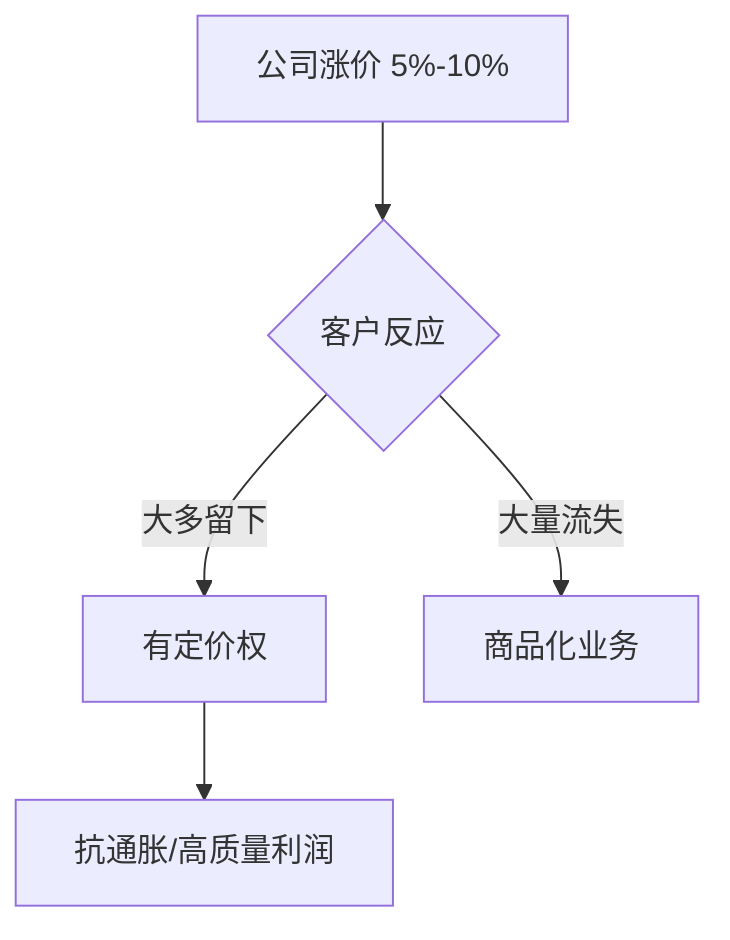

## 巴菲特思维筑基课: 定价权定律

### 作者
digoal

### 日期
2026-05-19

### 标签
定价权 , 护城河 , 品牌 , 抗通胀 , 客户忠诚 , 商品化 , 毛利率 , 巴菲特 , 商业模式 , 企业质量

----

## 背景

> 面向对象: 高中生
> 核心问题: 为什么巴菲特特别喜欢能涨价的公司?
> 先说结论: 能在不大量流失客户的情况下涨价，说明公司有真实优势。定价权是护城河最直接的检测器。

## 一张图先看懂

| 业务 | 涨价后客户反应 | 判断 |
|---|---|---|
| 强品牌饮料 | 多数继续买 | 有定价权 |
| 同质化原料 | 客户转向低价供应商 | 缺定价权 |

## 求真讲法

### 它到底说了什么

定价权是企业把成本上升或品牌价值转化为收入的能力。能涨价，说明客户认为它不容易被替代。

### 它是怎么来的

如果两个商品完全一样，客户自然买便宜的。只有当品牌、习惯、稀缺性、转换成本存在时，公司才有空间提高价格。

### 它依赖哪些假设

- 客户有替代选择。
- 价格变化会暴露客户忠诚度。
- 涨价不是靠垄断监管或短期短缺强行实现。
- 公司不会因涨价破坏长期信任。

### 常见误解

“涨价就是有定价权。”不一定。短期供不应求也能涨价，但周期过去可能跌回去。

## 求存讲法

### 它有什么用

它帮助你识别抗通胀企业。成本上升时，有定价权的公司能保护利润，没定价权的公司利润被挤压。

### 它怎么迁移到熟悉领域

个人服务也有定价权。如果你的能力稀缺、结果可靠、替换成本高，你就不只能靠低价竞争。

### 它的适用范围和边界

适用于消费品、服务、软件、平台等客户选择明显的业务。监管定价行业要谨慎，因为价格不完全由企业决定。

### 正例: 怎么用它提升能力

分析公司过去十年毛利率是否稳定，涨价后销量是否保持，客户评价是否说明“贵但值得”。

### 反例: 前提不成立会怎样

一家制造商成本上涨后涨价，客户立刻转向竞争对手。它的利润高只是周期红利，不是结构性定价权。

## 思考

如果你把自己的学习成果“涨价”成更难的任务，别人还会选择你吗?

## 最后记住

- 定价权是护城河的现实测试。
- 能涨价且不丢客户，才是真强。
- 商品型业务通常缺定价权。
- 通胀时代，定价权尤其重要。

## 参考资料

- Warren Buffett, 1981 shareholder letter on inflation-resistant businesses.
- Berkshire examples: See's Candies and branded consumer businesses.
- Business strategy literature on pricing power.
  
#### [PostgreSQL 解决方案集合](../201706/20170601_02.md "40cff096e9ed7122c512b35d8561d9c8")
  
  
#### [德哥 / digoal's Github - 公益是一辈子的事.](https://github.com/digoal/blog/blob/master/README.md "22709685feb7cab07d30f30387f0a9ae")
  
  
#### [About 德哥](https://github.com/digoal/blog/blob/master/me/readme.md "a37735981e7704886ffd590565582dd0")
  
  

  
