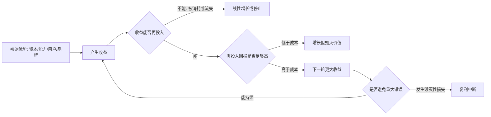

## 巴菲特思维筑基课: 长期复利: 好企业长期滚动创造价值

### 作者
digoal

### 日期
2026-05-19

### 标签
长期复利 , 价值滚动 , 好企业 , 再投资 , 复利系统 , 产品飞轮 , 运营增长 , 个人成长 , 现金流 , 长期主义

----

## 背景

> 面向对象: 大学生、产品经理、运营经理、有投资需求的人  
> 核心问题: 为什么有些人、产品、企业看起来增长很慢，却能在多年后拉开巨大差距？为什么有些高速增长反而毁灭价值？  
> 先说结论: 长期复利不是“时间久就会变好”，而是“一个系统能把今天的收益继续投入，明天产生更多收益，并且长期避免重大损失”。好企业之所以长期滚动创造价值，是因为它能持续把利润、用户、数据、品牌、组织能力再投入到高回报的位置。

这里把“长期复利”当作一个底层规律来讲。它不是投资专属概念，也不是简单的数学公式。它是一个跨领域规律：只要一个系统能保留成果、继续再投入、保持较高回报、避免毁灭性中断，时间就会把小优势放大成大差距。

## 一张图先看懂



## 求真讲法

### 它到底说了什么

复利最简单的数学形式是：

```text
未来价值 = 初始本金 x (1 + 回报率)^时间
```

但在真实世界里，关键不只是公式，而是公式背后的四个条件。

| 条件 | 投资里的含义 | 产品/运营里的含义 | 个人成长里的含义 |
|---|---|---|---|
| 有初始本金 | 资金、资产、企业股权 | 用户、内容、数据、品牌 | 时间、注意力、基础能力 |
| 有正回报 | 企业产生真实利润 | 用户留存、转化、复购提升 | 能力提高、作品积累 |
| 能再投入 | 利润继续投到高回报业务 | 数据改进产品，口碑带来新用户 | 经验反哺下一次学习 |
| 少犯大错 | 不永久亏损本金 | 不透支用户信任 | 不中断健康、信用和学习系统 |

所以，“长期复利”真正说的是：

> 时间只奖励能自我增强的系统，不奖励单纯熬时间的人或企业。

好企业长期滚动创造价值，不是因为它名字好听、规模大、股价涨过，而是因为它能把上一轮经营成果变成下一轮经营优势。利润可以变成研发、渠道、品牌、数据、供应链、人才和资本配置能力；这些再反过来提高未来利润。

### 它是怎么来的

复利来自数学，但巴菲特把它变成了商业判断框架。

在数学里，复利的威力来自指数增长。10% 的年化回报，10 年约变成 2.6 倍，30 年约变成 17 倍。看起来每年只差一点点，时间足够长时差距会被放大。

在商业里，巴菲特关心的不是“某一年增长很快”，而是一个企业能否长期把留存收益以高回报再投资。这里有一个关键判断：

```text
真正创造价值的增长 = 增量投入资本回报率 > 资本成本
毁灭价值的增长     = 增量投入资本回报率 < 资本成本
```

举个简化例子。

| 企业类型 | 今年赚 100 万后怎么做 | 长期结果 |
|---|---|---|
| 好企业 | 把 100 万投入新店、研发、品牌后，未来每年多赚 20 万 | 复利增强 |
| 普通企业 | 投入 100 万，未来每年只多赚 5 万 | 勉强增长 |
| 差企业 | 投入 100 万，未来每年只多赚 1 万甚至亏损 | 规模越大越累 |

这就是为什么巴菲特喜欢“好企业”：好企业的利润不是一次性结果，而是下一轮价值创造的种子。

### 它依赖哪些假设

长期复利能成立，需要满足这些假设。

1. 系统能保留成果。企业能留住利润、客户、品牌心智、数据和组织能力；个人能保留知识、作品、信用和健康。
2. 再投入有高回报。不是所有钱都值得继续投，只有投入后能产生超过机会成本的回报，增长才有意义。
3. 护城河能保护回报。竞争不会很快把超额利润打掉，否则复利会被竞争者分走。
4. 管理者能理性配置资本。赚来的钱必须投向正确地方，而不是盲目扩张、追热点、做面子工程。
5. 时间足够长。复利前期不显眼，后期才陡峭；没有耐心的人通常等不到后半段。
6. 避免重大错误。一次 50% 的损失，需要 100% 的收益才能回本；复利最怕中断。
7. 外部环境大体稳定。产权、规则、需求、技术路线如果剧烈破坏原有前提，复利曲线会被重置。

### 常见误解

误解一：长期复利等于长期持有。

不对。长期持有只是动作，复利是结果。持有一个优势消失、持续亏损、管理层乱投资的企业，时间不会帮你，只会放大问题。

误解二：增长越快越好。

不对。增长要看质量。如果每增长一单都亏更多，每开一家店都拉低回报，每获取一个用户都无法留存，那么增长不是复利，而是反复利。

误解三：复利只和钱有关。

不对。知识、信用、健康、产品体验、品牌、数据、组织能力都可能复利。它们共同点是：今天的积累能降低明天的成本，或提高明天的收益。

误解四：短期波动会破坏复利。

不一定。价格波动不等于价值波动。真正破坏复利的是基本面变坏、永久性亏损、现金流断裂、信任崩塌和错误资本配置。

误解五：只要努力就会复利。

不对。努力必须进入可积累系统。每天重复低质量劳动、没有反馈、没有作品、没有能力迁移，可能只是线性消耗。

## 求存讲法

### 它有什么用

长期复利的最大用途，是帮你区分“短期热闹”和“长期变强”。

| 表面现象 | 复利视角要问的问题 | 可能的真相 |
|---|---|---|
| 用户暴涨 | 留存、复购、口碑是否同步变好 | 可能只是补贴买来的流量 |
| 收入增长 | 利润率和现金流是否改善 | 可能是亏损换规模 |
| 股价上涨 | 企业未来现金流是否提高 | 可能只是估值扩张 |
| 产品功能变多 | 核心体验是否更强 | 可能增加复杂度 |
| 个人很忙 | 能力、作品、信用是否积累 | 可能只是重复消耗 |

对投资者来说，复利帮助你寻找能长期创造自由现金流、并把现金流高效再投入的企业。

对产品经理来说，复利帮助你寻找能积累用户信任、数据、工作流和网络效应的产品机制。

对运营经理来说，复利帮助你区分一次性活动和可持续增长飞轮。

对大学生来说，复利帮助你选择能长期积累的能力，而不是只追逐短期证书、热点名词和即时反馈。

### 它怎么迁移到熟悉领域

可以用“复利飞轮”看任何系统。

```text
好产品飞轮:
更好体验 -> 更高留存 -> 更多数据/反馈 -> 更好产品 -> 更低获客成本 -> 更高利润 -> 继续投入体验

坏增长循环:
补贴拉新 -> 用户薅完就走 -> 留存差 -> 继续加补贴 -> 亏损扩大 -> 融资依赖 -> 增长中断

个人成长飞轮:
基础能力 -> 真实项目 -> 反馈复盘 -> 作品沉淀 -> 信任增加 -> 更好机会 -> 更难项目 -> 能力升级
```

对产品经理，复利通常藏在这些地方：用户数据越多，推荐越准；工作流嵌入越深，切换成本越高；内容越多，搜索和分发越强；开发平台插件越多，生态越有吸引力。

对运营经理，复利通常来自可复用资产：用户分层、私域关系、内容库、渠道口碑、会员体系、复购机制。一次性促销如果不能沉淀这些资产，就很难复利。

对投资者，复利来自企业的留存收益再投资能力。一个企业赚到的钱如果只能躺在账上，或者被管理层乱收购、乱补贴、乱扩张，就不能形成高质量复利。

对大学生，复利来自长期可迁移能力：写作、数学、编程、沟通、行业理解、审美、研究能力。这些能力会互相增强，越早积累，越容易在未来组合出新机会。

### 它的适用范围和边界

长期复利适合这些对象。

1. 有可积累资产：品牌、数据、技术、客户关系、组织能力、个人作品。
2. 有再投入空间：赚来的钱、经验或用户反馈能继续改善系统。
3. 有高回报路径：新增投入能产生超过机会成本的收益。
4. 有保护机制：护城河、切换成本、规模优势或强执行能力能保护成果。
5. 有足够时间：系统不会在短期内被技术、政策、现金流或信任问题摧毁。

长期复利不适合这些对象。

1. 一次性机会：赚完就结束，不能积累下一轮优势。
2. 高流失系统：用户、员工、客户、利润留不住。
3. 低回报扩张：规模增加，但投入回报越来越差。
4. 高杠杆结构：短期波动就可能被迫出局。
5. 信任消耗型增长：靠误导、透支、补贴、骚扰换增长。

### 正例: 怎么用它提升能力

假设一个运营经理负责一款面向大学生的学习工具。他有两个选择。

选择 A：连续做补贴活动，拉来大量新用户，但用户领完权益就走。

选择 B：把资源投入到学习计划模板、错题沉淀、同伴打卡、优质内容库和个性化提醒，让用户每次使用都留下更多数据和学习资产。

从短期看，A 的数据更漂亮；从长期看，B 更接近复利。因为 B 的每次使用都会让产品更懂用户，让用户更舍不得离开，也让后续运营更精准。

如果这个系统跑通，会出现这样的链条：

```text
用户学习记录增加
  -> 推荐更准
  -> 完课率提高
  -> 口碑增强
  -> 获客成本下降
  -> 收入改善
  -> 继续投入内容和算法
  -> 用户体验再提高
```

投资里也是同理。一家好企业如果有稳定需求、强品牌、合理成本、优秀管理层，并且每年把利润投入到高回报的新项目，企业价值就会滚动增长。股价短期可能波动，但长期会被企业内在价值牵引。

个人成长也一样。一个大学生如果每周写一篇高质量分析、做一个小项目、复盘一次错误，前几个月不明显；几年后，他拥有作品集、方法论、表达能力和可信记录，这些会带来更好的实习、工作、合作和投资判断力。

### 反例: 前提不成立会怎样

某创业团队做消费产品，融资后快速开店。他们说自己在做长期复利，但实际前提不成立。

| 复利前提 | 实际情况 | 结果 |
|---|---|---|
| 单店模型健康 | 单店亏损，靠补贴拉客 | 开得越多亏得越多 |
| 用户能留存 | 用户只在打折时来 | 没有真实品牌资产 |
| 再投入高回报 | 新店回本周期越来越长 | 资本效率下降 |
| 管理能跟上 | 培训、供应链、品控失控 | 规模放大问题 |
| 能避免大错 | 使用高杠杆租金和债务 | 现金流断裂 |

这个失败不是因为“长期主义错了”，而是因为他们把扩张当成复利。扩张只是投入更多资源；复利要求每一轮投入都让系统更强。

投资者也常犯同样错误：看到公司收入高速增长，就以为企业价值在复利。但如果增长依赖烧钱、利润率下降、现金流恶化、竞争优势变弱，这种增长可能正在毁灭价值。

## 思考

长期复利最难的地方，不是理解公式，而是忍受早期的“不显眼”。

线性增长一开始更容易被看见：今天投广告，明天有点击；今天降价，明天有销量；今天追热点，明天有关注。复利增长前期常常很慢：打磨产品、积累内容、训练团队、建立信任、改善供应链，都不像一次活动那样立刻好看。

但复利的力量来自后半段。前半段是在建立可积累系统，后半段才开始拉开差距。

可以用一个简单对比理解。

```text
线性增长:  1, 2, 3, 4, 5, 6, 7
复利增长:  1, 1.2, 1.44, 1.73, 2.07, 2.49, 2.99 ...

前期: 线性更好看
后期: 复利开始拉开差距
前提: 复利系统不能中断
```

这对生活、产品和投资都有同一个提醒：不要只看当期结果，要看结果是否能变成下一期的生产力。

一个产品今天的新增用户，如果明天全部流失，就不是资产。一个人今天刷到很多信息，如果没有形成判断框架，就不是知识。一个企业今天赚到利润，如果管理层把钱投到低回报项目，就不是价值创造。

真正值得投入的东西，往往具有这三个特征：

1. 今天做的事，会降低明天的成本。
2. 今天积累的东西，会提高明天的收益。
3. 今天犯的小错，会被系统反馈并修正，而不是被掩盖成大错。

反过来，反复利系统也有三个特征：

1. 每一次增长都消耗信任。
2. 每一次扩张都增加脆弱性。
3. 每一次错误都需要更大的增长来掩盖。

如果你能看懂这两种系统的差别，就不会轻易被表面速度欺骗。

## 最后记住

1. 长期复利不是长期持有，而是一个系统能把收益继续投入并产生更高收益。
2. 好企业长期创造价值的关键，是留存收益能以高回报再投资，并且护城河能保护回报。
3. 增长不等于复利；低回报扩张、补贴增长和高流失增长都可能毁灭价值。
4. 复利最怕中断，重大亏损、信任崩塌、现金流断裂都会让多年积累归零。
5. 个人、产品、运营、投资都要问同一个问题：今天的成果能否变成明天更强的生产力？

## 参考资料

- Warren Buffett, Berkshire Hathaway Shareholder Letters, especially discussions on compounding, retained earnings, intrinsic value, long-term ownership, and avoiding permanent capital loss.
- Charles T. Munger, *Poor Charlie's Almanack*, especially long-term thinking, inversion, and avoiding large mistakes.
- Benjamin Graham, *The Intelligent Investor*, especially the distinction between market price and business value.
- 本文参考本地 `buffett` 技能资料: `references/02-investment-philosophy.md` 中关于复利、内在价值、增长质量和安全边际的框架；以及 `references/01-thinking-frameworks.md` 中关于长期主义和耐心的框架。
  
#### [PostgreSQL 解决方案集合](../201706/20170601_02.md "40cff096e9ed7122c512b35d8561d9c8")
  
  
#### [德哥 / digoal's Github - 公益是一辈子的事.](https://github.com/digoal/blog/blob/master/README.md "22709685feb7cab07d30f30387f0a9ae")
  
  
#### [About 德哥](https://github.com/digoal/blog/blob/master/me/readme.md "a37735981e7704886ffd590565582dd0")
  
  

  
