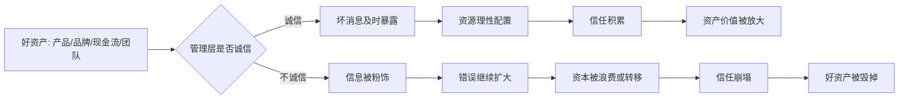

## 巴菲特思维筑基课: 管理层诚信: 坏管理层会毁掉好资产

### 作者
digoal

### 日期
2026-05-19

### 标签
管理层诚信 , 公司治理 , 资本配置 , 所有者心态 , 真实反馈 , 企业文化 , 信息质量 , 投资风险 , 产品团队 , 组织管理

----

## 背景

> 面向对象: 大学生、产品经理、运营经理、有投资需求的人  
> 核心问题: 为什么有些企业明明有好行业、好产品、好资产，最后却被内部人、错误激励和不诚实沟通毁掉？  
> 先说结论: 管理层诚信不是道德装饰，而是资产价值的底层前提。坏管理层会扭曲信息、掩盖坏消息、错误配置资本、透支信任，最终把好资产变成坏结果。

这里把“管理层诚信”当作一条底层规律来讲。它不只适用于股票投资，也适用于产品、运营、创业、职业选择和团队协作。任何需要长期合作和资源配置的系统，都必须先解决一个问题：掌握权力的人，会不会诚实面对事实，并把资源用于创造长期价值？

## 一张图先看懂



## 求真讲法

### 它到底说了什么

管理层诚信说的不是“这个人看起来好不好”，而是三个更硬的问题。

1. 他是否愿意说真话，尤其是坏消息？
2. 他是否把公司、用户、股东和团队的长期利益放在短期面子之前？
3. 他是否在没人监督时，仍然按正确原则配置资源？

在投资里，巴菲特把诚信看得非常重。因为管理层控制着信息、现金流、人事、并购、回购、预算、会计口径和战略方向。如果控制这些东西的人不诚实，再好的资产也会被逐步掏空或误用。

可以把管理层质量拆成三层。

| 层次 | 核心问题 | 失败后果 |
|---|---|---|
| 诚信 | 是否诚实面对事实和利益相关方 | 信息失真，外部人无法判断 |
| 资本配置 | 是否把钱投向高回报方向 | 好现金流被浪费 |
| 所有者心态 | 是否像长期所有者一样经营 | 短期指标压倒长期价值 |

其中诚信是第一层。没有诚信，聪明和勤奋反而更危险，因为不诚实的人越聪明，越会把错误包装得更像正确。

### 它是怎么来的

这条规律来自一个简单事实：企业不是自动运行的机器，而是由人不断做决定的系统。

企业的资产表面上是工厂、品牌、用户、专利、现金和渠道；但这些资产如何使用，取决于管理层。管理层可以把利润投入研发、品牌、供应链和客户体验，也可以把钱投向面子工程、关联交易、盲目并购和短期财务粉饰。

更麻烦的是，外部人看到的信息大多来自管理层。年报怎么写，指标怎么定义，坏消息怎么披露，风险怎么解释，都是管理层在塑造叙事。

所以，管理层诚信不是“锦上添花”，而是估值的地基。

```text
资产质量好
  + 管理层诚信
  + 资本配置理性
  = 好资产被长期放大

资产质量好
  + 管理层不诚信
  + 信息被粉饰
  = 外部人误判，资产被内部消耗
```

### 它依赖哪些假设

这条规律成立，依赖几个前提。

1. 管理层拥有资源配置权。也就是他们能决定现金、人才、战略和信息披露。
2. 外部人无法实时看到全部真相，只能通过公开信息、行为记录和结果反推。
3. 长期价值需要信任。用户、员工、供应商、股东和合作伙伴都依赖信任持续合作。
4. 坏消息如果被压制，会累积成更大问题。
5. 激励结构会影响行为。只奖励短期收入、股价或规模，就容易诱导粉饰和冒险。
6. 文化会放大管理层行为。高层容忍小谎言，组织会学会更大的谎言。

如果管理层没有实际控制权，或者业务完全由规则自动运行，这条规律影响会变弱。但在大多数企业、项目和团队里，管理层行为都非常关键。

### 常见误解

误解一：只要业务好，管理层差一点没关系。

不对。好业务能容忍普通管理，但很难长期容忍不诚信管理。坏管理层可以通过错误并购、财务粉饰、关联交易和短期主义持续损害资产。

误解二：诚信就是不违法。

不对。不违法只是底线。真正的诚信包括主动披露坏消息、承认错误、不用误导性指标掩盖问题、不把利益输送包装成正常交易。

误解三：业绩好说明管理层诚信。

不一定。短期业绩可能来自周期、补贴、会计处理、激进销售或透支渠道。诚信要看长期行为，尤其看坏年份怎么沟通。

误解四：创始人持股多就一定有所有者心态。

不一定。持股多能增强利益一致性，但不能自动保证诚实。还要看是否尊重小股东、客户、员工和长期规则。

误解五：企业文化是软东西，不影响估值。

不对。文化决定坏消息能不能上报、是否允许造假、是否鼓励短期冲量、是否尊重客户。文化最终会变成成本、现金流和风险。

## 求存讲法

### 它有什么用

管理层诚信的用途，是帮你在表面数据之外判断“这个系统能不能长期信任”。

| 场景 | 只看表面会看到什么 | 看管理层诚信会追问什么 |
|---|---|---|
| 投资 | 收入增长、利润增长、股价上涨 | 坏消息是否诚实披露，现金流是否真实 |
| 产品 | 功能上线快、指标好看 | 是否牺牲用户体验换短期数据 |
| 运营 | GMV、拉新、转化漂亮 | 是否靠误导、补贴和透支信任 |
| 创业 | 融资成功、团队扩张 | 是否有纪律地花钱，是否承认问题 |
| 职业 | 公司包装好、老板表达强 | 是否尊重事实、承诺和长期成长 |

对投资者，诚信是前置过滤器。诚信不过关，再低估值也可能是陷阱。

对产品经理，诚信意味着不拿虚假指标骗自己。用户留存差，就不能只展示下载量；功能没解决问题，就不能只展示上线数量。

对运营经理，诚信意味着不透支用户信任。诱导点击、夸大权益、隐藏限制、刷数据，短期可能好看，长期会毁掉品牌。

对大学生，诚信是选择团队和老板的重要标准。一个不诚实的组织会训练你说漂亮话、掩盖问题、迎合指标，长期会污染判断力。

### 它怎么迁移到熟悉领域

可以用一套“坏消息测试”来判断管理层或团队是否可信。

```text
当坏消息出现时:
  1. 是主动披露，还是拖到无法隐瞒？
  2. 是解释原因，还是只找外部借口？
  3. 是修正机制，还是换一个指标继续讲故事？
  4. 是保护长期信任，还是牺牲用户/员工/股东？
  5. 是减少错误，还是惩罚说真话的人？
```

对产品团队，坏消息可能是留存低、投诉多、转化差、线上事故。诚信团队会把问题暴露出来，修复根因；不诚信团队会换口径、压反馈、挑好看的指标汇报。

对运营团队，坏消息可能是活动用户质量差、补贴套利、复购低、渠道作弊。诚信团队会调整模型；不诚信团队会继续冲量，把风险留给以后。

对投资者，坏消息可能是毛利率下降、现金流恶化、客户流失、并购失败、管理层离职。诚信管理层会解释事实、承认错误、说明修正路径；不诚信管理层会用“短期波动”“战略投入”“一次性影响”反复遮掩。

### 它的适用范围和边界

管理层诚信特别适用于这些决策。

1. 投资企业，尤其是长期持有。
2. 加入公司或选择老板。
3. 选择创业合伙人。
4. 评估供应商、渠道和商业伙伴。
5. 判断产品和运营数据是否可信。

它也有边界。

第一，诚信不等于能力。诚实的人也可能不会配置资本、不会管理团队、不会判断行业。诚信是必要条件，不是充分条件。

第二，外部人很难完全判断内心，只能看长期行为记录。不要因为一次演讲、一个人设或几句价值观口号就下结论。

第三，坏结果不一定代表不诚信。行业周期、技术变化、竞争冲击都可能导致失败。关键是管理层如何面对失败。

第四，不能用“诚信”掩盖商业模式问题。一个诚实但没有护城河、没有现金流的企业，仍然可能不是好投资。

### 正例: 怎么用它提升能力

假设一个运营经理做会员增长项目。上线后，首月新增会员很好看，但复购率很差，很多用户投诉权益说明不清。

诚信的做法不是继续拿新增会员数汇报成功，而是主动拆解问题。

1. 承认新增会员里有多少是被短期权益吸引。
2. 披露投诉原因：权益理解偏差、页面说明不清、客服响应慢。
3. 重新计算真实留存和用户生命周期价值。
4. 暂停误导性投放素材，调整权益说明。
5. 建立长期指标：复购、投诉率、退款率、会员满意度。

这会让短期报表难看，但保护了长期信任。对产品和运营来说，诚信不是说好听的话，而是让真实数据进入决策系统。

投资中也是同理。一家管理层如果在年度报告中清楚解释错误并修正资本配置，反而比永远只讲胜利的管理层更可信。因为长期复利需要真实反馈，不能靠自我欺骗运行。

### 反例: 前提不成立会怎样

某公司拥有强品牌、稳定客户和不错现金流，原本是一项好资产。但新管理层上任后，为了追求短期股价和规模，开始做激进并购、使用大量“调整后利润”、隐藏客户流失，并把失败归因于外部环境。

表面上，公司仍然在增长；底层却已经变坏。

| 诚信前提 | 实际情况 | 后果 |
|---|---|---|
| 坏消息及时披露 | 客户流失被淡化 | 投资者误判护城河 |
| 指标真实反映经营 | 大量使用调整后指标 | 利润质量被掩盖 |
| 资本配置理性 | 为做大规模高价并购 | 现金流被浪费 |
| 管理层像所有者 | 关注短期股价和奖金 | 长期价值受损 |
| 文化鼓励说真话 | 内部只报喜不报忧 | 错误累积到不可收拾 |

这个失败不是因为资产一开始不好，而是因为坏管理层改变了资产的命运。好资产需要好人守住；坏人会把护城河当提款机，把品牌当消耗品，把现金流当个人业绩工具。

## 思考

管理层诚信的底层含义是：所有长期系统都依赖真实反馈。

一个企业如果不能诚实面对坏消息，就像一个人不敢看体检报告。问题不会因为不看而消失，只会变得更贵。财务造假、隐瞒投诉、夸大增长、转移利益，本质上都是让系统失去反馈能力。

这对大学生也很重要。选择公司和老板时，不要只看薪资、办公环境、融资新闻和外部包装。要观察这个组织如何处理错误：说真话的人是否被保护？坏消息是否能上行？承诺是否兑现？数据是否被尊重？这些会决定你学到的是判断力，还是表演术。

对产品和运营人员，诚信更具体：不要只对外诚实，也要对内诚实。一个团队如果天天用虚荣指标鼓励自己，最终会失去判断真实用户价值的能力。

可以用一个简化模型理解。

```text
真实反馈 -> 正确决策 -> 资源有效配置 -> 信任积累 -> 长期价值

虚假反馈 -> 错误决策 -> 资源持续浪费 -> 信任透支 -> 价值崩塌
```

管理层诚信不是让企业不犯错，而是让错误尽早、尽小、尽快被修正。一个诚实系统会犯小错；一个不诚实系统会把小错包装成成功，直到它变成大灾难。

所以，判断一个团队，不要只看它怎么讲成功，更要看它怎么处理失败。

## 最后记住

1. 管理层诚信是资产价值的地基；没有诚信，聪明和勤奋可能更危险。
2. 坏管理层会通过信息粉饰、错误资本配置、关联交易和短期主义毁掉好资产。
3. 判断诚信要看坏消息如何披露、错误如何承认、指标是否真实、利益是否一致。
4. 诚信是必要条件，不是充分条件；还要看能力、护城河、现金流和价格。
5. 对产品、运营、职业和投资来说，真实反馈比漂亮叙事更重要。

## 参考资料

- Warren Buffett, Berkshire Hathaway Shareholder Letters, especially discussions on management integrity, owner mentality, capital allocation, corporate culture, and shareholder-oriented governance.
- Charles T. Munger, *Poor Charlie's Almanack*, especially incentives, inversion, and the danger of rationalizing bad behavior.
- Benjamin Graham, *The Intelligent Investor*, especially the distinction between business value and market quotation.
- 本文参考本地 `buffett` 技能资料: `references/04-management-governance.md` 中关于诚信、资本配置、所有者心态、组织惯性、企业文化和治理的框架；以及 `references/06-valuation-capital.md` 中关于资本配置和回购纪律的框架。
  
#### [PostgreSQL 解决方案集合](../201706/20170601_02.md "40cff096e9ed7122c512b35d8561d9c8")
  
  
#### [德哥 / digoal's Github - 公益是一辈子的事.](https://github.com/digoal/blog/blob/master/README.md "22709685feb7cab07d30f30387f0a9ae")
  
  
#### [About 德哥](https://github.com/digoal/blog/blob/master/me/readme.md "a37735981e7704886ffd590565582dd0")
  
  

  
