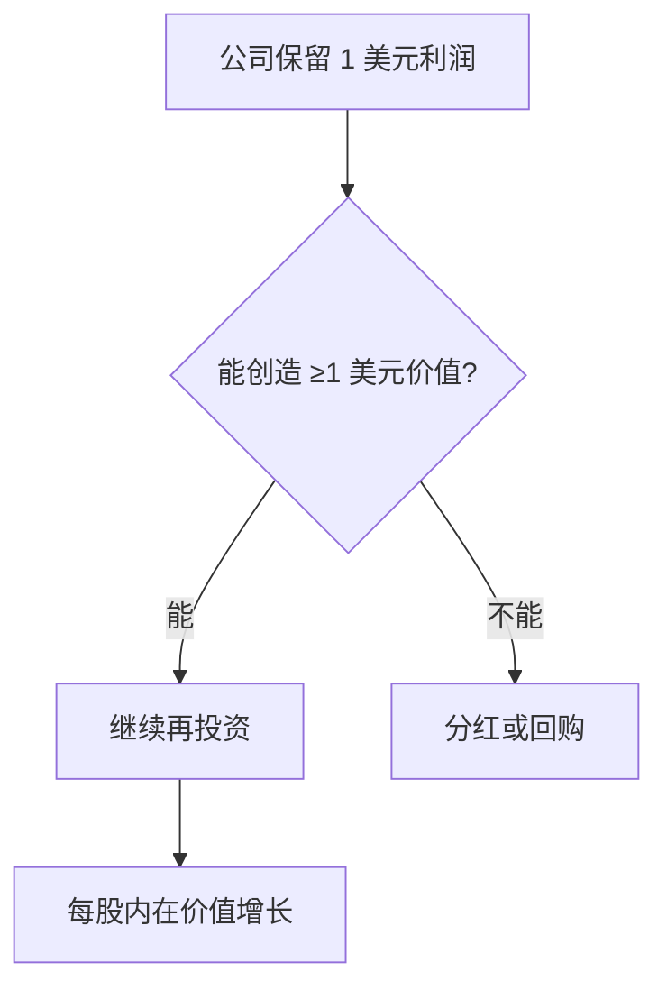

## 巴菲特思维筑基课: 一美元检验定律

### 作者
digoal

### 日期
2026-05-19

### 标签
一美元检验 , 留存收益 , 资本配置 , 分红 , 回购 , 股东价值 , 巴菲特 , ROIC , 管理层 , 每股价值

----

## 背景

> 面向对象: 高中生
> 核心问题: 公司赚的钱应该留下来，还是分给股东?
> 先说结论: 如果公司每留下 1 美元，长期不能为股东创造至少 1 美元价值，就应该把钱还给股东。

## 一张图先看懂

| 资金用途 | 好决策条件 |
|---|---|
| 再投主业 | 增量回报高于资本成本 |
| 并购 | 价格合理且业务懂 |
| 回购 | 股价低于内在价值 |
| 分红 | 没有更好用途 |

## 求真讲法

### 它到底说了什么

股东把利润留在公司，是因为相信管理层能更好地使用这笔钱。若管理层长期做不到，就没有资格继续占用资本。

### 它是怎么来的

如果你把 100 元交给同学经营小项目，他长期只能变成 90 元，你应该要求他还钱，而不是继续扩大项目。

### 它依赖哪些假设

- 管理层能选择资本用途。
- 每股内在价值可以作为长期结果指标。
- 历史资本配置记录有参考意义。
- 股东有机会通过分红、回购获得更好结果。

### 常见误解

“公司不分红就是重视增长。”不一定。留存收益只有能高回报再投资，才是好事。

## 求存讲法

### 它有什么用

它评估 CEO 最重要的能力: 资本配置。企业不是越大越好，而是每股价值越高越好。

### 它怎么迁移到熟悉领域

时间管理也有一美元检验。每投入 1 小时，是否产生至少 1 小时以上的长期价值? 否则就要调整。

### 它的适用范围和边界

适用于成熟公司和资本配置判断。初创企业可能短期看不到价值创造，但仍需解释未来回报逻辑。

### 正例: 怎么用它提升能力

公司主业 ROIC 高、市场空间大，保留利润扩张能创造超额价值，此时少分红反而合理。

### 反例: 前提不成立会怎样

管理层为了扩大规模高价并购，利润留存多年却没有提升每股价值。股东的钱被帝国扩张消耗。

## 思考

你保留自己的零花钱、时间或注意力时，是否也能通过“一单位投入创造超过一单位价值”来检验?

## 最后记住

- 留存收益不是天然正确。
- 每 1 美元至少要创造 1 美元价值。
- CEO 的核心工作是资本配置。
- 分红不是失败，乱投资才是失败。

## 参考资料

- Warren Buffett, 1984 shareholder letter on the one-dollar test.
- Berkshire Hathaway capital allocation discussions.
- Corporate finance literature on return on invested capital.
  
#### [PostgreSQL 解决方案集合](../201706/20170601_02.md "40cff096e9ed7122c512b35d8561d9c8")
  
  
#### [德哥 / digoal's Github - 公益是一辈子的事.](https://github.com/digoal/blog/blob/master/README.md "22709685feb7cab07d30f30387f0a9ae")
  
  
#### [About 德哥](https://github.com/digoal/blog/blob/master/me/readme.md "a37735981e7704886ffd590565582dd0")
  
  

  
