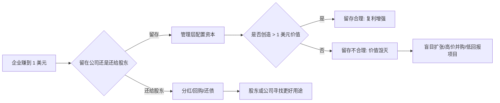

## 巴菲特思维筑基课: 一美元检验: 每留存 1 美元必须创造超过 1 美元价值

### 作者
digoal

### 日期
2026-05-19

### 标签
一美元检验 , 留存收益 , 资本配置 , 股东价值 , 回购 , 分红 , 再投资 , 管理层能力 , 产品资源 , 运营预算

----

## 背景

> 面向对象: 大学生、产品经理、运营经理、有投资需求的人  
> 核心问题: 企业赚到钱以后，为什么不一定应该继续留在公司里？什么时候再投资是复利，什么时候只是管理层把钱越花越少？  
> 先说结论: 一美元检验要求公司每留存 1 美元利润，长期至少要为所有者创造 1 美元以上的价值。留存利润不是管理层的战利品，而是股东委托管理层继续配置的资本。

这里把“一美元检验”当作一条底层规律来讲。它不是一个会计公式，而是一套资本配置纪律：钱留在企业里，必须比还给股东更有价值。否则，分红、回购、还债或等待，可能比盲目扩张更理性。

## 一张图先看懂



## 求真讲法

### 它到底说了什么

一美元检验说的是：

> 如果公司把 1 美元利润留在企业里，未来必须至少为所有者创造 1 美元以上的价值；否则，这 1 美元就不该留在公司里。

公司赚钱以后，大体有五种选择。

| 资本用途 | 什么时候合理 | 什么时候危险 |
|---|---|---|
| 投入现有业务 | 护城河强，增量回报高 | 为了规模硬扩张 |
| 收购其他公司 | 价格合理，业务可理解，管理层可信 | 高价并购、讲协同故事 |
| 买入上市公司股份 | 价格低于内在价值 | 追热点、追短期涨幅 |
| 回购自家股票 | 股价低于内在价值 | 高价回购美化 EPS |
| 分红 | 没有更好再投资机会 | 明明有高回报机会却过早分掉 |

一美元检验的本质是机会成本。钱留在公司，不是免费的。股东本来也可以拿走这笔钱，用于其他投资、消费、还债或储蓄。管理层要证明：留在公司，比交还给股东更好。

### 它是怎么来的

巴菲特长期把资本配置看成 CEO 最重要的工作之一。很多 CEO 擅长产品、销售、工程或组织管理，但一旦公司开始赚钱，他们就必须面对一个新问题：赚来的钱如何用？

这比想象中难。因为管理层天然有扩张冲动：做大规模、收购同行、建新总部、进入新业务、证明自己有战略。组织也会奖励“忙碌”和“增长”，却不一定奖励“耐心等待”和“把钱还给股东”。

一美元检验就是对这种冲动的约束。

```text
如果 1 美元留存收益
  -> 未来创造 1.5 美元价值
  -> 留存是正确的

如果 1 美元留存收益
  -> 未来只创造 0.6 美元价值
  -> 留存是在毁灭价值
```

这条规律让资本配置回到一个简单问题：钱放在哪里，长期回报最高？

### 它依赖哪些假设

一美元检验成立，依赖几个前提。

1. 公司有可分配或可再投资的真实所有者收益。
2. 管理层能在不同资本用途之间做选择。
3. 留存收益创造的价值可以在长期中被观察，比如每股内在价值、现金流、ROIC、股东回报。
4. 管理层诚实，不用会计口径包装低回报项目。
5. 投资者能区分“增长规模”和“增长每股价值”。
6. 时间足够长，能检验资本配置结果。

如果企业还没有真实现金流，或者处于生死存亡期，一美元检验仍然有用，但要改成“每 1 美元烧掉的钱，是否建设了超过 1 美元的未来价值”。

### 常见误解

误解一：公司不分红就是好，因为能复利。

不对。只有当管理层能高回报使用留存收益时，不分红才有意义。低回报留存只是把钱锁在低效率系统里。

误解二：增长越快，资本配置越好。

不对。增长规模不等于增长价值。如果扩张回报低于资本成本，增长越快，价值毁灭越快。

误解三：回购一定利好。

不对。只有当股价低于内在价值时，回购才增加剩余股东价值。高价回购是在用股东的钱买贵资产。

误解四：并购能做大公司，所以就是好事。

不对。并购最容易被“协同效应”和“战略布局”包装。关键是价格、整合成本、业务理解和资本回报。

误解五：分红说明公司没前途。

不一定。如果公司没有高回报再投资机会，诚实分红反而是好治理。承认没好机会，比乱花钱更难。

## 求存讲法

### 它有什么用

一美元检验能帮你判断管理层是否真正像所有者一样用钱。

| 场景 | 表面看 | 一美元检验看 |
|---|---|---|
| 投资 | 公司利润增长 | 留存利润是否提高每股价值 |
| 产品 | 研发投入增加 | 是否创造更高留存、收入和护城河 |
| 运营 | 活动预算增加 | 是否带来可复用用户资产 |
| 创业 | 融资更多 | 每一元烧钱是否建设未来现金流 |
| 职业 | 时间投入更多 | 是否沉淀能力、作品和选择权 |

对投资者，它是评估管理层资本配置能力的核心工具。

对产品经理，它提醒你：研发资源不是免费的，做功能要创造超过成本的长期价值。

对运营经理，它提醒你：预算不是花完就算完成任务，必须沉淀超过预算价值的用户、品牌或现金流。

对大学生，它可以迁移成个人时间配置：每投入 1 小时，是否创造超过 1 小时价值的能力、作品、信用或现金流？

### 它怎么迁移到熟悉领域

可以把一美元检验迁移成通用问题：

```text
每投入 1 单位资源
  是否创造超过 1 单位的长期价值？

资源可以是:
  钱 / 时间 / 注意力 / 用户信任 / 团队精力 / 品牌信用
```

产品经理可以问：

1. 这个功能占用 3 个月研发，未来能否提升足够多的留存或收入？
2. 它是否增强护城河，还是只满足少数临时需求？
3. 维护成本会不会长期吞掉收益？
4. 如果不做，把资源投入另一个功能会不会更好？

运营经理可以问：

1. 每 1 元补贴，是否带来超过 1 元的生命周期价值？
2. 活动留下的是复购用户，还是薅羊毛用户？
3. 渠道投放是否越投越有效，还是成本越来越高？
4. 预算能否转化为会员关系、内容资产、品牌信任？

投资者可以问：

1. 公司过去 5-10 年留存收益创造了多少每股价值？
2. ROIC 是否持续高于资本成本？
3. 并购是否真的提高现金流，还是只提高规模？
4. 回购是否发生在低估时？
5. 管理层是否愿意在没有好机会时分红或持有现金？

### 它的适用范围和边界

一美元检验适合所有涉及资源配置的长期决策。

适用条件包括：

1. 资源是稀缺的。
2. 存在多个可选用途。
3. 结果能在长期中被观察。
4. 决策者有权决定资源去向。
5. 目标是长期价值，而不是短期表面规模。

边界也要清楚。

1. 某些投入短期看不出回报，比如基础研究、品牌建设、人才培养，需要拉长周期。
2. 不是所有价值都能精确货币化，但必须能讲清因果链。
3. 不能用“一美元检验”否定所有试错，小规模实验本身可能创造学习价值。
4. 不能只看总价值，要看每股价值或单位资源价值。
5. 管理层可能用漂亮故事包装低回报项目，所以要看长期结果。

### 正例: 怎么用它提升能力

假设一个产品经理有 100 万研发预算，可以做两个项目。

项目 A：做一个大客户定制功能，短期能签一单，但未来维护复杂，难复用。

项目 B：重构核心协作流程，短期收入不明显，但能降低客服成本、提高留存、让更多客户自助完成关键任务。

用一美元检验，不是看哪个项目声音更大，而是看每 1 元投入能否创造更高长期价值。

| 项目 | 短期收益 | 长期影响 | 一美元检验 |
|---|---|---|---|
| A 定制功能 | 签单快 | 维护成本高，难复用 | 可能不合格 |
| B 核心流程 | 短期不显眼 | 留存提升，服务成本下降，护城河增强 | 可能合格 |

投资中也是同理。一家公司如果多年不分红，把利润留在企业里，但每股现金流、ROIC 和内在价值持续增长，说明管理层可能通过一美元检验。反过来，如果利润留存很多，却只是做低回报并购、扩张低效业务、维持管理层规模，那就是资本配置失败。

### 反例: 前提不成立会怎样

某公司主营业务很赚钱，账上现金很多。管理层为了讲“第二增长曲线”，高价收购一个自己不懂的新业务。

三年后，新业务亏损，商誉减值，原本能分红或回购的钱被消耗。

| 一美元检验前提 | 实际情况 | 后果 |
|---|---|---|
| 管理层懂业务 | 收购陌生赛道 | 判断失误 |
| 价格合理 | 高溢价收购 | 安全边际不足 |
| 能创造超过 1 美元价值 | 投入后持续亏损 | 价值毁灭 |
| 信息透明 | 用战略话术包装问题 | 股东误判 |
| 有所有者心态 | 追求规模和故事 | 每股价值下降 |

这个失败不是因为公司不会赚钱，而是因为赚来的钱被错误配置。好生意也可能被差资本配置拖垮。

## 思考

一美元检验最重要的地方，是它把“增长崇拜”改成“回报纪律”。

很多组织喜欢投入更多：更多预算、更多功能、更多渠道、更多并购、更多人员。投入增加很容易被看见，但单位回报下降不容易被承认。

一美元检验要求你追问：

```text
这 1 美元、1 小时、1 个用户信任、1 个研发周期，
放在这里，
是否比放在其他地方创造更多长期价值？
```

这对大学生也很直接。你每天把时间留存在某个系统里：刷短视频、备考、实习、写作、项目、社交、游戏。每 1 小时是否创造超过 1 小时的未来价值？有些投入会复利，有些投入只是消耗。

对产品和运营来说，预算花出去不是能力，能把预算变成长期资产才是能力。一个活动如果只带来一次性交易，没有复购、没有会员关系、没有品牌信任，就很可能没有通过一美元检验。

对投资者来说，一美元检验是识别管理层水平的尺子。真正优秀的管理层不只是会赚钱，更会决定钱该留、该投、该分、该回购、该等待。

最难的是“等待”。当没有好机会时，不乱花钱也是资本配置。很多管理层失败，不是因为没有钱，而是因为有钱以后忍不住证明自己。

## 最后记住

1. 一美元检验要求每 1 美元留存收益，长期至少创造 1 美元以上价值。
2. 留存利润不是天然正确，只有高回报再投资才配得上留存。
3. 回购、分红、并购、再投资都不是绝对好坏，关键看价格和回报。
4. 管理层最重要的能力之一，是把现金配置到最高长期价值的地方。
5. 产品、运营、职业和学习也适用：每 1 单位资源，都要问是否创造超过 1 单位长期价值。

## 参考资料

- Warren Buffett, Berkshire Hathaway Shareholder Letters, especially discussions on retained earnings, the one-dollar test, capital allocation, buybacks, dividends, and owner mentality.
- Charles T. Munger, *Poor Charlie's Almanack*, especially opportunity cost, incentives, and rational capital allocation.
- Benjamin Graham, *The Intelligent Investor*, especially the distinction between price and value and shareholder-oriented thinking.
- 本文参考本地 `buffett` 技能资料: `references/06-valuation-capital.md` 中关于一美元检验、资本配置五路径、回购和分红的框架；`references/05-financial-metrics.md` 中关于留存收益、穿透收益和内在价值增长的框架；以及 `references/04-management-governance.md` 中关于资本配置能力、所有者心态和组织惯性的框架。
  
#### [PostgreSQL 解决方案集合](../201706/20170601_02.md "40cff096e9ed7122c512b35d8561d9c8")
  
  
#### [德哥 / digoal's Github - 公益是一辈子的事.](https://github.com/digoal/blog/blob/master/README.md "22709685feb7cab07d30f30387f0a9ae")
  
  
#### [About 德哥](https://github.com/digoal/blog/blob/master/me/readme.md "a37735981e7704886ffd590565582dd0")
  
  

  
