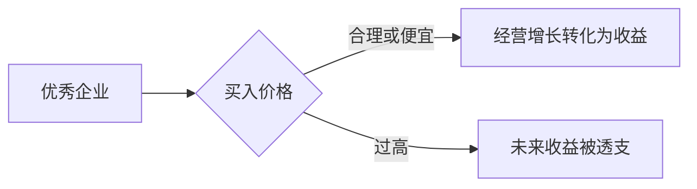

## 巴菲特思维筑基课: 合理价格定律

### 作者
digoal

### 日期
2026-05-19

### 标签
合理价格 , 好公司 , 买入价格 , 内在价值 , 估值 , 长期收益 , 巴菲特 , 芒格 , 投资回报 , 安全边际

----

## 背景

> 面向对象: 高中生
> 核心问题: 伟大公司是不是任何价格都值得买?
> 先说结论: 不是。买入价格决定未来收益，即使是优秀企业，买太贵也会让多年好经营被估值消化掉。

## 一张图先看懂

| 企业质量 | 买入价格 | 可能结果 |
|---|---|---|
| 好 | 合理 | 好投资 |
| 好 | 极贵 | 差投资 |
| 差 | 很便宜 | 可能是陷阱 |

## 求真讲法

### 它到底说了什么

企业好坏和投资好坏不是一回事。投资回报取决于企业未来价值增长和你买入时支付的价格。

### 它是怎么来的

如果一辆自行车真实值 500 元，你花 2000 元买，即使它质量很好，你的交易仍然糟糕。股票也是如此。

### 它依赖哪些假设

- 企业内在价值可以估算为一个范围。
- 市场价格可能高于内在价值。
- 长期收益受买入估值影响。
- 投资者有等待合理价格的选择。

### 常见误解

“好公司长期都会涨回来。”不一定。如果买入价透支太多，可能多年收益很低，甚至亏损。

## 求存讲法

### 它有什么用

它防止投资者把“好公司”当作追高理由。巴菲特强调的是好公司加合理价格，而不是好公司任意价格。

### 它怎么迁移到熟悉领域

好东西也要看价格。再好的课程，如果价格远高于你能获得的实际能力提升，也不是好交易。

### 它的适用范围和边界

适用于所有需要付出成本的选择。边界是: 不能只追求低价，价格合理要和质量一起看。

### 正例: 怎么用它提升能力

给优秀企业估算价值区间，只有在预期收益率达到要求时买入。错过也接受，不为了行动而行动。

### 反例: 前提不成立会怎样

一家企业未来十年利润翻倍，但你买入时估值高到离谱。利润增长只是在填补估值泡沫，你的收益很差。

## 思考

你喜欢一个东西时，还能冷静问“这个价格已经把未来好处算进去了吗”?

## 最后记住

- 好公司不等于好投资。
- 价格决定收益起点。
- 合理价格不是最低价，而是相对价值有吸引力。
- 等待也是投资动作。

## 参考资料

- Warren Buffett, shareholder letters on purchase price and intrinsic value.
- Charlie Munger's "wonderful business at a fair price" principle.
- Corporate valuation fundamentals.
  
#### [PostgreSQL 解决方案集合](../201706/20170601_02.md "40cff096e9ed7122c512b35d8561d9c8")
  
  
#### [德哥 / digoal's Github - 公益是一辈子的事.](https://github.com/digoal/blog/blob/master/README.md "22709685feb7cab07d30f30387f0a9ae")
  
  
#### [About 德哥](https://github.com/digoal/blog/blob/master/me/readme.md "a37735981e7704886ffd590565582dd0")
  
  

  
