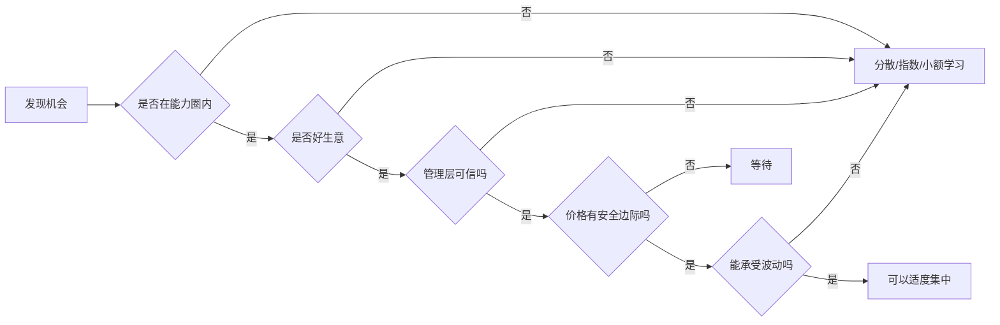

## 巴菲特思维筑基课: 集中投资: 真懂才集中，不懂就分散

### 作者
digoal

### 日期
2026-05-19

### 标签
集中投资 , 分散投资 , 能力圈 , 投资组合 , 认知边界 , 安全边际 , 资源配置 , 产品聚焦 , 运营渠道 , 职业选择

----

## 背景

> 面向对象: 大学生、产品经理、运营经理、有投资需求的人  
> 核心问题: 为什么巴菲特会集中持有少数优秀企业，但普通人盲目集中却很危险？集中到底是高认知后的理性，还是赌徒式冒险？  
> 先说结论: 集中投资不是“胆子大”，而是因为真正符合能力圈、好生意、好管理、好价格的机会极少。真懂才集中，不懂就分散；集中是深度理解的结果，不是替代理解的姿势。

这里把“集中投资”当作一条底层规律来讲。它不只适用于股票，也适用于时间、职业、产品资源和运营预算的配置：资源有限时，真正重要的不是到处撒一点，而是把资源投向你最懂、胜率最高、长期价值最大的地方。

## 一张图先看懂



## 求真讲法

### 它到底说了什么

集中投资说的是：如果你真正理解少数高质量机会，并且它们满足严格条件，把资源集中在这些机会中，可能比平均分散到许多不懂的机会更安全、更有效。

但这里有一个前提：你真的懂。

| 状态 | 合理做法 | 原因 |
|---|---|---|
| 不懂大多数公司 | 分散或指数化 | 承认能力边界 |
| 懂一点但不深 | 小仓位学习 | 防止假懂造成大损失 |
| 深度理解少数机会 | 可以适度集中 | 研究强度和确定性更高 |
| 自以为懂但无反证能力 | 不能集中 | 这是赌博，不是投资 |

集中投资的根本原因不是“喜欢冒险”，而是高质量机会本来就少。真正同时满足“在能力圈内、好生意、好管理、好价格、有安全边际”的机会，不会遍地都是。

### 它是怎么来的

巴菲特认为，过度分散常常是对无知的保护。如果一个人不了解企业，分散能避免单一错误毁掉全部资金；但如果一个人真的深入理解少数企业，过度分散反而会稀释最好的机会。

这背后有一个很简单的逻辑：

```text
不懂 + 集中 = 赌博
不懂 + 分散 = 承认限制
真懂 + 分散过度 = 稀释优势
真懂 + 合理集中 = 让优势发挥作用
```

集中投资不是先决定“我要集中”，然后去找理由；而是经过严格筛选后发现：值得下注的机会本来就少。

### 它依赖哪些假设

集中投资成立，依赖非常严格的前提。

1. 机会在能力圈内，能解释清楚赚钱逻辑和失败条件。
2. 企业是好生意，有护城河、现金流和长期复利能力。
3. 管理层诚实，并能理性配置资本。
4. 买入价格低于保守内在价值，有安全边际。
5. 投资者能承受短期波动，不用杠杆，不会被迫卖出。
6. 投资者会持续跟踪关键假设，发现错误时能修正。
7. 集中对象之间不是同一种隐藏风险，比如同一行业、同一宏观变量、同一融资环境。

少一个前提，集中就会从“理性配置”滑向“单点暴露”。

### 常见误解

误解一：集中投资就是重仓一只热门股。

不对。集中投资的核心是深度理解和严格筛选。重仓自己不懂的热门资产，是赌博。

误解二：分散投资一定平庸。

不对。对多数普通投资者，分散和指数化是承认能力边界后的理性选择。

误解三：持仓越少越高级。

不对。持仓少但不懂，风险更高。集中不是形式，而是认知深度和风险控制的结果。

误解四：集中投资能提高收益，所以应该尽量集中。

不对。集中会放大正确，也会放大错误。只有当判断质量足够高时，集中才有意义。

误解五：懂行业就可以集中。

不够。还要懂具体公司、价格、治理、现金流、竞争格局和失败条件。

## 求存讲法

### 它有什么用

集中投资的用途，是帮助你把稀缺资源投向最高质量机会。

| 场景 | 分散的作用 | 集中的前提 |
|---|---|---|
| 投资 | 降低单一误判伤害 | 深懂企业且价格合理 |
| 产品 | 避免押错单一需求 | 核心问题已被验证 |
| 运营 | 测试多个渠道 | 找到高质量渠道后加码 |
| 创业 | 早期探索方向 | 验证单位经济模型后聚焦 |
| 学习 | 打基础和试错 | 找到长期赛道后深挖 |

对投资者，集中让研究成果真正影响组合，而不是被几十个浅层判断稀释。

对产品经理，集中意味着不要同时做太多功能，而是把资源投到最能提升用户价值的核心问题上。

对运营经理，集中意味着先小规模测试渠道和人群，验证后再加预算。

对大学生，集中意味着先广泛探索，再把时间集中到能长期复利的能力上。

### 它怎么迁移到熟悉领域

可以把集中投资迁移成“资源配置纪律”。

```text
探索期:
  小额、多点、快速学习

验证期:
  记录数据、识别关键变量、寻找反证

集中期:
  把资源投向少数已验证、高回报、可复利的方向
```

产品经理可以问：

1. 这个问题是否是核心用户的高频高价值问题？
2. 是否已经有足够证据证明值得集中研发？
3. 继续增加功能是否分散团队注意力？
4. 集中资源后，失败代价是否可承受？

运营经理可以问：

1. 哪些渠道带来的用户生命周期价值最高？
2. 哪些活动只是表面热闹？
3. 是否先用小预算验证，再集中投放？
4. 渠道之间是否有同质风险？

投资者可以问：

1. 我能否用一页纸解释这家公司怎样赚钱？
2. 我知道哪三个变量会让判断失效吗？
3. 我是否有保守内在价值估计？
4. 如果股价跌 40%，我会更清楚还是更恐慌？
5. 我是否只是因为已经赚过钱而自信？

### 它的适用范围和边界

集中投资适合认知优势明确、机会稀缺、长期回报差异大的场景。

适用条件包括：

1. 能力圈清楚。
2. 关键变量可跟踪。
3. 下行风险可承受。
4. 有安全边际。
5. 有长期资金和心理承受力。

边界也必须非常明确。

1. 普通投资者不具备深度研究能力时，宽基指数和分散配置更合适。
2. 不要使用杠杆集中，因为波动会变成生存风险。
3. 不要把同一风险伪装成多个仓位，比如一堆同行业股票。
4. 不要把过去成功当成未来确定性。
5. 不要因为“巴菲特集中”就模仿表面动作，忽略他的能力圈、现金流、保险浮存金、管理层筛选和长期资金结构。

### 正例: 怎么用它提升能力

假设一个运营经理管理 5 个获客渠道。最初他不知道哪个有效，于是小预算测试。

测试后发现：

| 渠道 | 获客成本 | 留存 | 复购 | 结论 |
|---|---:|---:|---:|---|
| A 信息流 | 低 | 低 | 低 | 便宜但质量差 |
| B 搜索 | 中 | 高 | 中 | 可持续 |
| C 社群 | 中 | 高 | 高 | 值得加码 |
| D 达人 | 高 | 波动大 | 中 | 谨慎 |
| E 地推 | 高 | 低 | 低 | 停止 |

合理做法不是平均分配预算，而是在持续监控风险的前提下，集中资源到 B 和 C。因为这些渠道经过验证，用户质量更高，长期价值更好。

投资也是一样。一个投资者如果真正理解两三家优秀企业，知道它们的现金流、护城河、管理层和合理价格，那么适度集中可能比买几十个自己只是听说过的股票更理性。

### 反例: 前提不成立会怎样

某大学生听说“集中投资才能发财”，于是把大部分积蓄买入一只热门股票。他只知道公司属于热门赛道，不懂财务、不懂竞争、不知道估值，也没有现金流安全垫。

| 集中前提 | 实际情况 | 后果 |
|---|---|---|
| 在能力圈内 | 只懂概念，不懂生意 | 无法判断变化 |
| 有安全边际 | 追高买入 | 下跌直接亏损 |
| 好生意 | 商业模式尚未验证 | 价值不稳定 |
| 能承受波动 | 用生活费投资 | 被迫卖出 |
| 能寻找反证 | 只看利好观点 | 错误被放大 |

这个失败不是因为集中投资错了，而是因为他把集中投资的结果当成捷径，跳过了能力圈和安全边际。

## 思考

集中与分散，本质上不是投资风格之争，而是认知诚实问题。

如果你不懂，分散是保护；如果你懂，过度分散可能是浪费。关键是你是否真的知道自己处在哪个状态。

很多人最危险的地方，是处在“半懂”状态。半懂的人能说出术语、故事和行业趋势，但说不清现金流、竞争优势、失败条件和估值边界。半懂时集中，风险最大。

可以用一个简单图判断自己。

```text
盲区:
  不懂，也不知道自己不懂 -> 不碰

学习区:
  知道自己不懂，正在验证 -> 小额、多点

能力圈:
  能解释、能估值、能承受、能反证 -> 可以集中
```

对大学生来说，时间配置也一样。早期应该多探索，找到自己真正有优势和长期兴趣的方向后，再集中投入。没有探索就集中，容易押错；永远探索不集中，也难形成深度。

对产品和运营来说，集中不是拍脑袋押一个方向，而是经过小实验、数据验证和用户反馈后，把资源投向最高质量路径。

真正成熟的集中，是“先分散学习，再集中下注”。真正危险的集中，是“先听故事，再重仓幻想”。

## 最后记住

1. 集中投资不是胆大，而是真懂后的资源配置结果。
2. 不懂就分散或指数化，是承认能力边界，不是低级选择。
3. 集中的前提是能力圈、好生意、好管理、合理价格、安全边际和抗波动能力。
4. 集中会放大正确，也会放大错误；半懂时集中最危险。
5. 产品、运营、职业和学习也一样：先探索验证，再集中资源到高质量方向。

## 参考资料

- Warren Buffett, Berkshire Hathaway Shareholder Letters, especially discussions on focus investing, circle of competence, diversification, risk as permanent capital loss, and long-term ownership.
- Charles T. Munger, *Poor Charlie's Almanack*, especially opportunity cost, inversion, and concentrating on obvious high-quality opportunities.
- Benjamin Graham, *The Intelligent Investor*, especially the importance of knowing one's limitations and the role of diversification for defensive investors.
- 本文参考本地 `buffett` 技能资料: `references/02-investment-philosophy.md` 中关于集中投资、分散边界、风险定义和普通投资者指数化的框架；`references/01-thinking-frameworks.md` 中关于能力圈的框架；以及 `references/07-risk-behavior.md` 中关于卖出条件、价值陷阱和杠杆风险的框架。
  
#### [PostgreSQL 解决方案集合](../201706/20170601_02.md "40cff096e9ed7122c512b35d8561d9c8")
  
  
#### [德哥 / digoal's Github - 公益是一辈子的事.](https://github.com/digoal/blog/blob/master/README.md "22709685feb7cab07d30f30387f0a9ae")
  
  
#### [About 德哥](https://github.com/digoal/blog/blob/master/me/readme.md "a37735981e7704886ffd590565582dd0")
  
  

  
