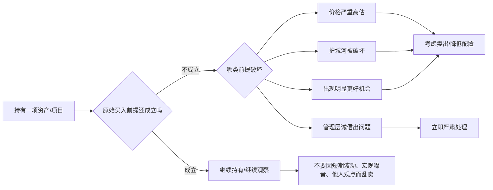

## 巴菲特思维筑基课: 卖出纪律: 长期持有不是永不卖出

### 作者
digoal

### 日期
2026-05-19

### 标签
卖出纪律 , 长期持有 , 护城河破坏 , 管理层诚信 , 机会成本 , 内在价值 , 价格高估 , 退出纪律 , 产品取舍 , 投资复盘

----

## 背景

> 面向对象: 大学生、产品经理、运营经理、有投资需求的人  
> 核心问题: 如果长期持有是好原则，为什么有时又必须卖出？怎样区分短期波动、暂时困难和真正需要退出的根本变化？  
> 先说结论: 长期持有不是信仰，而是有前提的纪律。当前提仍成立时，不被波动驱赶；当前提被破坏时，卖出不是背叛长期主义，而是保护复利。

这里把“卖出纪律”当作一条底层规律来讲。它连接了长期复利、护城河、内在价值、安全边际、管理层诚信和机会成本。真正成熟的投资者，不是永远不卖，而是知道什么不该卖、什么必须卖。

## 一张图先看懂



## 求真讲法

### 它到底说了什么

卖出纪律说的是：持有不是因为已经买了，而是因为持有的理由仍然成立。

巴菲特式长期持有有三个基本前提。

1. 企业仍是好生意，护城河没有被根本破坏。
2. 管理层仍然诚实可信，资本配置仍然理性。
3. 当前价格没有严重高于内在价值，或没有明显更好的机会。

如果这些前提仍成立，短期下跌、市场恐慌、分析师降级、宏观预测悲观，都不应自动成为卖出理由。

如果这些前提被破坏，就要考虑卖出。

| 卖出条件 | 真正含义 | 为什么重要 |
|---|---|---|
| 价格严重高估 | 市场报价远超保守内在价值 | 未来回报被透支 |
| 护城河被破坏 | 竞争优势发生结构性损害 | 时间不再是朋友 |
| 管理层诚信出问题 | 信息和资本配置基础被污染 | 无法信任未来现金流 |
| 出现明显更好机会 | 机会成本发生重大变化 | 资本应流向更高价值 |

### 它是怎么来的

长期持有的本质，是让好企业的长期复利发挥作用，并减少频繁交易带来的税费、摩擦成本和情绪错误。

但长期持有不是“买了就不管”。它依赖前提。企业会变，行业会变，管理层会变，价格也会变。

卖出纪律就是对前提变化的回应。

```text
长期持有:
  前提成立 -> 忍受波动 -> 等待价值复利

卖出纪律:
  前提破坏 -> 承认变化 -> 保护资本和机会
```

这条规律最难的地方，是它同时反对两种极端：一是被波动吓得乱卖，二是把长期持有变成死扛。

### 它依赖哪些假设

卖出纪律成立，依赖几个前提。

1. 买入时有清楚的投资假设，而不是凭感觉买入。
2. 你能大致估计内在价值，知道价格是否严重偏离价值。
3. 你能区分暂时困难和永久损害。
4. 你能观察护城河、现金流、管理层诚信和资本配置的变化。
5. 你承认机会成本：持有一个资产，就是放弃其他资产。
6. 你不让买入价、面子、沉没成本和从众情绪绑架判断。

如果买入时没有写清理由，卖出时就会变成情绪反应：跌了想卖，涨了想追，听到坏消息就慌，看到别人赚钱就换。

### 常见误解

误解一：长期持有就是永不卖出。

不对。长期持有有前提。护城河被破坏、管理层失信、价格极端高估或出现明显更好机会时，继续持有可能是懒惰或沉没成本。

误解二：股价下跌就应该卖。

不对。股价下跌只是市场报价变化。要问内在价值是否下降。如果价值没变，低价可能不是风险，而是机会。

误解三：赚钱了就应该落袋为安。

不一定。如果企业内在价值仍在增长、价格没有严重高估，过早卖出可能放弃长期复利。

误解四：亏损了就不能卖，否则就是认输。

不对。如果买入前提被证明错误，卖出是纠错，不是认输。真正危险的是为了面子把小错拖成大错。

误解五：有更好机会就随时换仓。

不对。更好机会必须“明显更好”，足以覆盖税费、交易成本、判断错误和熟悉度差异。频繁切换会侵蚀收益。

## 求存讲法

### 它有什么用

卖出纪律的作用，是防止两类错误。

第一类错误：因为短期波动卖掉长期好资产。

第二类错误：因为沉没成本死守已经变坏的资产。

| 场景 | 不该卖的原因 | 该卖的原因 |
|---|---|---|
| 投资 | 股价下跌、市场恐慌、宏观悲观 | 护城河破坏、诚信问题、严重高估 |
| 产品 | 一次实验失败、短期指标波动 | 用户价值假设被证伪 |
| 运营 | 活动首日不达预期 | 渠道用户质量长期差 |
| 创业 | 短期融资困难 | 单位经济模型长期不成立 |
| 职业 | 一时挫折、不被短期认可 | 路径不积累能力，组织不诚信 |

对投资者，卖出纪律是保护资本和复利。

对产品经理，卖出纪律对应“砍功能”和“停止错误路线”。

对运营经理，卖出纪律对应“停止低质量渠道”和“停止透支用户信任的活动”。

对大学生，卖出纪律对应“及时退出不积累长期能力的路径”。

### 它怎么迁移到熟悉领域

可以把卖出纪律迁移成“退出纪律”。

```text
继续的理由:
  核心假设仍成立
  长期价值仍增长
  短期困难可恢复

退出的理由:
  核心假设被证伪
  长期价值被破坏
  继续投入的机会成本太高
```

产品经理可以问：

1. 这个功能的用户价值假设是否仍成立？
2. 数据差是因为学习成本，还是因为需求不存在？
3. 继续维护是否阻碍更重要的产品方向？
4. 是否因为团队投入很多而不愿下线？

运营经理可以问：

1. 渠道质量差是暂时波动，还是长期结构问题？
2. 活动带来的用户是否会复购？
3. 继续补贴是否只是掩盖商业模式问题？
4. 停止活动会损失面子，还是会保护长期价值？

投资者可以问：

1. 我当初买入的三个关键假设还成立吗？
2. 内在价值是否被永久下修？
3. 管理层是否仍可信？
4. 如果今天没有持仓，我还会买它吗？
5. 是否有明显更好的机会？

### 它的适用范围和边界

卖出纪律适合所有需要长期投入并持续验证假设的领域。

适用条件包括：

1. 买入或投入时有清晰假设。
2. 能观察关键变量变化。
3. 能区分噪音和结构性变化。
4. 存在机会成本。
5. 决策者有退出权限。

边界也要清楚。

1. 不要把短期困难误判为永久损害。
2. 不要用“长期主义”掩盖沉没成本。
3. 不要因为市场情绪或别人观点而频繁切换。
4. 不要在能力圈外判断“更好机会”。
5. 不要忽视税费、交易成本、团队切换成本和重新学习成本。

### 正例: 怎么用它提升能力

假设一个运营经理长期投放某个渠道。最初这个渠道获客成本低，用户留存高，值得加码。

一年后，情况发生变化。

| 变量 | 过去 | 现在 |
|---|---:|---:|
| 获客成本 | 40 元 | 95 元 |
| 30 天留存 | 35% | 12% |
| 复购率 | 28% | 8% |
| 投诉率 | 低 | 高 |
| 用户生命周期价值 | 160 元 | 70 元 |

如果只是某一周波动，不该立刻退出。但如果连续几个周期都显示用户质量恶化，且渠道生态已经变化，那么继续投放就是沉没成本。

正确做法是：停止加码，保留小额监测预算，把主要资源转向已验证更高质量的渠道。这就是运营里的卖出纪律。

投资中也是同理。如果一家企业护城河仍在、现金流仍好、管理层可信，股价下跌不应成为卖出理由。如果管理层造假或竞争优势被永久破坏，哪怕账面亏损，也要严肃考虑退出。

### 反例: 前提不成立会怎样

某投资者买入一家曾经优秀的企业。后来新技术改变行业，客户开始迁移，毛利率持续下降，管理层仍然用乐观话术说“短期波动”。

投资者因为信奉长期持有，一直不卖。

| 长期持有前提 | 实际变化 | 后果 |
|---|---|---|
| 护城河仍在 | 技术替代核心优势 | 时间不再是朋友 |
| 管理层可信 | 坏消息被淡化 | 信息质量下降 |
| 现金流稳定 | 自由现金流持续恶化 | 内在价值下修 |
| 价格有安全边际 | 价值跌得比价格更快 | 低价也不安全 |
| 更好机会不明显 | 其他资产风险收益更好 | 机会成本上升 |

这个失败不是因为长期持有错了，而是因为他把长期持有误解成永不承认前提变化。

## 思考

卖出纪律最难的地方，是它要求你同时克服恐惧和固执。

恐惧会让你在好资产下跌时卖出。固执会让你在坏资产变坏时继续持有。一个成熟的判断系统，要同时避免这两种错误。

可以用一个简单框架。

```text
价格变了，价值没变:
  不要被价格驱赶

价值变了，价格没充分反映:
  要重新判断

价格很高，价值没那么高:
  考虑机会成本

诚信出问题:
  不要幻想小修小补
```

对大学生来说，卖出纪律不是教你轻易放弃，而是教你停止把时间投给错误系统。一个专业、一家公司、一个项目，如果长期不积累能力、不尊重事实、不产生作品和信用，就要重新评估。

对产品和运营来说，卖出纪律也不是“失败就砍”，而是“假设被证伪就砍”。短期数据差但长期价值强，可以坚持；短期数据漂亮但透支信任，也应该停止。

长期主义的核心不是死守，而是让时间服务于正确系统。如果系统已经变错，时间只会放大错误。

## 最后记住

1. 长期持有不是永不卖出，而是在核心前提仍成立时减少无效交易。
2. 该卖的四类情况：价格严重高估、护城河被破坏、管理层诚信出问题、出现明显更好机会。
3. 不该卖的常见理由：股价下跌、市场恐慌、宏观悲观、别人短期看空。
4. 卖出纪律的关键是检查原始假设，而不是被买入价、面子和沉没成本绑架。
5. 产品、运营、职业和创业也需要退出纪律：假设被证伪时停止投入，前提仍成立时忍受波动。

## 参考资料

- Warren Buffett, Berkshire Hathaway Shareholder Letters, especially discussions on long-term holding, intrinsic value, Mr. Market, management integrity, and when selling becomes rational.
- Charles T. Munger, *Poor Charlie's Almanack*, especially inversion, opportunity cost, and avoiding sunk-cost thinking.
- Benjamin Graham, *The Intelligent Investor*, especially Mr. Market, margin of safety, and the distinction between price and value.
- 本文参考本地 `buffett` 技能资料: `references/07-risk-behavior.md` 中关于四类卖出条件、价值陷阱、杠杆风险和不该卖原因的框架；`references/01-thinking-frameworks.md` 中关于长期主义和市场先生的框架；以及 `references/06-valuation-capital.md` 中关于内在价值、价格与价值关系和机会成本的框架。
  
#### [PostgreSQL 解决方案集合](../201706/20170601_02.md "40cff096e9ed7122c512b35d8561d9c8")
  
  
#### [德哥 / digoal's Github - 公益是一辈子的事.](https://github.com/digoal/blog/blob/master/README.md "22709685feb7cab07d30f30387f0a9ae")
  
  
#### [About 德哥](https://github.com/digoal/blog/blob/master/me/readme.md "a37735981e7704886ffd590565582dd0")
  
  

  
