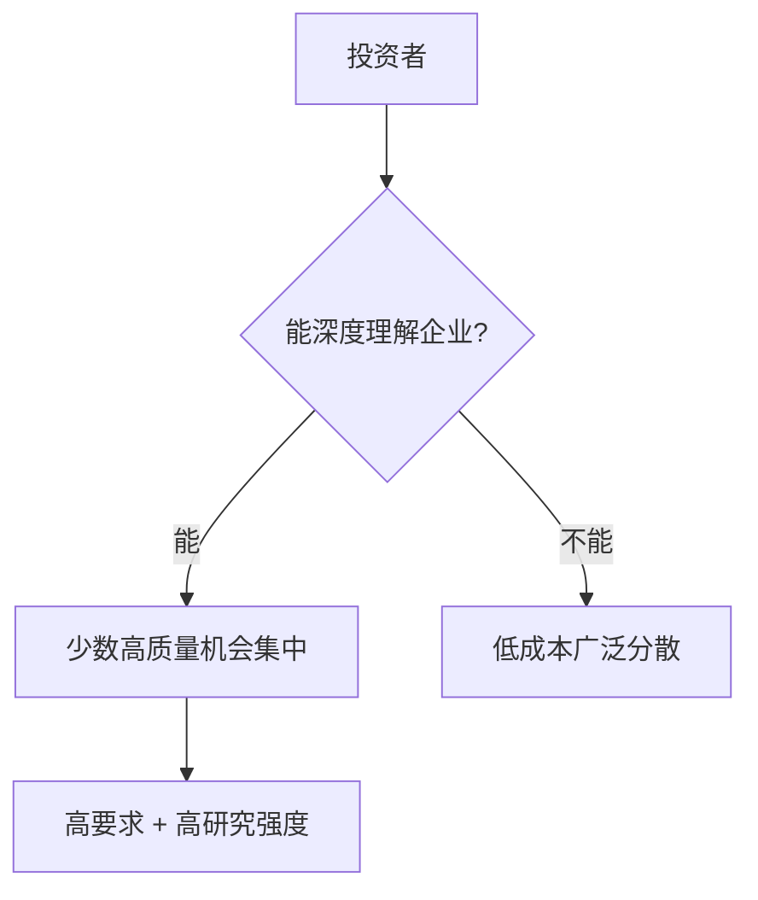

## 巴菲特思维筑基课: 集中投资定律

### 作者
digoal

### 日期
2026-05-19

### 标签
集中投资 , 分散投资 , 能力圈 , 深度研究 , 投资组合 , 巴菲特 , 风险 , 指数基金 , 确定性 , 长期投资

----

## 背景

> 面向对象: 高中生
> 核心问题: 为什么巴菲特不主张懂的人买一百只股票?
> 先说结论: 真正理解且价格合适的机会很少。对有能力深度研究的人，适度集中能提高质量；对普通人，广泛分散更合适。

## 一张图先看懂

| 投资者类型 | 更适合 |
|---|---|
| 能深入研究企业 | 适度集中 |
| 没时间或没能力研究 | 指数化分散 |

## 求真讲法

### 它到底说了什么

集中投资不是为了刺激，而是因为符合巴菲特标准的机会极少: 能懂、好生意、好管理、好价格。找到后，过度分散反而稀释判断价值。

### 它是怎么来的

如果你真正理解 5 个项目，却为了看起来安全买 50 个不了解的项目，数量增加了，理解反而下降了。

### 它依赖哪些假设

- 投资者有真实研究能力。
- 持仓企业质量高且相关性不过度集中。
- 投资者能承受价格波动。
- 每个集中仓位都经过严格安全边际检验。

### 常见误解

“巴菲特集中，所以我也该满仓一只。”不对。没有深度理解的集中是赌博。

## 求存讲法

### 它有什么用

它让资本和注意力集中在少数高确定性机会上，而不是为了分散而买入平庸资产。

### 它怎么迁移到熟悉领域

学习也需要集中。与其浅尝二十个技能，不如先把两三个关键能力练到能产生作品。

### 它的适用范围和边界

适用于能力圈清晰、研究深入、心理稳定的投资者。对多数普通人，分散指数投资更稳妥。

### 正例: 怎么用它提升能力

你只在三四个熟悉行业内寻找机会，每个机会写完整研究记录，仓位随确定性和安全边际变化。

### 反例: 前提不成立会怎样

你听朋友推荐重仓一家自己不懂的公司。股价大跌时没有判断依据，只能恐慌卖出。

## 思考

你的“分散”是在降低风险，还是在掩盖自己其实没有研究清楚任何一个选择?

## 最后记住

- 集中是高理解后的结果，不是起点。
- 广泛分散适合承认能力边界的普通人。
- 持仓越集中，研究要求越高。
- 不懂的集中就是赌博。

## 参考资料

- Warren Buffett, 1993 shareholder letter on concentration and risk.
- Berkshire portfolio history.
- Modern portfolio theory as a contrasting framework.
  
#### [PostgreSQL 解决方案集合](../201706/20170601_02.md "40cff096e9ed7122c512b35d8561d9c8")
  
  
#### [德哥 / digoal's Github - 公益是一辈子的事.](https://github.com/digoal/blog/blob/master/README.md "22709685feb7cab07d30f30387f0a9ae")
  
  
#### [About 德哥](https://github.com/digoal/blog/blob/master/me/readme.md "a37735981e7704886ffd590565582dd0")
  
  

  
