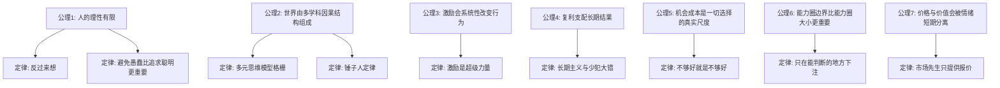

## 查理芒格思维筑基课: 查理芒格思想: 从底层公理到上层定律

### 作者
digoal

### 日期
2026-05-19

### 标签
查理芒格 , 思维模型 , 投资哲学 , 底层公理 , 上层定律 , 反向思维 , 能力圈 , 复利 , 护城河 , 安全边际

----

## 背景

> 面向对象: 高中生到普通投资者  
> 核心问题: 芒格的思想为什么不是一堆零散金句，而是一套可以迁移的判断系统？  
> 先说结论: 芒格思想的底层不是“聪明选股”，而是“承认人的无知与偏误，用跨学科模型、反向思维和长期复利去减少重大错误”。上层定律只是这些公理在投资、商业、人生决策里的展开。

## 一张图先看懂



## 求真讲法

### 它到底说了什么

芒格的思想可以压缩成一句话:

**现实很复杂，人又很容易自欺，所以要用多学科模型理解现实，用反向思维排除灾难，用能力圈约束行动，用复利和机会成本衡量长期结果。**

这不是单纯的投资方法。投资只是它最显眼的应用场景。它本质上是一套“如何少犯大错、如何做高质量判断”的认知系统。

### 底层公理

| 编号 | 底层公理 | 含义 | 如果不承认它，会怎样 |
|---|---|---|---|
| 公理1 | 人的理性有限 | 人会受贪婪、恐惧、嫉妒、从众、确认偏误影响 | 误把情绪当判断，误把自信当能力 |
| 公理2 | 世界是多因果系统 | 商业和人生问题通常不是单一学科能解释的 | 拿一个模型解释一切，形成“锤子人” |
| 公理3 | 激励塑造行为 | 人会朝奖励方向行动，哪怕口头理由很高尚 | 只听说辞，不看制度和利益结构 |
| 公理4 | 长期结果由复利决定 | 小优势长期积累会产生巨大差异，小错误也会复利 | 追逐短期刺激，打断长期增长 |
| 公理5 | 机会成本是真实成本 | 选择A就是放弃最好的B | 用“还不错”替代“最值得” |
| 公理6 | 能力有边界 | 不理解的领域不能靠勤奋临时补齐判断力 | 在看不懂的地方下注，获得虚假确定性 |
| 公理7 | 价格不等于价值 | 市场报价常被情绪、流动性和叙事拉偏 | 把涨跌当真理，把波动当风险本身 |

这些公理不是数学公理，不能像几何命题那样严格证明。它们更像经验世界里的“元假设”: 你接受它们，很多芒格式决策就自然推出；你否定它们，芒格的方法就会显得过度保守。

### 经典上层定律

#### 1. 反向思维定律

不要只问“怎样成功”，先问“怎样必败”。  
在投资里，就是先问: 这家公司怎样会让我永久亏钱？在生活里，就是先问: 这个选择怎样会毁掉我的健康、信用、关系和学习能力？

推导链:

```text
人会高估正面叙事
        ↓
先看失败路径，能降低自欺
        ↓
排除灾难后，再谈收益
```

#### 2. 避免愚蠢定律

芒格的锋利之处不在于追求“惊人聪明”，而在于系统性避免明显愚蠢: 杠杆过高、欺骗自己、跟错人、买看不懂的东西、被激励带偏。

这条定律来自公理1和公理4: 人会犯错，而大错会中断复利。所以长期胜利常常不是因为做了很多天才动作，而是因为少做了毁灭性动作。

#### 3. 多元思维模型定律

一个重大问题至少要被多个基础学科看过: 数学看概率和复利，经济学看机会成本和激励，心理学看偏误，工程学看冗余和安全边际，生物学看生态位和竞争。

这不是“知道很多名词”，而是能在真实问题里调用模型。

| 模型来源 | 芒格式用途 |
|---|---|
| 数学 | 复利、概率、期望值、排列组合 |
| 经济学 | 机会成本、供需、规模经济、激励 |
| 心理学 | 从众、损失厌恶、承诺一致性、社会认同 |
| 工程学 | 安全边际、冗余设计、故障模式 |
| 生物学 | 生态位、竞争适应、临界规模 |

#### 4. 锤子人定律

手里只有一把锤子，看什么都像钉子。  
一个人只有一个模型时，模型会从工具变成牢笼。只懂宏观的人把所有问题都解释成周期；只懂技术的人把所有护城河都看成代码；只懂财务的人会忽视文化、品牌和激励。

#### 5. 激励超级力量定律

如果制度奖励短期利润，人们就会牺牲长期质量；如果制度奖励规模，人们就会追求规模；如果制度奖励成交，销售话术就会压倒真实适配。

芒格式判断不先问“他说了什么”，而先问:

- 他因为什么得到奖励？
- 他犯错由谁承担成本？
- 他是否能从我的误判中获益？

#### 6. 能力圈定律

能力圈的关键不是圈有多大，而是你是否知道边界在哪里。  
真正的能力圈要求你能说清楚: 这个系统怎样赚钱，关键变量是什么，竞争优势怎样被破坏，什么证据会证明自己错了。

#### 7. 安全边际定律

因为人会错、模型会漏、未来会变，所以决策必须留缓冲。  
在投资中，安全边际表现为“价格明显低于保守估算的内在价值”；在工程中，表现为冗余；在人生中，表现为现金储备、健康余量、信誉余量和时间余量。

#### 8. 护城河定律

好企业不是“现在赚钱”，而是“竞争者有钱、有才、有意愿，却仍然难以复制它的经济性”。  
常见护城河包括品牌、低成本、转换成本、网络效应、有效规模。没有护城河的高利润会吸引竞争，最后被竞争吃掉。

#### 9. 复利定律

复利不只适用于钱，也适用于知识、信任、声誉、健康和关系。  
但复利有一个前提: 不能被毁灭性错误打断。亏掉50%，需要赚100%才能回本；失去信用，重建成本更高。

#### 10. 机会成本定律

芒格的标准不是“这个东西好吗”，而是“它比我能选择的最好替代方案更好吗”。  
这条定律会让人显得挑剔，但它能阻止我们把时间、资本和注意力长期锁死在平庸选择里。

#### 11. 市场先生定律

市场每天给报价，但报价不是价值本身。  
市场恐慌时，价格可能低于价值；市场狂热时，价格可能高于价值。优秀投资者利用市场情绪，而不是被市场情绪教育。

#### 12. 坐等挥棒定律

不是每个球都要打。  
投资和人生里，很多优势来自“不行动”: 不买看不懂的资产，不参与低胜率竞争，不为了缓解焦虑而做交易。真正的机会出现时，再重拳出击。

### 它依赖哪些假设

这套思想成立，至少依赖这些假设:

1. 世界存在相对稳定的因果规律，不是完全随机。
2. 人类心理偏误具有重复性，可以被识别和规避。
3. 长期复利可以压过短期波动，但前提是不遭遇毁灭性损失。
4. 某些商业系统确实存在持久竞争优势，而不是所有利润都会立刻均值回归。
5. 个体能通过学习、反馈和诚实复盘扩大能力圈，但不能无限快速扩大。

### 常见误解

| 误解 | 更准确的说法 |
|---|---|
| 芒格思想就是价值投资 | 价值投资是应用之一，底层是跨学科判断和避免愚蠢 |
| 多元模型就是懂很多知识点 | 关键是能在真实问题中组合使用模型 |
| 长期持有就是永远不卖 | 护城河毁坏、管理层失信、价格极端高估时，长期主义不等于僵化 |
| 能力圈是保守借口 | 能力圈是为了在能判断的地方下重注，而不是永远不学习 |
| 反向思维很悲观 | 它是先排雷，再进攻 |

## 求存讲法

### 它有什么用

芒格思想最大的实际作用，是把复杂决策变成一组检查:

```text
我懂不懂？              -> 能力圈
我会怎样失败？          -> 反向思维
谁被什么激励？          -> 激励机制
有没有长期复利？        -> 复利
有没有更好的替代？      -> 机会成本
价格和价值是否分离？    -> 市场先生
竞争者能否复制？        -> 护城河
```

### 它怎么迁移到熟悉领域

| 场景 | 芒格式问法 |
|---|---|
| 选专业 | 这个方向是否能长期积累？我是否真的理解它的学习成本和就业结构？ |
| 找工作 | 公司奖励什么行为？这里积累的是能力、信誉，还是只消耗时间？ |
| 创业 | 用户为什么非用我不可？竞争者有钱后能不能复制？ |
| 投资 | 我能解释商业模式吗？如果市场关闭五年，我还愿意持有吗？ |
| 学习 | 哪些基础能力会复利？哪些坏习惯会反向复利？ |

### 适用范围和边界

适用条件:

- 问题有长期后果。
- 问题涉及不确定性、人性、激励或竞争。
- 你有时间等待高质量机会。
- 你能诚实承认“不知道”。

不适用或要小心的情况:

- 必须快速试错的早期探索，过度等待会错失反馈。
- 信息极少且变化极快的领域，能力圈判断容易滞后。
- 纯粹随机、没有可重复因果结构的场景。
- 需要集体协调的问题，个人理性不一定自动推出系统最优。

### 正例: 怎么用它提升能力

假设你要选择一个长期学习方向。

芒格式做法不是问“哪个方向最热门”，而是问:

1. 这个方向的底层知识是否能复利？
2. 我是否能持续获得反馈？
3. 这个方向的竞争优势来自可积累能力，还是来自短期风口？
4. 如果失败，最可能失败在哪里？
5. 我选择它，要放弃的最好替代方案是什么？

这样选出来的方向，未必最热，但更可能形成长期能力资产。

### 反例: 前提不成立会怎样

一个人因为某个资产短期大涨而买入，并给自己找理由: “这是长期主义。”

失败点在于:

- 能力圈前提不成立: 他不能解释资产怎样产生现金流。
- 价格价值分离前提被误用: 他把上涨当成价值证明。
- 反向思维缺失: 没有问“怎样永久亏钱”。
- 机会成本被忽视: 资金被锁在不理解的风险里。

这不是芒格式长期主义，而是用长期主义包装追涨。

## 思考

1. 如果一个机会必须靠复杂预测才能成立，它是否已经超出了你的能力圈？
2. 如果一个人说的话和他的激励方向冲突，你该相信哪一个？
3. 你的生活里，哪些习惯正在复利？哪些习惯正在反向复利？
4. 你现在坚持的某个观点，是基于证据，还是基于身份认同和沉没成本？
5. 如果先问“怎样失败”，你今天最该停止做的一件事是什么？

## 最后记住

1. 芒格思想的底层公理是: 人会错、世界复杂、激励强大、复利漫长、机会成本真实。
2. “反过来想”不是口号，而是防止自欺和灾难的第一道程序。
3. 多元思维模型不是知识炫耀，而是避免单一模型误判复杂世界。
4. 能力圈不是保守，而是把行动集中在能判断、能承受、能等待的地方。
5. 最好的长期结果，往往来自少数正确大决定，加上长期不犯毁灭性错误。

## 参考资料

- Charlie Munger, *Poor Charlie's Almanack*.
- Charlie Munger, "The Psychology of Human Misjudgment".
- Warren Buffett, Berkshire Hathaway Shareholder Letters, especially discussions of circle of competence, Mr. Market, intrinsic value, compounding, and economic moat.
- Benjamin Graham, *The Intelligent Investor*.
- 本文同时参考本地 `buffett` 技能资料中的思维框架、投资哲学与商业护城河笔记。
  
#### [PostgreSQL 解决方案集合](../201706/20170601_02.md "40cff096e9ed7122c512b35d8561d9c8")
  
  
#### [德哥 / digoal's Github - 公益是一辈子的事.](https://github.com/digoal/blog/blob/master/README.md "22709685feb7cab07d30f30387f0a9ae")
  
  
#### [About 德哥](https://github.com/digoal/blog/blob/master/me/readme.md "a37735981e7704886ffd590565582dd0")
  
  

  
