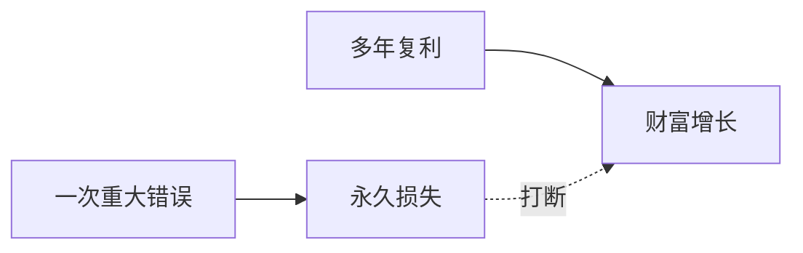

## 巴菲特思维筑基课: 少犯大错定律

### 作者
digoal

### 日期
2026-05-19

### 标签
少犯大错 , 永久亏损 , 复利 , 杠杆 , 风险控制 , 财务造假 , 巴菲特 , 投资纪律 , 生存权 , 本金安全

----

## 背景

> 面向对象: 高中生
> 核心问题: 为什么投资中“不要死”比“赚快钱”更重要?
> 先说结论: 复利最怕被一次重大错误打断。避免归零、造假、杠杆和看不懂，是长期收益的底线。

## 一张图先看懂

| 大错类型 | 为什么危险 |
|---|---|
| 高杠杆 | 被迫卖出或归零 |
| 财务造假 | 价值基础不存在 |
| 看不懂 | 无法判断风险 |
| 买太贵 | 长期回报被压低 |

## 求真讲法

### 它到底说了什么

巴菲特强调避免永久性亏损，因为复利需要连续性。一次 50% 亏损，需要 100% 收益才能回本；一次归零，复利链条结束。

### 它是怎么来的

数学上，亏损和盈利不对称。亏 20% 只需涨 25% 回本，亏 80% 要涨 400%。亏得越大，恢复越困难。

### 它依赖哪些假设

- 投资目标是长期复利。
- 重大亏损会显著降低未来资本基数。
- 有些风险可以通过不碰来避免。
- 生存权比短期收益更重要。

### 常见误解

“不犯大错就是保守低收益。”不对。避免大错是为了让好机会的复利有时间发挥。

## 求存讲法

### 它有什么用

它提供底线清单: 不借过量钱、不碰看不懂、不碰不诚信、不用短期钱做长期投资。

### 它怎么迁移到熟悉领域

人生规划也如此。很多长期成功不是每天惊艳，而是持续避免会毁掉信用、健康和学习能力的大错。

### 它的适用范围和边界

适用于长期资本和人生决策。边界是: 避免大错不等于拒绝所有风险，而是拒绝无法承受的风险。

### 正例: 怎么用它提升能力

投资前写下“我可能永久亏损的三条路径”，只要其中一条无法排除，就降低仓位或放弃。

### 反例: 前提不成立会怎样

你为了提高收益率加杠杆。连续小胜让你更自信，但一次流动性危机强制平仓，前面收益全部失去。

## 思考

你现在追求的收益，有没有让你暴露在“一次失败就不能继续游戏”的风险中?

## 最后记住

- 复利第一要求是不中断。
- 大亏损恢复非常困难。
- 有些风险最好的处理方式是不参与。
- 生存不是胆小，是长期主义的前提。

## 参考资料

- Warren Buffett, shareholder letters on leverage and permanent loss.
- Berkshire Hathaway risk management discussions.
- Standard arithmetic of investment drawdowns.
  
#### [PostgreSQL 解决方案集合](../201706/20170601_02.md "40cff096e9ed7122c512b35d8561d9c8")
  
  
#### [德哥 / digoal's Github - 公益是一辈子的事.](https://github.com/digoal/blog/blob/master/README.md "22709685feb7cab07d30f30387f0a9ae")
  
  
#### [About 德哥](https://github.com/digoal/blog/blob/master/me/readme.md "a37735981e7704886ffd590565582dd0")
  
  

  
