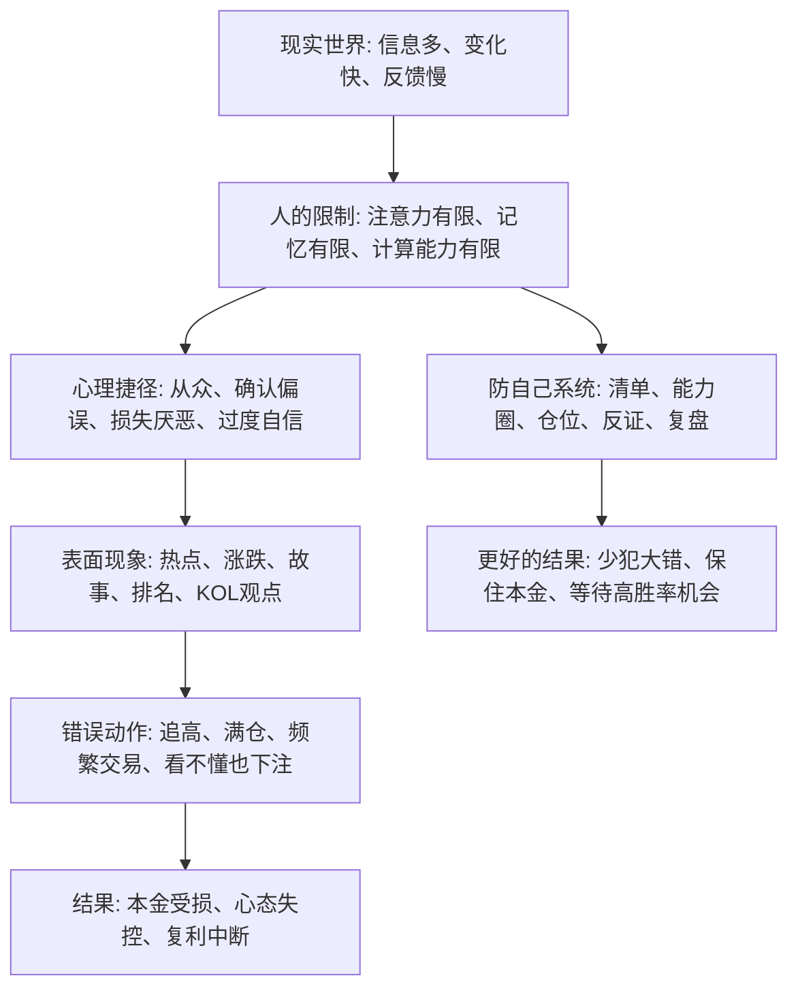

## 查理芒格思维筑基课: 人的理性有限: 投资者先要防自己

### 作者
digoal

### 日期
2026-05-19

### 标签
有限理性 , 投资防错 , 行为金融 , 查理芒格 , 心理偏误 , 能力圈 , 风险控制 , 投资纪律 , 复利 , 决策框架

----

## 背景

> 面向对象: 大学生、产品经理、运营经理、有投资需求的人  
> 核心问题: 为什么聪明人也会在投资、创业和生活决策中反复犯低级错误？  
> 先说结论: 人不是纯理性计算器，而是带着情绪、有限信息、有限注意力和社会压力做判断的生物。投资者的第一敌人通常不是市场、庄家或宏观环境，而是自己没有被约束的贪婪、恐惧、自信和从众。

## 一张图先看懂



## 求真讲法

### 它到底说了什么

“人的理性有限”不是说人很笨，而是说人在真实世界里不可能像教科书中的“完全理性人”那样行动。

完全理性人仿佛有无限信息、无限计算能力、稳定偏好和冷静心态。真实的人不是这样。我们会累，会怕亏，会被别人赚钱刺激，会喜欢证明自己正确，会把最近发生的事看得过重，也会在压力下把复杂问题简化成一个好听的故事。

所以这条底层规律可以写成一句话:

**凡是需要在不确定性中做选择的地方，都要先假设自己会被情绪、叙事和利益结构带偏，然后设计约束来保护自己。**

### 它是怎么来的

这个观点在现代经济学、心理学和投资实践中都有来源。

赫伯特·西蒙提出“有限理性”时，核心意思是: 人做决策时受到信息、认知能力和时间的限制，往往追求“足够满意”的解，而不是理论上的最优解。后来行为经济学进一步揭示，人们在风险和收益面前还会系统性偏离理性判断，例如损失厌恶、锚定效应、过度自信、从众行为。

在投资里，这些偏差会被放大。因为投资同时刺激三件事:

1. 钱: 亏损会带来真实痛感。
2. 面子: 判断错误会伤害自我形象。
3. 比较: 别人赚钱会制造焦虑和嫉妒。

这就是为什么“知道道理”和“做到”之间有巨大距离。知道“低买高卖”很容易，真正在下跌时敢买、在狂热时敢停手，却很难。

### 它依赖哪些假设

这条规律成立，依赖几个现实假设:

| 假设 | 含义 | 投资中的表现 |
|---|---|---|
| 信息不完备 | 我们永远看不到所有事实 | 财报、行业、管理层、政策和竞争信息都可能缺失 |
| 认知资源有限 | 人无法同时处理太多变量 | 最后只盯股价、K线、短视频观点或单一指标 |
| 情绪会干扰判断 | 恐惧和贪婪会改变行动 | 暴跌时割肉，暴涨时加杠杆 |
| 社会比较会改变偏好 | 人会被别人赚钱影响 | 原本保守的人也会因为朋友盈利而追热点 |
| 反馈有噪声 | 短期赚钱不等于判断正确 | 牛市里错误方法也可能暂时赚钱 |

这些假设不是数学公理，不能在一个封闭系统里“证明”。它们更像经验世界里的底层约束: 只要你承认它们，投资就必须先做防错设计；如果你否认它们，就容易把好运误认为能力。

### 常见误解

| 误解 | 更准确的说法 |
|---|---|
| 有限理性就是人不理性 | 人有理性能力，但理性受到信息、算力、情绪和环境限制 |
| 学过金融就能克服偏误 | 知识能降低错误，但不能自动消除贪婪、恐惧和自欺 |
| 投资失败主要因为市场太坏 | 市场环境重要，但很多失败来自仓位、杠杆、跟风和看不懂还下注 |
| 情绪不好就不要投资 | 不是消灭情绪，而是用规则让情绪不能随便指挥本金 |
| 防自己就是保守不赚钱 | 防自己是为了避免永久性损失，把本金留给真正能看懂的机会 |

## 求存讲法

### 它有什么用

这条规律最大的用处，是把“我要战胜市场”改成“我先不要被自己打败”。

很多人投资前只问:

```text
这个东西会不会涨？
别人是不是赚了？
有没有大佬推荐？
这次是不是大机会？
```

承认有限理性后，要先问:

```text
我是不是看懂了？
我是不是只在找支持自己观点的证据？
如果跌 30%，我会不会被迫卖出？
我是不是因为别人赚钱而焦虑？
这笔钱亏掉会不会影响生活和长期计划？
```

前一组问题追逐外部答案，后一组问题检查内部缺陷。投资者先防自己，就是先把不可控的自己变得可控一点。

### 它怎么迁移到熟悉领域

| 场景 | 有限理性的表现 | 防自己的办法 |
|---|---|---|
| 学习 | 以为看懂视频就等于掌握 | 用闭卷复述和做题反馈检验 |
| 产品 | 因为自己喜欢就判断用户喜欢 | 做用户访谈、数据验证和小范围实验 |
| 运营 | 被短期数据刺激，频繁改策略 | 区分噪声和趋势，设观察周期 |
| 创业 | 把愿景当需求，把融资当验证 | 找真实付费、留存和复购证据 |
| 投资 | 把上涨当正确，把下跌当错误 | 事前写投资逻辑，事后对照复盘 |

### 它的适用范围和边界

适用范围:

- 高不确定性决策: 投资、创业、职业选择、重大消费。
- 反馈慢的决策: 买股票、选赛道、培养能力、建立品牌。
- 情绪参与强的决策: 钱、排名、面子、关系、身份认同。
- 群体叙事强的决策: 风口、概念、热点、社交媒体共识。

边界也要说清楚:

- 有限理性不能推出“什么都别做”。它要求先控制风险，再行动。
- 有限理性不能替代专业研究。清单只能减少低级错误，不能让不懂的人突然懂行业。
- 有限理性不能保证赚钱。它主要降低毁灭性错误，提高长期留在牌桌上的概率。
- 有限理性不是怀疑一切。过度怀疑也会导致错过机会，关键是证据和仓位要匹配。

### 正例: 怎么用它提升能力

假设一名大学生刚开始投资，看到某个热门板块一个月涨了 40%，同学也在赚钱。他很想立刻买入。

承认有限理性后，他不急着下单，而是做五步:

1. 写下买入理由: 是因为公司价值，还是因为别人赚钱？
2. 写下反方证据: 什么情况说明自己判断错了？
3. 限制仓位: 即使看错，也不影响生活费、学习和长期计划。
4. 设定等待期: 冷静 24 小时后再看是否仍然成立。
5. 复盘结果: 无论赚亏，都检查当初的逻辑是否被事实支持。

这套动作不会让他每次都赚钱，但会让他少把冲动误认为判断，少把运气误认为能力。

### 反例: 前提不成立会怎样

假设一个产品经理转去做投资，认为自己理解用户心理，所以也能理解所有消费股。他听到一个新消费品牌故事很好，门店排队，社交媒体热度高，于是重仓买入。

失败点不在于“他不努力”，而在于多个前提不成立:

| 被破坏的前提 | 真实情况 | 后果 |
|---|---|---|
| 信息不完备 | 排队可能来自补贴、开店初期流量和社媒投放 | 把营销热度误认为长期需求 |
| 能力圈有限 | 懂产品体验不等于懂渠道、供应链、财务和估值 | 只看见好故事，看不见利润质量 |
| 情绪会干扰判断 | 他想证明跨界判断能力 | 反方证据被忽略 |
| 反馈有噪声 | 买入初期股价继续上涨 | 短期盈利强化了错误自信 |

后来补贴下降、同质化竞争加剧、利润不及预期，股价大幅回落。他的问题不是“不够聪明”，而是没有把“自己可能看错”写进制度里。

## 一个防自己清单

```text
下单前 10 问

1. 我能用三句话说清楚它怎样赚钱吗？
2. 我知道它最关键的三个变量吗？
3. 我看过反方观点吗？
4. 我是否因为别人赚钱而焦虑？
5. 我是否把最近涨跌当成长期规律？
6. 如果跌 30%，我是否会被迫卖出？
7. 这笔仓位是否超过我的理解程度？
8. 有没有利益相关者在诱导我交易？
9. 什么证据出现时，我必须承认自己错了？
10. 如果市场关闭三年，我还愿意持有吗？
```

这份清单的价值不在于复杂，而在于把大脑最容易偷懒的地方暴露出来。

## 思考

如果一个人永远相信“我这次是理性的”，他就很难建立真正的理性。真正成熟的理性，往往从承认“不可靠的正是我自己”开始。

可以继续追问几个问题:

1. 如果短期结果不能证明方法正确，我该用什么指标评价自己的决策质量？
2. 如果我知道自己会从众，应该如何设计信息环境，减少被热点牵着走？
3. 如果我知道自己厌恶亏损，应该如何提前设计仓位，而不是等亏损后再靠意志力？
4. 如果创业者、产品经理、运营经理也受有限理性影响，团队应该如何用机制减少老板或核心成员的一念之差？
5. 如果市场中大多数人都有偏误，那么机会是否正来自“别人无法控制自己”的地方？

## 最后记住

1. 人的理性有限，不是因为人笨，而是因为信息、注意力、计算能力和情绪都有限。
2. 投资者的第一道风险控制，不是预测市场，而是约束自己。
3. 短期赚钱不一定说明判断正确，可能只是运气、趋势或流动性奖励。
4. 能力圈、仓位、反证、清单和复盘，本质上都是“防自己”的工具。
5. 真正的长期复利，先来自少犯毁灭性错误，再来自抓住少数看得懂的机会。

## 参考资料

- Herbert A. Simon, "A Behavioral Model of Rational Choice", 1955.
- Herbert A. Simon, "Models of Man", 1957.
- Daniel Kahneman and Amos Tversky, "Prospect Theory: An Analysis of Decision under Risk", 1979.
- Daniel Kahneman, "Thinking, Fast and Slow", 2011.
- Richard H. Thaler, "Misbehaving: The Making of Behavioral Economics", 2015.
- Charles T. Munger, "Poor Charlie's Almanack", 2005.
- Benjamin Graham, "The Intelligent Investor", revised editions.
- Warren E. Buffett, Berkshire Hathaway shareholder letters.
  
#### [PostgreSQL 解决方案集合](../201706/20170601_02.md "40cff096e9ed7122c512b35d8561d9c8")
  
  
#### [德哥 / digoal's Github - 公益是一辈子的事.](https://github.com/digoal/blog/blob/master/README.md "22709685feb7cab07d30f30387f0a9ae")
  
  
#### [About 德哥](https://github.com/digoal/blog/blob/master/me/readme.md "a37735981e7704886ffd590565582dd0")
  
  

  
