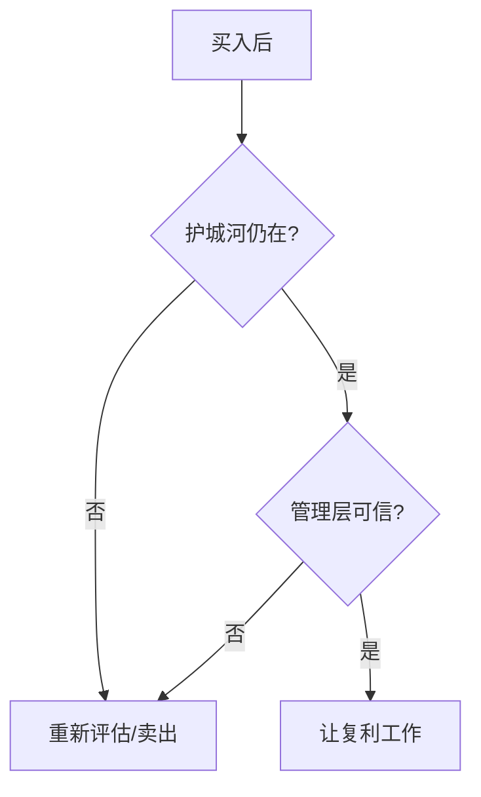

## 巴菲特思维筑基课: 长期持有定律

### 作者
digoal

### 日期
2026-05-19

### 标签
长期持有 , 复利 , 护城河 , 管理层 , 合理价格 , 巴菲特 , 长期投资 , 企业质量 , 卖出纪律 , 投资耐心

----

## 背景

> 面向对象: 高中生
> 核心问题: 巴菲特说长期持有，是不是买了就永远不动?
> 先说结论: 长期持有只适用于好企业、好管理、合理价格和护城河仍在的情况。它是高质量判断后的结果，不是懒得判断。

## 一张图先看懂

| 长期持有的前提 | 说明 |
|---|---|
| 生意优秀 | 能长期创造现金 |
| 护城河稳固 | 利润不易被抢走 |
| 管理层可信 | 不乱配置资本 |
| 买价合理 | 未来收益未被透支 |

## 求真讲法

### 它到底说了什么

如果你拥有优秀企业的一部分，频繁买卖只会打断复利并增加错误。长期持有让企业利润、再投资和时间一起工作。

### 它是怎么来的

好企业像一棵健康果树。你不必每天拔起来看根长没长，只要定期检查土壤、水分和病虫害。

### 它依赖哪些假设

- 企业质量长期保持。
- 管理层能合理配置资本。
- 投资者买入价格没有严重过高。
- 投资者不需要短期用这笔钱。

### 常见误解

“长期持有可以弥补买错。”不对。坏企业持有越久，价值毁灭越多。

## 求存讲法

### 它有什么用

它减少交易摩擦、税费和情绪错误，让企业内在价值增长真正转化为投资收益。

### 它怎么迁移到熟悉领域

学习长期技能也是这样。选对方向后，不要因短期反馈差就频繁换赛道，但也要定期检查方向是否仍正确。

### 它的适用范围和边界

适用于优秀、可持续、可理解的资产。不适用于衰退行业、欺诈公司、无护城河企业或买入价极端高的泡沫资产。

### 正例: 怎么用它提升能力

买入后每季度检查关键指标: 护城河、现金流、资本配置，而不是每天检查股价。

### 反例: 前提不成立会怎样

你把一家低回报、重资产、需求下降的企业长期持有，结果时间没有帮你复利，只是持续暴露问题。

## 思考

你所谓的“长期”，是基于清楚的长期逻辑，还是只是因为亏了不愿承认?

## 最后记住

- 长期持有有前提。
- 好企业让时间成为朋友。
- 坏企业让时间成为敌人。
- 定期检查企业，不要天天盯报价。

## 参考资料

- Warren Buffett, shareholder letters on favorite holding period.
- Berkshire examples: Coca-Cola, American Express.
- Value investing literature on long-term ownership.
  
#### [PostgreSQL 解决方案集合](../201706/20170601_02.md "40cff096e9ed7122c512b35d8561d9c8")
  
  
#### [德哥 / digoal's Github - 公益是一辈子的事.](https://github.com/digoal/blog/blob/master/README.md "22709685feb7cab07d30f30387f0a9ae")
  
  
#### [About 德哥](https://github.com/digoal/blog/blob/master/me/readme.md "a37735981e7704886ffd590565582dd0")
  
  

  
