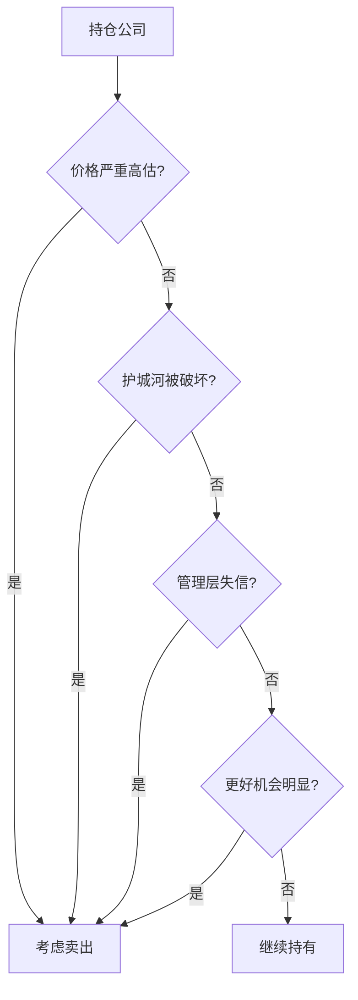

## 巴菲特思维筑基课: 卖出四条件定律

### 作者
digoal

### 日期
2026-05-19

### 标签
卖出条件 , 高估 , 护城河破坏 , 管理层诚信 , 机会成本 , 巴菲特 , 长期持有 , 投资纪律 , 价值投资 , 组合管理

----

## 背景

> 面向对象: 高中生
> 核心问题: 如果长期持有很重要，什么时候该卖?
> 先说结论: 巴菲特式卖出主要看四件事: 严重高估、护城河破坏、管理层诚信出问题、出现明显更好机会。

## 一张图先看懂

| 不该卖的理由 | 为什么不充分 |
|---|---|
| 股价跌了 | 价值未必变 |
| 大盘不好 | 宏观预测不可靠 |
| 别人看空 | 要看证据 |
| 短期利润波动 | 可能只是周期 |

## 求真讲法

### 它到底说了什么

卖出不应由情绪触发，而应由价值、质量、诚信和机会成本触发。长期持有不是僵化不动，而是不被噪音驱动。

### 它是怎么来的

如果你拥有一家好店，隔壁每天报价低一点不是卖出理由。但如果店的客源永久消失，或者店长偷钱，性质就变了。

### 它依赖哪些假设

- 投资者能评估内在价值和护城河变化。
- 管理层诚信是长期价值基础。
- 机会成本真实存在。
- 交易有摩擦，不能频繁换来换去。

### 常见误解

“跌了就该止损。”不一定。若价值未变，价格下跌可能是机会；若价值毁坏，即使没跌也该重估。

## 求存讲法

### 它有什么用

它给卖出设置纪律，避免两种错误: 因恐慌卖掉好公司，或因固执持有坏公司。

### 它怎么迁移到熟悉领域

退出一个项目也应有条件: 目标失效、团队失信、投入产出严重不合理、出现明显更好的方向。

### 它的适用范围和边界

适用于长期投资组合管理。边界是: “更好机会”必须明显更好，否则频繁切换会被税费和错误吞噬。

### 正例: 怎么用它提升能力

每次想卖出时，先把四条件逐项写出来。若只是因为价格跌和心情差，就暂缓决定。

### 反例: 前提不成立会怎样

发现管理层财务造假却继续持有，理由是“估值很低”。诚信基础已毁，低估值可能只是陷阱。

## 思考

你卖出一个选择时，是因为它真的变差，还是因为你暂时承受不了波动?

## 最后记住

- 卖出看四条件。
- 价格下跌本身不是卖出理由。
- 管理层失信要高度果断。
- 机会成本要明显，不能频繁摇摆。

## 参考资料

- Warren Buffett, shareholder letters on sell discipline.
- Berkshire discussions on management integrity and moat deterioration.
- Value investing portfolio management principles.
  
#### [PostgreSQL 解决方案集合](../201706/20170601_02.md "40cff096e9ed7122c512b35d8561d9c8")
  
  
#### [德哥 / digoal's Github - 公益是一辈子的事.](https://github.com/digoal/blog/blob/master/README.md "22709685feb7cab07d30f30387f0a9ae")
  
  
#### [About 德哥](https://github.com/digoal/blog/blob/master/me/readme.md "a37735981e7704886ffd590565582dd0")
  
  

  
