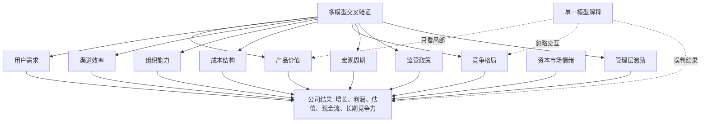

## 查理芒格思维筑基课: 世界是多因果系统: 别用单一模型解释公司

### 作者
digoal

### 日期
2026-05-19

### 标签
多因果系统 , 企业分析 , 商业模型 , 查理芒格 , 产品经理 , 投资判断 , 竞争格局 , 组织能力 , 财务质量 , 决策框架

----

## 背景

> 面向对象: 大学生、产品经理、运营经理、有投资需求的人  
> 核心问题: 为什么只看一个指标、一个故事、一个模型，很容易误判一家公司？  
> 先说结论: 公司不是由单一因素决定的机器，而是产品、用户、渠道、组织、财务、竞争、周期、监管、资本和人性共同作用的多因果系统。单一模型能让问题变简单，也会让真相变窄。

## 一张图先看懂



## 求真讲法

### 它到底说了什么

“世界是多因果系统”说的是: 很多重要结果不是由一个原因单独造成的，而是多个原因相互作用后的结果。

一家公司为什么成功，不能只说“产品好”；为什么失败，也不能只说“管理层不行”。产品好但获客太贵，可能不赚钱；财务漂亮但研发断档，可能透支未来；创始人很强但激励错了，组织可能变形；行业需求很大但竞争过度，股东未必赚钱。

所以这条底层规律可以写成一句话:

**解释公司时，不要问“唯一原因是什么”，要问“哪些关键变量一起作用，它们怎样互相加强或互相抵消”。**

### 它是怎么来的

这不是某个学科独有的观点，而是多个学科面对复杂现实后形成的共同认识。

系统论提醒我们: 系统的表现来自组成部分之间的关系，不只是单个部分的质量。经济学提醒我们: 供需、价格、激励、机会成本和竞争会同时起作用。管理学提醒我们: 战略、组织、流程、文化和激励会影响执行。心理学提醒我们: 用户、员工、管理层和投资者都会受偏见与情绪影响。

公司正好站在这些学科的交叉处。它不是财务报表本身，也不是产品截图本身，而是一个持续运转的商业系统。

可以把公司简化成这样:

```text
公司 = 为用户创造价值
     + 用渠道把价值送到用户面前
     + 用组织持续生产和交付
     + 用商业模式把价值转成现金流
     + 在竞争和周期中守住优势
     + 在资本和监管约束下分配资源
```

这只是教学用的简化。真实公司更复杂，但这个简化能提醒我们: 少看任何一块，都可能误判整体。

### 它依赖哪些假设

| 假设 | 含义 | 公司分析中的表现 |
|---|---|---|
| 变量之间会交互 | 一个变量的效果取决于其他变量 | 好产品遇到高获客成本，仍可能亏损 |
| 因果有时间滞后 | 原因发生后，结果可能很久才显现 | 研发削减短期提高利润，长期伤害竞争力 |
| 局部最优不等于整体最优 | 一个部门好看，不代表公司更强 | 销售冲规模可能带来坏账和低质量客户 |
| 外部环境会改变内部效果 | 同样的能力在不同周期中价值不同 | 低利率时高增长受追捧，高利率时现金流更重要 |
| 人会响应激励 | 制度奖励什么，行为就倾向什么 | KPI 奖励成交，销售可能牺牲客户匹配度 |

这些假设不是数学定理，不能在商业世界中被一次性证明。它们是分析复杂系统时的工作前提: 如果承认它们，就必须多角度验证；如果忽略它们，就容易把局部现象当成全部真相。

### 常见误解

| 误解 | 更准确的说法 |
|---|---|
| 多因果就是把所有因素都列出来 | 关键不是罗列，而是识别主变量、交互关系和时间顺序 |
| 单一模型都没用 | 单一模型有用，但只能解释一部分，不能冒充全景 |
| 财务好就说明公司好 | 财务是结果和线索，还要看质量、来源、可持续性和代价 |
| 产品好就一定能成功 | 还要看需求强度、渠道、成本、竞争、组织和商业模式 |
| 宏观不好所以公司不行 | 宏观是背景，不同公司对周期的敏感度不同 |
| 多模型分析会让人不敢行动 | 目标不是无限复杂化，而是避免被一个漂亮解释骗走 |

## 求存讲法

### 它有什么用

这条规律最大的用处，是帮我们抵抗“单因果故事”。

单因果故事通常很顺耳:

```text
这家公司一定行，因为创始人很厉害。
这家公司一定行，因为产品体验很好。
这家公司一定行，因为行业空间巨大。
这家公司一定不行，因为短期利润下降。
这家公司一定不行，因为宏观环境不好。
```

这些话可能有一部分对，但危险在于它们把公司压缩成一个变量。真正的公司分析应该从“一个解释”升级为“一组相互校验的问题”。

### 它怎么迁移到熟悉领域

| 场景 | 单一模型误判 | 多因果看法 |
|---|---|---|
| 选专业 | 只看就业薪资 | 同时看兴趣、能力、行业周期、学习成本、长期迁移性 |
| 做产品 | 只看用户反馈说喜欢 | 同时看付费、留存、使用频率、替代方案、获客成本 |
| 做运营 | 只看活动带来新增 | 同时看留存、复购、毛利、用户质量、品牌损耗 |
| 创业 | 只看市场空间大 | 同时看切入点、竞争壁垒、现金流、团队能力、销售周期 |
| 投资 | 只看市盈率低 | 同时看利润质量、资产负债表、行业格局、管理层、周期位置 |

### 它的适用范围和边界

适用范围:

- 公司分析、行业研究、投资判断、创业决策。
- 产品、运营、增长、组织和战略问题。
- 原因多、反馈慢、变量相互影响的复杂问题。
- 看似有一个强解释，但结果长期不符合预期的场景。

边界也要说清楚:

- 多因果分析不是把问题搞得无限复杂。最后仍要抓主要矛盾。
- 不是每个因素都同等重要。不同公司、阶段、行业的关键变量不同。
- 多模型不能替代事实调查。没有事实，多模型只是更复杂的想象。
- 在早期探索中，可以先用简单模型快速试错，但一旦要重仓投入时间、资本或信誉，就必须升级为多因果分析。

### 正例: 怎么用它提升能力

假设你在分析一家订阅制软件公司。单一模型可能只看“收入增长很快”，然后得出公司很好。

多因果分析会拆成几组问题:

| 维度 | 要问的问题 | 为什么重要 |
|---|---|---|
| 产品 | 用户是否高频使用？是否替代关键流程？ | 决定留存和议价能力 |
| 用户 | 客户是真需求还是预算宽松时尝鲜？ | 决定需求韧性 |
| 渠道 | 获客成本是否下降？销售周期是否缩短？ | 决定增长质量 |
| 财务 | 收入增长是否伴随现金流改善？ | 决定是否越增长越缺钱 |
| 竞争 | 竞品是否能用低价复制核心功能？ | 决定利润能否保住 |
| 组织 | 研发、销售、客服是否协同？ | 决定交付质量和扩张效率 |
| 激励 | 管理层奖励收入、利润还是长期留存？ | 决定行为方向 |

这时你可能得到一个更稳的判断: 这家公司增长快只是表层现象，真正值得关注的是“高留存 + 获客效率提升 + 现金流改善 + 竞争者难以替代”。如果只有增长，没有这些支撑，风险就大得多。

### 反例: 前提不成立会怎样

假设一个投资者只用“低市盈率”模型买入一家传统制造公司。他认为: 市盈率低，所以便宜；便宜，所以安全。

问题在于，他默认了一个前提: 当前利润能代表未来利润。但这个前提可能不成立。

| 被忽略的变量 | 实际情况 | 造成的误判 |
|---|---|---|
| 周期 | 公司正处于行业景气高点 | 市盈率低只是利润暂时高 |
| 竞争 | 新产能大量进入 | 未来价格和毛利率可能下行 |
| 技术 | 下游客户开始切换新工艺 | 旧产品需求可能萎缩 |
| 资产 | 设备重、折旧高、退出难 | 下行时固定成本拖累现金流 |
| 激励 | 管理层为完成规模目标继续扩产 | 供给过剩进一步加剧 |

后来行业价格下跌，利润快速下降，市盈率反而变高，股价继续下跌。失败不是因为“市盈率没用”，而是把一个有用指标当成了完整模型。

## 一个公司分析的多模型清单

```text
分析公司前 12 问

1. 这家公司到底为谁解决什么问题？
2. 用户为什么现在必须用它，而不是可有可无？
3. 它怎样获得客户？获客成本是上升还是下降？
4. 收入增长来自真实需求、涨价、并购，还是会计口径？
5. 毛利率和现金流能否支持持续投入？
6. 竞争者有钱、有技术、有渠道后，能不能复制？
7. 公司强在产品、渠道、成本、品牌、网络效应，还是监管位置？
8. 管理层被什么指标奖励？
9. 行业处在上行、下行，还是结构变化中？
10. 哪些政策、利率、汇率或供应链变量会改变结果？
11. 当前估值隐含了多乐观的未来？
12. 什么证据出现时，我必须承认原判断错了？
```

这个清单的目的不是让每个人都变成行业专家，而是避免用一个漂亮句子解释一家公司。

## 思考

多因果系统最反直觉的地方在于: 你看到的结果往往不是一个原因的胜利，而是多个变量暂时站在同一边。

一家公司短期增长很快，可能是产品好，也可能是补贴高、渠道强、宏观顺风、竞争未进入、资本愿意烧钱。只有当潮水变化后，你才知道哪些因素是真能力，哪些只是顺风。

可以继续追问:

1. 如果一个结论只能用一个变量解释，它是不是太脆弱了？
2. 如果同一个结果可以由多个原因造成，我怎样区分真正原因和表面原因？
3. 如果一个公司短期利润很好，哪些证据能证明它不是透支未来？
4. 如果我是产品经理，我是否过度相信产品体验，低估了渠道和组织？
5. 如果我是投资者，我是否过度相信财务指标，低估了竞争和周期？
6. 如果我是创业者，我是否过度相信市场空间，低估了切入顺序和现金流？

## 最后记住

1. 公司是多因果系统，不是单一变量的线性结果。
2. 单一模型可以作为入口，但不能作为结论。
3. 好分析不是罗列因素，而是找出关键变量、交互关系和时间顺序。
4. 财务、产品、组织、竞争、周期、监管和激励要相互校验。
5. 投资和创业中，最危险的不是没有模型，而是只有一个模型却以为看见了全部。

## 参考资料

- Ludwig von Bertalanffy, "General System Theory", 1968.
- Peter M. Senge, "The Fifth Discipline", 1990.
- Michael E. Porter, "Competitive Strategy", 1980.
- Michael E. Porter, "What Is Strategy?", Harvard Business Review, 1996.
- Clayton M. Christensen, "The Innovator's Dilemma", 1997.
- Richard P. Rumelt, "Good Strategy Bad Strategy", 2011.
- Charlie Munger, "Poor Charlie's Almanack", 2005.
- Benjamin Graham, "The Intelligent Investor", revised editions.
  
#### [PostgreSQL 解决方案集合](../201706/20170601_02.md "40cff096e9ed7122c512b35d8561d9c8")
  
  
#### [德哥 / digoal's Github - 公益是一辈子的事.](https://github.com/digoal/blog/blob/master/README.md "22709685feb7cab07d30f30387f0a9ae")
  
  
#### [About 德哥](https://github.com/digoal/blog/blob/master/me/readme.md "a37735981e7704886ffd590565582dd0")
  
  

  
