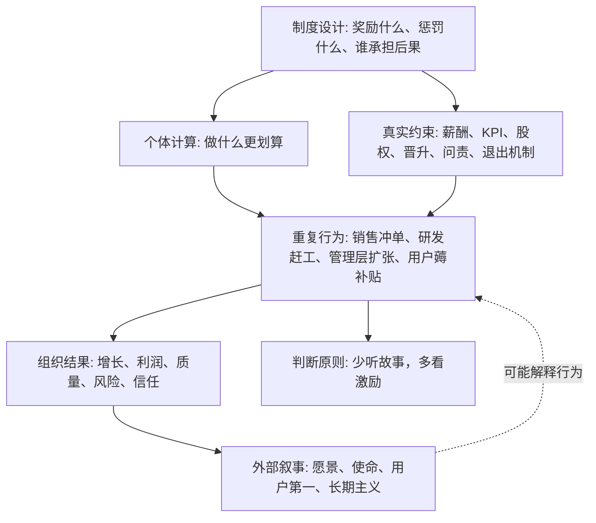

## 查理芒格思维筑基课: 激励塑造行为: 看制度比听故事重要

### 作者
digoal

### 日期
2026-05-19

### 标签
激励机制 , 行为塑造 , 制度设计 , 查理芒格 , 代理问题 , 产品运营 , 投资尽调 , 管理层 , KPI , 商业判断

----

## 背景

> 面向对象: 大学生、产品经理、运营经理、有投资需求的人  
> 核心问题: 为什么很多人嘴上说得很好，最后行为却朝着另一个方向走？  
> 先说结论: 人会响应激励。真正决定长期行为的，往往不是口号、愿景和故事，而是谁因为什么得到奖励，谁为错误承担代价，谁能从别人的误判中获益。

## 一张图先看懂



## 求真讲法

### 它到底说了什么

“激励塑造行为”不是说人都自私，也不是说道德、理想和文化没用。它说的是: 当一个制度长期奖励某种行为时，人们大概率会向那个方向调整；当一个制度让错误成本由别人承担时，冒险行为就会变多。

激励，简单说就是“做某件事会得到什么、失去什么”。它可以是钱，也可以是晋升、排名、流量、面子、权力、股权、声誉、惩罚或免罚。

所以这条底层规律可以写成一句话:

**判断一个人、团队或公司会怎样行动，不要只听他们说重视什么，要看制度实际奖励什么。**

### 它是怎么来的

这个观点来自经济学、管理学、组织行为学和投资实践的共同经验。

经济学把人看作会响应约束和收益变化的行动者。管理学研究发现，绩效指标、晋升机制和责任分配会持续改变组织行为。投资实践也反复证明，管理层怎么拿钱、怎么持股、怎么被考核，往往比年报里的漂亮话更能解释长期行为。

一个简单例子:

```text
公司口号: 用户第一
考核指标: 本月成交额
奖励方式: 谁成交多谁奖金高
问责方式: 退款、投诉、长期流失不影响奖金

更可能出现的行为:
销售夸大承诺 -> 短期收入上升 -> 客户体验下降 -> 续费率下降 -> 品牌受损
```

不是销售天生坏，而是制度把短期成交奖励得太明确，把长期后果惩罚得太弱。

### 它依赖哪些假设

| 假设 | 含义 | 现实表现 |
|---|---|---|
| 人会对收益和成本作出反应 | 奖励和惩罚会改变选择 | 奖金看销售额，销售就会重成交 |
| 重复激励会塑造习惯 | 一次奖励可能偶然，长期奖励会固化行为 | 组织慢慢形成某种文化 |
| 指标会替代目标 | 人容易把被考核的数字当成真正目标 | 追 DAU、GMV、收入，却牺牲质量 |
| 成本转嫁会放大冒险 | 如果犯错成本由别人承担，人会更敢冒险 | 高杠杆、乱承诺、过度扩张 |
| 信息不对称会制造诱导 | 一方懂得更多，可能利用另一方误判 | 销售、投顾、平台、管理层都可能美化叙事 |

这些假设不是在说人一定会作恶，而是在说: 制度会改变行为概率。好制度让好行为更容易发生，坏制度让坏行为更容易发生。

### 常见误解

| 误解 | 更准确的说法 |
|---|---|
| 看激励就是不相信人 | 看激励是为了理解行为环境，不是预设所有人坏 |
| 有使命感就不需要激励 | 使命感重要，但长期行为仍需要制度支持 |
| 高奖金一定导致坏行为 | 奖励本身不是问题，问题是奖励指标是否偏离真实目标 |
| 文化比制度更重要 | 文化常常是长期制度的结果，不是口号本身 |
| 管理层说长期主义就可信 | 要看持股、薪酬、资本分配、回购、并购和问责方式是否一致 |

## 求存讲法

### 它有什么用

这条规律的实际作用，是让你从“听故事”升级为“看结构”。

很多叙事很动听:

```text
我们坚持用户第一。
我们重视长期价值。
我们是一支有理想的团队。
我们和客户共赢。
我们不会为了短期利益牺牲品质。
```

这些话不能直接判定真假。真正要问的是:

```text
谁因为用户满意而得到奖励？
谁因为长期质量而晋升？
谁因为短期作假而付出代价？
谁能从客户不懂中赚钱？
谁在冒险，谁在承担后果？
```

故事负责表达愿望，制度负责塑造行为。判断现实，要优先看后者。

### 它怎么迁移到熟悉领域

| 场景 | 只听故事会看到什么 | 看制度要问什么 |
|---|---|---|
| 学习 | 老师说重视能力 | 考试到底奖励理解，还是奖励刷题记忆？ |
| 产品 | 团队说用户第一 | KPI 奖励留存、满意度，还是只奖励新增？ |
| 运营 | 活动说提升用户价值 | 奖励真实复购，还是奖励短期拉新数字？ |
| 创业 | 创始人说长期主义 | 股权、现金流、融资压力是否迫使短期冲量？ |
| 投资 | 管理层说回报股东 | 薪酬、持股、并购、分红和回购是否一致？ |

### 它的适用范围和边界

适用范围:

- 判断公司管理层是否可信。
- 设计产品、运营、销售和团队 KPI。
- 分析平台、学校、企业、市场中的行为偏差。
- 投资中识别代理问题，也就是“替别人管钱的人是否真的替出资人负责”。

边界也要说清楚:

- 激励不是唯一原因。能力、价值观、法律、文化、资源约束也会影响行为。
- 激励分析不能替代事实。要看合同、薪酬、股权、考核、历史行为，而不是凭空猜测。
- 短期行为不一定代表长期制度。偶发事件要和长期记录区分。
- 好激励也不能保证好结果。方向对，还需要能力、执行、资源和外部环境配合。

### 正例: 怎么用它提升能力

假设你是产品经理，要提升一款订阅软件的长期留存。团队原来的指标只看“本月新增付费用户数”，销售和运营都拼命拉新，但三个月后大量流失。

如果承认“激励塑造行为”，你不会只批评团队“不够重视用户”。你会检查制度:

| 原指标 | 被奖励的行为 | 可能副作用 |
|---|---|---|
| 本月新增付费 | 强促销、夸承诺、拉低匹配度用户 | 退款、投诉、低留存 |
| 首月收入 | 追求短期成交 | 忽视长期使用价值 |
| 活动报名数 | 制造热闹 | 用户质量下降 |

更合理的设计可以改成:

| 新指标 | 被奖励的行为 | 更接近的真实目标 |
|---|---|---|
| 90 天留存 | 找匹配用户，做好交付 | 长期使用 |
| 净收入留存 | 服务高价值客户 | 可持续增长 |
| 投诉率和退款率 | 减少误导销售 | 信任和质量 |
| 用户关键动作完成率 | 帮用户真正用起来 | 产品价值实现 |

这时团队行为会变: 不再只追求拉新，而是更关心用户是否真的适合、是否上手、是否持续获得价值。

### 反例: 前提不成立会怎样

假设一个投资者买入一家公司，因为管理层反复强调“我们坚持长期主义，绝不做短期行为”。他只听故事，没有看制度。

后来发现:

| 被忽略的制度 | 实际情况 | 后果 |
|---|---|---|
| 薪酬指标 | 奖金主要绑定收入规模 | 管理层倾向低质量扩张 |
| 股权结构 | 管理层持股很少 | 股价长期损失与个人财富关系弱 |
| 并购机制 | 并购越多，管理层控制资源越多 | 为做大规模而高价收购 |
| 问责方式 | 商誉减值几年后才暴露 | 当期决策者未必承担后果 |
| 信息披露 | 只强调订单，不强调现金回款 | 投资者误把收入当现金质量 |

几年后，公司收入看似增长，现金流却恶化，商誉减值，股价下跌。失败不是因为“长期主义这个词错了”，而是投资者没有验证制度是否真的奖励长期主义。

## 一个看制度的检查清单

```text
判断激励前 12 问

1. 这个系统口头上说重视什么？
2. 它实际奖励什么数字、行为或结果？
3. 谁因为短期表现得到好处？
4. 谁承担长期后果？
5. 指标是否容易被刷、被包装、被短期操纵？
6. 奖励的是过程、结果，还是可持续结果？
7. 做正确但短期不好看的事，会不会被惩罚？
8. 做错误但短期好看的事，会不会被奖励？
9. 决策者是否有足够股权、声誉或责任与结果绑定？
10. 客户、员工、股东和管理层的利益是否一致？
11. 历史行为是否证明他们按口号行动？
12. 如果我完全不听故事，只看制度，会得出什么判断？
```

这份清单最适合用在三类地方: 选公司、设计团队、判断合作对象。

## 思考

很多人判断世界时喜欢问“他说的是真的吗”。更高阶的问题是: “在这个制度下，他长期说真话、做正确事，对他是否划算？”

如果答案是否定的，单靠道德期待就很危险。不是因为人一定会变坏，而是因为制度会不断筛选行为。短期看，是一个人的选择；长期看，是一套规则在生产结果。

可以继续追问:

1. 如果一个组织天天强调质量，却只奖励速度，最后会出现什么文化？
2. 如果一个平台靠用户上瘾赚钱，它说“保护用户时间”时，我该看什么证据？
3. 如果一个基金经理拿管理费比拿业绩分成更稳定，他和投资者的利益是否完全一致？
4. 如果创业公司用 GMV 讲增长，却不披露退款、补贴和现金流，这个增长真实吗？
5. 如果我自己也会响应激励，我该如何设计学习、工作和投资环境，让正确行为更容易发生？

## 最后记住

1. 激励不是口号，而是奖励、惩罚、责任和收益的分配方式。
2. 人会响应激励，组织会沿着考核指标生长。
3. 听故事只能知道对方想让你相信什么，看制度才能知道行为大概率会走向哪里。
4. 好制度让正确行为更容易，坏制度让短期、包装和冒险更有利。
5. 投资、创业、产品和运营中，先看谁受益、谁承担后果，再判断故事是否可信。

## 参考资料

- Adam Smith, "The Wealth of Nations", 1776.
- Ronald H. Coase, "The Nature of the Firm", 1937.
- Michael C. Jensen and William H. Meckling, "Theory of the Firm: Managerial Behavior, Agency Costs and Ownership Structure", 1976.
- Steven Kerr, "On the Folly of Rewarding A, While Hoping for B", 1975.
- Michael C. Jensen, "Value Maximization, Stakeholder Theory, and the Corporate Objective Function", 2001.
- Charles T. Munger, "Poor Charlie's Almanack", 2005.
- Daniel Kahneman, "Thinking, Fast and Slow", 2011.
- Richard H. Thaler, "Misbehaving: The Making of Behavioral Economics", 2015.
  
#### [PostgreSQL 解决方案集合](../201706/20170601_02.md "40cff096e9ed7122c512b35d8561d9c8")
  
  
#### [德哥 / digoal's Github - 公益是一辈子的事.](https://github.com/digoal/blog/blob/master/README.md "22709685feb7cab07d30f30387f0a9ae")
  
  
#### [About 德哥](https://github.com/digoal/blog/blob/master/me/readme.md "a37735981e7704886ffd590565582dd0")
  
  

  
