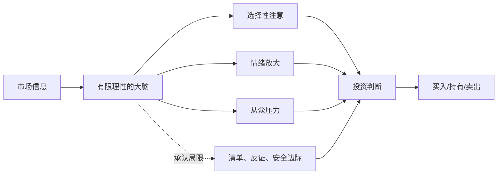

## 查理芒格思维筑基课: 公理1: 人的理性有限 - 投资者先要防自己

### 作者
digoal

### 日期
2026-05-19

### 标签
有限理性 , 投资心理 , 认知偏误 , 确认偏误 , 损失厌恶 , 风险控制 , 安全边际 , 投资纪律 , 芒格思想 , 行为金融

----

## 背景

> 面向对象: 投资者  
> 核心问题: 为什么聪明人也会在市场里做出明显错误的决定？  
> 先说结论: 投资者不是冷冰冰的计算器，而是会被贪婪、恐惧、从众、确认偏误和损失厌恶影响的人。芒格思想的第一块地基，就是把“我可能会错”当成默认设置。

## 一张图先看懂



## 求真讲法

### 它到底说了什么

这条公理说: 投资者的判断能力有天然上限。我们会遗漏信息，会偏爱支持自己仓位的证据，会在上涨中高估自己，在下跌中急于逃跑。

所以，理性不是天赋状态，而是一套防错系统。真正成熟的投资者不是永远冷静的人，而是知道自己何时最容易不冷静的人。

### 它是怎么来的

芒格长期强调误判心理学。投资市场恰好会放大这些心理弱点: 价格每天跳动，别人每天表达观点，盈亏每天刺激自尊。

这条公理不是从芒格体系内部“证明”出来的，而是来自反复观察: 很多永久亏损并非源于信息不足，而是源于人对信息的错误处理。

### 它依赖哪些假设

| 假设 | 在投资中的含义 |
|---|---|
| 人会受情绪影响 | 恐惧和贪婪会改变风险判断 |
| 人会保护自尊 | 买错后更愿意找理由，而不是修正判断 |
| 人会模仿群体 | 热门叙事会降低独立思考强度 |
| 人的注意力有限 | 容易盯住股价，忽视商业质量 |

### 常见误解

| 误解 | 更准确的理解 |
|---|---|
| 承认有限理性就是不自信 | 这是建立可靠判断的起点 |
| 聪明人不受偏误影响 | 聪明人常能编出更漂亮的自欺理由 |
| 多看信息就能消除偏误 | 信息更多时，筛选偏误也可能更强 |

## 求存讲法

### 它有什么用

这条公理让投资者先搭防护栏: 投资前写下买入理由，主动寻找反证，预设卖出条件，不用短期股价证明自己对错。

### 它怎么迁移到投资流程

```text
投资前: 写清楚假设
持有中: 跟踪假设是否变坏
亏损时: 区分价格波动和基本面恶化
盈利时: 防止把运气误认为能力
```

### 它的适用范围和边界

适用于高不确定性、强情绪刺激、多人竞争的投资场景。边界是: 它不能替代商业研究，也不能让一个不懂行业的人突然变懂。

### 正例: 怎么用它提升能力

买入一家公司前，投资者写下三条可能证明自己错了的证据: 毛利率持续下滑、客户留存下降、管理层开始大规模并购。半年后若出现两条，就重新评估，而不是用“长期持有”自我安慰。

### 反例: 前提不成立会怎样

投资者买入热门股后，只看利好研报和上涨K线，忽视现金流恶化。这里失败的不是勤奋，而是“人会选择性接收信息”这个前提被忽视了。

## 思考

1. 你持仓里哪一家公司最容易触发你的确认偏误？
2. 如果你没有买入成本这个锚点，今天还会买它吗？
3. 你最近一次投资错误，是信息不够，还是处理信息的方式错了？

## 最后记住

1. 投资者首先要防自己的大脑。
2. 偏误不会因智商高而消失。
3. 写下反证，比收集更多支持材料更重要。
4. 安全边际是对有限理性的补偿。

## 参考资料

- Charlie Munger, *Poor Charlie's Almanack*.
- Charlie Munger, "The Psychology of Human Misjudgment".
- Benjamin Graham, *The Intelligent Investor*.
- 本文参考本地 `buffett` 技能资料中的思维框架与风险行为笔记。
  
#### [PostgreSQL 解决方案集合](../201706/20170601_02.md "40cff096e9ed7122c512b35d8561d9c8")
  
  
#### [德哥 / digoal's Github - 公益是一辈子的事.](https://github.com/digoal/blog/blob/master/README.md "22709685feb7cab07d30f30387f0a9ae")
  
  
#### [About 德哥](https://github.com/digoal/blog/blob/master/me/readme.md "a37735981e7704886ffd590565582dd0")
  
  

  
