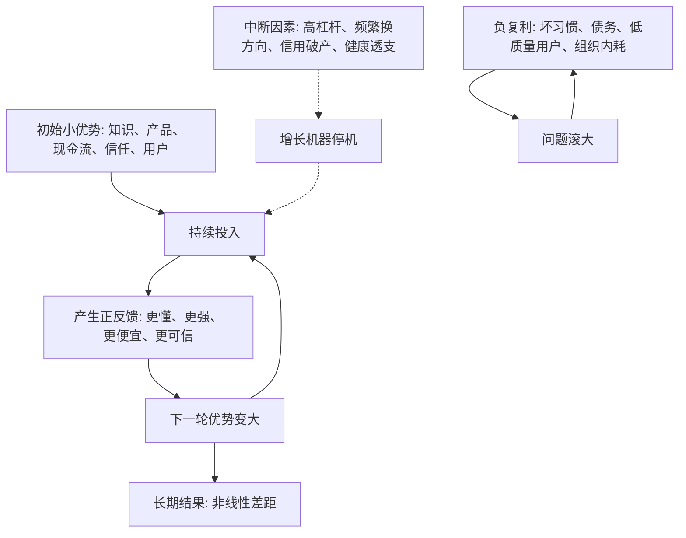

## 查理芒格思维筑基课: 长期结果由复利决定: 别中断你的增长机器

### 作者
digoal

### 日期
2026-05-19

### 标签
复利 , 长期主义 , 增长机器 , 查理芒格 , 投资本金 , 能力积累 , 产品增长 , 创业 , 风险控制 , 负复利

----

## 背景

> 面向对象: 大学生、产品经理、运营经理、有投资需求的人  
> 核心问题: 为什么很多短期看起来差不多的人、公司和投资，长期结果会相差巨大？  
> 先说结论: 长期结果往往不是由某一次爆发决定，而是由小优势持续积累、再反过来增强下一轮优势决定。复利最怕的不是慢，而是被毁灭性错误、频繁切换和负反馈中断。

## 一张图先看懂



## 求真讲法

### 它到底说了什么

“长期结果由复利决定”说的是: 当一个系统的收益能够继续投入，并且下一轮收益建立在上一轮积累之上，结果就会呈现非线性增长。

在金钱里，复利很直观: 本金产生利息，利息再变成本金。在能力里，复利表现为: 基础知识越扎实，学习新知识越快；做过的项目越多，判断问题越准；信用越好，别人越愿意给你机会。在产品里，复利表现为: 用户越多，数据越多，产品越准，口碑越强，获客越便宜。

所以这条底层规律可以写成一句话:

**真正重要的不是一时增长多快，而是你的增长能不能持续、能不能自我增强、会不会被一次错误打断。**

### 它是怎么来的

复利的数学形式很简单:

```text
未来结果 = 初始本金 × (1 + 增长率) ^ 时间
```

这个公式不只是金融算术，它揭示了一个更普遍的结构: 只要“积累”能参与下一轮增长，时间就会放大差异。

假设两个人起点都是 100。一个人每年增长 5%，另一个人每年增长 10%。第一年差距只有 5，但 30 年后:

| 年增长率 | 30 年后的结果 | 直观含义 |
|---|---:|---|
| 5% | 约 432 | 增长了 4.3 倍 |
| 10% | 约 1745 | 增长了 17.4 倍 |

差距不是线性扩大，而是时间把增长率差异不断放大。

但复利还有一个常被忽略的反面: 亏损也会破坏复利。亏 50%，需要涨 100% 才能回本；信用破产一次，重建可能要很多年；健康透支到无法工作，之前的积累也会被迫停机。

### 它依赖哪些假设

| 假设 | 含义 | 如果不成立会怎样 |
|---|---|---|
| 积累能留存 | 上一轮成果不会很快消失 | 学了不用、用户流失、利润不可持续，复利无法发生 |
| 收益能再投入 | 成果可以变成下一轮增长的资源 | 赚到的钱、经验或数据不能再利用，只是一次性收益 |
| 增长率长期为正 | 系统总体在变强 | 坏习惯、债务、亏损业务会形成负复利 |
| 不发生毁灭性中断 | 本金、健康、信用、组织能力不能归零 | 一次爆仓、欺诈或重大事故会打断长期积累 |
| 时间足够长 | 复利需要时间显现 | 太短期的评价会看不出真正差距 |

这些假设说明: 复利不是魔法。不是“坚持就一定成功”，而是要确认你坚持的东西真的在积累，且没有隐藏的中断风险。

### 常见误解

| 误解 | 更准确的说法 |
|---|---|
| 复利就是投资收益率 | 投资只是复利最容易量化的场景，能力、信任、产品、组织也会复利 |
| 只要长期坚持就有复利 | 坚持负反馈系统，只会得到负复利 |
| 增长越快越好 | 过快增长如果靠杠杆、补贴或透支质量，可能提高中断概率 |
| 亏损一点没关系 | 小亏可承受，大亏会严重破坏复利路径 |
| 复利意味着永远不改变方向 | 如果方向没有积累性，及时切换反而是保护复利 |

## 求存讲法

### 它有什么用

这条规律的实际作用，是帮你分清“刺激”和“增长机器”。

刺激通常是短期有效:

```text
熬夜冲刺
重金补贴
追热点交易
夸张营销
高杠杆扩张
```

增长机器则能持续积累:

```text
基础能力
可信品牌
稳定现金流
低成本获客
高留存产品
良好信用
可复用流程
```

短期刺激不一定错，但如果它损害了增长机器，就要警惕。真正重要的问题不是“这次能不能涨”，而是“这次动作会让下一轮更容易，还是更困难”。

### 它怎么迁移到熟悉领域

| 场景 | 会复利的东西 | 容易中断复利的东西 |
|---|---|---|
| 学习 | 基础概念、表达能力、问题拆解能力 | 只刷答案、不复盘、频繁换方向 |
| 产品 | 留存、口碑、用户数据、流程效率 | 误导获客、低质量用户、功能堆砌 |
| 运营 | 用户信任、社群关系、内容资产 | 标题党、过度打扰、短期薅流量 |
| 创业 | 现金流、组织能力、品牌、渠道 | 盲目扩张、高固定成本、融资依赖 |
| 投资 | 本金、认知、纪律、耐心 | 杠杆、满仓单押、追涨杀跌 |

### 它的适用范围和边界

适用范围:

- 长周期目标: 投资、学习、职业发展、创业、品牌建设。
- 可以积累资产的系统: 知识、代码、产品、客户、数据、信用。
- 能形成正反馈的场景: 越做越懂、越做越便宜、越做越可信。

边界也要说清楚:

- 复利不适合解释所有短期波动。一天、一周、一个季度的涨跌常常是噪声。
- 复利要求方向正确。错误方向上的坚持不是复利，是沉没成本扩大。
- 复利要求成果可留存。没有留存、没有复用、没有学习，忙碌不会自动复利。
- 复利要求控制尾部风险。尾部风险是小概率但后果极严重的事件，例如爆仓、违法、信用破产、健康崩溃。

### 正例: 怎么用它提升能力

假设一个大学生想提升未来 10 年的竞争力。他不是只问“哪个技能现在最火”，而是问“哪些能力会让下一项能力更容易获得”。

更像复利的选择包括:

| 能力 | 为什么会复利 | 下一轮增强什么 |
|---|---|---|
| 写作表达 | 能把复杂问题讲清楚 | 面试、汇报、销售、影响力 |
| 数学和统计 | 能判断概率、风险和数据 | 投资、产品实验、商业分析 |
| 编程和自动化 | 能把想法变成工具 | 效率、产品原型、数据处理 |
| 行业研究 | 能看懂商业系统 | 投资判断、职业选择、创业方向 |
| 可信记录 | 别人更愿意合作 | 机会、资源、长期关系 |

他每年都产出作品、复盘项目、积累案例。前两年可能看不出巨大差距，但五年后，他的知识、作品、信用和人脉会互相强化。这就是个人成长里的复利。

### 反例: 前提不成立会怎样

假设一个投资者每年都想抓最快的热点。他不断换行业、换策略、追短期涨幅。牛市时赚得很快，于是加杠杆，觉得自己找到了高增长机器。

问题在于，几个复利前提都不成立:

| 被破坏的前提 | 实际情况 | 后果 |
|---|---|---|
| 积累能留存 | 每次换方向，之前研究很少复用 | 经验难以沉淀 |
| 收益能再投入 | 赚的钱用于更高杠杆，而不是更稳系统 | 风险放大 |
| 增长率长期为正 | 收益来自行情和运气，不来自可重复能力 | 市场变化后失效 |
| 不发生毁灭性中断 | 杠杆导致一次大跌就被迫平仓 | 复利机器停机 |
| 时间足够长 | 只看几周几月表现 | 把短期波动误认为长期能力 |

最后一次极端波动让本金大幅回撤。即使他之前赚过很多，也因为一次中断失去继续复利的资本。失败不是因为“追热点永远不赚钱”，而是这种方法没有保护增长机器。

## 一个保护增长机器的清单

```text
复利检查 12 问

1. 我现在做的事，成果能不能留下来？
2. 这次收益能不能帮助下一次做得更好？
3. 我是在积累能力、资产和信用，还是只是在消耗精力？
4. 这个增长靠内生能力，还是靠外部顺风？
5. 如果外部环境变差，系统还能不能活下去？
6. 我有没有为了更快增长而增加毁灭性风险？
7. 最坏情况下，我会失去本金、健康、信用或核心团队吗？
8. 我是否频繁切换到无法沉淀经验？
9. 我是否把短期刺激误认为长期增长？
10. 这个系统有没有负复利，例如债务、坏口碑、组织内耗？
11. 我能否用 3 年、5 年、10 年视角评价它？
12. 什么证据出现时，我应该停止坚持，保护剩余本金？
```

这份清单的核心不是让人慢，而是让人别为了短期速度毁掉长期发动机。

## 思考

复利最残酷的地方在于，它前期不明显，后期才显著。很多人因为前期看不到巨大变化而放弃，也有人因为短期增长太快而忽略风险。

真正高质量的长期主义，不是盲目坚持，而是守住三个条件:

```text
方向正确 + 持续积累 + 不被毁灭性错误中断
```

可以继续追问:

1. 我现在最重要的增长机器是什么: 能力、产品、现金流、品牌、关系，还是信用？
2. 我每天做的事是在增强它，还是在消耗它？
3. 哪些短期收益看起来很诱人，但会伤害长期复利？
4. 如果我把人生、产品或投资看成 10 年系统，今天的选择还合理吗？
5. 我最大的中断风险是什么: 杠杆、健康、信用、组织内耗，还是频繁换方向？

## 最后记住

1. 复利的本质，是上一轮积累能参与下一轮增长。
2. 长期差距常常来自小优势的持续放大，不是一次爆发。
3. 复利需要方向正确、成果留存、收益再投入和时间足够长。
4. 高杠杆、信用破产、健康透支、频繁切换都会打断增长机器。
5. 投资、创业和个人成长中，先保护本金和能力，再谈长期复利。

## 参考资料

- Albert Einstein attributed quote on compound interest is widely circulated, but attribution is uncertain; this article does not rely on it as evidence.
- Benjamin Graham, "The Intelligent Investor", revised editions.
- Warren E. Buffett, Berkshire Hathaway shareholder letters.
- Charles T. Munger, "Poor Charlie's Almanack", 2005.
- Nassim Nicholas Taleb, "Fooled by Randomness", 2001.
- Nassim Nicholas Taleb, "The Black Swan", 2007.
- James Clear, "Atomic Habits", 2018.
- Peter M. Senge, "The Fifth Discipline", 1990.
  
#### [PostgreSQL 解决方案集合](../201706/20170601_02.md "40cff096e9ed7122c512b35d8561d9c8")
  
  
#### [德哥 / digoal's Github - 公益是一辈子的事.](https://github.com/digoal/blog/blob/master/README.md "22709685feb7cab07d30f30387f0a9ae")
  
  
#### [About 德哥](https://github.com/digoal/blog/blob/master/me/readme.md "a37735981e7704886ffd590565582dd0")
  
  

  
