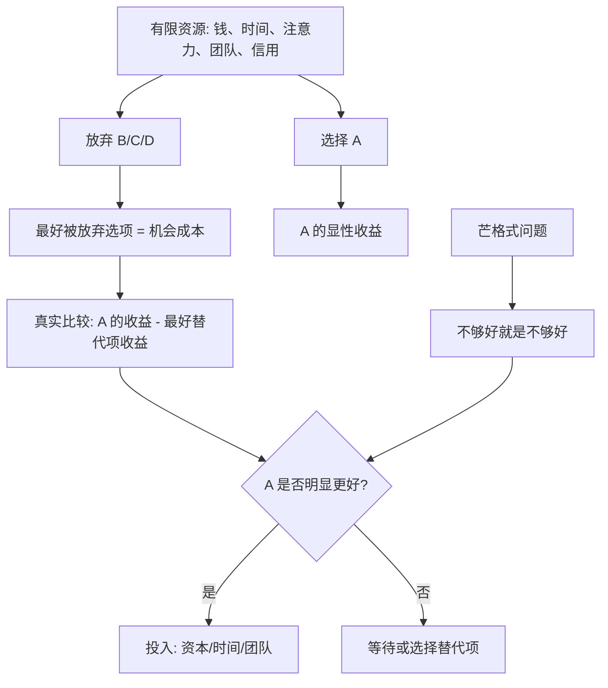

## 查理芒格思维筑基课: 机会成本是真实成本: 每一笔投资都在和最好替代项竞争

### 作者
digoal

### 日期
2026-05-19

### 标签
机会成本 , 替代选择 , 投资决策 , 查理芒格 , 资源稀缺 , 产品排期 , 创业选择 , 资本配置 , 能力圈 , 长期复利

----

## 背景

> 面向对象: 大学生、产品经理、运营经理、有投资需求的人  
> 核心问题: 为什么“这个选择还不错”仍然可能是一个错误选择？  
> 先说结论: 成本不只是你付出去的钱、时间和精力，还包括你因此放弃的最好替代机会。投资、创业和人生决策里，真正的问题不是“它好不好”，而是“它是否比我能选择的最好替代项更值得”。

## 一张图先看懂



## 求真讲法

### 它到底说了什么

“机会成本”是经济学里的基础概念，意思是: 当你选择一个方案时，被你放弃的最好替代方案，就是这个选择的真实成本。

它让我们从一个更严格的角度看选择。普通人常问:

```text
这个项目能赚钱吗？
这家公司便宜吗？
这个岗位不错吗？
这个产品功能有用户要吗？
```

机会成本会追问:

```text
和我能选择的最好替代项相比，它还值得吗？
```

所以这条底层规律可以写成一句话:

**每一次选择都不是孤立评分，而是在和你放弃的最好选择竞争。**

### 它是怎么来的

机会成本来自一个最朴素的事实: 资源有限。

钱有限，所以买了 A 股票，就少了买 B 股票、买指数基金或持有现金的资金。时间有限，所以做一个项目，就少了学习、休息、陪伴、研究另一个项目的时间。团队有限，所以开发一个功能，就少了开发另一个功能的工程资源。注意力有限，所以盯着短期波动，就少了研究长期变量的心力。

经济学把这种“选择带来的放弃”明确命名为机会成本。查理·芒格在投资和生活中反复强调类似思想: 不要因为一个东西“还可以”就接受它，真正的比较对象应该是你能找到的最好机会。

这就是为什么芒格式决策看起来很挑剔。它不是在问“这个选择有没有优点”，而是在问“它是否值得占用我稀缺的资本、时间和注意力”。

### 它依赖哪些假设

| 假设 | 含义 | 如果不成立会怎样 |
|---|---|---|
| 资源是稀缺的 | 钱、时间、团队、精力不能同时投向所有方向 | 如果资源无限，就没有取舍，也就没有机会成本 |
| 选择会排斥其他选择 | 做 A 会减少做 B 的能力 | 如果选择之间完全不冲突，机会成本会降低 |
| 替代项可比较 | 不同选择能在某个目标下比较价值 | 如果目标混乱，就不知道什么是“最好替代项” |
| 未来存在不确定性 | 替代项收益只能估计，不能精确知道 | 需要安全边际和情景分析 |
| 人会低估看不见的成本 | 被放弃的机会没有发票，所以容易被忽视 | 人会把平庸选择误认为便宜 |

这些假设说明，机会成本不是账本上一定能看到的数字，而是一种更完整的比较方式。它要求我们把“没选的最好选项”也放进决策桌面。

### 常见误解

| 误解 | 更准确的说法 |
|---|---|
| 机会成本就是花出去的钱 | 花出去的钱是显性成本，机会成本是被放弃的最好选择 |
| 只要不亏钱就没成本 | 如果占用了资本却输给更好选择，仍然有机会成本 |
| 机会成本要求永远选收益最高 | 还要考虑风险、流动性、能力圈、时间和不可逆后果 |
| 机会成本只适用于投资 | 学习、职业、创业、产品排期、运营活动都适用 |
| 选择多就是好事 | 选择越多，比较成本越高，也越容易被平庸机会占满 |

## 求存讲法

### 它有什么用

机会成本最大的作用，是帮你摆脱“还不错陷阱”。

很多选择不是坏，而是不够好。它们最危险的地方在于: 看起来合理，能带来一点收益，但会长期占用你最稀缺的资源，让你错过更值得的机会。

```text
低质量忙碌占用时间
平庸项目占用团队
普通股票占用资金
无效社交占用注意力
不匹配岗位占用成长窗口
```

芒格式问题不是“这件事有没有收益”，而是:

```text
这件事是否值得我放弃最好替代项？
```

### 它怎么迁移到熟悉领域

| 场景 | 普通问法 | 机会成本问法 |
|---|---|---|
| 学习 | 这门课有用吗？ | 它比我现在最该补的能力更重要吗？ |
| 求职 | 这个岗位待遇不错吗？ | 它占用的几年是否能换来最好的成长路径？ |
| 产品 | 这个功能有人要吗？ | 它是否比最重要的用户痛点更值得排期？ |
| 运营 | 这个活动能带新增吗？ | 它带来的新增是否比维护老用户更有价值？ |
| 创业 | 这个市场够大吗？ | 这个切入点是否比其他切入点更适合我的资源？ |
| 投资 | 这只股票会涨吗？ | 它是否比现金、指数基金和我最懂的公司更值得持有？ |

### 它的适用范围和边界

适用范围:

- 资源明显有限的决策: 钱、时间、团队、注意力、信用。
- 有多个替代方案的选择: 投资标的、职业路径、产品排期、创业方向。
- 长期后果明显的决策: 买公司、选赛道、招关键人、放弃一段时间窗口。

边界也要说清楚:

- 机会成本不是让人永远后悔。选择前用于比较，选择后用于复盘，不应用来反复折磨自己。
- 机会成本不是事后诸葛亮。不能用事后涨得最好的资产，倒推当初一定错了。
- 机会成本需要目标函数。你先要知道自己更重视安全、成长、现金流、学习还是自由。
- 机会成本要结合能力圈。一个理论上更高收益、但你完全看不懂的机会，不一定是你的最好替代项。

### 正例: 怎么用它提升能力

假设你是产品经理，团队只有 4 周开发时间。销售团队要求做一个大客户定制功能，理由是“客户愿意付费”。与此同时，数据分析显示，老用户流失的主要原因是核心流程太复杂。

如果只看显性收益，大客户定制功能很诱人。但机会成本视角会问:

| 选择 | 显性收益 | 被放弃的最好替代项 | 真实问题 |
|---|---|---|---|
| 做大客户定制 | 可能拿下一笔合同 | 优化核心流程，提升所有用户留存 | 一次性收入是否值得牺牲长期留存？ |
| 优化核心流程 | 短期收入不一定立刻增加 | 大客户合同可能推迟或丢失 | 长期留存提升是否更接近产品战略？ |

如果公司当前最大瓶颈是留存，而不是获客，那么优化核心流程可能是更好的选择。不是因为大客户不重要，而是因为团队资源有限，每个排期都在和最重要的问题竞争。

### 反例: 前提不成立会怎样

假设一个投资者买入一只“看起来很便宜”的股票。它市盈率低、分红率还可以，投资者觉得“反正不贵，放着也没事”。

但他忽略了机会成本:

| 被忽略的前提 | 实际情况 | 后果 |
|---|---|---|
| 资源稀缺 | 资金被这只股票占用 | 无法买入更高质量、更确定的公司 |
| 替代项可比较 | 同期有更强现金流、更好护城河的公司 | 低估了“平庸持有”的成本 |
| 未来不确定 | 低估值来自利润下滑和行业衰退 | 便宜可能是价值陷阱 |
| 能力圈有限 | 投资者只看估值，不懂行业结构 | 误把低价格当低风险 |
| 看不见的成本容易被忽视 | 账面没有亏很多 | 多年跑输更好替代项 |

几年后，这只股票没大跌，但长期横盘，分红也无法弥补增长不足。投资者表面上“没亏大钱”，真实成本却是错过了更好的复利资产。

## 一个机会成本决策清单

```text
做选择前 12 问

1. 我现在真正稀缺的资源是什么: 钱、时间、团队、注意力，还是信用？
2. 这个选择会占用哪些资源？
3. 被我放弃的最好替代项是什么？
4. 我是否只看到了显性成本，没有看到放弃成本？
5. 这个选择和最好替代项相比，优势是否足够明显？
6. 我是在比较收益，还是同时比较风险和可逆性？
7. 这个机会是否在我的能力圈内？
8. 它会增强我的长期复利，还是只是短期不错？
9. 如果我什么都不做，持有现金、保留时间或等待机会，是否更好？
10. 我是否因为沉没成本而继续占用资源？
11. 如果最好的替代项出现，我是否还有资源抓住？
12. 什么证据出现时，我应该切换到更好的替代项？
```

这份清单的核心是: 不让“还可以”的选择长期占用最宝贵的位置。

## 思考

机会成本让人变得挑剔，但这种挑剔不是傲慢，而是对稀缺资源负责。

很多人的人生、公司和投资组合，不是被明显的坏选择毁掉，而是被大量“还不错但不够好”的选择占满。时间被占满，现金被占满，团队排期被占满，注意力被占满。最后真正的大机会出现时，已经没有资源、耐心和判断力。

可以继续追问:

1. 如果我把“最好替代项”写出来，当前选择还显得好吗？
2. 我现在持有的资产、项目和关系里，哪些只是因为“还可以”而没有被替换？
3. 我的产品团队是否把排期给了最重要的问题，还是给了声音最大的人？
4. 我的投资组合里，哪些标的占用了本该属于高质量公司的资金？
5. 如果现金也是一种选择，等待是否有时比勉强行动更有价值？

## 最后记住

1. 机会成本是被你放弃的最好替代项，不只是账面花出去的钱。
2. 每一笔投资、每一个项目、每一次排期，都在和最好替代项竞争。
3. “还不错”不等于“值得做”，因为资源有限。
4. 机会成本要结合目标、风险、能力圈和长期复利一起看。
5. 芒格式决策的严格标准是: 不够好就是不够好，把资源留给真正值得的机会。

## 参考资料

- Friedrich von Wieser, "Natural Value", 1889.
- Lionel Robbins, "An Essay on the Nature and Significance of Economic Science", 1932.
- Paul A. Samuelson and William D. Nordhaus, "Economics", multiple editions.
- Benjamin Graham, "The Intelligent Investor", revised editions.
- Warren E. Buffett, Berkshire Hathaway shareholder letters.
- Charles T. Munger, "Poor Charlie's Almanack", 2005.
- Richard P. Rumelt, "Good Strategy Bad Strategy", 2011.
  
#### [PostgreSQL 解决方案集合](../201706/20170601_02.md "40cff096e9ed7122c512b35d8561d9c8")
  
  
#### [德哥 / digoal's Github - 公益是一辈子的事.](https://github.com/digoal/blog/blob/master/README.md "22709685feb7cab07d30f30387f0a9ae")
  
  
#### [About 德哥](https://github.com/digoal/blog/blob/master/me/readme.md "a37735981e7704886ffd590565582dd0")
  
  

  
