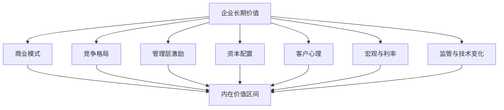

## 查理芒格思维筑基课: 公理2: 世界是多因果系统 - 别用单一模型解释公司

### 作者
digoal

### 日期
2026-05-19

### 标签
多因果系统 , 多元思维模型 , 企业分析 , 商业模式 , 竞争格局 , 投资框架 , 跨学科思维 , 财务分析 , 估值判断 , 芒格思想

----

## 背景

> 面向对象: 投资者  
> 核心问题: 为什么只看财务、只看宏观或只看技术，都会误判企业？  
> 先说结论: 企业价值由产品、竞争、资本、管理、心理、制度和周期共同决定。芒格要求投资者建立多元思维模型，是因为真实世界从来不是单一变量方程。

## 一张图先看懂

## 求真讲法

### 它到底说了什么

这条公理说: 投资对象不是一张财务报表，而是一个嵌在社会、技术、竞争和人性里的系统。单一指标能提示问题，但不能独立完成判断。

只看低市盈率，可能买到价值陷阱；只看高速增长，可能忽视资本消耗；只看伟大产品，可能忽视估值过高。

### 它是怎么来的

芒格的“多元思维模型格栅”来自一个朴素观察: 重大错误往往不是因为某个模型错，而是因为投资者只用了一个模型。

商业世界里，一个变量改善可能被另一个变量抵消。例如收入增长很好，但如果增长靠补贴、应收账款和高杠杆维持，股东未必赚钱。

### 它依赖哪些假设

| 假设 | 投资含义 |
|---|---|
| 企业是开放系统 | 外部竞争、监管、利率会改变企业价值 |
| 因果链会相互作用 | 增长、利润率、资本开支不能孤立看 |
| 单一模型有盲区 | 财务模型看不到文化和激励，宏观看不到公司差异 |
| 多模型能互相纠偏 | 心理学、经济学、会计、工程思维可以互相补漏洞 |

### 常见误解

| 误解 | 更准确的理解 |
|---|---|
| 多元模型就是知识越多越好 | 关键是能把模型用于真实判断 |
| 财务数据客观，所以只看财务就够 | 财务是结果，商业机制才是原因 |
| 宏观决定一切 | 宏观影响折现率和需求，但不能替代公司分析 |

## 求存讲法

### 它有什么用

它让投资者不被一个漂亮故事带走。看到一家好公司时，同时问: 它的护城河在哪里？激励是否正确？现金流能否支撑增长？估值是否透支未来？

### 它怎么迁移到投资流程

| 模型 | 投资检查问题 |
|---|---|
| 经济学 | 这个利润会不会被竞争吃掉？ |
| 心理学 | 客户为什么愿意持续购买？市场是否过度狂热？ |
| 会计 | 利润是否转化为现金？ |
| 工程学 | 系统最脆弱的故障点在哪里？ |
| 数学 | 赔率、复利、回撤和期望值是否匹配？ |

### 它的适用范围和边界

适合研究复杂企业、行业周期和长期投资。边界是: 多模型不是无限复杂化，最终仍要压缩成少数关键变量。

### 正例: 怎么用它提升能力

研究一家消费品牌时，投资者不只看收入增长，还看品牌定价权、渠道议价能力、复购率、广告投入效率、库存和管理层资本配置。多个模型指向同一结论时，判断更可靠。

### 反例: 前提不成立会怎样

只因某公司市盈率低就买入，但行业长期萎缩、产品无差异、资本开支沉重。失败原因是把“估值模型”当成全部现实，忽略了多因果系统。

## 思考

1. 你最常用的投资模型是什么？它看不见什么？
2. 你是否曾经因为一个指标漂亮而忽略系统性缺陷？
3. 一个投资结论至少应被哪三类模型共同支持？

## 最后记住

1. 企业是系统，不是单一指标。
2. 多模型的价值在于互相纠偏。
3. 复杂研究最后仍要回到关键变量。
4. 只懂一个模型的人，最容易被那个模型困住。

## 参考资料

- Charlie Munger, *Poor Charlie's Almanack*.
- Warren Buffett, Berkshire Hathaway Shareholder Letters.
- 本文参考本地 `buffett` 技能资料中的多元模型、护城河和估值笔记。
  
#### [PostgreSQL 解决方案集合](../201706/20170601_02.md "40cff096e9ed7122c512b35d8561d9c8")
  
  
#### [德哥 / digoal's Github - 公益是一辈子的事.](https://github.com/digoal/blog/blob/master/README.md "22709685feb7cab07d30f30387f0a9ae")
  
  
#### [About 德哥](https://github.com/digoal/blog/blob/master/me/readme.md "a37735981e7704886ffd590565582dd0")
  
  

  
