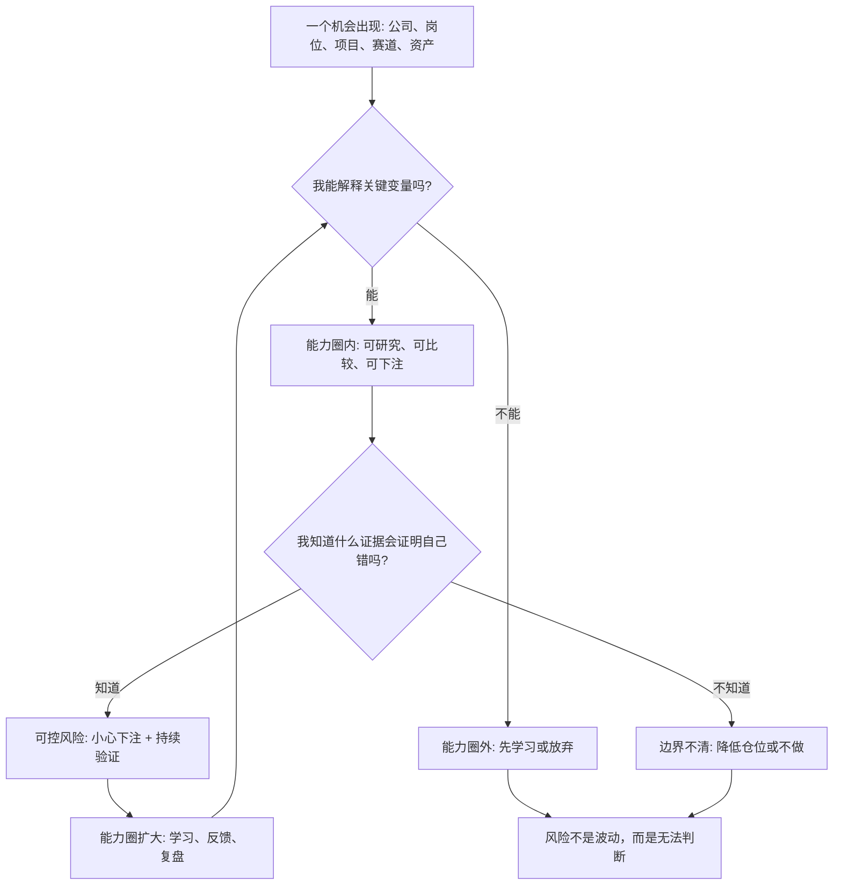

## 查理芒格思维筑基课: 能力圈边界比大小更重要: 不懂就是风险

### 作者
digoal

### 日期
2026-05-19

### 标签
能力圈 , 边界意识 , 投资风险 , 查理芒格 , 不懂不投 , 商业判断 , 反证 , 投资纪律 , 行业研究 , 风险控制

----

## 背景

> 面向对象: 大学生、产品经理、运营经理、有投资需求的人  
> 核心问题: 为什么有些人知道很多概念，却仍然在投资、创业和职业选择中严重误判？  
> 先说结论: 能力圈的关键不是你知道多少，而是你是否知道自己在哪里能判断、在哪里不能判断。不懂本身就是风险，最危险的是不懂却以为自己懂。

## 一张图先看懂



## 求真讲法

### 它到底说了什么

“能力圈”是查理·芒格和沃伦·巴菲特投资思想中非常核心的概念。它的意思不是“只做自己已经会的事”，而是说: 在下注之前，你要知道自己是否真的具备判断能力。

能力圈不是知识清单，而是一种可验证的判断范围。一个人真正懂一个领域，至少要能说清楚:

```text
这个系统怎样运转？
关键变量是什么？
什么因素会让它变好？
什么因素会让它变坏？
别人为什么难以复制？
什么证据会证明我错了？
```

所以这条底层规律可以写成一句话:

**风险不只来自价格波动，也来自你无法判断自己面对的是什么。**

### 它是怎么来的

这个观点来自一个朴素事实: 世界复杂，而人的理解能力有限。

投资者经常会看到很多机会: 新技术、新消费、新能源、新药、AI、海外市场、周期资源、加密资产、并购重组。每个机会都有故事，每个故事都能找到支持者。但看见机会不等于理解机会，听懂故事不等于能判断价值。

芒格强调能力圈，是因为长期投资不只比谁聪明，也比谁少在看不懂的地方犯大错。一个人可以不懂很多东西，这不是问题；真正的问题是他不知道自己不懂。

能力圈有三层:

| 层次 | 表现 | 风险 |
|---|---|---|
| 圈内 | 能解释机制、变量、竞争和反证 | 可研究、可比较、可下注 |
| 边界 | 懂一部分，但关键变量不稳 | 容易过度自信，需要小仓位或继续学习 |
| 圈外 | 只能复述故事，不能判断真假 | 不懂就是风险，最好不下注 |

### 它依赖哪些假设

| 假设 | 含义 | 如果不成立会怎样 |
|---|---|---|
| 世界有可理解的结构 | 公司、行业和项目不是完全随机 | 如果完全随机，能力圈也无法提供优势 |
| 不同人理解范围不同 | 经历、知识、反馈和训练不同 | 不能照搬别人的机会 |
| 理解可以被检验 | 真懂应能解释、预测、反证和复盘 | 如果无法检验，就容易自我感觉良好 |
| 能力扩展需要时间 | 不能靠几篇文章临时获得深判断 | 热点中最容易出现假懂 |
| 不懂会放大风险 | 无法估计概率、损失和关键变量 | 仓位、估值和退出条件都会失控 |

这些假设说明，能力圈不是天生固定的。它可以扩大，但扩大需要学习、实践、反馈和诚实复盘，不能靠情绪和叙事跳过去。

### 常见误解

| 误解 | 更准确的说法 |
|---|---|
| 能力圈就是保守不创新 | 能力圈是先知道边界，再决定学习、试错或下注 |
| 我听懂商业模式就算懂 | 听懂故事只是入口，懂要能判断变量和反证 |
| 大佬买了我也能买 | 大佬的能力圈、信息、资金期限和风险承受力可能与你不同 |
| 热门行业必须参与 | 圈外机会再热，也可能只是别人的机会 |
| 不懂可以靠分散解决 | 分散能降低单点风险，但不能把无知变成理解 |

## 求存讲法

### 它有什么用

能力圈最大的用处，是防止你把“信息接触”误认为“判断能力”。

今天的信息很多，短视频、研报、社群、播客、财报解读、KOL观点都能让人快速接触一个行业。但接触不等于理解。你可以一天看完十篇 AI 医疗文章，却仍然无法判断一家 AI 医疗公司是否有真实壁垒、是否能商业化、是否会被监管或医院采购流程卡住。

能力圈要求你先做一个诚实分类:

```text
我懂，可以判断。
我半懂，只能小心研究。
我不懂，先不下注。
```

这不是退缩，而是把风险放在显微镜下。

### 它怎么迁移到熟悉领域

| 场景 | 能力圈问题 | 具体含义 |
|---|---|---|
| 学习 | 我是真的会，还是只是看懂？ | 能不能不看资料讲出来、做出来、迁移到新题？ |
| 产品 | 我懂用户，还是只懂自己的偏好？ | 是否有真实访谈、留存、付费和行为数据支持？ |
| 运营 | 我懂增长，还是只懂活动热闹？ | 是否能区分高质量用户和短期流量？ |
| 创业 | 我懂行业，还是只懂市场空间？ | 是否理解供应链、渠道、现金流、监管和竞争？ |
| 投资 | 我懂公司，还是只懂股价和故事？ | 是否能判断商业模式、护城河、财务质量和估值？ |

### 它的适用范围和边界

适用范围:

- 高不确定性、高损失后果的决策。
- 投资、创业、职业选择、重大合作、关键产品方向。
- 需要判断概率、质量、持续性和反证条件的场景。

边界也要说清楚:

- 能力圈不是不学习。相反，它要求你明确从哪里开始学习。
- 能力圈不是永远小仓位。圈内高质量机会出现时，才有资格重仓。
- 能力圈不是只看熟悉行业。熟悉不等于理解，陌生也可以通过长期学习变成熟悉。
- 能力圈不能保证正确。它只是让你有能力发现错误、控制损失和持续修正。

### 正例: 怎么用它提升能力

假设你想投资一家软件公司。你过去做过 SaaS 产品，对订阅模式、客户成功、留存、销售周期比较熟悉。

你可以这样判断是否在能力圈内:

| 问题 | 能回答说明什么 |
|---|---|
| 客户为什么付费？ | 理解真实需求 |
| 替代方案是什么？ | 理解竞争格局 |
| 留存率、续费率、净收入留存意味着什么？ | 理解增长质量 |
| 获客成本多久回收？ | 理解商业模式 |
| 哪些功能只是表面好看，哪些嵌入关键流程？ | 理解产品壁垒 |
| 什么证据说明公司变差？ | 有反证条件 |

如果这些问题你能回答，并且能用财报、客户案例、产品试用和竞品比较来验证，那么这家公司可能在你的能力圈内。你仍然可能错，但你至少知道该看什么、错在哪里、何时修正。

### 反例: 前提不成立会怎样

假设一名投资者长期研究消费股，突然看到某个创新药公司股价大涨。他读了几篇文章，知道药物靶点、临床进展和市场空间，于是认为自己已经懂了。

问题在于，他破坏了能力圈的几个前提:

| 被破坏的前提 | 实际情况 | 后果 |
|---|---|---|
| 理解可以被检验 | 他只能复述研报，不能判断临床数据质量 | 把专业术语误认为理解 |
| 关键变量可识别 | 不懂适应症、终点指标、竞品管线和审批风险 | 不知道真正风险在哪里 |
| 能力扩展需要时间 | 几天阅读无法替代长期行业训练 | 过度自信 |
| 不懂会放大风险 | 无法估计失败概率和估值区间 | 仓位过大 |
| 反证条件清晰 | 不知道什么结果意味着逻辑失效 | 下跌后只能硬扛 |

后来临床结果不及预期，股价大跌。他的问题不是“医药股不能投”，而是把圈外信息接触误认为圈内判断能力。

## 一个能力圈检查清单

```text
下注前 12 问

1. 我能用自己的话讲清楚这个系统怎样赚钱吗？
2. 我知道最关键的三个变量是什么吗？
3. 我知道这些变量从哪里验证吗？
4. 我能说出主要竞争者和替代方案吗？
5. 我知道它为什么可能变坏吗？
6. 我知道什么证据会证明我错了吗？
7. 我是在理解一手事实，还是在复述别人的结论？
8. 我是否因为价格上涨、别人赚钱或热点叙事而假装懂？
9. 我过去在这个领域有没有可验证的判断记录？
10. 如果判断错了，最大损失是否可承受？
11. 这笔仓位是否超过了我的理解程度？
12. 如果我承认“不懂”，最好的替代选择是什么？
```

这份清单不是为了让人不行动，而是为了让行动和理解程度匹配。

## 思考

能力圈真正难的地方，不是扩大它，而是诚实地画出边界。

人很容易承认“我不懂火箭科学”，却很难承认“我不懂这只正在上涨的股票”。因为后者不仅是知识问题，还牵涉贪婪、面子、从众和错失恐惧。

可以继续追问:

1. 我现在最可靠的能力圈在哪里？它来自学习、工作经验、长期观察，还是一次好运？
2. 哪些领域我只是熟悉名词，却不能判断关键变量？
3. 我有没有把“别人讲得有道理”误认为“我已经理解”？
4. 如果我必须写出反方观点，我还能维持原判断吗？
5. 我的仓位、时间投入和决策权，是否与我的理解程度匹配？

## 最后记住

1. 能力圈的关键不是大小，而是边界是否清楚。
2. 不懂不是羞耻，不懂还下注才是风险。
3. 真懂要能解释机制、识别变量、提出反证、接受复盘。
4. 能力圈可以扩大，但需要时间、事实、反馈和诚实记录。
5. 投资、创业和职业选择中，先判断自己能否判断，再决定是否行动。

## 参考资料

- Warren E. Buffett, Berkshire Hathaway shareholder letters.
- Charles T. Munger, "Poor Charlie's Almanack", 2005.
- Benjamin Graham, "The Intelligent Investor", revised editions.
- Daniel Kahneman, "Thinking, Fast and Slow", 2011.
- Philip E. Tetlock and Dan Gardner, "Superforecasting", 2015.
- Howard Marks, "The Most Important Thing", 2011.
- Richard P. Rumelt, "Good Strategy Bad Strategy", 2011.
  
#### [PostgreSQL 解决方案集合](../201706/20170601_02.md "40cff096e9ed7122c512b35d8561d9c8")
  
  
#### [德哥 / digoal's Github - 公益是一辈子的事.](https://github.com/digoal/blog/blob/master/README.md "22709685feb7cab07d30f30387f0a9ae")
  
  
#### [About 德哥](https://github.com/digoal/blog/blob/master/me/readme.md "a37735981e7704886ffd590565582dd0")
  
  

  
