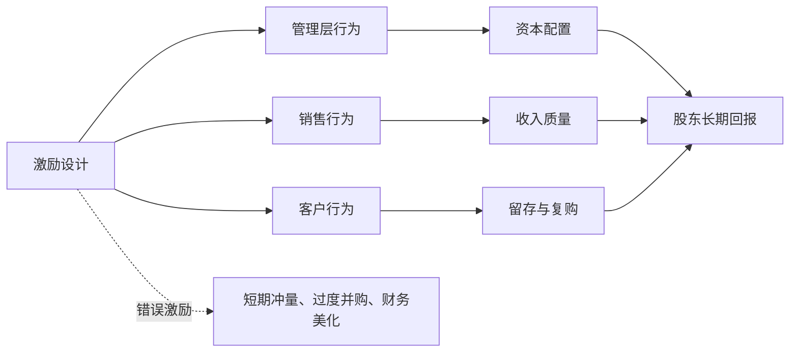

## 查理芒格思维筑基课: 公理3: 激励塑造行为 - 看制度比听故事重要

### 作者
digoal

### 日期
2026-05-19

### 标签
激励机制 , 管理层评估 , 公司治理 , 资本配置 , 股东价值 , 代理问题 , 薪酬考核 , 利润质量 , 投资尽调 , 芒格思想

----

## 背景

> 面向对象: 投资者  
> 核心问题: 为什么管理层说得很好，结果却经常伤害股东？  
> 先说结论: 人会朝奖励方向行动。投资者评估公司时，不能只听战略口号，而要看管理层、员工、渠道和客户分别被什么激励。

## 一张图先看懂



## 求真讲法

### 它到底说了什么

这条公理说: 行为不是只由品格和口号决定，也由奖励结构决定。奖励规模，就会追规模；奖励短期利润，就可能牺牲长期质量；奖励成交，就可能牺牲客户适配。

芒格式投资者要问: 谁拿好处？谁承担后果？奖金和股东长期价值是否一致？

### 它是怎么来的

芒格把激励称为强大的心理力量。商业史里，很多错误不是因为人不知道正确做法，而是因为错误做法带来即时奖励。

这条公理的选择理由很简单: 如果不理解激励，就无法解释为什么聪明、体面的人也会持续做出损害长期价值的决定。

### 它依赖哪些假设

| 假设 | 投资含义 |
|---|---|
| 人会响应奖励 | 薪酬、晋升、股权、声誉都会改变行为 |
| 短期激励更容易被感知 | 季度目标可能压倒长期护城河 |
| 成本可能外部化 | 管理层收益确定，股东承担尾部风险 |
| 制度会筛选人 | 坏激励会吸引适应坏激励的人 |

### 常见误解

| 误解 | 更准确的理解 |
|---|---|
| 好人不会被激励带偏 | 好人也会逐渐适应错误制度 |
| 股权激励一定对齐股东 | 如果考核价格而非内在价值，仍可能鼓励短期行为 |
| 管理层承诺最重要 | 承诺要放在激励结构里检验 |

## 求存讲法

### 它有什么用

它帮助投资者识别管理质量和利润质量。很多财务数字看似漂亮，其实来自错误激励: 压货、放松授信、推迟费用、用并购制造增长。

### 它怎么迁移到投资流程

```text
先看薪酬指标 -> 再看行为 -> 再看财务结果
如果三者不一致 -> 优先相信行为和现金流
```

| 检查对象 | 问题 |
|---|---|
| CEO | 薪酬与ROIC、现金流、长期股东回报是否相关？ |
| 销售 | 是否为了成交牺牲回款质量？ |
| 渠道 | 是否被鼓励囤货而非真实销售？ |
| 董事会 | 是否真正约束管理层资本配置？ |

### 它的适用范围和边界

适用于管理层评估、金融机构、平台企业、销售驱动型公司。边界是: 激励解释行为倾向，不等于否定人的品格，也不能替代事实核验。

### 正例: 怎么用它提升能力

一家公司的管理层薪酬长期绑定每股内在价值增长、ROIC和自由现金流，而不是单纯收入规模。公司在估值过高时停止回购，在价格低估时回购。激励与行为一致，可信度上升。

### 反例: 前提不成立会怎样

一家企业把销售奖金完全绑定当季订单额，销售团队大量给客户放宽付款条件。收入增长很快，但应收账款激增，坏账随后暴露。失败原因是投资者听了增长故事，没有看激励。

## 思考

1. 你持有公司的管理层因为什么获得高薪？
2. 公司的增长是否让管理层受益，却让股东承担风险？
3. 哪些财务指标最容易被薪酬制度扭曲？

## 最后记住

1. 激励比口号更接近真实动机。
2. 错误激励会制造错误行为。
3. 股权激励不自动等于股东友好。
4. 投资者要把薪酬、行为和现金流放在一起看。

## 参考资料

- Charlie Munger, *Poor Charlie's Almanack*.
- Warren Buffett, Berkshire Hathaway Shareholder Letters.
- 本文参考本地 `buffett` 技能资料中的管理治理与资本配置笔记。
  
#### [PostgreSQL 解决方案集合](../201706/20170601_02.md "40cff096e9ed7122c512b35d8561d9c8")
  
  
#### [德哥 / digoal's Github - 公益是一辈子的事.](https://github.com/digoal/blog/blob/master/README.md "22709685feb7cab07d30f30387f0a9ae")
  
  
#### [About 德哥](https://github.com/digoal/blog/blob/master/me/readme.md "a37735981e7704886ffd590565582dd0")
  
  

  
