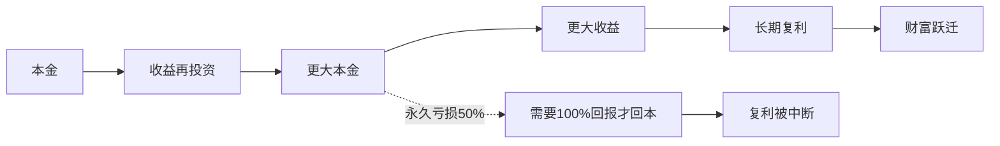

## 查理芒格思维筑基课: 公理4: 长期结果由复利决定 - 别中断你的增长机器

### 作者
digoal

### 日期
2026-05-19

### 标签
复利 , 长期主义 , 永久性损失 , 高ROIC , 再投资 , 护城河 , 杠杆风险 , 投资回报 , 资本配置 , 芒格思想

----

## 背景

> 面向对象: 投资者  
> 核心问题: 为什么长期投资最怕的不是波动，而是永久性损失？  
> 先说结论: 复利会把小优势放大成巨大结果，也会把大错误变成难以恢复的伤口。投资者的核心任务，是找到能长期复利的资产，并避免会中断复利的灾难。

## 一张图先看懂

## 求真讲法

### 它到底说了什么

这条公理说: 长期财富不是线性增长，而是复合增长。年化收益率看似只差几个百分点，几十年后结果可能相差数倍甚至数十倍。

但复利的前提是不断裂。一次不可恢复的亏损、一次过度杠杆、一次管理层诚信问题，都可能让长期曲线归零。

### 它是怎么来的

芒格和巴菲特长期强调复利、耐心和避免大错。伯克希尔的历史说明，真正可怕的力量不是短期暴涨，而是高质量资本在长时间内持续再投资。

这条公理不是“证明”出来的，而是数学机制加商业经验: 只要收益能再投资，时间会放大差异；只要遭遇永久损失，时间也救不了错误。

### 它依赖哪些假设

| 假设 | 投资含义 |
|---|---|
| 收益可以再投资 | 企业能把留存收益投向高回报项目 |
| 资产能长期存续 | 护城河和管理层不被破坏 |
| 投资者能承受波动 | 不被短期价格迫使卖出 |
| 不使用致命杠杆 | 不在低谷被强制出局 |

### 常见误解

| 误解 | 更准确的理解 |
|---|---|
| 长期持有就能复利 | 只有好资产和好价格才配长期 |
| 高增长一定复利强 | 如果增长消耗大量资本，股东未必受益 |
| 波动会破坏复利 | 永久损失和强制卖出才真正破坏复利 |

## 求存讲法

### 它有什么用

它让投资者把注意力从“下个月涨不涨”转到“这台机器能不能十年后更强”。复利思维会自然排斥高杠杆、低质量、频繁交易和追逐热点。

### 它怎么迁移到投资流程

| 问题 | 复利视角 |
|---|---|
| 是否买入 | 企业能否长期以高ROIC再投资？ |
| 是否持有 | 护城河是否仍在扩大或稳定？ |
| 是否卖出 | 是否出现永久性损伤？ |
| 是否加杠杆 | 最坏情形会不会中断复利？ |

### 它的适用范围和边界

适用于长期权益投资、企业经营和能力积累。边界是: 复利不能拯救坏生意，也不能抵消过高买入价格。

### 正例: 怎么用它提升能力

投资者买入一家品牌力强、资本开支低、能持续提价的公司。公司把自由现金流用于高回报再投资和低估时回购。短期股价波动不影响复利机器，长期股东受益。

### 反例: 前提不成立会怎样

投资者高杠杆买入周期股，前几年收益很好，随后行业下行触发强制平仓。失败点是“不能中断复利”的前提被杠杆破坏。

## 思考

1. 你的投资组合中，哪些资产真正能再投资？
2. 哪些风险一旦发生，会让你再也无法参与长期复利？
3. 你是在追求高年化，还是在保护可持续年化？

## 最后记住

1. 复利需要时间、质量和不中断。
2. 大错会吞掉很多小聪明。
3. 长期主义不是不卖，而是不破坏复利条件。
4. 好企业、高再投资率、合理价格，才是复利土壤。

## 参考资料

- Warren Buffett, Berkshire Hathaway Shareholder Letters.
- Charlie Munger, *Poor Charlie's Almanack*.
- 本文参考本地 `buffett` 技能资料中的复利、风险行为和资本配置笔记。
  
#### [PostgreSQL 解决方案集合](../201706/20170601_02.md "40cff096e9ed7122c512b35d8561d9c8")
  
  
#### [德哥 / digoal's Github - 公益是一辈子的事.](https://github.com/digoal/blog/blob/master/README.md "22709685feb7cab07d30f30387f0a9ae")
  
  
#### [About 德哥](https://github.com/digoal/blog/blob/master/me/readme.md "a37735981e7704886ffd590565582dd0")
  
  

  
