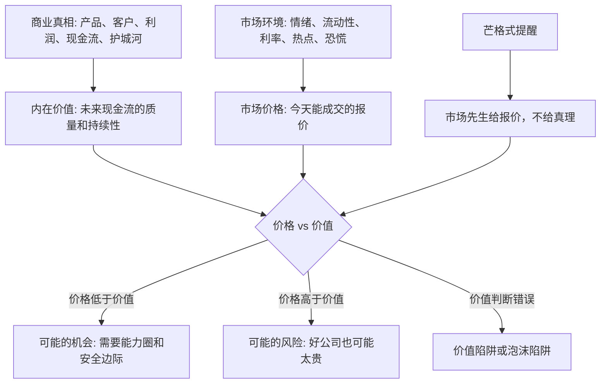

## 查理芒格思维筑基课: 价格不等于价值: 市场报价不是商业真相

### 作者
digoal

### 日期
2026-05-19

### 标签
价格与价值 , 市场先生 , 价值投资 , 查理芒格 , 商业真相 , 估值 , 安全边际 , 现金流 , 市场情绪 , 投资判断

----

## 背景

> 面向对象: 大学生、产品经理、运营经理、有投资需求的人  
> 核心问题: 为什么股价涨了不一定说明公司变好，股价跌了也不一定说明公司变差？  
> 先说结论: 价格是市场此刻愿意成交的报价，价值是资产未来能创造现金流和效用的能力。市场报价会受情绪、流动性、叙事和周期影响，不能直接等同于商业真相。

## 一张图先看懂



## 求真讲法

### 它到底说了什么

“价格不等于价值”说的是: 一个东西今天的成交价格，不一定等于它真实能创造的长期价值。

价格是别人愿意用多少钱买卖。它会每天变化，甚至每分钟变化。价值则更慢一些，来自公司能不能持续为客户创造价值、能不能把价值转成现金流、能不能抵抗竞争、能不能长期留住利润。

所以这条底层规律可以写成一句话:

**市场价格是投票结果，商业价值是称重结果；短期报价会摆动，长期价值要靠事实和现金流验证。**

### 它是怎么来的

这个观点是价值投资的核心。格雷厄姆用“市场先生”的比喻说明市场会每天给你报价，但你不必每天接受他的情绪。巴菲特和芒格进一步强调，投资不是买一串跳动的代码，而是买一部分企业所有权。

一家公司今天股价上涨，可能有很多原因:

```text
业绩真的变好
利率下降
资金流入
市场偏好改变
热点叙事升温
短期筹码供需变化
投资者过度乐观
```

股价下跌也可能有很多原因:

```text
基本面变差
市场整体恐慌
短期利润低于预期
流动性收紧
行业被暂时厌恶
大股东减持
投资者过度悲观
```

同一个价格变化，背后的原因完全不同。只盯价格，就像只看体温不看病因: 它是信号，但不是完整诊断。

### 它依赖哪些假设

| 假设 | 含义 | 如果不成立会怎样 |
|---|---|---|
| 资产有可分析的经济价值 | 公司未来现金流、资产质量和竞争优势可以被估计 | 如果完全无法估计，价值判断就没有基础 |
| 市场短期会受情绪影响 | 贪婪、恐惧、从众和流动性会推高或压低价格 | 如果市场永远完全有效，就很难有价格与价值偏离 |
| 价格和价值最终会相互靠近 | 长期现金流会逐渐约束价格 | 如果永远不靠近，低估也不一定能兑现 |
| 投资者能力不同 | 有人能更好理解商业，有人只看报价 | 能力圈决定是否能利用偏离 |
| 估值存在误差 | 价值不是精确数字，而是区间 | 需要安全边际防止自己算错 |

这些假设说明，价格不等于价值不是让人无视市场，而是要求人把报价和商业事实分开看。

### 常见误解

| 误解 | 更准确的说法 |
|---|---|
| 股价涨了，公司一定更好 | 可能是价值提升，也可能是情绪和流动性推高估值 |
| 股价跌了，公司一定更差 | 可能是基本面变差，也可能是市场恐慌带来误杀 |
| 低价就是便宜 | 便宜要看价格相对价值，不是看绝对价格低 |
| 好公司随便买都行 | 好公司如果价格过高，也可能带来差回报 |
| 价值投资就是不看价格 | 价值投资更重视价格，只是不把价格当真相 |

## 求存讲法

### 它有什么用

这条规律最大的用处，是让你不被报价牵着鼻子走。

很多投资者的判断顺序是:

```text
价格涨了 -> 一定有利好 -> 我要买
价格跌了 -> 一定有问题 -> 我要卖
```

更稳的判断顺序应该是:

```text
价格变化 -> 追问原因 -> 检查商业事实 -> 比较价格和价值 -> 决定行动
```

市场价格不是没用。它很有用，因为它告诉你别人愿意用什么价格交易。但价格只是输入，不是结论。真正的结论来自“价格和价值的关系”。

### 它怎么迁移到熟悉领域

| 场景 | 表面价格或热度 | 更接近价值的问题 |
|---|---|---|
| 学习 | 课程很贵、很多人买 | 它是否真的提升我的能力？ |
| 求职 | 薪资很高 | 岗位是否积累能力、信用和长期选择权？ |
| 产品 | 功能点击率高 | 是否提升留存、付费和用户真实价值？ |
| 运营 | 活动声量很大 | 是否带来高质量用户和长期信任？ |
| 创业 | 估值很高 | 商业模式和现金流是否支撑估值？ |
| 投资 | 股价上涨 | 企业价值是否同步提升？ |

### 它的适用范围和边界

适用范围:

- 股票、基金、房产、创业公司估值等资产判断。
- 产品和运营中区分“热度”和“真实价值”。
- 职业选择中区分“短期报价”和“长期成长价值”。
- 任何价格、排名、热搜、估值容易替代真实判断的场景。

边界也要说清楚:

- 价格不是价值，但价格仍然重要。再好的资产，买太贵也会降低回报。
- 价值不是一个精确点，而是一个区间。估值必须承认误差。
- 市场有时比你聪明。价格变化可能包含你还不知道的信息。
- 低估不一定立刻修复。你需要资金期限、耐心和承受波动的能力。
- 如果在能力圈外，你可能根本分不清低估、合理和价值陷阱。

### 正例: 怎么用它提升能力

假设一家优秀消费品公司因为短期成本上升，利润低于市场预期，股价大跌。很多人看到下跌就认为公司不行了。

更好的分析方式是把价格和价值拆开:

| 要检查的事实 | 关键问题 | 可能含义 |
|---|---|---|
| 产品需求 | 用户是否仍然稳定购买？ | 决定收入韧性 |
| 品牌力 | 公司是否还能提价或维持份额？ | 决定长期利润率 |
| 成本压力 | 是一次性冲击还是长期恶化？ | 决定利润能否恢复 |
| 竞争格局 | 竞争者是否趁机抢走客户？ | 决定护城河是否受损 |
| 现金流 | 公司是否仍能产生自由现金流？ | 决定真实经营质量 |
| 估值 | 当前价格隐含了多悲观的未来？ | 决定是否有安全边际 |

如果检查后发现需求、品牌和现金流仍然稳，成本冲击只是阶段性，而股价已经反映极度悲观预期，那么下跌可能不是坏消息，而是价格低于价值的机会。

### 反例: 前提不成立会怎样

假设一个投资者看到一只股票从 100 元跌到 30 元，觉得“跌了 70%，一定便宜”。他没有分析价值，只把过去价格当作参考。

问题在于，几个关键前提可能不成立:

| 被破坏的前提 | 实际情况 | 后果 |
|---|---|---|
| 资产有稳定经济价值 | 公司核心产品被替代，未来现金流下降 | 过去价值不代表现在价值 |
| 价格会向价值回归 | 价值本身也在下坠 | 股价下跌不是误杀，而是重估 |
| 投资者能判断商业 | 他只看跌幅，不懂行业变化 | 把便宜误认为安全 |
| 估值有安全边际 | 30 元仍然高于恶化后的价值 | 继续下跌 |
| 低估能兑现 | 公司现金流恶化，融资困难 | 等不到价值修复 |

后来公司利润持续下滑，股价继续走低。失败不是因为“价格不等于价值”这条规律错了，而是投资者没有真正估计价值，只是用历史高价给自己制造便宜感。

## 一个价格与价值检查清单

```text
买入或卖出前 12 问

1. 我看到的是价格变化，还是商业事实变化？
2. 股价上涨或下跌，可能由哪些原因造成？
3. 公司的收入、利润和现金流是否真的变了？
4. 用户需求、竞争格局和护城河是否变了？
5. 当前价格隐含了怎样的未来预期？
6. 我估计的是一个精确数字，还是一个价值区间？
7. 如果我算错了，安全边际在哪里？
8. 这是低估，还是价值陷阱？
9. 这是高估，还是公司价值真的快速提升？
10. 我是否因为涨跌而改变了对事实的解释？
11. 如果市场三年不给我更高报价，我还愿意持有吗？
12. 这个判断是否在我的能力圈内？
```

这份清单的目的，是让价格成为线索，而不是让价格成为主人。

## 思考

价格最危险的地方在于，它每天都在动，而且看起来像事实。人很容易因为价格上涨而相信故事，因为价格下跌而否定事实。

但商业世界里，真正重要的东西通常变化没那么快: 客户是否需要，产品是否有价值，组织是否有效，现金流是否真实，竞争优势是否能持续。价格每天喊话，价值慢慢称重。

可以继续追问:

1. 我最近一次改变判断，是因为事实变了，还是因为价格变了？
2. 如果没有每天报价，我还会不会认为这家公司变好或变坏？
3. 我是否把“市场同意我”误认为“我判断正确”？
4. 我是否把“股价下跌”误认为“风险变大”，而忽略了价格更低可能降低风险？
5. 我是否把“股价上涨”误认为“风险变小”，而忽略了估值更高可能增加风险？

## 最后记住

1. 价格是市场报价，价值是资产未来创造现金流和效用的能力。
2. 价格会受情绪、流动性、利率、叙事和短期供需影响。
3. 股价涨跌是信号，不是商业真相本身。
4. 好投资来自价格低于价值，并且价值判断在能力圈内、有安全边际。
5. 市场先生每天给报价，但你不必每天接受他的情绪。

## 参考资料

- Benjamin Graham, "The Intelligent Investor", revised editions.
- Benjamin Graham and David Dodd, "Security Analysis", 1934.
- Warren E. Buffett, Berkshire Hathaway shareholder letters.
- Charles T. Munger, "Poor Charlie's Almanack", 2005.
- John Burr Williams, "The Theory of Investment Value", 1938.
- Howard Marks, "The Most Important Thing", 2011.
- Robert J. Shiller, "Irrational Exuberance", 2000.
  
#### [PostgreSQL 解决方案集合](../201706/20170601_02.md "40cff096e9ed7122c512b35d8561d9c8")
  
  
#### [德哥 / digoal's Github - 公益是一辈子的事.](https://github.com/digoal/blog/blob/master/README.md "22709685feb7cab07d30f30387f0a9ae")
  
  
#### [About 德哥](https://github.com/digoal/blog/blob/master/me/readme.md "a37735981e7704886ffd590565582dd0")
  
  

  
