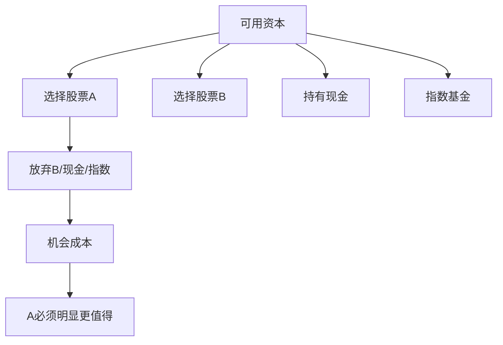

## 查理芒格思维筑基课: 公理5: 机会成本是真实成本 - 每一笔投资都在和最好替代项竞争

### 作者
digoal

### 日期
2026-05-19

### 标签
机会成本 , 资本配置 , 投资选择 , 现金价值 , 替代方案 , 组合管理 , 投资门槛 , 长期回报 , 资源约束 , 芒格思想

----

## 背景

> 面向对象: 投资者  
> 核心问题: 为什么“还不错”的投资也可能是错误选择？  
> 先说结论: 投资不是判断一个机会是否好，而是判断它是否比可获得的最佳替代方案更好。机会成本让投资者变得挑剔，也让资本不被平庸长期占用。

## 一张图先看懂



## 求真讲法

### 它到底说了什么

这条公理说: 任何选择都有被放弃的最好替代项。你买入一家普通公司，不只是承担它自己的风险，还放弃了买入优秀公司、等待更好价格或持有现金的选择权。

在芒格体系里，机会成本不是会计账上的支出，而是决策的真实标尺。

### 它是怎么来的

经济学把机会成本定义为选择某项行动时放弃的最佳替代收益。芒格把它变成投资纪律: 标准不是“能不能赚钱”，而是“这是不是最值得占用资本的选择”。

这条公理的动机是防止资本被“看起来还行”的机会消耗掉。

### 它依赖哪些假设

| 假设 | 投资含义 |
|---|---|
| 资本有限 | 买入A就不能同时满仓B |
| 时间有限 | 研究平庸机会会挤占研究优质机会 |
| 机会质量不同 | 少数机会远好于多数机会 |
| 现金有选择权价值 | 等待本身可能是理性行动 |

### 常见误解

| 误解 | 更准确的理解 |
|---|---|
| 现金没有收益，所以没有价值 | 现金保留了未来选择权 |
| 小赚就是好投资 | 若放弃了更高质量机会，小赚仍可能低效 |
| 分散越多越安全 | 过度分散可能持有大量低质量替代项 |

## 求存讲法

### 它有什么用

它帮助投资者建立投资门槛。每个新机会都必须回答: 它是否优于我已经持有的最好公司？是否优于低成本指数？是否值得放弃现金等待权？

### 它怎么迁移到投资流程

```text
候选投资 -> 与现有持仓比较 -> 与现金比较 -> 与指数比较 -> 只有明显更优才行动
```

| 比较对象 | 核心问题 |
|---|---|
| 现有持仓 | 新机会是否显著更好？ |
| 现金 | 现在买入是否补偿了等待价值？ |
| 指数基金 | 主动选择是否有足够胜算？ |
| 无风险利率 | 风险溢价是否充足？ |

### 它的适用范围和边界

适用于资本配置、仓位调整和持仓替换。边界是: 机会成本无法精确计算，只能用保守比较和清晰门槛处理。

### 正例: 怎么用它提升能力

投资者发现一家估值合理的普通公司，但组合里已有一家更强护城河、更高现金回报、估值也不贵的公司。机会成本比较后，他选择加仓后者，而不是为了“新鲜感”买入前者。

### 反例: 前提不成立会怎样

投资者持有一只低ROIC公司多年，理由是“没有亏钱”。但同期优质企业和指数大幅复利。失败点是只看绝对盈亏，忽略被放弃的最好替代项。

## 思考

1. 你组合里哪一项资产最占用机会成本？
2. 如果只能持有五家公司，你会删掉哪些“还不错”？
3. 你是否把现金的选择权价值计算进决策？

## 最后记住

1. 每笔投资都在和最好替代项竞争。
2. “还不错”不是足够理由。
3. 现金不是懒惰，可能是等待权。
4. 机会成本会逼投资者提高标准。

## 参考资料

- Charlie Munger, *Poor Charlie's Almanack*.
- Warren Buffett, Berkshire Hathaway Shareholder Letters.
- 本文参考本地 `buffett` 技能资料中的机会成本、集中投资和资本配置笔记。
  
#### [PostgreSQL 解决方案集合](../201706/20170601_02.md "40cff096e9ed7122c512b35d8561d9c8")
  
  
#### [德哥 / digoal's Github - 公益是一辈子的事.](https://github.com/digoal/blog/blob/master/README.md "22709685feb7cab07d30f30387f0a9ae")
  
  
#### [About 德哥](https://github.com/digoal/blog/blob/master/me/readme.md "a37735981e7704886ffd590565582dd0")
  
  

  
