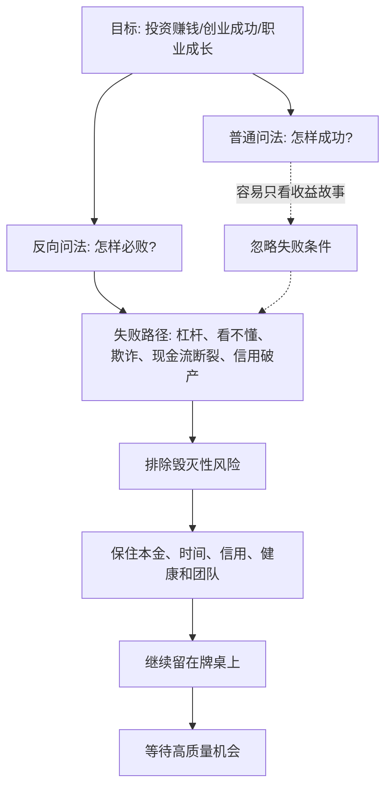

## 查理芒格思维筑基课: 反向思维定律: 先问怎样会亏掉本金

### 作者
digoal

### 日期
2026-05-19

### 标签
反向思维 , 本金安全 , 投资防错 , 查理芒格 , 风险管理 , 永久损失 , 安全边际 , 能力圈 , 杠杆风险 , 决策清单

----

## 背景

> 面向对象: 大学生、产品经理、运营经理、有投资需求的人  
> 核心问题: 为什么很多人明明想赚钱、想成功，却总是在关键处犯下毁灭性错误？  
> 先说结论: 正向思考问“怎样赚钱”，反向思维先问“怎样会输光、爆仓、失去信用、毁掉复利”。在投资和创业里，先排除会让你出局的错误，再谈收益，胜率会高很多。

## 一张图先看懂



## 求真讲法

### 它到底说了什么

反向思维，也常被称为 inversion，意思是: 不只从目标出发问“怎样做到”，还要反过来问“怎样一定做不到”“怎样会失败”“怎样会造成不可逆损失”。

查理·芒格很喜欢这种思考方式。它的力量在于，人很容易被成功故事吸引，却不愿意正视失败路径。成功往往有很多复杂原因，但失败常常有一些可识别、可避免的共同原因。

所以这条底层规律可以写成一句话:

**先把会让你出局的错误排除掉，再去追求收益、增长和成功。**

在投资中，“出局”通常意味着本金大幅亏损、被迫卖出、加杠杆爆仓、被欺诈、买入永久衰退资产。在创业中，“出局”通常意味着现金流断裂、核心团队散掉、信誉破产、产品没有真实需求却烧光资源。

### 它是怎么来的

反向思维不是神秘技巧，而是风险管理中的基本动作。

如果你只问“怎样赚钱”，大脑会自动寻找正面证据: 市场空间大、管理层厉害、技术先进、估值便宜、朋友赚了钱。它会让人更容易确认自己想相信的东西。

如果你先问“怎样亏掉本金”，问题会变得更硬:

```text
如果公司造假怎么办？
如果行业利润高点已经过去怎么办？
如果我看不懂关键技术怎么办？
如果融资断了怎么办？
如果股价跌 50% 我会不会被迫卖出？
如果增长靠补贴和会计口径怎么办？
```

这些问题会把漂亮故事拉回现实。反向思维的目的不是悲观，而是排雷。排雷之后，真正的机会反而更清楚。

### 它依赖哪些假设

| 假设 | 含义 | 如果不成立会怎样 |
|---|---|---|
| 失败路径有重复性 | 很多失败来自相似原因 | 如果失败完全随机，反向清单帮助会有限 |
| 人会偏爱正面叙事 | 人容易相信自己想相信的东西 | 不反向提问，就容易忽略坏证据 |
| 毁灭性损失不对称 | 亏掉 50% 要赚 100% 才回本 | 大错会打断复利，不能只看平均收益 |
| 资源有不可逆性 | 本金、信用、时间和团队损失后很难恢复 | 决策前必须先看最坏结果 |
| 避免愚蠢能提高长期胜率 | 少犯大错比多做聪明动作更稳定 | 长期成功先来自不出局 |

这些假设说明，反向思维不是证明某个机会一定好，而是先检验它会不会让你遭遇不可承受的坏结果。

### 常见误解

| 误解 | 更准确的说法 |
|---|---|
| 反向思维就是悲观 | 它是风险识别，不是拒绝行动 |
| 只要想到风险就不做 | 关键是区分可承受风险和不可承受风险 |
| 反向思维会错过机会 | 它会过滤掉会让你出局的机会，把资源留给更好的机会 |
| 赚钱比不亏钱更重要 | 长期复利要求先不遭遇永久性本金损失 |
| 列风险就是反向思维 | 反向思维要追问失败机制、触发条件和防护动作 |

## 求存讲法

### 它有什么用

反向思维最大的作用，是让你从“被收益诱惑”切换到“先保护生存条件”。

在投资里，生存条件包括:

```text
本金还在
没有高杠杆
没有被迫卖出
没有买入欺诈公司
没有超出能力圈
有耐心等待机会
```

在创业和工作里，生存条件包括:

```text
现金流不断
信誉不破产
团队不被透支
产品有真实需求
关键客户和供应链不失控
决策者能承认错误
```

如果这些条件被破坏，再漂亮的收益故事都可能变成陷阱。

### 它怎么迁移到熟悉领域

| 场景 | 正向问题 | 反向问题 |
|---|---|---|
| 学习 | 怎样提高成绩？ | 哪些习惯会让我长期退步？ |
| 产品 | 怎样做爆款功能？ | 哪些功能会破坏信任、留存和核心体验？ |
| 运营 | 怎样快速拉新？ | 哪些拉新会带来低质量用户和坏口碑？ |
| 创业 | 怎样高速增长？ | 哪些增长方式会烧断现金流？ |
| 投资 | 怎样赚大钱？ | 哪些情况会让我永久亏掉本金？ |

### 它的适用范围和边界

适用范围:

- 高风险、高不确定性、高不可逆性的决策。
- 投资、创业、职业跳槽、重大合作、产品战略。
- 容易被情绪、热点、叙事和短期收益诱导的场景。

边界也要说清楚:

- 反向思维不能替代正向研究。排除风险后，还要判断收益来源。
- 反向思维不能让你完全无风险。它只是减少可避免的大错。
- 反向思维不能变成无限怀疑。所有机会都有风险，关键是风险是否可理解、可承受、可补偿。
- 反向思维尤其适合先筛掉“不能碰”的东西，不一定能直接告诉你“最该买什么”。

### 正例: 怎么用它提升能力

假设你准备投资一家快速增长的公司。正向故事很诱人: 行业空间大、收入增长快、创始人表达能力强、市场关注度高。

反向思维会先问:

| 失败路径 | 要检查的问题 | 防护动作 |
|---|---|---|
| 看不懂 | 我能解释商业模式和关键变量吗？ | 不懂就不重仓 |
| 财务造假 | 现金流是否匹配利润？应收账款是否异常？ | 看现金流、审计意见和同行对比 |
| 增长质量差 | 增长是否靠补贴、放宽信用或一次性收入？ | 区分高质量收入和虚胖收入 |
| 竞争恶化 | 竞争者是否能低价复制？ | 看护城河和客户切换成本 |
| 估值过高 | 当前价格隐含多乐观未来？ | 要求安全边际 |
| 被迫卖出 | 仓位和资金期限是否匹配？ | 控制仓位，不用杠杆 |

这样做以后，你可能仍然投资，但下注会更清楚: 为什么买、最大风险是什么、什么证据出现时要认错、亏损是否可承受。

### 反例: 前提不成立会怎样

假设一个投资者只问“怎样赚大钱”，看到某个热门资产短期翻倍。他听到的都是正面故事: 技术革命、机构入场、供给稀缺、未来空间巨大。于是满仓加杠杆买入。

他没有先问“怎样会亏掉本金”，结果几个风险同时出现:

| 被忽略的失败路径 | 实际情况 | 后果 |
|---|---|---|
| 杠杆风险 | 价格短期大跌触发强平 | 不是不想长期持有，而是被迫出局 |
| 能力圈风险 | 他不懂资产定价和周期 | 下跌后无法判断是机会还是陷阱 |
| 流动性风险 | 恐慌时买盘消失 | 想卖也卖不出好价格 |
| 叙事风险 | 正面故事已经反映在高价格中 | 好故事不等于好回报 |
| 心理风险 | 满仓后情绪失控 | 低点割肉，高点追入 |

最后他亏掉大部分本金。失败不是因为热门资产一定不能投，而是他没有先排除会让自己出局的条件。

## 一个反向思维检查清单

```text
下注前先问 12 个反向问题

1. 这笔投资怎样会让我永久亏掉本金？
2. 我是否用了杠杆，或者存在被迫卖出的条件？
3. 我是否真的懂这个资产怎样创造价值？
4. 如果价格跌 50%，我的原逻辑会变还是只会情绪变？
5. 财务、现金流、客户和竞争有没有互相验证？
6. 这个增长是否可能是补贴、会计或周期高点造成的？
7. 管理层或销售方是否能从我的误判中获益？
8. 当前价格是否已经反映了过度乐观预期？
9. 哪些证据出现时，我必须承认自己错了？
10. 最坏情况下，损失是否会影响生活、信用或长期计划？
11. 有没有更简单、更确定、机会成本更低的替代项？
12. 如果我完全不买，会错过机会，还是保住选择权？
```

这份清单不是让人不赚钱，而是让人先不死。长期复利的第一条件，是还能继续复利。

## 思考

反向思维最有价值的地方，是逼你承认一个事实: 成功路径往往模糊，失败路径有时很清楚。

很多人不愿意反向想，是因为失败路径会破坏兴奋感。可是投资、创业和人生里，真正昂贵的不是少赚一次，而是因为一次不可逆错误失去继续选择的资格。

可以继续追问:

1. 我最近最想做的一笔投资，最可能怎样失败？
2. 我是不是只找了支持自己观点的信息，没有找反方证据？
3. 如果我先写一份“失败说明书”，还会用同样仓位下注吗？
4. 哪些风险不是让我短期难受，而是让我长期出局？
5. 在我的学习、工作、创业和投资中，最该先避免的愚蠢是什么？

## 最后记住

1. 反向思维先问“怎样会失败”，再问“怎样成功”。
2. 投资里最先排除的，是会导致永久性本金损失的路径。
3. 杠杆、圈外下注、欺诈、现金流断裂和被迫卖出，都是常见出局原因。
4. 反向思维不是悲观，而是为了保住本金、信用、时间和复利资格。
5. 长期胜利常常来自少犯大错，而不是每次都做出天才判断。

## 参考资料

- Charles T. Munger, "Poor Charlie's Almanack", 2005.
- Warren E. Buffett, Berkshire Hathaway shareholder letters.
- Benjamin Graham, "The Intelligent Investor", revised editions.
- Howard Marks, "The Most Important Thing", 2011.
- Nassim Nicholas Taleb, "Fooled by Randomness", 2001.
- Nassim Nicholas Taleb, "The Black Swan", 2007.
- Daniel Kahneman, "Thinking, Fast and Slow", 2011.
  
#### [PostgreSQL 解决方案集合](../201706/20170601_02.md "40cff096e9ed7122c512b35d8561d9c8")
  
  
#### [德哥 / digoal's Github - 公益是一辈子的事.](https://github.com/digoal/blog/blob/master/README.md "22709685feb7cab07d30f30387f0a9ae")
  
  
#### [About 德哥](https://github.com/digoal/blog/blob/master/me/readme.md "a37735981e7704886ffd590565582dd0")
  
  

  
