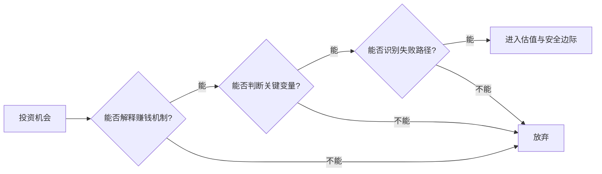

## 查理芒格思维筑基课: 公理6: 能力圈边界比大小更重要 - 不懂就是风险

### 作者
digoal

### 日期
2026-05-19

### 标签
能力圈 , 投资边界 , 商业理解 , 风险识别 , 估值能力 , 行业研究 , 投资纪律 , 反证条件 , 仓位管理 , 芒格思想

----

## 背景

> 面向对象: 投资者  
> 核心问题: 为什么承认看不懂，反而是投资优势？  
> 先说结论: 投资风险常常来自不知道自己不知道。能力圈不是炫耀懂多少，而是清楚哪些生意自己能判断，哪些必须放弃。

## 一张图先看懂

## 求真讲法

### 它到底说了什么

这条公理说: 每个人都有能可靠判断的范围，也有不能可靠判断的范围。投资者真正的危险，不是圈小，而是不知道圈在哪里。

能解释公司怎样赚钱，不等于在能力圈内；还要知道关键变量、竞争威胁、资本需求、管理层行为和什么证据会证明自己错了。

### 它是怎么来的

巴菲特和芒格长期强调只在能理解的领域行动。能力圈的选择理由是: 投资本身已经充满不确定性，如果连基本商业机制都不懂，安全边际就没有计算基础。

这条公理不是证明题，而是风险控制的起点。

### 它依赖哪些假设

| 假设 | 投资含义 |
|---|---|
| 判断能力不均匀 | 懂消费品不等于懂半导体周期 |
| 知识需要场景经验 | 读几篇报告不等于有判断力 |
| 边界可以扩大 | 但需要长期学习和反馈 |
| 边界不清会制造自信幻觉 | 最危险的是半懂不懂 |

### 常见误解

| 误解 | 更准确的理解 |
|---|---|
| 能力圈是保守不进步 | 它是行动边界，不是学习边界 |
| 热门行业必须参与 | 看不懂就没有下注资格 |
| 专家推荐可替代能力圈 | 专家观点不能替你承担错误 |

## 求存讲法

### 它有什么用

它让投资者过滤大量机会，减少低质量决策。能力圈越清晰，越能在少数真正懂的机会里下重注。

### 它怎么迁移到投资流程

| 能力圈检查 | 达标标准 |
|---|---|
| 商业模式 | 一段话说明怎样赚钱 |
| 关键变量 | 说出2到3个决定长期价值的变量 |
| 护城河 | 说明竞争者为什么难复制 |
| 失败路径 | 说出三个永久亏损路径 |
| 反证条件 | 写出什么事实出现就承认错 |

### 它的适用范围和边界

适用于个股投资、行业选择和仓位管理。边界是: 能力圈不能保证收益，只是让估值和风险判断有基础。

### 正例: 怎么用它提升能力

投资者长期研究消费品牌，能判断定价权、渠道、复购和库存。他放弃看不懂的复杂金融衍生品，把精力集中在少数可理解公司上。

### 反例: 前提不成立会怎样

投资者因为某AI公司热门而买入，却不能解释收入质量、客户留存和竞争壁垒。下跌后他只能靠新闻安慰自己。失败点是把热点当能力圈。

## 思考

1. 你真正能解释清楚的行业有几个？
2. 哪些持仓其实依赖他人的判断？
3. 你扩大能力圈靠的是阅读，还是可验证反馈？

## 最后记住

1. 能力圈大小不如边界清楚重要。
2. 不懂的东西，估值再低也可能不便宜。
3. 学习可以扩大能力圈，下注必须待在圈内。
4. 承认不知道，是投资纪律。

## 参考资料

- Warren Buffett, Berkshire Hathaway Shareholder Letters.
- Charlie Munger, *Poor Charlie's Almanack*.
- 本文参考本地 `buffett` 技能资料中的能力圈和思维框架笔记。
  
#### [PostgreSQL 解决方案集合](../201706/20170601_02.md "40cff096e9ed7122c512b35d8561d9c8")
  
  
#### [德哥 / digoal's Github - 公益是一辈子的事.](https://github.com/digoal/blog/blob/master/README.md "22709685feb7cab07d30f30387f0a9ae")
  
  
#### [About 德哥](https://github.com/digoal/blog/blob/master/me/readme.md "a37735981e7704886ffd590565582dd0")
  
  

  
