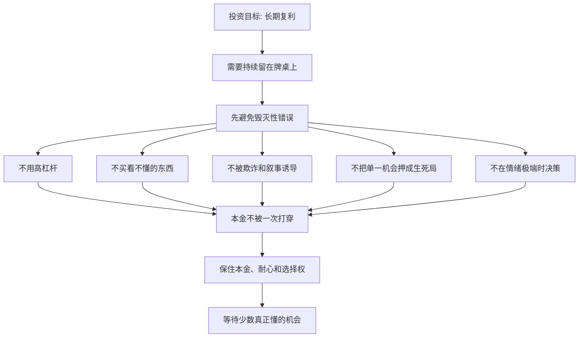

## 查理芒格思维筑基课: 避免愚蠢定律: 投资先减少毁灭性错误

### 作者
digoal

### 日期
2026-05-19

### 标签
避免愚蠢 , 毁灭性错误 , 投资纪律 , 查理芒格 , 防错系统 , 本金保护 , 复利 , 杠杆风险 , 行为偏误 , 风险控制

----

## 背景

> 面向对象: 大学生、产品经理、运营经理、有投资需求的人  
> 核心问题: 为什么长期投资成功不一定靠很多天才判断，反而常常靠少犯大错？  
> 先说结论: 投资的第一目标不是每次都聪明，而是先避免会让本金、信用、心态和复利机器受重伤的愚蠢错误。少犯毁灭性错误，本身就是长期优势。

## 一张图先看懂



## 求真讲法

### 它到底说了什么

“避免愚蠢定律”说的是: 在复杂、不确定、会放大人性弱点的领域里，长期结果往往先取决于你能不能避开明显的大坑。

这不是说聪明不重要，而是说很多毁灭性错误一旦发生，后面再聪明也很难补回来。投资里亏 50%，需要赚 100% 才能回本；加杠杆爆仓，连等待修复的资格都没有；买到欺诈公司，本金可能永久消失；在圈外重仓，跌了也不知道该买、该卖还是该认错。

所以这条底层规律可以写成一句话:

**投资不是先证明自己多聪明，而是先建立系统，避免自己做出足以毁掉长期复利的蠢事。**

### 它是怎么来的

这条规律来自投资实践中的不对称性。

普通考试里，错一道题可能只扣几分。但投资里，有些错误不是扣几分，而是让你出局。比如:

```text
一次高杠杆爆仓
一次重仓财务造假公司
一次把生活资金投入高波动资产
一次在极端情绪下割肉或追高
一次相信自己看不懂的复杂产品
```

查理·芒格反复强调，避免愚蠢比追求聪明更可靠。原因很直接: 聪明动作通常很难复制，愚蠢错误却经常重复出现。人类的贪婪、恐惧、从众、过度自信和确认偏误，在每一轮市场里都会换个外壳重新出现。

### 它依赖哪些假设

| 假设 | 含义 | 投资中的表现 |
|---|---|---|
| 损失具有不对称性 | 大亏之后回本更难 | 亏 50% 要赚 100% 才能回本 |
| 人会系统性犯错 | 错误不是偶然，而是会重复 | 追涨杀跌、过度自信、从众 |
| 某些错误会中断复利 | 不是所有错误都可修复 | 爆仓、欺诈、信用破产 |
| 机会会反复出现 | 不必每个机会都参与 | 保留现金和耐心有价值 |
| 防错系统比临场意志可靠 | 情绪上头时，人很难靠自控 | 清单、仓位、规则比口号更稳 |

这些假设说明，避免愚蠢不是消极，而是承认投资世界会惩罚那些没有防错系统的人。

### 常见误解

| 误解 | 更准确的说法 |
|---|---|
| 避免愚蠢就是不冒险 | 它是避免不可承受风险，不是拒绝合理风险 |
| 不犯错就能赚钱 | 不犯大错只是基础，还要有能力识别好机会 |
| 聪明人不需要清单 | 越聪明越容易为错误找理由，更需要外部约束 |
| 分散投资能避免所有愚蠢 | 分散能降低单点风险，但不能解决圈外乱买和估值过高 |
| 错误越多成长越快 | 小错能学习，大错可能直接毁掉本金和心态 |

## 求存讲法

### 它有什么用

这条规律的实际作用，是把投资目标从“我要抓住每个机会”改成“我先不做会毁掉自己的事”。

毁灭性错误通常有几个共同特征:

| 错误类型 | 表面诱惑 | 毁灭性在哪里 |
|---|---|---|
| 高杠杆 | 放大收益 | 下跌时被迫卖出，失去等待权 |
| 圈外重仓 | 热点很强，别人赚钱 | 不知道关键风险，无法修正判断 |
| 价值陷阱 | 估值低，看似便宜 | 公司价值持续下降 |
| 欺诈公司 | 增长漂亮，故事完整 | 财务和经营事实可能是假的 |
| 满仓单押 | 一次机会看起来确定 | 判断错时没有退路 |
| 情绪交易 | 立刻缓解焦虑 | 高点追入、低点割肉 |

避免这些错误，不能只靠“我会小心”。要靠规则和环境设计。

### 它怎么迁移到熟悉领域

| 场景 | 毁灭性错误 | 防错动作 |
|---|---|---|
| 学习 | 只追热点技能，基础长期空心 | 保留基础训练和复盘 |
| 产品 | 为短期增长破坏用户信任 | 把留存、投诉、退款纳入指标 |
| 运营 | 用标题党和过度打扰换流量 | 保护用户关系和品牌信用 |
| 创业 | 过早扩张，现金流断裂 | 控制固定成本，延长生存期 |
| 投资 | 杠杆、圈外重仓、追涨杀跌 | 能力圈、仓位、清单、现金储备 |

### 它的适用范围和边界

适用范围:

- 投资、创业、职业选择、重大合作等高后果决策。
- 错误代价远大于普通试错成本的场景。
- 人容易被情绪、热点、排名、故事和短期收益诱导的场景。

边界也要说清楚:

- 避免愚蠢不是追求零错误。零错误会导致不行动。
- 它主要针对不可承受、不可逆、会中断复利的大错。
- 它不能替代正向能力建设。少犯错后，还需要研究、判断和执行。
- 有些小试错是必要的，关键是控制试错成本，不能把试错做成生死局。

### 正例: 怎么用它提升能力

假设你刚开始投资，有 10 万元本金。你看到一个热门板块涨得很快，很想重仓。

避免愚蠢的做法不是立刻判断“它一定不好”，而是先设防:

| 防错问题 | 规则 | 作用 |
|---|---|---|
| 我懂不懂？ | 说不清商业模式和关键变量，不重仓 | 防圈外下注 |
| 会不会爆仓？ | 不借钱、不加杠杆 | 防被迫出局 |
| 会不会单点失败？ | 单一标的不超过可承受比例 | 防一错致命 |
| 有没有反方证据？ | 买入前写下看空理由 | 防确认偏误 |
| 亏损是否影响生活？ | 生活费、应急钱不入市 | 防心理失控 |
| 何时认错？ | 事前写出卖出或降仓条件 | 防硬扛 |

这样做可能让你少赚某次快速上涨，但能显著降低一次错误毁掉本金的概率。长期看，活下来比一次押中更重要。

### 反例: 前提不成立会怎样

假设一个投资者很聪明，学习能力强，也读了很多公司研究。他认为自己比普通人更能承受风险，于是借钱重仓一家高增长公司。

他犯的不是“不会研究”，而是破坏了避免愚蠢的几个前提:

| 被破坏的前提 | 实际情况 | 后果 |
|---|---|---|
| 损失不对称 | 杠杆让小跌变成大亏 | 本金快速受损 |
| 防错系统比意志可靠 | 下跌时情绪和压力上升 | 无法冷静判断 |
| 某些错误会中断复利 | 触发追加保证金或被迫卖出 | 失去等待权 |
| 机会会反复出现 | 他把一次机会当成唯一机会 | 没有选择权 |
| 人会系统性犯错 | 过度自信让他忽略反方证据 | 错误仓位过大 |

后来公司短期业绩低于预期，股价大跌。他本来可能熬过周期，却因为杠杆被迫卖出。失败不是因为公司一定差，而是投资结构太愚蠢。

## 一个避免毁灭性错误清单

```text
投资前先排除 12 个大错

1. 我是否用了杠杆或借来的钱？
2. 这笔钱亏掉是否会影响生活、信用或长期计划？
3. 我是否能解释这家公司怎样赚钱？
4. 我是否知道最关键的三个风险变量？
5. 我是否只看了支持自己观点的信息？
6. 公司利润是否能被现金流验证？
7. 这个价格是否已经包含过高预期？
8. 我是否因为别人赚钱而焦虑入场？
9. 单一标的或单一行业是否占比过高？
10. 如果跌 50%，我是否会被迫卖出？
11. 什么证据出现时，我必须认错？
12. 如果不买，我是否还有更好的替代选择？
```

这份清单不保证你赚钱，但能帮你避开很多足以毁掉长期复利的错误。

## 思考

很多人把投资想成“寻找聪明答案”，但真实世界常常先奖励那些不犯低级大错的人。

原因很简单: 复利需要时间，而毁灭性错误会夺走时间；机会需要耐心，而满仓和杠杆会夺走耐心；判断需要清醒，而情绪交易会夺走清醒。

可以继续追问:

1. 我过去最大的损失，是因为不知道机会，还是因为犯了可避免的大错？
2. 我有没有把“胆子大”误认为“能力强”？
3. 我现在的投资组合里，哪个风险一旦发生会让我出局？
4. 如果市场关闭三年，我的持仓、现金和心态能否承受？
5. 我是否建立了规则，阻止未来情绪化的自己做蠢事？

## 最后记住

1. 投资长期成功，先靠少犯毁灭性错误，再靠抓住少数好机会。
2. 高杠杆、圈外重仓、欺诈、价值陷阱、满仓单押和情绪交易，是常见大坑。
3. 聪明不能替代防错系统，尤其在情绪和压力很强的时候。
4. 小错可以学习，大错会中断本金、信用、心态和复利。
5. 避免愚蠢不是不行动，而是让自己一直有资格行动。

## 参考资料

- Charles T. Munger, "Poor Charlie's Almanack", 2005.
- Warren E. Buffett, Berkshire Hathaway shareholder letters.
- Benjamin Graham, "The Intelligent Investor", revised editions.
- Howard Marks, "The Most Important Thing", 2011.
- Nassim Nicholas Taleb, "Fooled by Randomness", 2001.
- Daniel Kahneman, "Thinking, Fast and Slow", 2011.
- Atul Gawande, "The Checklist Manifesto", 2009.
  
#### [PostgreSQL 解决方案集合](../201706/20170601_02.md "40cff096e9ed7122c512b35d8561d9c8")
  
  
#### [德哥 / digoal's Github - 公益是一辈子的事.](https://github.com/digoal/blog/blob/master/README.md "22709685feb7cab07d30f30387f0a9ae")
  
  
#### [About 德哥](https://github.com/digoal/blog/blob/master/me/readme.md "a37735981e7704886ffd590565582dd0")
  
  

  
