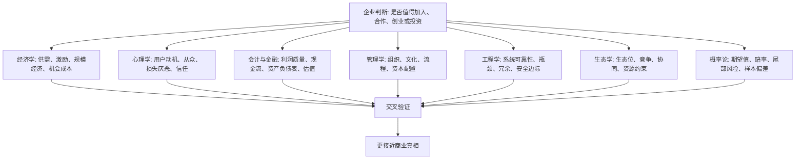

## 查理芒格思维筑基课: 多元思维模型定律: 用模型格栅看企业

### 作者
digoal

### 日期
2026-05-19

### 标签
多元思维模型 , 模型格栅 , 企业分析 , 查理芒格 , 跨学科 , 投资判断 , 产品经理 , 商业系统 , 概率思维 , 决策框架

----

## 背景

> 面向对象: 大学生、产品经理、运营经理、有投资需求的人  
> 核心问题: 为什么只懂一个学科、一个指标或一种经验，很容易误判企业？  
> 先说结论: 企业是多学科交汇的复杂系统。用单一模型看企业，就像只拿一盏手电照一个角落；用模型格栅看企业，是让经济学、心理学、会计、管理、工程、生态和概率一起校验同一个判断。

## 一张图先看懂



## 求真讲法

### 它到底说了什么

“多元思维模型定律”说的是: 面对复杂问题，不能只用一个模型解释一切。你需要把多个基础学科中可靠、可迁移的模型组合起来，形成一个判断格栅。

模型，就是帮助我们理解现实的简化工具。比如“供需”是经济学模型，“损失厌恶”是心理学模型，“现金流”是财务模型，“瓶颈”是工程模型，“生态位”是生物学模型。

格栅，就是这些模型不是散落一地，而是能互相连接、互相校验、互相纠偏。

所以这条底层规律可以写成一句话:

**看企业时，不要问“哪个模型能解释一切”，而要问“哪些模型一起解释，哪些模型互相矛盾，哪些事实能验证”。**

### 它是怎么来的

查理·芒格强调，人不能只掌握一个学科的少数工具。如果一个人手里只有锤子，就容易看什么都像钉子。企业恰恰不是单一学科问题，而是多因素交互问题。

一家企业为什么能长期赚钱，可能同时涉及:

```text
用户为什么买          -> 心理学、产品、行为科学
它为什么能赚钱        -> 经济学、商业模式、会计
竞争者为什么难复制    -> 战略、生态位、规模经济
组织为什么能持续执行  -> 管理学、激励、文化
风险为什么没有暴露    -> 概率论、会计、工程安全边际
价格是否值得          -> 金融、机会成本、估值
```

只用一个模型，容易得到一个漂亮但脆弱的解释。多元模型不是为了显得博学，而是为了减少盲区。

### 它依赖哪些假设

| 假设 | 含义 | 如果不成立会怎样 |
|---|---|---|
| 企业是复杂系统 | 结果由多个变量共同决定 | 单一模型容易误判 |
| 学科模型能迁移 | 基础规律可跨场景使用 | 模型格栅就无法帮忙 |
| 每个模型都有边界 | 任何模型都只解释一部分现实 | 把一个模型用到极端会变形 |
| 事实可以交叉验证 | 不同模型能指向同一事实或暴露矛盾 | 判断只能停留在故事层 |
| 人会偏爱熟悉模型 | 人容易用自己擅长的工具解释一切 | 需要主动补齐盲区 |

这些假设说明，多元思维不是追求复杂，而是承认现实本来复杂，并用结构化方法降低误判。

### 常见误解

| 误解 | 更准确的说法 |
|---|---|
| 多元模型就是懂很多名词 | 关键是能在真实问题中调用模型并验证事实 |
| 模型越多越好 | 模型要服务于问题，不能为了复杂而复杂 |
| 一个高手模型就够了 | 单个模型再强，也可能遮住其他关键变量 |
| 多学科会让判断变慢 | 对重大决策，慢一点换来少犯大错是值得的 |
| 模型能替代一手事实 | 模型只是提问方式，事实才是判断材料 |

## 求存讲法

### 它有什么用

多元模型最大的作用，是让你避免被单一叙事骗走。

常见单一叙事包括:

```text
产品体验好，所以公司一定好。
利润增长快，所以公司一定好。
创始人厉害，所以公司一定好。
行业空间大，所以公司一定好。
估值低，所以公司一定好。
用户很多，所以公司一定好。
```

这些判断可能都有一部分道理，但都不够。多元模型会继续追问:

```text
产品好，用户是否愿意持续付费？
利润增长快，现金流是否真实？
创始人厉害，组织是否能复制他的能力？
行业空间大，公司能否占到有利润的生态位？
估值低，是便宜还是价值陷阱？
用户很多，获客成本和留存是否健康？
```

### 它怎么迁移到熟悉领域

| 场景 | 单一模型 | 模型格栅 |
|---|---|---|
| 学习 | 只看努力时间 | 看反馈、方法、基础、情绪、环境 |
| 产品 | 只看用户反馈 | 看行为数据、付费、留存、替代方案、心理动机 |
| 运营 | 只看新增人数 | 看用户质量、复购、口碑、成本、长期信任 |
| 创业 | 只看市场规模 | 看切入点、现金流、竞争、组织、渠道 |
| 投资 | 只看估值指标 | 看商业模式、护城河、财务质量、管理层、周期 |

### 它的适用范围和边界

适用范围:

- 企业分析、行业研究、投资判断、创业规划。
- 产品、运营、组织、战略和资本配置问题。
- 需要长期判断、跨部门协同、跨变量权衡的复杂决策。

边界也要说清楚:

- 小决策不必过度模型化。买一杯咖啡不需要模型格栅。
- 模型格栅不能替代专业深度。懂多个模型，不等于懂每个行业。
- 模型之间可能冲突。冲突不是坏事，它提醒你继续找事实。
- 最后仍要做判断。多元模型是提高判断质量，不是逃避选择。

### 正例: 怎么用它提升能力

假设你在分析一家社区团购公司。单一模型可能说: “用户多、交易额大，所以公司好。”

模型格栅会这样展开:

| 模型 | 要问的问题 | 可能发现 |
|---|---|---|
| 经济学 | 单位经济模型是否为正？ | GMV 高但履约成本也高 |
| 心理学 | 用户是真忠诚，还是只对补贴敏感？ | 补贴停止后可能流失 |
| 会计金融 | 现金流是否支撑扩张？ | 增长可能依赖持续融资 |
| 管理学 | 团长、仓配、采购能否稳定协同？ | 组织复杂度很高 |
| 工程学 | 物流系统瓶颈在哪里？ | 最后一公里决定体验和成本 |
| 生态学 | 它在供应链中占什么生态位？ | 上游议价力未必强 |
| 概率论 | 最坏情景下能活多久？ | 现金储备决定生存时间 |

经过交叉验证，你可能得出更稳的判断: 这家公司不是“用户多就好”，而要看补贴退潮后留存是否真实、单位经济是否转正、供应链效率是否形成壁垒。

### 反例: 前提不成立会怎样

假设一名投资者只用会计模型看企业。他看到某公司利润增长快、市盈率不高，于是认为很便宜。

但他忽略了其他模型:

| 被忽略的模型 | 实际情况 | 后果 |
|---|---|---|
| 经济学 | 行业供给正在大幅增加 | 未来价格和毛利率下行 |
| 心理学 | 客户购买主要因为短期补贴 | 真实需求没有想象中强 |
| 管理学 | 销售团队只奖励签单，不奖励回款 | 应收账款恶化 |
| 工程学 | 产品交付质量不稳定 | 售后成本上升 |
| 概率论 | 利润高点被当成常态 | 估值基准错误 |

后来公司利润下滑、现金流变差、股价下跌。失败不是因为会计模型没用，而是他把一个模型当成完整世界。

## 一个企业模型格栅清单

```text
看企业前 14 问

1. 用户为什么买？这是强需求还是弱需求？
2. 公司怎样赚钱？单位经济模型是否成立？
3. 增长来自真实需求、补贴、并购，还是会计口径？
4. 现金流是否支持利润和扩张？
5. 竞争者为什么不能复制？
6. 公司在产业链中有没有议价权？
7. 管理层和员工被什么激励？
8. 组织能力是否能支撑规模扩大？
9. 产品或系统的瓶颈在哪里？
10. 最坏情景下，公司能活多久？
11. 当前价格隐含了多乐观的未来？
12. 哪些模型给出相反信号？
13. 我是否只在使用自己最熟悉的模型？
14. 什么事实出现时，我必须修正判断？
```

这份清单的目的不是把问题变复杂，而是防止一个漂亮故事遮住关键事实。

## 思考

多元思维模型真正训练的不是记忆力，而是切换视角的能力。

你要能从用户视角看需求，从财务视角看质量，从竞争视角看护城河，从组织视角看执行，从概率视角看风险，从机会成本视角看是否值得。一个视角可能让你兴奋，另一个视角可能让你冷静。好判断往往来自这种互相校正。

可以继续追问:

1. 我最常用的模型是什么？它会让我忽略什么？
2. 如果我从另一个学科看同一家公司，结论会不会改变？
3. 当前企业故事里，哪些事实被反复强调，哪些事实被有意忽略？
4. 哪些模型同时支持这个判断，哪些模型正在发出警告？
5. 我是在寻找真相，还是在寻找能支持自己买入理由的模型？

## 最后记住

1. 企业是复杂系统，不能只用一个模型解释。
2. 模型格栅的价值不是炫耀知识，而是交叉验证、发现盲区。
3. 经济学、心理学、会计、管理、工程、生态和概率都能帮助看企业。
4. 单一模型可以作为入口，但不能冒充结论。
5. 好判断来自模型、事实、反证和边界意识的共同作用。

## 参考资料

- Charles T. Munger, "Poor Charlie's Almanack", 2005.
- Warren E. Buffett, Berkshire Hathaway shareholder letters.
- Peter M. Senge, "The Fifth Discipline", 1990.
- Michael E. Porter, "Competitive Strategy", 1980.
- Richard P. Rumelt, "Good Strategy Bad Strategy", 2011.
- Daniel Kahneman, "Thinking, Fast and Slow", 2011.
- Philip E. Tetlock and Dan Gardner, "Superforecasting", 2015.
  
#### [PostgreSQL 解决方案集合](../201706/20170601_02.md "40cff096e9ed7122c512b35d8561d9c8")
  
  
#### [德哥 / digoal's Github - 公益是一辈子的事.](https://github.com/digoal/blog/blob/master/README.md "22709685feb7cab07d30f30387f0a9ae")
  
  
#### [About 德哥](https://github.com/digoal/blog/blob/master/me/readme.md "a37735981e7704886ffd590565582dd0")
  
  

  
