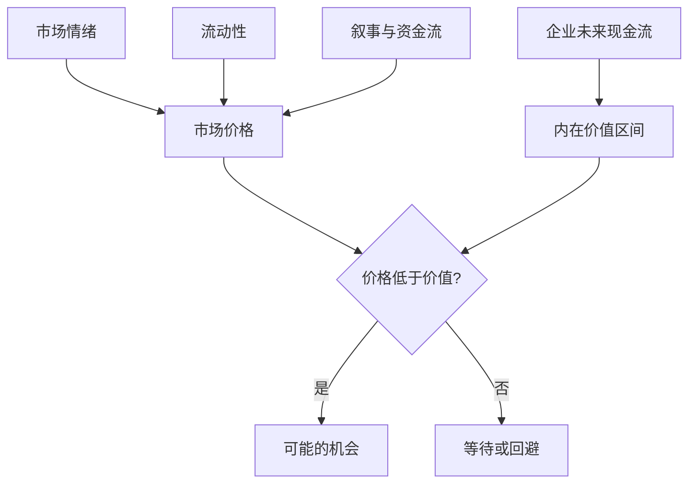

## 查理芒格思维筑基课: 公理7: 价格不等于价值 - 市场报价不是商业真相

### 作者
digoal

### 日期
2026-05-19

### 标签
价格与价值 , 内在价值 , 市场先生 , 现金流折现 , 估值区间 , 安全边际 , 市场情绪 , 价值投资 , 投资判断 , 芒格思想

----

## 背景

> 面向对象: 投资者  
> 核心问题: 为什么股价上涨不等于判断正确，股价下跌也不等于判断错误？  
> 先说结论: 价格是市场当下愿意交易的数字，价值是企业未来可分配现金流的折现。短期价格会被情绪和流动性拉偏，长期价格才逐渐向价值靠拢。

## 一张图先看懂



## 求真讲法

### 它到底说了什么

这条公理说: 股价不是价值本身。价格每天变化，企业真实价值通常不会每天剧烈变化。投资者要把市场报价当作可利用的信息，而不是最终裁判。

价值来自企业未来能为所有者拿出的现金。价格来自当下买卖双方的情绪、资金和预期。

### 它是怎么来的

格雷厄姆的“市场先生”隐喻和巴菲特的内在价值定义共同构成这条公理。芒格接受这个框架，并进一步强调: 好生意也可能因高价格变成坏投资。

它的动机是把投资从“猜别人明天愿意付多少钱”拉回“估计企业长期能产生多少现金”。

### 它依赖哪些假设

| 假设 | 投资含义 |
|---|---|
| 企业有可估算现金流 | 价值不是纯叙事 |
| 市场短期会偏离 | 恐惧和狂热会制造价格偏差 |
| 长期有回归机制 | 企业业绩和现金分配会约束价格 |
| 投资者能保守估值 | 无法估值就无法判断便宜 |

### 常见误解

| 误解 | 更准确的理解 |
|---|---|
| 跌了就是便宜 | 价值可能跌得更多 |
| 涨了就是好公司 | 可能只是估值扩张 |
| 好公司任何价格都能买 | 过高价格会透支多年好业绩 |

## 求存讲法

### 它有什么用

它让投资者建立买入纪律: 先估价值区间，再看价格是否提供安全边际。没有价值估算，价格高低没有意义。

### 它怎么迁移到投资流程

```text
商业质量 -> 未来现金流 -> 内在价值区间 -> 当前价格 -> 安全边际 -> 行动
```

| 状态 | 行动倾向 |
|---|---|
| 好公司 + 低于价值 | 研究后考虑买入 |
| 好公司 + 明显高于价值 | 等待 |
| 差公司 + 低估值 | 警惕价值陷阱 |
| 无法估值 | 退出能力圈 |

### 它的适用范围和边界

适用于能估计现金流的资产。边界是: 对无现金流、极早期、强技术跃迁的资产，价值区间可能过宽，投资者应提高安全边际或放弃。

### 正例: 怎么用它提升能力

市场恐慌时，一家高质量消费公司的股价下跌40%，但品牌、现金流、负债和竞争地位没有恶化。投资者用保守现金流估值确认价格低于价值，分批买入。

### 反例: 前提不成立会怎样

一家公司股价从100跌到20，投资者认为“跌了80%很便宜”。但公司核心产品被替代，现金流永久下台阶。失败点是把价格跌幅当成价值判断。

## 思考

1. 你买入前是否写过内在价值区间？
2. 哪些持仓只是因为价格走势让你感觉正确？
3. 如果市场明天关闭五年，你还关心什么？

## 最后记住

1. 价格是报价，价值是现金流能力。
2. 跌幅不是安全边际。
3. 好公司也会因价格过高变成差投资。
4. 市场先生服务你，不教育你。

## 参考资料

- Benjamin Graham, *The Intelligent Investor*.
- Warren Buffett, Berkshire Hathaway Shareholder Letters.
- 本文参考本地 `buffett` 技能资料中的内在价值、市场先生和估值笔记。
  
#### [PostgreSQL 解决方案集合](../201706/20170601_02.md "40cff096e9ed7122c512b35d8561d9c8")
  
  
#### [德哥 / digoal's Github - 公益是一辈子的事.](https://github.com/digoal/blog/blob/master/README.md "22709685feb7cab07d30f30387f0a9ae")
  
  
#### [About 德哥](https://github.com/digoal/blog/blob/master/me/readme.md "a37735981e7704886ffd590565582dd0")
  
  

  
