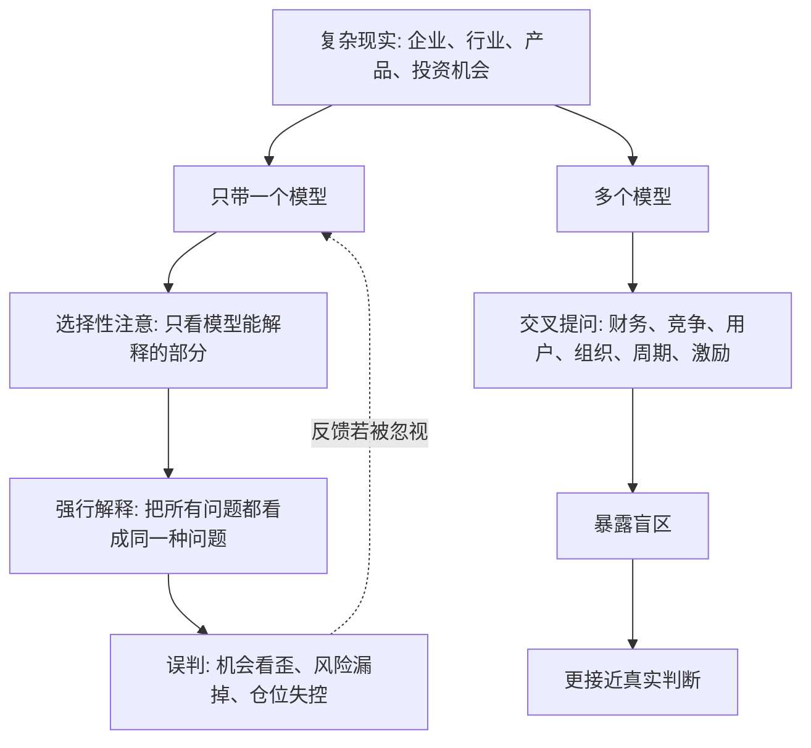

## 查理芒格思维筑基课: 锤子人定律: 只有一个模型会把机会看歪

### 作者
digoal

### 日期
2026-05-19

### 标签
锤子人定律 , 单一模型 , 认知偏差 , 查理芒格 , 模型边界 , 企业分析 , 投资误判 , 产品决策 , 跨学科 , 反方证据

----

## 背景

> 面向对象: 大学生、产品经理、运营经理、有投资需求的人  
> 核心问题: 为什么有些人很聪明、很专业，却总是把复杂机会看歪？  
> 先说结论: 当一个人只有一个熟悉模型时，他会不自觉地把所有问题都解释成这个模型能处理的样子。模型本来是工具，但当工具太少时，它会变成认知牢笼。

## 一张图先看懂



## 求真讲法

### 它到底说了什么

“锤子人定律”来自一句常见表达: 如果你手里只有一把锤子，看什么都像钉子。

这句话讲的是认知偏差。一个人越熟悉某个工具、学科、指标或经验，就越容易把它用到所有问题上。财务出身的人可能只看利润和估值，产品出身的人可能只看体验，技术出身的人可能只看架构，宏观出身的人可能只看周期，销售出身的人可能只看成交。

所以这条底层规律可以写成一句话:

**当你只有一个模型时，不是你在使用模型，而是模型在使用你。**

模型不是错的。锤子也不是错的。问题在于，世界不全是钉子。企业可能同时是产品问题、渠道问题、成本问题、组织问题、心理问题、竞争问题、资本问题和周期问题。

### 它是怎么来的

这条规律的根源，是人的认知资源有限。人会倾向于使用自己最熟悉、最省力、最有成就感的解释框架。

一个投资者刚学会市盈率，就容易到处找“低 PE”；刚学会增长率，就容易到处找“高增长”；刚学会护城河，就容易把所有品牌都解释成护城河；刚学会宏观周期，就容易把所有公司涨跌都归因于利率和流动性。

这种偏差有一个危险之处: 它常常让人感觉自己很有逻辑。因为单一模型内部可以自洽，但它可能漏掉了模型外的关键事实。

```text
单一模型内部自洽
        ↓
看起来解释力很强
        ↓
忽略模型外变量
        ↓
现实结果不断打脸
        ↓
继续用原模型找借口
```

### 它依赖哪些假设

| 假设 | 含义 | 如果不成立会怎样 |
|---|---|---|
| 现实是多变量系统 | 结果通常不是单一原因造成 | 单一模型才可能误导 |
| 人会偏爱熟悉工具 | 熟悉模型更容易被调用 | 如果人总能自动调用全部模型，锤子人问题会少很多 |
| 模型有适用边界 | 每个模型只能解释一部分现实 | 如果一个模型能解释一切，就不需要模型格栅 |
| 反馈常有延迟 | 错误模型不会立刻暴露 | 人会长时间带着错误解释前进 |
| 自尊会保护旧模型 | 承认模型不够用会让人不舒服 | 人容易把反证解释成例外 |

这些假设说明，锤子人定律不是嘲笑专业能力，而是提醒我们: 专业能力越强，越要警惕自己的工具偏好。

### 常见误解

| 误解 | 更准确的说法 |
|---|---|
| 锤子人就是能力差 | 很多锤子人恰恰很专业，只是工具太单一 |
| 单一模型没有价值 | 单一模型有价值，但不能冒充完整解释 |
| 多学科就是浅尝辄止 | 多学科不是每科都浅，而是知道什么时候该换工具 |
| 我有成功经验，所以模型可靠 | 过去有效可能只是场景匹配，换场景会失效 |
| 反对锤子人就是反对专业化 | 真正的专业化要知道自己专业的边界 |

## 求存讲法

### 它有什么用

锤子人定律最大的用处，是提醒你在重大决策前问一句:

```text
我是不是正在用自己最熟悉的模型，强行解释一个更复杂的问题？
```

很多误判都不是因为没有模型，而是模型太少:

| 熟悉模型 | 容易看见 | 容易忽略 |
|---|---|---|
| 财务模型 | 利润、估值、现金流 | 用户动机、竞争变化、组织能力 |
| 产品模型 | 体验、功能、需求 | 获客成本、商业模式、现金流 |
| 技术模型 | 架构、效率、性能 | 销售、监管、生态、客户预算 |
| 宏观模型 | 利率、周期、流动性 | 公司微观竞争力 |
| 增长模型 | 拉新、转化、留存 | 品牌信任、用户质量、长期利润 |
| 叙事模型 | 愿景、趋势、故事 | 估值、执行、财务真实性 |

这张表不是说这些模型错，而是说每个模型都有盲区。真正危险的是不知道盲区在哪里。

### 它怎么迁移到熟悉领域

| 场景 | 锤子人表现 | 更好的做法 |
|---|---|---|
| 学习 | 只靠刷题解释所有成绩问题 | 同时看理解、反馈、睡眠、情绪、方法 |
| 产品 | 只看用户访谈说喜欢 | 同时看行为、付费、留存、替代方案 |
| 运营 | 只看新增和转化 | 同时看用户质量、复购、投诉、品牌损耗 |
| 创业 | 只看市场空间 | 同时看切入点、现金流、渠道、团队 |
| 投资 | 只看低估值或高增长 | 同时看质量、周期、护城河、管理层、价格 |

### 它的适用范围和边界

适用范围:

- 企业分析、投资判断、创业选择、产品战略。
- 需要跨变量判断、长期结果和不可逆投入的决策。
- 专业背景很强，但问题明显跨学科的场景。

边界也要说清楚:

- 小问题可以用简单工具。不是所有事情都要多模型分析。
- 熟练模型仍然很宝贵。问题不是有锤子，而是只有锤子。
- 多模型不能替代事实。换工具之前，仍要看真实数据和一手证据。
- 避免锤子人不等于平均用力。最后仍要识别主要矛盾。

### 正例: 怎么用它提升能力

假设你是产品经理，要判断一款企业软件是否值得创业。你很容易从产品模型出发: 体验不好、流程复杂、用户抱怨多，所以机会很大。

如果只用产品模型，你会看到“体验改进机会”。但用多个模型交叉看，判断会更稳:

| 模型 | 要问的问题 | 可能改变判断的事实 |
|---|---|---|
| 产品 | 用户痛点是否真实高频？ | 抱怨多但不愿付费，可能不是强需求 |
| 经济学 | 客户愿意为改进支付多少钱？ | 预算归属不清，销售周期很长 |
| 销售 | 谁是决策者、使用者、付款者？ | 用的人痛，付钱的人不痛 |
| 工程 | 改进是否会增加交付复杂度？ | 定制化成本可能吞掉利润 |
| 竞争 | 大厂是否能复制核心功能？ | 功能差异不等于护城河 |
| 组织 | 团队是否有行业销售能力？ | 好产品可能卖不进去 |

这样你可能仍然创业，但会先验证预算、决策链、销售周期和交付成本，而不是只凭“产品体验差”就重投入。

### 反例: 前提不成立会怎样

假设一名投资者只会用“低估值模型”。他看到一家传统企业市盈率很低、股息率不错，于是认为它是价值投资机会。

他的问题不是低估值模型无用，而是只带了这一把锤子:

| 被忽略的模型 | 实际情况 | 后果 |
|---|---|---|
| 产业模型 | 行业需求正在被新技术替代 | 低估值可能是衰退信号 |
| 竞争模型 | 新进入者成本更低 | 老公司利润被压缩 |
| 财务质量 | 利润来自一次性资产处置 | 真实经营能力被高估 |
| 组织激励 | 管理层只追求规模和稳定 | 缺乏转型动力 |
| 概率模型 | 小概率转型成功被当成确定性 | 仓位过重 |

几年后，公司股价长期低迷，分红下降。失败不是因为“低估值不能买”，而是因为他把便宜当作全部事实，忽略了价值正在下降。

## 一个防锤子人检查清单

```text
重大决策前 12 问

1. 我现在主要用了哪个模型？
2. 这个模型最擅长解释什么？
3. 这个模型最容易忽略什么？
4. 如果从财务角度看，结论是否改变？
5. 如果从用户角度看，结论是否改变？
6. 如果从竞争角度看，结论是否改变？
7. 如果从组织和激励角度看，结论是否改变？
8. 如果从周期和概率角度看，结论是否改变？
9. 哪些事实不支持我最熟悉的模型？
10. 我是否因为专业背景而过度自信？
11. 有没有一个反方模型能更好解释现实？
12. 如果我必须换一把工具，最该换哪一把？
```

这份清单的目的，不是让你放弃专业工具，而是防止专业工具把现实削成它喜欢的形状。

## 思考

锤子人最难自知。因为单一模型往往来自一个人的优势、训练和成功经验。越是曾经靠它赢过，越容易相信它到处都能赢。

真正成熟的判断，不是抛弃自己的强项，而是知道强项何时会变成盲点。产品经理要学会看财务，投资者要学会看用户，技术人要学会看销售，运营人要学会看长期信任。

可以继续追问:

1. 我最常用的那把“锤子”是什么？
2. 它过去帮我赢在哪里，又可能让我输在哪里？
3. 我最近一次误判，是因为信息不足，还是因为模型太单一？
4. 哪些人和我拥有不同模型，能帮助我校正判断？
5. 如果我把当前机会交给一个完全不同背景的人看，他会看到什么风险？

## 最后记住

1. 锤子人定律提醒我们: 模型太少，会把复杂现实看歪。
2. 单一模型不是没用，而是不能解释全部企业和机会。
3. 越熟悉的工具，越容易被滥用到不适合的场景。
4. 防止锤子人，要主动寻找模型盲区、反方证据和不同背景视角。
5. 好判断不是拿一个模型赢到底，而是在正确问题上使用正确工具。

## 参考资料

- Abraham H. Maslow, "The Psychology of Science", 1966.
- Charles T. Munger, "Poor Charlie's Almanack", 2005.
- Warren E. Buffett, Berkshire Hathaway shareholder letters.
- Daniel Kahneman, "Thinking, Fast and Slow", 2011.
- Philip E. Tetlock and Dan Gardner, "Superforecasting", 2015.
- Peter M. Senge, "The Fifth Discipline", 1990.
- Richard P. Rumelt, "Good Strategy Bad Strategy", 2011.
  
#### [PostgreSQL 解决方案集合](../201706/20170601_02.md "40cff096e9ed7122c512b35d8561d9c8")
  
  
#### [德哥 / digoal's Github - 公益是一辈子的事.](https://github.com/digoal/blog/blob/master/README.md "22709685feb7cab07d30f30387f0a9ae")
  
  
#### [About 德哥](https://github.com/digoal/blog/blob/master/me/readme.md "a37735981e7704886ffd590565582dd0")
  
  

  
