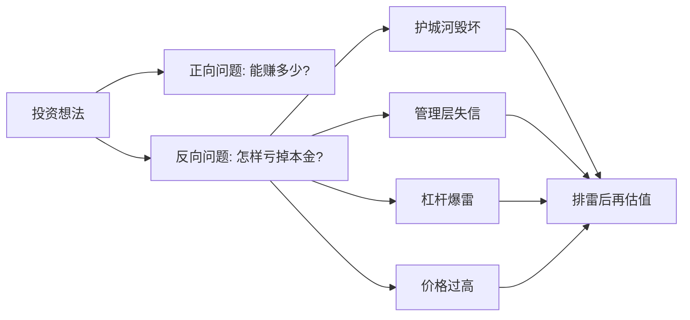

## 查理芒格思维筑基课: 定律1: 反向思维定律 - 先问怎样会亏掉本金

### 作者
digoal

### 日期
2026-05-19

### 标签
反向思维 , 永久亏损 , 风险清单 , 投资排雷 , 失败路径 , 护城河破坏 , 杠杆风险 , 管理层诚信 , 投资纪律 , 芒格思想

----

## 背景

> 面向对象: 投资者  
> 核心问题: 为什么优秀投资者总是先看失败路径？  
> 先说结论: 反向思维就是先问“怎样会失败”，再谈“怎样会成功”。在投资里，它把注意力从诱人故事拉回永久亏损、杠杆、护城河破坏和管理层诚信。

## 一张图先看懂



## 求真讲法

### 它到底说了什么

反向思维要求投资者先构造失败清单。不是为了悲观，而是因为人天然更愿意相信上涨故事。

如果一个投资想法经不起失败路径检验，就没有必要进入乐观预测。

### 它是怎么来的

它来自公理1“人的理性有限”和公理4“复利不能被中断”。投资中，避免归零或永久损失，比抓住每一次机会更重要。

### 它依赖哪些假设

| 假设 | 含义 |
|---|---|
| 人容易被收益吸引 | 所以要强制看风险 |
| 大错比小机会更重要 | 一次灾难可抹掉多年复利 |
| 失败路径可提前识别一部分 | 杠杆、欺诈、价值陷阱常有信号 |

### 常见误解

| 误解 | 更准确的理解 |
|---|---|
| 反向思维是唱空 | 它是风险清单，不是情绪判断 |
| 找到风险就不能买 | 关键是风险是否可理解、可承受、已被价格补偿 |
| 只适合熊市 | 牛市更需要反向思维 |

## 求存讲法

### 它有什么用

它把投资流程从“寻找利好”变成“排除致命错误”。尤其适合防止追高、买入复杂金融资产、忽略杠杆和相信管理层包装。

### 它怎么迁移到投资流程

```text
买入前:
1. 写出三条永久亏损路径
2. 找证据证明它们暂时不成立
3. 若无法排除，放弃或降低仓位
```

### 它的适用范围和边界

适用于所有高风险资本配置。边界是: 反向思维不能让你发现所有黑天鹅，也不能代替正向商业分析。

### 正例: 怎么用它提升能力

研究一家银行时，投资者先问: 坏账如何爆发？负债端是否稳定？管理层是否为了增长放松风控？这些问题比“利润增速多少”更先出现。

### 反例: 前提不成立会怎样

投资者只看新能源公司未来空间，不问产能过剩、补贴退坡和资本开支压力。后来行业价格战导致利润消失。失败原因是没有先问失败路径。

## 思考

1. 你最近一次买入前写过“怎样会亏钱”吗？
2. 哪一类风险会让你的投资 thesis 直接失效？
3. 你是在排除风险，还是只是在寻找安慰？

## 最后记住

1. 先排雷，再进攻。
2. 反向思维服务于复利不中断。
3. 最重要的问题常是“我怎样会错”。

## 参考资料

- Charlie Munger, *Poor Charlie's Almanack*.
- 本文参考本地 `buffett` 技能资料中的反向思维与风险行为笔记。
  
#### [PostgreSQL 解决方案集合](../201706/20170601_02.md "40cff096e9ed7122c512b35d8561d9c8")
  
  
#### [德哥 / digoal's Github - 公益是一辈子的事.](https://github.com/digoal/blog/blob/master/README.md "22709685feb7cab07d30f30387f0a9ae")
  
  
#### [About 德哥](https://github.com/digoal/blog/blob/master/me/readme.md "a37735981e7704886ffd590565582dd0")
  
  

  
